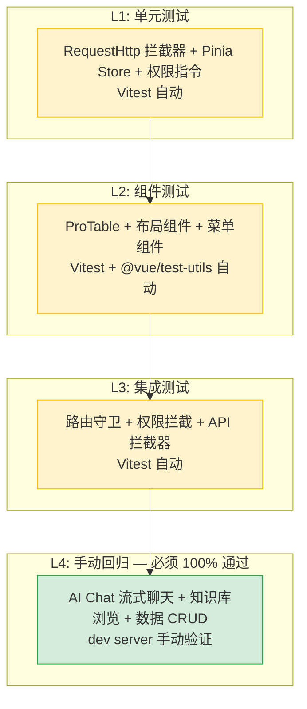

# YiVad 七月迭代 — 项目初始化 / AI Chat 迁移 / 构建系统升级 / 知识库集成 — 测试规格

> 来源 PRD：[00-prd-需求总览.md](../../prds/2026-07/00-prd-需求总览.md)
> 提取日期：2026-09-11

---

## 14. 测试策略

### 14.1 测试分层

### 13.2 核心测试用例

#### AI Chat 模块

| # | 用例 | 操作 | 预期结果 |
|----|------|------|----------|
| 1 | SSE 流式聊天 | 发送消息 "你好" | 逐 token 流式渲染 AI 回复 |
| 2 | 会话创建 | 首次发送消息 | 自动创建新会话，会话列表更新 |
| 3 | 会话切换 | 切换到历史会话 | 加载历史消息，消息列表正确渲染 |
| 4 | SSE 断连重试 | 模拟网络中断后恢复 | 自动重连或显示错误提示 |
| 5 | 空消息发送 | 发送空消息 | 前端拦截，不发送 API 请求 |

#### 知识库模块

| # | 用例 | 操作 | 预期结果 |
|----|------|------|----------|
| 1 | 知识树加载 | 访问知识库页面 | 知识树正确渲染，层级结构正确 |
| 2 | RAG 检索聊天 | 发送知识相关问题 | 返回带引用的 RAG 回答 |
| 3 | 文件预览 | 点击知识文件 | Markdown 渲染预览正确 |
| 4 | 搜索过滤 | 输入关键词搜索 | 知识树按关键词过滤 |

#### 权限系统

| # | 用例 | 操作 | 预期结果 |
|----|------|------|----------|
| 1 | 未登录访问 | 直接访问受保护路由 | 跳转登录页 |
| 2 | 无权限按钮 | 用户无 `user:delete` 权限 | 删除按钮 DOM 移除 |
| 3 | 动态菜单加载 | 登录后获取菜单 | 菜单与用户权限一致 |
| 4 | Token 过期 | Token 过期后访问 API | 自动清除状态，跳转登录页 |

### 13.3 测试环境要求

| 环境要求 | 说明 |
|----------|------|
| YiAi 后端 | 必须运行，提供 RPC 接口 |
| 浏览器 | Chrome 最新版 |
| 测试数据 | 预置菜单数据、知识文件、测试用户 |
| 网络条件 | 正常网络 + Chrome DevTools 慢网络模拟 |

---

