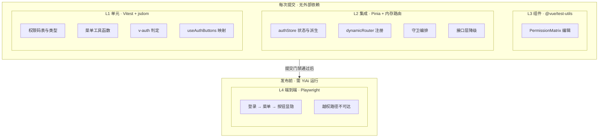
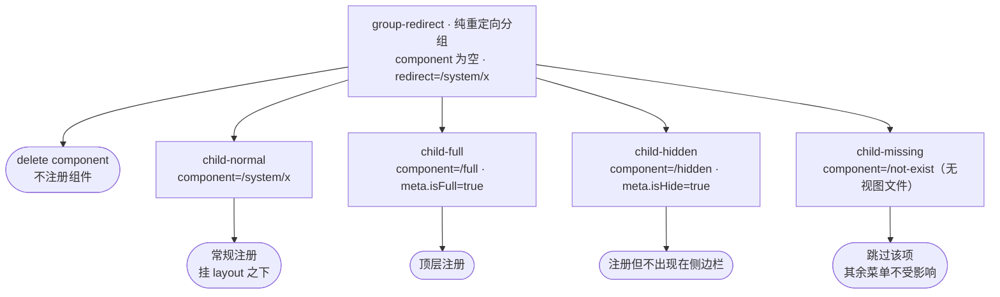

# YV-07-07: 权限系统与动态菜单 — RBAC 权限码 + v-auth 按钮级鉴权 + 菜单驱动动态路由 — 测试用例

> 来源 PRD：[07-prd-权限系统与动态菜单.md](../../prds/2026-07/07-prd-权限系统与动态菜单.md)
> 开发方案：[07-prd-task-权限系统与动态菜单.md](../../devs/2026-07/07-prd-task-权限系统与动态菜单.md)
> 提取日期：2026-09-11 · 修订：2026-09-12

本文档定义**验证方式**——测什么、怎么测、通过标准是什么。需求见 PRD，实现见开发方案。

---

## 一、测试范围与策略

### 1.1 测试分层



> 分层依据是**运行门禁**，而非依赖关系：L1–L3 同属提交门禁、互不依赖（各自独立装配）；L4 需真实 YiAi 运行，单独作为发布门禁。

| 层级 | 工具 | 环境依赖 | 执行时机 |
|------|------|---------|---------|
| L1 单元 | Vitest 4 + jsdom | 无外部依赖 | 每次提交 |
| L2 集成 | Vitest 4 + Pinia + 内存路由 | 无外部依赖（mock 接口） | 每次提交 |
| L3 组件 | Vitest 4 + `@vue/test-utils` | 无外部依赖 | 每次提交 |
| L4 端到端 | Playwright | YiAi 后端运行 | 发布前 |

### 1.2 覆盖范围

| 编号 | 被测对象 | 层级 |
|------|---------|------|
| COV-1 | `constants/permissions.ts`——权限码、模块分组、角色矩阵、类型 | L1 |
| COV-2 | `utils/index.ts`——`getFlatMenuList` / `getShowMenuList` / `sortMenuTree` / `getAllBreadcrumbList` | L1 |
| COV-3 | `directives/modules/auth.ts`——`v-auth` 判定与移除 | L1 |
| COV-4 | `hooks/useAuthButtons.ts`——`BUTTONS` 映射 | L1 |
| COV-5 | `stores/modules/auth.ts`——状态、派生、动作 | L2 |
| COV-6 | `routers/modules/dynamicRouter.ts`——`initDynamicRouter()` | L2 |
| COV-7 | `routers/index.ts`——守卫编排、`resetRouter` | L2 |
| COV-8 | `api/modules/login.ts`——授权接口与降级 | L2 |
| COV-9 | `PermissionMatrix.vue`——矩阵编辑 | L3 |
| COV-10 | 端到端权限链路 | L4 |

### 1.3 不覆盖范围

| 不覆盖 | 原因 |
|--------|------|
| 路由级权限拦截（403） | 需求范围外——路由可达性由菜单驱动（PRD 决策 4） |
| 后端授权校验 | 属 YiAi 测试范围 |
| `views-glob-plugin.ts` 分块产物 | 属构建产物验证，由 `build:pro` 冒烟覆盖 |
| 真实 SSE / 权限推送 | 需求范围外 |
| 权限矩阵的样式与布局回归 | 无视觉回归基线 |

### 1.4 测试环境

| 项 | 值 |
|----|----|
| 运行器 | Vitest 4（`pnpm test` / `pnpm test:coverage`） |
| DOM | jsdom 27 |
| 用例发现 | `tests/**/*.{test,spec}.{ts,tsx}` |
| 全局装配 | `tests/setup.ts`（localStorage / matchMedia / ResizeObserver / IntersectionObserver mock） |
| 别名 | `@` → `src`；`@yivad/views-glob` → `tests/mocks/viewsGlob.ts` |
| 覆盖阈值 | lines 80 / functions 80 / branches 75 / statements 80 |
| 端到端 | Playwright（`e2e/specs/`，需 YiAi 运行） |

> **装配约束（影响用例编写）**
>
> 1. `@yivad/views-glob` 在测试中被别名为**空对象** `{}`（`tests/mocks/viewsGlob.ts`）。因此 `initDynamicRouter()` 在默认装配下会**跳过所有菜单项**（组件解析恒为 `undefined`）。验证路由注册的用例必须用 `vi.mock("@yivad/views-glob", ...)` 覆盖为含键的映射。
> 2. `initDynamicRouter()` 在菜单为空分支调用 `useI18n()`，在无组件实例时会抛错（开发方案 §8 缺陷 7）。该分支的用例需 mock `vue-i18n`，否则捕获到的是 i18n 错误而非业务结果。
> 3. 守卫用例需自建内存路由（`createRouter({ history: createMemoryHistory() })`），并与被测模块共享同一 router 实例。
> 4. 覆盖配置**排除了 `src/routers/**`**，因此 COV-6 / COV-7 的用例不计入覆盖率门禁——须以「用例必通过」而非「覆盖率」保证质量（见 §六 缺口 G-1）。

### 1.5 测试数据

**角色夹具**（权限码数组，取自 `DEFAULT_ROLE_PERMISSIONS`）：

| 夹具 | 权限 | 用途 |
|------|------|------|
| `FULL` | 全部 16 个权限码 | 管理员场景 |
| `ENGINEER` | 10 个（无 `*:delete`、无 `user:manage`/`role:manage`/`audit:*`） | 常规写入角色 |
| `VIEWER` | 5 个（全部为 `:view` / `chat:create`） | 只读角色 |
| `EMPTY` | `[]` | 无权限边界 |

**菜单夹具**（最小树，覆盖全部注册分支）——每个节点对应 `initDynamicRouter()` 的一条分支：



**按钮条夹具**（按路由名索引）：

```json
{ "useProTable": ["add", "batchAdd", "export"], "home": [] }
```

**真实用例引用**：`views/proTable/useProTable/index.vue` 是当前唯一使用 `v-auth` 的页面，含 `v-auth="'add'"`、`v-auth="'batchAdd'"`、`v-auth="'export'"`。其按钮规则以页面名 `useProTable` 为键（兜底按钮文件中存在该键，兜底菜单中**不存在**对应路由——见 TC-FB-009）。

---

## 二、测试用例

### 2.1 权限码表与角色矩阵（COV-1 · L1）

> 自动化落点：`tests/unit/permissions.test.ts`（**待新增**）

| 编号 | 用例 | 步骤 | 预期结果 | 优先级 | 状态 |
|------|------|------|---------|--------|------|
| TC-PERM-001 | 权限码总数 | 统计 `Object.values(PERMISSIONS)` | 恰好 16 个 | P0 | 待实现 |
| TC-PERM-002 | 权限码格式 | 逐项匹配 `/^[a-z]+:[a-z]+$/` | 全部匹配，无大写、无空格 | P0 | 待实现 |
| TC-PERM-003 | 权限码唯一性 | `new Set(values).size` 与 `values.length` 比较 | 相等（无重复） | P0 | 待实现 |
| TC-PERM-004 | 模块数与分组一致性 | 统计 `PERMISSION_MODULES` 及其 `permissions` 展开 | 7 个模块；展开后与 `Object.values(PERMISSIONS)` 集合相等（无遗漏、无多余） | P0 | 待实现 |
| TC-PERM-005 | 模块分组标签完整 | 遍历 `PERMISSION_MODULES` | 每项 `module` 非空、`label` 为中文、`permissions` 非空 | P1 | 待实现 |
| TC-PERM-006 | 角色矩阵键完整性 | 检查 `DEFAULT_ROLE_PERMISSIONS` 的键 | 恰为 `admin`/`engineer`/`producter`/`analyst`/`viewer` | P0 | 待实现 |
| TC-PERM-007 | admin 持有全部权限 | 比对 `DEFAULT_ROLE_PERMISSIONS.admin` 与全部权限码 | 集合相等（16 个） | P0 | 待实现 |
| TC-PERM-008 | 角色权限数符合规格 | 统计各角色权限数 | admin 16 / engineer 10 / producter 9 / analyst 6 / viewer 5 | P0 | 待实现 |
| TC-PERM-009 | 矩阵值均为合法权限码 | 展开全部角色的权限数组，与 `Object.values(PERMISSIONS)` 求差集 | 差集为空（无拼写错误、无已废弃权限码） | P0 | 待实现 |
| TC-PERM-010 | 删除类权限仅 admin 持有 | 筛选含 `:delete` 的权限码 | 仅 `admin` 持有 `project:delete` / `knowledge:delete` | P1 | 待实现 |
| TC-PERM-011 | 管理面权限仅 admin 持有 | 检查 `user:manage` / `role:manage` | 仅 `admin` 持有 | P0 | 待实现 |
| TC-PERM-012 | 权限码类型约束 | 以非法字面量赋值给 `PermissionCode` | `vue-tsc --noEmit` 报错（类型测试，可用于 `tsd` 或类型断言） | P1 | 待实现 |

### 2.2 菜单工具函数（COV-2 · L1）

> 自动化落点：`tests/unit/utils.test.ts`（已存在，追加用例）

| 编号 | 用例 | 步骤 | 预期结果 | 优先级 | 状态 |
|------|------|------|---------|--------|------|
| TC-UTIL-001 | 扁平化父先于子 | 以菜单夹具调用 `getFlatMenuList` | 输出顺序中父节点索引恒小于其后代索引 | P0 | 待实现 |
| TC-UTIL-002 | 扁平化含全部节点 | 计数输出长度 | 等于树中节点总数（含中间分组） | P0 | 待实现 |
| TC-UTIL-003 | 扁平化不污染原树 | 调用后检查入参菜单树 | 入参结构不变（深拷贝生效） | P1 | 待实现 |
| TC-UTIL-004 | 隐藏项被过滤 | 以菜单夹具调用 `getShowMenuList` | 结果中不含 `meta.isHide === true` 的项 | P0 | 待实现 |
| TC-UTIL-005 | 嵌套隐藏项递归过滤 | 构造父可见、子隐藏的树 | 父保留、子被剔除 | P1 | 待实现 |
| TC-UTIL-006 | 排序按标题 | 构造标题乱序的兄弟节点，调用 `sortMenuTree` | 按 `meta.title` 升序（`localeCompare` zh-CN） | P0 | 待实现 |
| TC-UTIL-007 | 排序递归到子树 | 构造多层乱序树 | 每一层子节点均已排序 | P1 | 待实现 |
| TC-UTIL-008 | 排序不污染原树 | 调用后检查入参 | 入参顺序不变 | P1 | 待实现 |
| TC-UTIL-009 | 面包屑按路径索引 | 以菜单夹具调用 `getAllBreadcrumbList` | 结果以 `path` 为键，值为「祖先 → 自身」数组；根节点数组长度为 1 | P0 | 待实现 |
| TC-UTIL-010 | 空输入不报错 | 传 `[]` 调用四个工具函数 | 均返回空数组/空对象，无异常 | P1 | 待实现 |

### 2.3 `v-auth` 指令（COV-3 · L1）

> 自动化落点：`tests/directives/auth.test.ts`（**待新增**）
> 前置：`setActivePinia(createPinia())`；写入 `authStore.authButtonList` 与 `authStore.routeName`

| 编号 | 用例 | 步骤 | 预期结果 | 优先级 | 状态 |
|------|------|------|---------|--------|------|
| TC-AUTH-001 | 单权限码命中保留 | 按钮码含 `add`，`v-auth="'add'"` | 元素仍在 DOM 中 | P0 | 待实现 |
| TC-AUTH-002 | 单权限码未命中移除 | 按钮码含 `add`，`v-auth="'export'"` | 元素从 DOM 移除 | P0 | 待实现 |
| TC-AUTH-003 | 数组 AND 全命中保留 | 按钮码含 `add`+`export`，`v-auth="['add','export']"` | 元素保留 | P0 | 待实现 |
| TC-AUTH-004 | 数组 AND 缺一移除 | 按钮码仅含 `add`，`v-auth="['add','export']"` | 元素移除 | P0 | 待实现 |
| TC-AUTH-005 | 移除为物理移除 | 执行 `v-auth` 移除后检查容器 | `container.innerHTML` 中不含该元素（非 CSS 隐藏，无 `display:none`） | P0 | 待实现 |
| TC-AUTH-006 | 按路由名索引 | `authButtonList = { A: ['add'], B: [] }`，`routeName='B'` | `v-auth="'add'"` 的元素被移除（不受 A 的权限影响） | P0 | 待实现 |
| TC-AUTH-007 | 当前路由无按钮规则 | `authButtonList = {}` | 所有 `v-auth` 元素被移除 | P0 | 待实现 |
| TC-AUTH-008 | 空数组语义 | `v-auth="[]"` | **记录现状**：落入单值分支，元素被移除（开发方案 §8 缺陷 6） | P1 | 待实现 |
| TC-AUTH-009 | 空值语义 | `v-auth=""`（值为 `undefined`/空串） | **记录现状**：元素被移除（同上） | P1 | 待实现 |
| TC-AUTH-010 | 权限未就绪语义 | `authButtonList = {}` 且未置就绪标记 | **记录现状**：元素被移除且不恢复（开发方案 §8 缺陷 4） | P1 | 待实现 |
| TC-AUTH-011 | 权限变更不恢复 | 先无权限移除，再写入权限 | **记录现状**：元素仍不在 DOM 中（无 `updated` 钩子，缺陷 3） | P2 | 待实现 |
| TC-AUTH-012 | 真值型单值不崩溃 | `v-auth="'add'"` 且按钮码为 `undefined` 路由 | 不抛异常，元素被移除 | P1 | 待实现 |

### 2.4 `useAuthButtons`（COV-4 · L1）

> 自动化落点：`tests/hooks/useAuthButtons.test.ts`（**待新增**）
> 前置：`setActivePinia(createPinia())`；内存路由并导航到目标路由；在带 `setup` 的组件内调用

| 编号 | 用例 | 步骤 | 预期结果 | 优先级 | 状态 |
|------|------|------|---------|--------|------|
| TC-BTN-001 | 返回布尔映射 | 按钮码 `['add','export']` | `BUTTONS.value` 为 `{ add: true, export: true }` | P0 | 待实现 |
| TC-BTN-002 | 无权限按钮键不存在 | 按钮码 `['add']` | `BUTTONS.value.export` 为 `undefined`（falsy） | P0 | 待实现 |
| TC-BTN-003 | 空规则返回空映射 | 路由无按钮规则 | `BUTTONS.value` 为空对象 | P1 | 待实现 |
| TC-BTN-004 | 按当前路由名取值 | 导航至路由 A 后调用 | 映射来自 `authButtonList[A]` | P0 | 待实现 |
| TC-BTN-005 | 路由切换后不更新 | 在 A 调用后切换至 B | **记录现状**：`BUTTONS` 仍为 A 的映射（authButtons 非 computed，缺陷 5） | P2 | 待实现 |

### 2.5 权限状态 Store（COV-5 · L2）

> 自动化落点：`tests/stores/auth.test.ts`（**待新增**）
> 前置：`setActivePinia(createPinia())`；mock `@/api/modules/login`

| 编号 | 用例 | 步骤 | 预期结果 | 优先级 | 状态 |
|------|------|------|---------|--------|------|
| TC-STORE-001 | 初始状态 | 新建 store | `authMenuList` 为 `[]`、`authButtonList` 为 `{}`、`routeName` 为 `""` | P0 | 待实现 |
| TC-STORE-002 | 加载菜单写入状态 | mock 接口返回菜单树，调用 `getAuthMenuList()` | `authMenuListGet` 等于返回树 | P0 | 待实现 |
| TC-STORE-003 | 加载按钮写入状态 | mock 接口返回按钮映射，调用 `getAuthButtonList()` | `authButtonListGet` 等于返回映射 | P0 | 待实现 |
| TC-STORE-004 | 设置路由名 | `setRouteName("useProTable")` | `routeName` 更新 | P0 | 待实现 |
| TC-STORE-005 | 扁平派生 | 加载含嵌套的菜单树 | `flatMenuListGet` 含全部节点，父先于子 | P0 | 待实现 |
| TC-STORE-006 | 显示派生已过滤已排序 | 加载含 `isHide` 且乱序的菜单树 | `showMenuListGet` 无隐藏项且按标题排序 | P0 | 待实现 |
| TC-STORE-007 | 面包屑派生 | 加载菜单树 | `breadcrumbListGet` 以路径为键，值为祖先链 | P1 | 待实现 |
| TC-STORE-008 | 派生不污染原始树 | 读取派生前后比对 `authMenuList` | 原始树结构未被修改（深拷贝生效） | P0 | 待实现 |
| TC-STORE-009 | 接口异常向上抛出 | mock 接口 reject，调用动作 | 动作 reject（store 不吞异常，交由调用方处理） | P1 | 待实现 |
| TC-STORE-010 | 重复加载覆盖 | 连续两次加载不同菜单 | 状态为最后一次的值（非累积） | P1 | 待实现 |

### 2.6 动态路由注册（COV-6 · L2）

> 自动化落点：`tests/routers/dynamicRouter.test.ts`（**待新增**）
> 前置：mock `@/api/modules/login`、`@/stores/helper/persist`、`vue-i18n`、`element-plus`；**必须** mock `@yivad/views-glob` 为含键映射（默认别名为空对象，否则所有项被跳过）；内存路由并注册名为 `layout` 的父路由

| 编号 | 用例 | 步骤 | 预期结果 | 优先级 | 状态 |
|------|------|------|---------|--------|------|
| TC-ROUTE-001 | 常规菜单注册成功 | 菜单含 `component=/system/x`、`isFull=false` | `router.hasRoute(name)` 为真，且路由挂在 `layout` 下 | P0 | 待实现 |
| TC-ROUTE-002 | 全屏菜单注册于顶层 | 菜单 `meta.isFull=true` | 路由注册于顶层，非 `layout` 子路由 | P0 | 待实现 |
| TC-ROUTE-003 | 组件缺失被跳过 | 菜单 `component=/not-exist` | 该项未注册；**其余菜单项正常注册**（不中断） | P0 | 待实现 |
| TC-ROUTE-004 | 纯重定向分组不注册组件 | 菜单有 `redirect` 且 `component=''` | 该项不作为路由注册（或注册为无组件路由），无异常 | P1 | 待实现 |
| TC-ROUTE-005 | 子节点不残留 | 菜单含嵌套 `children` | 注册的路由不含 `children`（避免嵌套重复） | P0 | 待实现 |
| TC-ROUTE-006 | 组件解析为懒加载函数 | 检查注册路由的 `component` | 为函数（异步加载），非已求值组件 | P0 | 待实现 |
| TC-ROUTE-007 | 组件路径映射正确 | 菜单 `component=/system/x` | 取用映射键 `/src/views/system/x.vue` | P0 | 待实现 |
| TC-ROUTE-008 | 菜单为空 → 清态跳登录 | 接口返回空数组 | token 被清空、`clearPersistedState` 被调用、`router.replace(LOGIN_URL)` 被调用 | P0 | 待实现 |
| TC-ROUTE-009 | 菜单为空 → 拒绝 | 同上 | 函数返回 rejected Promise | P0 | 待实现 |
| TC-ROUTE-010 | 接口异常 → 清态跳登录 | 接口 reject | 同上三项动作发生 | P0 | 待实现 |
| TC-ROUTE-011 | 拉取顺序 | 记录 mock 调用顺序 | `getAuthMenuList` 先于 `getAuthButtonList`（当前为串行） | P2 | 待实现 |

### 2.7 路由守卫（COV-7 · L2）

> 自动化落点：`tests/routers/guard.test.ts`（**待新增**）
> 前置：内存路由 + 与 `routers/index.ts` 共享实例；mock store

| 编号 | 用例 | 步骤 | 预期结果 | 优先级 | 状态 |
|------|------|------|---------|--------|------|
| TC-GUARD-001 | 未登录 → 登录页 | 无 token，导航至受保护路由 | 最终路由为 `/login` | P0 | 待实现 |
| TC-GUARD-002 | 白名单放行 | 无 token，导航至 `/500` | 放行（不重定向登录页） | P0 | 待实现 |
| TC-GUARD-003 | 已登录访问登录页 → 退回来源页 | 有 token，从 `/a` 导航至 `/login` | 最终路由为 `/a` | P0 | 待实现 |
| TC-GUARD-004 | 无 token 访问登录页 → 重置路由 | 无 token，导航至 `/login` | `resetRouter()` 被调用；已注册动态路由被移除 | P0 | 待实现 |
| TC-GUARD-005 | 菜单未加载 → 初始化并二次导航 | 有 token、菜单为空、目标路由可注册 | `initDynamicRouter` 被调用一次；最终命中目标路由（非 404） | P0 | 待实现 |
| TC-GUARD-006 | 仅初始化一次 | 连续导航两次 | `initDynamicRouter` 累计调用一次（第二次因菜单非空而跳过） | P0 | 待实现 |
| TC-GUARD-007 | 写入路由名 | 菜单已加载，导航至路由 `useProTable` | `authStore.routeName === "useProTable"` | P0 | 待实现 |
| TC-GUARD-008 | 白名单按路径匹配 | 白名单含 `/500`，导航至 `/500` | 放行，不做 token 校验 | P1 | 待实现 |
| TC-GUARD-009 | 未下发路由不可达 | 导航至未注册路径 | 不落入受保护页面（404 语义），无权限提示 | P0 | 待实现 |
| TC-GUARD-010 | 文档标题设置 | 导航至 `meta.title` 存在的路由 | `document.title` 为 `"<title> - <APP_TITLE>"` | P1 | 待实现 |
| TC-GUARD-011 | 导航进度条收敛 | 导航完成/出错 | `NProgress.done()` 被调用（`afterEach` / `onError`） | P2 | 待实现 |
| TC-GUARD-012 | 初始化失败不白屏 | `initDynamicRouter` reject | 导航结束于登录页，无白屏、无未捕获拒绝 | P0 | 待实现 |

### 2.8 授权接口与降级（COV-8 · L2）

> 自动化落点：`tests/api/login.test.ts`（**待新增**）
> 前置：mock `@/api` 的 http 实例

| 编号 | 用例 | 步骤 | 预期结果 | 优先级 | 状态 |
|------|------|------|---------|--------|------|
| TC-FB-001 | 菜单接口正常 | mock `http.get` 返回菜单 | 返回接口数据，未读取兜底 | P0 | 待实现 |
| TC-FB-002 | 菜单接口失败降级 | mock `http.get` 抛出网络错误 | 返回 `authMenuList.json` 内容，不抛异常 | P0 | 待实现 |
| TC-FB-003 | 按钮接口失败降级 | mock `http.get` 抛出网络错误 | 返回 `authButtonList.json` 内容 | P0 | 待实现 |
| TC-FB-004 | 非 2xx 亦降级 | mock 返回业务错误 | 降级到兜底数据 | P1 | 待实现 |
| TC-FB-005 | 降级静默 | 降级路径执行时捕获 console | **记录现状**：无 WARN 日志（开发方案 §8 缺陷 2） | P2 | 待实现 |
| TC-FB-006 | 兜底菜单形状合法 | 校验 `authMenuList.json` | 每项含 `path`/`name`/`meta`，`meta` 含 `title`/`isHide`/`isFull`/`isKeepAlive`/`isAffix` | P0 | 待实现 |
| TC-FB-007 | 兜底菜单无管理面 | 检索兜底菜单路径 | 不含用户管理 / 角色管理入口（PRD §5.1 降级范围收敛） | P0 | 待实现 |
| TC-FB-008 | 兜底按钮数据形状 | 校验 `authButtonList.json` | **记录现状**：为 `{code, data:{...}}` 信封形状，且按钮码为裸动作名 | P0 | 待实现 |
| TC-FB-009 | 兜底菜单与按钮键不相交 | 取兜底菜单全部 `name` 与兜底按钮键求交集 | **记录现状**：交集为空 → 降级状态下所有 `v-auth` 按钮被移除（开发方案 §8 缺陷 1） | P0 | 待实现 |
| TC-FB-010 | 接口与兜底信封形状一致 | 比对 `/auth/buttons` 响应与兜底文件的顶层键 | 均为 `{code, message?, data}`；store 解构 `data` 后两条路径形状一致 | P0 | 待实现 |
| TC-FB-011 | 后端按钮规则索引键 | 检查 `/auth/buttons` 响应键 | 键为页面名（与菜单 `name` 对应），值为裸动作名数组 | P1 | 待实现 |

### 2.9 权限矩阵组件（COV-9 · L3）

> 自动化落点：`tests/components/PermissionMatrix.test.ts`（**待新增**）

| 编号 | 用例 | 步骤 | 预期结果 | 优先级 | 状态 |
|------|------|------|---------|--------|------|
| TC-MATRIX-001 | 分组渲染 | 以空 `modelValue` 挂载 | 7 个模块标签全部渲染；权限码行数与 16 一致 | P0 | 待实现 |
| TC-MATRIX-002 | 已选回显 | `modelValue=['project:view']` | 对应复选框为选中 | P0 | 待实现 |
| TC-MATRIX-003 | 勾选上抛 | 勾选未选项 | `update:modelValue` 事件载荷含新权限码且保留原项 | P0 | 待实现 |
| TC-MATRIX-004 | 取消勾选上抛 | 取消已选项 | 载荷中移除该项 | P0 | 待实现 |
| TC-MATRIX-005 | 全选 | 点击「全选」 | 载荷为全部 16 个权限码 | P0 | 待实现 |
| TC-MATRIX-006 | 取消全选 | 点击「取消全选」 | 载荷为 `[]` | P0 | 待实现 |
| TC-MATRIX-007 | 不就地修改入参 | 勾选后检查 `props.modelValue` | 原数组未被修改（emit 新数组） | P1 | 待实现 |
| TC-MATRIX-008 | 模块标签跨行合并 | 检查首个权限行的首列 | `rowspan` 等于该模块权限数 | P2 | 待实现 |

### 2.10 端到端（COV-10 · L4）

> 自动化落点：`e2e/specs/permissions.spec.ts`（**待新增**，复用 `e2e/fixtures/auth.ts`）
> 前置：YiAi 运行，预置测试账号与菜单数据

| 编号 | 用例 | 步骤 | 预期结果 | 优先级 | 状态 |
|------|------|------|---------|--------|------|
| TC-E2E-001 | 登录后菜单与权限一致 | 登录 → 读取侧边栏菜单 | 菜单项与账号权限一致，无越权入口 | P0 | 待实现 |
| TC-E2E-002 | 无权限按钮不存在 | 登录后检查页面 HTML | 无权限按钮内容不在 DOM 源码中 | P0 | 待实现 |
| TC-E2E-003 | 未下发路径不可达 | 手工输入未下发路径 | 不渲染受保护页面 | P0 | 待实现 |
| TC-E2E-004 | 未登录跳转 | 清除凭据后访问受保护路由 | 重定向登录页 | P0 | 待实现 |
| TC-E2E-005 | 降级可用 | 停止 YiAi 后登录 | 菜单来自兜底数据，后台基本可用 | P1 | 待实现 |
| TC-E2E-006 | 刷新不重复拉取 | 刷新页面并统计 `/auth/menu/list` | 单次页面加载内请求一次（守卫不重复初始化） | P1 | 待实现 |

---

## 三、边缘场景用例

> 自动化落点随所属模块

| 编号 | 场景 | 步骤 | 预期结果 | 优先级 | 状态 |
|------|------|------|---------|--------|------|
| TC-EDGE-001 | 菜单为 `null` 而非 `[]` | 接口返回 `null` | 走空菜单分支（`authMenuListGet.length` 判定不抛错），清态跳登录 | P0 | 待实现 |
| TC-EDGE-002 | 菜单项缺 `meta` | 菜单项无 `meta` 字段 | 不抛异常；该项被注册或被安全跳过（记录现状） | P1 | 待实现 |
| TC-EDGE-003 | 按钮规则为对象而非数组 | `authButtonList = { home: {0:'add'} }` | 记录现状：`includes` 判定失败 → 按钮被移除（曾导致全量隐藏的同类问题） | P0 | 待实现 |
| TC-EDGE-004 | 菜单项名与静态路由重名 | 下发菜单名与静态路由 `name` 相同 | 记录现状：`addRoute` 抛重复路由名错误，被 `catch` 归入失败路径（清态跳登录） | P1 | 待实现 |
| TC-EDGE-005 | 深层嵌套菜单（≥3 级） | 下发三级菜单 | 全部扁平化并注册，父先于子 | P1 | 待实现 |
| TC-EDGE-006 | 菜单项路径大小写不一致 | `path=/System/X` | 记录现状：路由注册区分大小写，手工输入小写路径落 404 | P2 | 待实现 |
| TC-EDGE-007 | 权限码含空格/大写 | 权限码为 `Project:View` | 与规范比对失败（TC-PERM-002 覆盖），运行时不做归一化 | P2 | 待实现 |
| TC-EDGE-008 | 角色权限矩阵为空 | 角色 `permissions` 为 `[]` | 矩阵全不勾选；「取消全选」幂等 | P1 | 待实现 |
| TC-EDGE-009 | 并发导航 | 同时发起两次导航 | 不重复初始化动态路由；最终落到目标路由 | P2 | 待实现 |
| TC-EDGE-010 | 视图文件重命名 | 菜单指向已重命名的视图 | 该项被跳过，其余菜单正常（TC-ROUTE-003 同一机制） | P1 | 待实现 |

---

## 四、回归用例

> 针对开发方案 §8 已登记的缺陷，每条缺陷至少一条用例**固化当前行为**，并在修复后转为断言期望行为。

| 编号 | 关联缺陷 | 场景 | 当前预期（固化） | 修复后预期 | 优先级 | 状态 |
|------|---------|------|-----------------|-----------|--------|------|
| TC-REG-001 | 缺陷 1（P0） | 权限码与运行时词汇分裂 | `v-auth="PERMISSIONS.PROJECT_DELETE"` 在按钮码为裸动作名时 **移除**按钮——权限码不驱动鉴权 | 权限码 `project:delete` 命中即可见 | P0 | 待实现 |
| TC-REG-002 | 缺陷 1（P0） | `DEFAULT_ROLE_PERMISSIONS` 无消费方 | 全仓静态检索该符号的引用数 | 引用数 ≥ 1（接入鉴权链路） | P0 | 待实现 |
| TC-REG-003 | 缺陷 2（P2） | 降级不可观测 | 降级路径无 WARN 日志 | 产生 WARN 且含失败原因 | P2 | 待实现 |
| TC-REG-004 | 缺陷 3（P2） | 权限放宽后按钮不恢复 | 元素保持移除状态 | `updated` 钩子触发后元素恢复 | P2 | 待实现 |
| TC-REG-005 | 缺陷 4（P1） | 权限未就绪误移除 | 元素被移除且不恢复 | 未就绪时保留元素，就绪后判定 | P1 | 待实现 |
| TC-REG-006 | 缺陷 5（P3） | `useAuthButtons` 路由切换不更新 | 映射冻结于首次求值 | 映射随路由名响应更新 | P3 | 待实现 |
| TC-REG-007 | 缺陷 6（P3） | `v-auth` 空值语义 | 空值/空数组 → 移除元素 | 空值保留元素（区分「未声明」与「无权限」） | P3 | 待实现 |
| TC-REG-008 | 缺陷 7（P1） | 空菜单分支 `useI18n()` 抛错 | 无「无权限」通知；reject 携带 `MUST_BE_CALL_SETUP_TOP`；最终仍跳登录页 | 通知正常显示；reject 携带权限错误原因 | P1 | 待实现 |
| TC-REG-009 | 缺陷 7（P1） | 空菜单分支行为不回归 | 即使 i18n 抛错，最终仍落到登录页且 token 已清空 | 保持不变（该行为必须始终成立） | P0 | 待实现 |

---

## 五、追溯矩阵

| 需求项（PRD） | 验收标准 | 覆盖用例 |
|--------------|---------|---------|
| FR-01 权限码体系 | AC-01、AC-02 | TC-PERM-001 ~ 012 |
| FR-02 按钮级鉴权 | AC-03、AC-04 | TC-AUTH-001 ~ 012、TC-E2E-002 |
| FR-03 菜单级鉴权与动态路由 | AC-05、AC-06、AC-07 | TC-ROUTE-001 ~ 007、TC-UTIL-001 ~ 005、TC-E2E-001、TC-E2E-003 |
| FR-04 登录态与路由守卫 | AC-08、AC-09、AC-10 | TC-GUARD-001 ~ 012、TC-E2E-004 |
| FR-05 权限下发与离线降级 | AC-11、AC-12 | TC-FB-001 ~ 008、TC-E2E-005 |
| FR-06 编程式权限检查 | — | TC-BTN-001 ~ 005 |
| FR-07 角色权限矩阵编辑 | AC-13 | TC-MATRIX-001 ~ 008 |
| NFR 性能（不重复拉取） | — | TC-GUARD-006、TC-E2E-006 |
| 安全（降级范围收敛） | — | TC-FB-007 |
| DoD 类型检查 | AC-14 | TC-PERM-012、`pnpm type:check` |

---

## 六、覆盖缺口

| 编号 | 缺口 | 影响 | 建议 |
|------|------|------|------|
| G-1 | Vitest 覆盖配置**排除 `src/routers/**`** | 动态路由与守卫（本需求核心逻辑）不计入覆盖率门禁，回归风险高 | 将 `src/routers/modules/dynamicRouter.ts` 与 `src/routers/index.ts` 纳入 `coverage.include`，或将排除范围收窄到 `staticRouter.ts` |
| G-2 | 权限系统**零自动化用例** | 当前 42 个测试文件无一覆盖权限链路（`tests/stores/`、`tests/directives/`、`tests/routers/` 目录均不存在） | 按本文档 §2 补建用例，优先 P0 |
| G-3 | `@yivad/views-glob` 测试别名为空映射 | 默认装配下动态路由注册「静默全跳过」，易误判为通过 | 在路由用例中显式 mock 非空映射；或令 mock 提供最小可用映射 |
| G-4 | 无视觉回归基线 | 权限矩阵与菜单渲染的样式回归不可见 | 按需引入视觉快照 |
| G-5 | 端到端依赖真实 YiAi | CI 中不可稳定运行 | 引入 mock 后端或契约夹具 |

---

## 七、入口与出口准则

### 入口准则

- [ ] 开发方案 §2 文件清单全部落地，可通过 `pnpm type:check`
- [ ] 权限码表与角色矩阵已定稿（PRD §4）
- [ ] 测试夹具（角色 / 菜单 / 按钮条）就绪
- [ ] `tests/mocks/viewsGlob.ts` 支持注入非空映射

### 出口准则

- [ ] **P0 用例 100% 通过**
- [ ] P1 用例通过率 ≥ 90%，未通过项已登记且不影响权限主链路
- [ ] 回归用例 TC-REG-009 通过（空菜单失败路径始终落登录页）
- [ ] 单元与集成用例并入 `pnpm test`，全量通过
- [ ] 覆盖率：`constants/`、`utils/`、`directives/`、`hooks/`、`stores/` 达门禁阈值；`routers/` 缺口（G-1）已登记
- [ ] 端到端 P0 用例在发布前于真实环境执行通过
- [ ] 缺陷 1（P0 词汇分裂）的处置结论已明确：修复或明确降级为「角色建档」并同步 PRD 风险表
