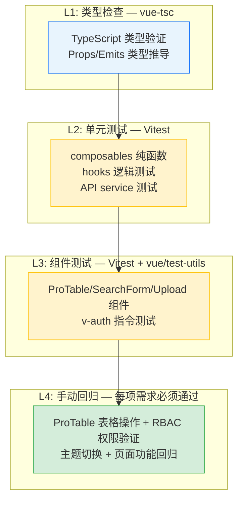

# YiVad 八月迭代 — 组件化 / 测试基础设施 / 主题系统 / 权限控制 / 详情页优化 / 首页优化 / 列表页优化 / 系统管理 / 首页仪表盘 / Kanban看板 / 全局搜索 / Roadmap路线图 / 自定义指令系统 / API层架构 — 测试规格

> 来源 PRD：[00-prd-需求总览.md](../../prds/2026-08/00-prd-需求总览.md)
> 提取日期：2026-09-11

---

## 11. 测试策略

### 11.1 测试分层

### 11.2 回归测试用例

| # | 用例 | 操作 | 预期结果 |
|----|------|------|----------|
| 1 | ProTable 基础渲染 | 访问 Issue 列表页 | 表格正确渲染，列配置生效 |
| 2 | ProTable 搜索 | 在 SearchForm 输入关键词 | 表格数据按关键词过滤 |
| 3 | ProTable 分页 | 切换页码和每页条数 | 分页正确，数据刷新 |
| 4 | ProTable 多选 | 勾选多行 + 批量操作 | 选中状态正确，批量操作生效 |
| 5 | RBAC 路由守卫 | 无权限用户访问受限页面 | 重定向到 403 或首页 |
| 6 | RBAC 按钮控制 | 无权限用户查看页面 | 对应按钮隐藏或禁用 |
| 7 | 暗色主题切换 | 点击主题切换按钮 | 页面即时切换，无闪烁 |
| 8 | 暗色主题持久化 | 切换暗色 → 刷新页面 | 保持暗色主题 |
| 9 | 详情页 KeepAlive | 切换 Tab 后再切回 | 保留滚动位置和筛选状态 |
| 10 | 首页竞态修复 | 快速切换日期筛选 | 显示最后一次请求的数据 |

---

