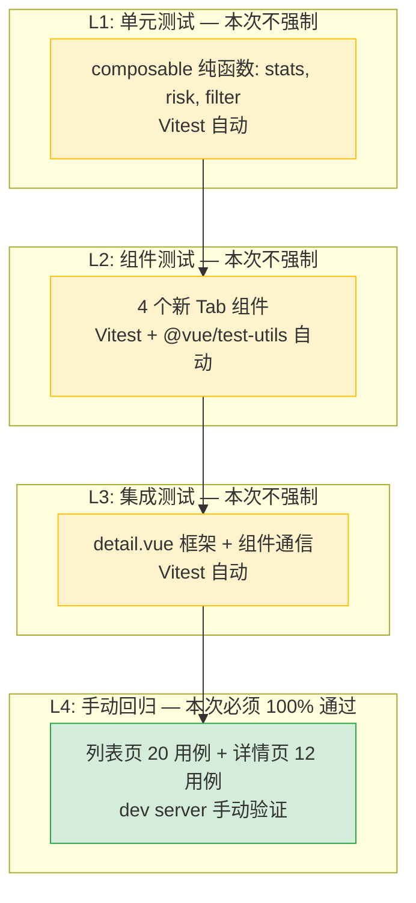

# YiVad 九月迭代 — Project 页面功能模块重构 — 测试规格

> 来源 PRD：[00-prd-需求总览.md](../../prds/2026-09/00-prd-需求总览.md)

> **文档职责**：本文档定义**怎么验证**（VERIFY），不含产品目标与实现方案。用例覆盖度以 PRD 的 `FR-x.y` / `NFR-x` 编号追溯，不复制需求正文。
> 提取日期：2026-09-11

---


---

<a id="sec-strategy"></a>
## 测试策略

### 分层模型

| 层级 | 说明 | 自动化 | 执行时机 |
|------|------|--------|---------|
| L1 单元 | Composable/hook/工具函数纯逻辑 | Vitest | 每次提交 |
| L2 组件 | Vue 组件挂载与交互 | Vitest + @vue/test-utils | 每次提交 |
| L3 集成 | Composable ↔ 组件 ↔ Store ↔ RPC | Vitest + mock | 每次提交 |
| L4 端到端 | 完整用户路径（需 YiAi 运行） | 手动 | 提测/回归 |

### 优先级定义

| 级别 | 含义 | 响应 |
|------|------|------|
| P0 | 核心路径，失败阻塞发布 | 立即修复 |
| P1 | 重要功能，失败需评估 | 当日修复 |
| P2 | 增强功能，可延后 | 排期修复 |

---

<a id="sec-env"></a>
## 测试环境与前置条件

| 项 | 要求 |
|----|------|
| Node.js | 与项目 `.nvmrc` 一致 |
| 包管理器 | pnpm |
| 浏览器 | Chrome 最新版 |
| 框架 | Vitest + jsdom |
| 类型检查 | `pnpm exec vue-tsc --noEmit` |

```bash
pnpm test                                    # 全部测试
pnpm exec vitest run tests/hooks/            # 仅 hooks
pnpm exec vitest run --coverage             # 覆盖率
```

---

<a id="sec-criteria"></a>
## 准入与准出标准

### 准入

| # | 条件 |
|---|------|
| 1 | 对应 FR 的实现已提交 |
| 2 | `vue-tsc --noEmit` 无错误 |
| 3 | 功能在开发环境可正常使用 |

### 准出

| # | 条件 | 阈值 |
|---|------|------|
| 1 | P0 用例通过率 | 100% |
| 2 | P1 用例通过率 | ≥ 95% |
| 3 | 遗留缺陷 | 无 Blocker / Critical |

---

<a id="sec-defects"></a>
## 缺陷分级

| 级别 | 定义 | 示例 |
|------|------|------|
| Blocker | 阻塞测试或数据损坏 | 功能完全不可用 |
| Critical | 核心功能不可用 | 主要路径报错 |
| Major | 功能缺陷但有替代路径 | 边界条件处理不当 |
| Minor | 体验问题 | UI 偏移/文案错误 |
| Trivial | 视觉细节 | 间距微调 |

### 需求覆盖矩阵

| FR | 需求 | 测试覆盖 | 状态 |
|----|------|---------|------|
| FR-1 | 页面功能概述 | UT + CT + IT | ✅ 已完成 |
| FR-2 | 列表页 (`/project`) — 项目仪表盘 | UT + CT + IT | ✅ 已完成 |
| FR-3 | 详情页 (`/project/:key`) — 单项目深度视 | UT + CT + IT | ✅ 已完成 |
| FR-4 | 状态管理 | UT + CT + IT | ✅ 已完成 |
| FR-5 | 模块交互拓扑 | UT + CT + IT | ✅ 已完成 |
| FR-6 | 模块职责矩阵 | UT + CT + IT | ✅ 已完成 |
| FR-7 | 系统范围 | UT + CT + IT | ✅ 已完成 |
| FR-8 | 接口协议 | UT + CT + IT | ✅ 已完成 |
| FR-9 | API 协议 | UT + CT + IT | ✅ 已完成 |
| FR-10 | 组件通信协议 | UT + CT + IT | ✅ 已完成 |
| FR-11 | 数据流时序 | UT + CT + IT | ✅ 已完成 |
| FR-12 | 功能清单 | UT + CT + IT | ✅ 已完成 |


<a id="sec-9"></a>
## 9. 测试策略

### 9.1 测试分层



> L1-L3 计划在十月迭代补充，本次迭代仅要求 L4 手动回归 100% 通过。

### 9.2 手动回归测试用例

#### 列表页（20 个用例）

| # | 用例 | 操作 | 预期结果 |
|----|------|------|----------|
| 1 | 页面加载 | 访问 `/project` | 项目卡片正确渲染，统计卡片显示正确数据 |
| 2 | 日期过滤 | 点击日期导航前后箭头 | 项目列表和数据按日期过滤 |
| 3 | 日期清除 | 点击 "Clear date filter" | 恢复显示所有项目 |
| 4 | 统计卡片点击 | 点击 "At risk" 卡片 | 应用 `flagged=1` 过滤 |
| 5 | 搜索 | 输入项目名称/标识符关键字 | 项目列表按关键字过滤 |
| 6 | 排序 | 切换排序方式 | 项目列表按所选方式排序 |
| 7 | 升序/降序 | 点击排序方向按钮 | 切换升序/降序 |
| 8 | 状态过滤 | 选择 Active/Archived | 显示对应状态的项目 |
| 9 | Starred 过滤 | 点击 Starred 按钮 | 仅显示 starred 项目 |
| 10 | 图表过滤 | 点击图表中的状态/优先级/类型条 | 应用对应维度过滤 |
| 11 | 风险过滤 | 点击 ProjectAttention 中的风险标签 | 应用对应风险过滤 |
| 12 | 过滤 pill 操作 | 点击 pill 的 × 按钮 | 移除该过滤条件 |
| 13 | Undo 过滤 | 点击 undo 按钮 | 恢复上一个过滤状态 |
| 14 | 视图切换 | 切换到 List 视图 | 显示列表视图 |
| 15 | CSV 导出 | 点击 Export 按钮 | 下载 CSV 文件 |
| 16 | 新建项目 | 点击 New Project，填写表单 | 项目创建成功 |
| 17 | 编辑项目 | 点击项目卡的编辑按钮 | 编辑弹窗打开，修改后保存成功 |
| 18 | 归档/恢复 | 选择项目，点击 Archive/Restore | 项目状态变更 |
| 19 | 批量操作 | 多选项目，点击 Archive | 批量归档成功 |
| 20 | 点击项目卡 | 点击项目卡主体 | 导航到 `/project/{key}` |

#### 详情页（12 个用例）

| # | 用例 | 操作 | 预期结果 |
|----|------|------|----------|
| 1 | 页面加载 | 访问 `/project/{key}` | 项目详情正确渲染 |
| 2 | Overview Tab | 默认显示 | README.md 预览、统计侧边栏、模块列表、活动动态正确渲染 |
| 3 | Requirements Tab | 切换到 Requirements | 需求列表正确渲染，过滤和搜索正常 |
| 4 | Issues Tab | 切换到 Issues | IssueList 组件正确渲染 |
| 5 | Modules Tab | 切换到 Modules | ModuleList 组件正确渲染 |
| 6 | Docs Tab | 切换到 Docs | 文档列表正确渲染，点击可预览 |
| 7 | Bugs Tab | 切换到 Bugs | BugList 组件正确渲染 |
| 8 | Members Tab | 切换到 Members | 成员列表正确渲染，添加/删除成员正常 |
| 9 | URL Tab 参数 | 访问 `/project/{key}?tab=members` | 自动切换到 Members Tab |
| 10 | 日期过滤 | 切换日期导航 | Overview 和 Requirements 数据按日期过滤 |
| 11 | 返回列表 | 点击 "Projects" 返回按钮 | 导航回 `/project` |
| 12 | 404 处理 | 访问不存在的 `/project/{invalid}` | 显示 "Project not found" 错误状态 |

### 9.3 回归测试环境

| 环境要求 | 说明 |
|----------|------|
| YiAi 后端 | 必须运行，提供数据接口 |
| 浏览器 | Chrome 最新版 |
| 测试数据 | 使用现有项目数据（PLANE 等），无需准备测试数据 |
| 网络条件 | 正常网络 + Chrome DevTools 慢网络模拟（Fast 3G） |

---

