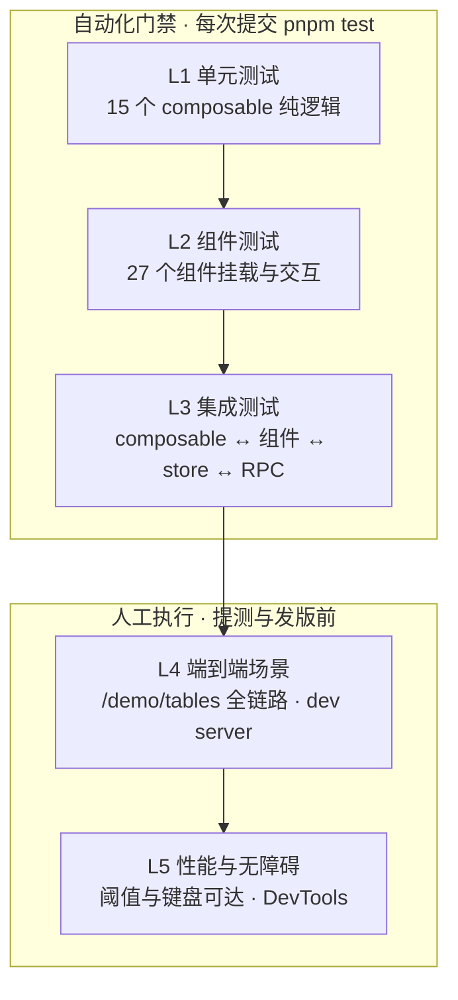
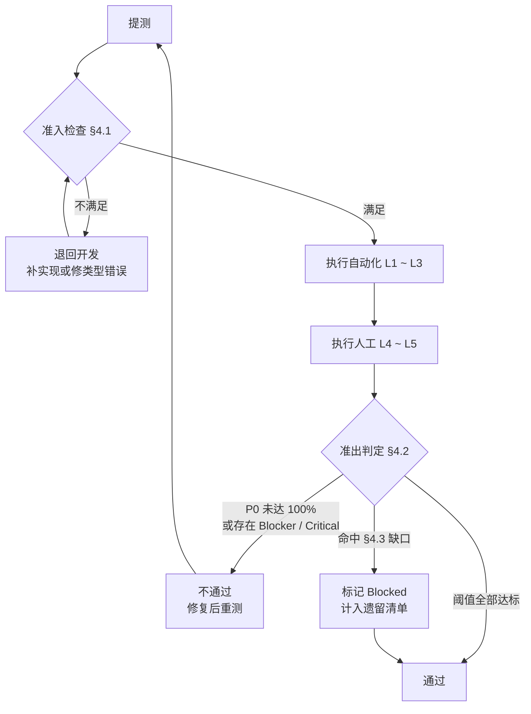
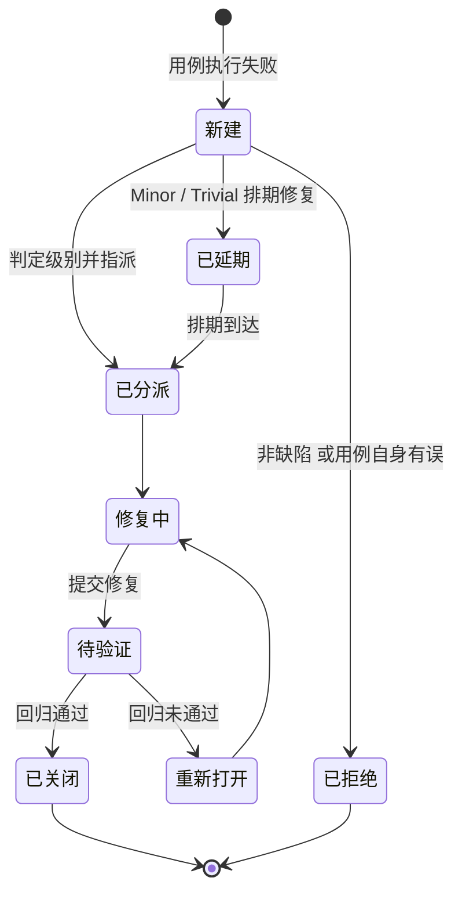

# 列表组件体系 — 测试用例

> 来源 PRD：[01-prd-列表组件体系.md](../../prds/2026-09/01-prd-列表组件体系.md)
> 开发方案：[01-prd-task-列表组件体系.md](../../devs/2026-09/01-prd-task-列表组件体系.md)
> 需求编号：YV-09-M08 · 优先级：中

> **文档职责**：本文档定义**怎么验证**（VERIFY），不含产品目标与实现方案。用例覆盖度以 PRD 的 `FR-x.y` / `NFR-x` 编号追溯，不复制需求正文。

---

## 目录

- [一、测试范围与目标](#sec-1)
- [二、测试策略](#sec-2)
- [三、测试环境与前置条件](#sec-3)
- [四、准入与准出标准](#sec-4)
- [五、需求覆盖矩阵](#sec-5)
- [六、单元测试](#sec-6)
- [七、组件测试](#sec-7)
- [八、集成测试](#sec-8)
- [九、端到端场景](#sec-9)
- [十、性能验收测试](#sec-10)
- [十一、无障碍测试](#sec-11)
- [十二、缺陷分级与处理流程](#sec-12)
- [十三、自动化现状与缺口](#sec-13)
- [十四、测试数据](#sec-14)

---

<a id="sec-1"></a>
## 一、测试范围与目标

### 1.1 在范围内

| 范围 | 内容 |
|------|------|
| 15 个 composable | 虚拟滚动、行选择、列管理、状态持久化、行内编辑、导出编排、批量操作、骨架屏时序、视图偏好、无限滚动、懒加载、条件格式、列计算、快速查找、自定义视图 |
| 27 个组件 | ProTable 子组件 11（14 个中剔除 §1.2 所列 3 个既有件）+ 导出 4 + 批量操作 8 + 空状态 3 + 加载 1 |
| 6 个导出渲染器 | `src/utils/export/` 下 CSV / JSON / XLSX / PDF 四个渲染器 + `types.ts` + `index.ts` |
| 3 个 Pinia store | `export` / `tableState` / `tag` |
| 1 个 API 封装 | `exportService.ts` 与后端 RPC 契约 |
| 非功能需求 | 性能阈值（NFR-1）、无障碍（NFR-2）、响应式（NFR-3）、体积预算（NFR-4） |

### 1.2 不在范围内

| 排除项 | 原因 |
|--------|------|
| `useTable` / `useSelection` / `Pagination.vue` / `ColSetting.vue` / `TableColumn.vue` | 改造前既有能力，未被本次改动触及 |
| `useTheme` / `useProjectFilter` / `useGracefulDegradation` | 属其他需求域 |
| 后端 `export_service` 内部实现 | 后端未落地，无实现可测（前端契约测试另计，见 §8.3 IT-04） |
| IE 兼容 | NFR-4 明确不支持 |

### 1.3 测试目标

| 目标 | 判定 |
|------|------|
| 需求可追溯 | FR-1.1 ~ FR-14.3 每条至少关联 1 个用例（除 §4.3 已登记缺口） |
| 核心路径自动化 | 15 个 composable 全部有单元测试文件 |
| 性能达标 | NFR-1 全部阈值通过 |
| 无障碍达标 | NFR-2 核心路径键盘可达 |
| 缺陷可复现 | 每条缺陷附最小复现步骤与预期 / 实际 |

---

<a id="sec-2"></a>
## 二、测试策略

### 2.1 分层模型



> 图中不使用硬编码 `fill:` / `stroke:`——YiVad 由 `getMermaidThemeConfig(isDark)` 按明暗主题下发配色，写死颜色会在深色模式下失效。分层归属改用 subgraph 表达。

| 层级 | 用例编号 | 自动化 | 执行时机 |
|------|---------|--------|---------|
| L1 单元 | `UT-01` ~ `UT-15` | 是 | 每次提交 |
| L2 组件 | `CT-01` ~ `CT-12` | 是 | 每次提交 |
| L3 集成 | `IT-01` ~ `IT-10` | 是 | 每次提交 |
| L4 端到端 | `E2E-S01` ~ `E2E-S43` | 否 | 提测 / 回归 |
| L5 性能 | `PT-01` ~ `PT-12` | 否 | 提测 / 发版前 |
| L5 无障碍 | `A11Y-01` ~ `A11Y-08` | 否 | 发版前 |

### 2.2 优先级定义

| 级别 | 含义 | 用例范围 |
|------|------|---------|
| P0 | 核心能力，失败即阻塞发布 | UT-01/02/03/05/06/07/08、CT-01..04/09、IT-01/02/03/04/05/08、E2E-S01..S13/S16/S18/S23/S25/S26、PT-01..PT-04 |
| P1 | 重要能力，失败需评估 | 其余 UT / CT / IT、E2E-S14/S15/S17/S19..S22/S24/S27..S32/S36/S37/S39..S43、PT-05..PT-12 |
| P2 | 增强能力，可延后 | 视图 / 标签 / 自定义字段 / 定时导出相关 |

### 2.3 分层职责边界

| 层 | 测什么 | 不测什么 |
|----|--------|---------|
| UT | 纯函数边界、状态流转、异常分支 | DOM、样式 |
| CT | props → 渲染、事件冒泡、插槽 | 真实 RPC |
| IT | 组合后的数据流、RPC 参数形状、持久化落盘 | 视觉细节 |
| E2E | 真实后端下的完整用户路径 | 代码分支覆盖 |
| PT | 阈值、帧率、内存、体积 | 功能正确性 |

---

<a id="sec-3"></a>
## 三、测试环境与前置条件

### 3.1 环境矩阵

| 项 | 要求 |
|----|------|
| 操作系统 | macOS / Linux（CI 为 Linux） |
| Node.js | 与项目 `.nvmrc` 一致 |
| 包管理器 | pnpm |
| 浏览器 | Chrome 最新版（性能与无障碍测试基准） |
| 后端 | YiAi 运行于 `:10086`（仅 E2E 需要） |
| 前端 | Rsbuild dev server 运行于 `:8848` |
| 数据库 | MongoDB 运行（E2E 数据依赖） |
| 屏幕 | 1920×1080（响应式测试另用 DevTools 设备模拟） |

### 3.2 前置条件清单

| # | 前置条件 | 影响用例 |
|---|---------|---------|
| 1 | `pnpm install` 完成，`node_modules` 完整 | 全部自动化用例（**当前不满足**，见 §13.3） |
| 2 | YiAi 后端已启动 | E2E、IT（导出任务相关） |
| 3 | MongoDB 已启动且有测试数据 | E2E |
| 4 | `/demo/tables` 路由可访问 | 全部 E2E |
| 5 | `pnpm exec vue-tsc --noEmit` 通过 | 全部（类型错误阻塞构建） |
| 6 | 导出模板存储已清空（`localStorage` 中 `yivad-*` 键） | 导出用例（避免脏数据） |

### 3.3 执行命令

```bash
# 单元 + 组件 + 集成测试
pnpm test

# 单文件
pnpm exec vitest run tests/hooks/useVirtualScroll.test.ts

# 覆盖率
pnpm exec vitest run --coverage

# 类型检查
pnpm exec vue-tsc --noEmit

# E2E 前置
cd ../YiAi && python main.py     # 终端 1
pnpm dev                          # 终端 2
```

---

<a id="sec-4"></a>
## 四、准入与准出标准

### 4.1 准入（开始测试的条件）

| # | 条件 |
|---|------|
| 1 | 开发方案中对应 FR 的实现已提交 |
| 2 | `pnpm exec vue-tsc --noEmit` 无错误 |
| 3 | `/demo/tables` 对应演示页可正常打开且无控制台报错 |
| 4 | 该能力对应的 composable 已有测试文件 |

### 4.2 准出（提测通过的条件）

| # | 条件 | 阈值 |
|---|------|------|
| 1 | P0 用例通过率 | 100% |
| 2 | P1 用例通过率 | ≥ 95% |
| 3 | P2 用例通过率 | ≥ 85% |
| 4 | 遗留缺陷 | 无 Blocker / Critical |
| 5 | NFR-1 性能阈值 | 全部达标 |
| 6 | NFR-2 无障碍 | 核心路径键盘可达 |
| 7 | NFR-4 首屏增量 | < 10KB（gzip） |
| 8 | 需求覆盖 | FR-1.1 ~ FR-14.3 无未覆盖项（除 §4.3 已登记缺口） |

准入与准出的判定关系：



> `Blocked` 与 `Failed` 的区别是判定成立的前提：前者是**无实现可测**，不计入通过率分母；后者是**实现存在但行为不符**，计入分母并直接拉低通过率。

<a id="blocked-list"></a>
### 4.3 已登记缺口（计入 Blocked，不阻塞准出）

以下项因实现或后端未就绪，测试标记为 **Blocked** 而非 **Failed**，不阻塞准出，但需在测试报告中显式列出：

| 缺口 | 阻塞用例 | 依据 |
|------|---------|------|
| `useColumnVirtualization.ts` 未实现 | FR-1.4 相关用例 | [开发方案 §14.1-1](../../devs/2026-09/01-prd-task-列表组件体系.md#dev-gap-1) |
| `useTableGroup.ts` 未实现 | FR-12.4 相关用例 | [开发方案 §14.1-2](../../devs/2026-09/01-prd-task-列表组件体系.md#dev-gap-2) |
| YiAi `export_service` 未落地 | FR-5.7（>5000 行）、FR-5.10、FR-5.11 相关用例 | [开发方案 §14.1-3](../../devs/2026-09/01-prd-task-列表组件体系.md#dev-gap-3) |
| ProTable 未接入新能力 | 真实列表页 E2E（本文件统一在 `/demo/tables` 下验证） | [开发方案 §14.1-4](../../devs/2026-09/01-prd-task-列表组件体系.md#dev-gap-4) |
| `useSkeleton.hide()` 最小显示时长缺陷 | FR-8.2 用例 | [开发方案 §14.2-1](../../devs/2026-09/01-prd-task-列表组件体系.md#dev-defect-1)（本文 §12.4） |
| 自动化环境 `vitest` 未安装 | 全部自动化用例当前无法执行 | 本文 §13.3 |

---

<a id="sec-5"></a>
## 五、需求覆盖矩阵

### 5.1 功能需求覆盖

| FR | 需求 | 单元 | 组件 | 集成 | 端到端 |
|----|------|------|------|------|--------|
| [FR-1.1](../../prds/2026-09/01-prd-列表组件体系.md#fr-1-1) | 行虚拟滚动 | UT-01 | CT-01 | IT-01 | E2E-S01, S02 |
| [FR-1.2](../../prds/2026-09/01-prd-列表组件体系.md#fr-1-2) | 滚动定位 | UT-01 | CT-01 | — | E2E-S03 |
| [FR-1.3](../../prds/2026-09/01-prd-列表组件体系.md#fr-1-3) | 容器自适应 | UT-01 | CT-01 | — | E2E-S04 |
| [FR-1.4](../../prds/2026-09/01-prd-列表组件体系.md#fr-1-4) | 列虚拟化 | — | — | — | — **Blocked** |
| [FR-1.5](../../prds/2026-09/01-prd-列表组件体系.md#fr-1-5) | 无限滚动 | UT-10 | — | IT-07 | E2E-S20 |
| [FR-1.6](../../prds/2026-09/01-prd-列表组件体系.md#fr-1-6) | 懒加载 | UT-11 | CT-05 | — | E2E-S21 |
| [FR-1.7](../../prds/2026-09/01-prd-列表组件体系.md#fr-1-7) | 固定行列 | — | CT-01 | — | E2E-S05 |
| [FR-1.8](../../prds/2026-09/01-prd-列表组件体系.md#fr-1-8) | 加载策略 | UT-08 | CT-05 | — | E2E-S16 |
| [FR-2.1](../../prds/2026-09/01-prd-列表组件体系.md#fr-2-1) | 列显隐 | UT-03 | CT-02 | IT-02 | E2E-S06 |
| [FR-2.2](../../prds/2026-09/01-prd-列表组件体系.md#fr-2-2) | 列排序 | UT-03 | CT-02 | IT-02 | E2E-S06 |
| [FR-2.3](../../prds/2026-09/01-prd-列表组件体系.md#fr-2-3) | 列宽调整 | UT-03 | CT-02 | — | E2E-S07 |
| [FR-2.4](../../prds/2026-09/01-prd-列表组件体系.md#fr-2-4) | 列冻结 | UT-03 | CT-02 | — | E2E-S07 |
| [FR-2.5](../../prds/2026-09/01-prd-列表组件体系.md#fr-2-5) | 配置持久化 | UT-03 | — | IT-02 | E2E-S08 |
| [FR-2.6](../../prds/2026-09/01-prd-列表组件体系.md#fr-2-6) | 列预设 | — | CT-02 | — | E2E-S09 |
| [FR-2.7](../../prds/2026-09/01-prd-列表组件体系.md#fr-2-7) | 自定义字段入列 | — | CT-02 | IT-09 | E2E-S22 |
| [FR-3.1](../../prds/2026-09/01-prd-列表组件体系.md#fr-3-1) | 选择模式 | UT-02 | CT-03 | IT-03 | E2E-S10 |
| [FR-3.2](../../prds/2026-09/01-prd-列表组件体系.md#fr-3-2) | 选中反馈 | UT-02 | CT-03 | — | E2E-S10 |
| [FR-3.3](../../prds/2026-09/01-prd-列表组件体系.md#fr-3-3) | 批量工具栏 | — | CT-04 | — | E2E-S11 |
| [FR-3.4](../../prds/2026-09/01-prd-列表组件体系.md#fr-3-4) | 批量编辑 | UT-07 | CT-04 | IT-05 | E2E-S12 |
| [FR-3.5](../../prds/2026-09/01-prd-列表组件体系.md#fr-3-5) | 批量删除 | UT-07 | CT-04 | IT-05 | E2E-S13 |
| [FR-3.6](../../prds/2026-09/01-prd-列表组件体系.md#fr-3-6) | 批量移动 | UT-07 | CT-04 | — | E2E-S13 |
| [FR-3.7](../../prds/2026-09/01-prd-列表组件体系.md#fr-3-7) | 批量复制 | UT-07 | — | — | E2E-S14 |
| [FR-3.8](../../prds/2026-09/01-prd-列表组件体系.md#fr-3-8) | 批量标签 | UT-07 | CT-12 | — | E2E-S14 |
| [FR-3.9](../../prds/2026-09/01-prd-列表组件体系.md#fr-3-9) | 批量邮件 | — | CT-04 | — | E2E-S15 |
| [FR-3.10](../../prds/2026-09/01-prd-列表组件体系.md#fr-3-10) | 进度与容错 | UT-07 | CT-04 | IT-05 | E2E-S13 |
| [FR-3.11](../../prds/2026-09/01-prd-列表组件体系.md#fr-3-11) | 批量导入 | — | CT-04 | — | E2E-S15 |
| [FR-4.1](../../prds/2026-09/01-prd-列表组件体系.md#fr-4-1) | 多字段排序 | — | CT-06 | — | E2E-S17 |
| [FR-4.2](../../prds/2026-09/01-prd-列表组件体系.md#fr-4-2) | 排序交互 | — | CT-06 | — | E2E-S17 |
| [FR-4.3](../../prds/2026-09/01-prd-列表组件体系.md#fr-4-3) | 排序模式 | — | CT-06 | — | E2E-S17 |
| [FR-4.4](../../prds/2026-09/01-prd-列表组件体系.md#fr-4-4) | 排序预设 | — | CT-06 | — | E2E-S17 |
| [FR-4.5](../../prds/2026-09/01-prd-列表组件体系.md#fr-4-5) | 筛选构建器 | — | CT-07 | IT-06 | E2E-S18 |
| [FR-4.6](../../prds/2026-09/01-prd-列表组件体系.md#fr-4-6) | 运算符自适应 | — | CT-07 | — | E2E-S18 |
| [FR-4.7](../../prds/2026-09/01-prd-列表组件体系.md#fr-4-7) | 筛选预设与历史 | — | CT-07 | — | E2E-S18 |
| [FR-4.8](../../prds/2026-09/01-prd-列表组件体系.md#fr-4-8) | 筛选反馈 | — | CT-07 | IT-06 | E2E-S18 |
| [FR-4.9](../../prds/2026-09/01-prd-列表组件体系.md#fr-4-9) | 单元格快筛 | — | CT-07 | — | E2E-S18 |
| [FR-4.10](../../prds/2026-09/01-prd-列表组件体系.md#fr-4-10) | 筛选导入导出 | — | CT-07 | — | E2E-S19 |
| [FR-4.11](../../prds/2026-09/01-prd-列表组件体系.md#fr-4-11) | 快速查找 | UT-13 | — | — | E2E-S19 |
| [FR-5.1](../../prds/2026-09/01-prd-列表组件体系.md#fr-5-1) | 导出范围 | UT-06 | CT-08 | IT-04 | E2E-S23 |
| [FR-5.2](../../prds/2026-09/01-prd-列表组件体系.md#fr-5-2) | 导出格式 | UT-06 | CT-08 | IT-04 | E2E-S23 |
| [FR-5.3](../../prds/2026-09/01-prd-列表组件体系.md#fr-5-3) | CSV 正确性 | UT-06, UT-15 | — | IT-04 | E2E-S23 |
| [FR-5.4](../../prds/2026-09/01-prd-列表组件体系.md#fr-5-4) | Excel 正确性 | UT-06 | — | IT-04 | E2E-S23 |
| [FR-5.5](../../prds/2026-09/01-prd-列表组件体系.md#fr-5-5) | JSON 结构 | UT-15 | — | — | E2E-S23 |
| [FR-5.6](../../prds/2026-09/01-prd-列表组件体系.md#fr-5-6) | PDF 正确性 | UT-06 | — | IT-04 | E2E-S23 |
| [FR-5.7](../../prds/2026-09/01-prd-列表组件体系.md#fr-5-7) | 数据量分流 | UT-06 | — | IT-04 | — **Blocked（后端）** |
| [FR-5.8](../../prds/2026-09/01-prd-列表组件体系.md#fr-5-8) | 列映射 | — | CT-08 | — | E2E-S23 |
| [FR-5.9](../../prds/2026-09/01-prd-列表组件体系.md#fr-5-9) | 导出模板 | — | CT-08 | IT-04 | E2E-S24 |
| [FR-5.10](../../prds/2026-09/01-prd-列表组件体系.md#fr-5-10) | 导出历史 | — | CT-08 | IT-04 | — **Blocked（后端）** |
| [FR-5.11](../../prds/2026-09/01-prd-列表组件体系.md#fr-5-11) | 定时导出 | — | — | — | — **Blocked（后端）** |
| [FR-5.12](../../prds/2026-09/01-prd-列表组件体系.md#fr-5-12) | 导出可取消 | UT-06 | CT-08 | — | E2E-S24 |
| [FR-6.1](../../prds/2026-09/01-prd-列表组件体系.md#fr-6-1) | 触发与提交 | UT-05 | CT-09 | IT-08 | E2E-S25 |
| [FR-6.2](../../prds/2026-09/01-prd-列表组件体系.md#fr-6-2) | 编辑器自适应 | UT-05 | CT-09 | — | E2E-S25 |
| [FR-6.3](../../prds/2026-09/01-prd-列表组件体系.md#fr-6-3) | 脏数据标记 | UT-05 | CT-09 | — | E2E-S25 |
| [FR-6.4](../../prds/2026-09/01-prd-列表组件体系.md#fr-6-4) | 校验 | UT-05 | CT-09 | IT-08 | E2E-S26 |
| [FR-6.5](../../prds/2026-09/01-prd-列表组件体系.md#fr-6-5) | 虚拟滚动兼容 | UT-05 | CT-09 | IT-08 | E2E-S26 |
| [FR-6.6](../../prds/2026-09/01-prd-列表组件体系.md#fr-6-6) | 提交一致性 | — | — | IT-08 | E2E-S26 |
| [FR-7.1](../../prds/2026-09/01-prd-列表组件体系.md#fr-7-1) | 视图类型 | UT-09 | CT-10 | — | E2E-S27 |
| [FR-7.2](../../prds/2026-09/01-prd-列表组件体系.md#fr-7-2) | 视图一致性 | UT-09 | CT-10 | IT-10 | E2E-S27 |
| [FR-7.3](../../prds/2026-09/01-prd-列表组件体系.md#fr-7-3) | 视图独立配置 | — | CT-10 | IT-10 | E2E-S27 |
| [FR-7.4](../../prds/2026-09/01-prd-列表组件体系.md#fr-7-4) | 视图偏好 | UT-09 | — | IT-10 | E2E-S27 |
| [FR-7.5](../../prds/2026-09/01-prd-列表组件体系.md#fr-7-5) | 视图分享 | UT-14 | — | IT-10 | E2E-S28 |
| [FR-8.1](../../prds/2026-09/01-prd-列表组件体系.md#fr-8-1) | 骨架屏 | — | CT-05 | — | E2E-S16 |
| [FR-8.2](../../prds/2026-09/01-prd-列表组件体系.md#fr-8-2) | 骨架屏时序 | UT-08 | — | — | E2E-S16 **（缺陷）** |
| [FR-8.3](../../prds/2026-09/01-prd-列表组件体系.md#fr-8-3) | 全局进度条 | — | — | — | E2E-S16 |
| [FR-8.4](../../prds/2026-09/01-prd-列表组件体系.md#fr-8-4) | 空状态场景 | — | CT-05 | — | E2E-S29 |
| [FR-8.5](../../prds/2026-09/01-prd-列表组件体系.md#fr-8-5) | 空状态引导 | — | CT-05 | — | E2E-S29 |
| [FR-9.1](../../prds/2026-09/01-prd-列表组件体系.md#fr-9-1) | 悬浮操作 | — | CT-11 | — | E2E-S30 |
| [FR-9.2](../../prds/2026-09/01-prd-列表组件体系.md#fr-9-2) | 右键菜单 | — | CT-11 | — | E2E-S30 |
| [FR-9.3](../../prds/2026-09/01-prd-列表组件体系.md#fr-9-3) | 操作权限 | — | CT-11 | — | E2E-S31 |
| [FR-9.4](../../prds/2026-09/01-prd-列表组件体系.md#fr-9-4) | 危险操作确认 | — | CT-11 | — | E2E-S31 |
| [FR-9.5](../../prds/2026-09/01-prd-列表组件体系.md#fr-9-5) | 详情侧边栏 | — | CT-11 | — | E2E-S32 |
| [FR-9.6](../../prds/2026-09/01-prd-列表组件体系.md#fr-9-6) | 面板规格 | — | CT-11 | — | E2E-S32 |
| [FR-9.7](../../prds/2026-09/01-prd-列表组件体系.md#fr-9-7) | 条目导航 | — | — | — | E2E-S32 |
| [FR-9.8](../../prds/2026-09/01-prd-列表组件体系.md#fr-9-8) | 未保存保护 | — | CT-11 | — | E2E-S33 |
| [FR-10.1](../../prds/2026-09/01-prd-列表组件体系.md#fr-10-1) | 标签 CRUD | UT-12 | CT-12 | — | E2E-S34 |
| [FR-10.2](../../prds/2026-09/01-prd-列表组件体系.md#fr-10-2) | 标签层级 | UT-12 | CT-12 | — | E2E-S34 |
| [FR-10.3](../../prds/2026-09/01-prd-列表组件体系.md#fr-10-3) | 标签外观 | — | CT-12 | — | E2E-S34 |
| [FR-10.4](../../prds/2026-09/01-prd-列表组件体系.md#fr-10-4) | 使用分析 | UT-12 | CT-12 | — | E2E-S34 |
| [FR-10.5](../../prds/2026-09/01-prd-列表组件体系.md#fr-10-5) | 自动标签 | UT-12 | — | — | — |
| [FR-10.6](../../prds/2026-09/01-prd-列表组件体系.md#fr-10-6) | 标签清理 | UT-12 | CT-12 | — | E2E-S34 |
| [FR-10.7](../../prds/2026-09/01-prd-列表组件体系.md#fr-10-7) | 列表集成 | — | CT-12 | — | E2E-S35 |
| [FR-11.1](../../prds/2026-09/01-prd-列表组件体系.md#fr-11-1) | 字段类型 | — | — | IT-09 | E2E-S22 |
| [FR-11.2](../../prds/2026-09/01-prd-列表组件体系.md#fr-11-2) | 字段配置 | — | — | IT-09 | E2E-S22 |
| [FR-11.3](../../prds/2026-09/01-prd-列表组件体系.md#fr-11-3) | 列表集成 | — | — | IT-09 | E2E-S22 |
| [FR-12.1](../../prds/2026-09/01-prd-列表组件体系.md#fr-12-1) | 树形表格 | — | CT-11 | — | E2E-S36 |
| [FR-12.2](../../prds/2026-09/01-prd-列表组件体系.md#fr-12-2) | 条件格式 | UT-12 | — | — | E2E-S37 |
| [FR-12.3](../../prds/2026-09/01-prd-列表组件体系.md#fr-12-3) | 列计算 | UT-12 | — | — | E2E-S37 |
| [FR-12.4](../../prds/2026-09/01-prd-列表组件体系.md#fr-12-4) | 分组与聚合 | — | — | — | — **Blocked** |
| [FR-12.5](../../prds/2026-09/01-prd-列表组件体系.md#fr-12-5) | 数据透视 | — | CT-11 | — | E2E-S38 |
| [FR-13.1](../../prds/2026-09/01-prd-列表组件体系.md#fr-13-1) | 持久化内容 | UT-04 | — | IT-02 | E2E-S08 |
| [FR-13.2](../../prds/2026-09/01-prd-列表组件体系.md#fr-13-2) | 恢复优先级 | UT-04 | — | IT-02 | E2E-S39 |
| [FR-13.3](../../prds/2026-09/01-prd-列表组件体系.md#fr-13-3) | 双通道分工 | UT-04 | — | IT-02 | E2E-S39 |
| [FR-13.4](../../prds/2026-09/01-prd-列表组件体系.md#fr-13-4) | 自定义视图 | UT-14 | — | IT-10 | E2E-S28 |
| [FR-13.5](../../prds/2026-09/01-prd-列表组件体系.md#fr-13-5) | 视图管理 | UT-14 | — | IT-10 | E2E-S28 |
| [FR-13.6](../../prds/2026-09/01-prd-列表组件体系.md#fr-13-6) | 视图分享 | UT-14 | — | IT-10 | E2E-S28 |
| [FR-14.1](../../prds/2026-09/01-prd-列表组件体系.md#fr-14-1) | 打印样式 | — | — | — | E2E-S40 |
| [FR-14.2](../../prds/2026-09/01-prd-列表组件体系.md#fr-14-2) | 分页控制 | — | — | — | E2E-S40 |
| [FR-14.3](../../prds/2026-09/01-prd-列表组件体系.md#fr-14-3) | 选择性导出 | — | CT-08 | — | E2E-S40 |

### 5.2 非功能需求覆盖

| NFR | 需求 | 用例 |
|-----|------|------|
| [NFR-1](../../prds/2026-09/01-prd-列表组件体系.md#nfr-1) | 性能阈值 | PT-01 ~ PT-12 |
| [NFR-2](../../prds/2026-09/01-prd-列表组件体系.md#nfr-2) | 无障碍 | A11Y-01 ~ A11Y-08 |
| [NFR-3](../../prds/2026-09/01-prd-列表组件体系.md#nfr-3) | 响应式 | E2E-S41 ~ E2E-S43 |
| [NFR-4](../../prds/2026-09/01-prd-列表组件体系.md#nfr-4) | 体积与依赖 | PT-11, PT-12 |

### 5.3 覆盖统计

| 项 | 数量 |
|----|------|
| FR 条目总数 | 97（与 PRD 的 FR 条目一一对应，无遗漏、无多余） |
| 有 UT/CT/IT 自动化覆盖 | 90 |
| 有 E2E 覆盖 | 91 |
| 自动化与 E2E 均有 | 87 |
| 无任何用例 | 3（FR-1.4、FR-5.11、FR-12.4，均为 Blocked） |
| Blocked（缺实现或后端） | 5（FR-1.4、FR-5.7、FR-5.10、FR-5.11、FR-12.4） |
| NFR 条目总数 | 4（含 20 条阈值） |
| 用例总数 | 15 UT + 12 CT + 10 IT + 43 E2E + 12 PT + 8 A11Y = **100** |

---

<a id="sec-6"></a>
## 六、单元测试

> 位置：`tests/hooks/*.test.ts` · 框架：Vitest + jsdom
> 通用要求：每个 hook 至少覆盖正常路径、边界值、异常分支各 1 条。

### UT-01 `useVirtualScroll`（P0）

| # | 用例 | 输入 | 预期 |
|---|------|------|------|
| 1 | 可见范围初始计算 | `totalRows=1000, rowHeight=48, scrollTop=0, viewportHeight=480, overscan=5` | `start=0`，`end` 裁剪至 `totalRows` |
| 2 | 滚动后范围偏移 | `scrollTop=4800` | `start=100-5=95`，`offsetTop=95×48=4560` |
| 3 | 起始边界裁剪 | `scrollTop=0`，overscan 大于起始行 | `start` 恒 `≥ 0` |
| 4 | 结束边界裁剪 | `scrollTop` 接近底部 | `end ≤ totalRows` |
| 5 | 总高度 | `totalRows=50000, rowHeight=48` | `totalHeight = 2,400,000` |
| 6 | 空数据 | `totalRows=0` | `visibleRange = {0,0,0}`，不抛异常 |
| 7 | 容器未挂载即调用 `scrollToIndex` | `containerRef = null` | 静默失败，不抛异常 |
| 8 | 滚动事件节流 | 同一帧内连续派发 10 次 `scroll` | 按最后一帧位置重算一次 |
| 9 | 卸载清理 | `unmount()` 后派发 `scroll` | 不再更新 `scrollTop` |

> **对应 FR**：FR-1.1、FR-1.2、FR-1.3

### UT-02 `useRowSelection`（P0）

| # | 用例 | 预期 |
|---|------|------|
| 1 | 单选 | `selectedIds` 仅含 1 项 |
| 2 | 多选累加 | 连续选中 3 行，`selectedIds.size = 3` |
| 3 | 反选 | 再次点击同一行，从集合移除 |
| 4 | 全选 | `selectedIds` 等于当前页全部 id |
| 5 | Shift 范围选择 | 点击第 2 行后 Shift + 点击第 8 行，选中 2–8 共 7 行 |
| 6 | Shift 反向范围 | Shift + 点击更小索引，仍正确覆盖区间 |
| 7 | 清空选择 | `clearSelection()` 后 `size = 0` |
| 8 | 换页后选中保持 | 换页后已选 id 保留在集合中 |
| 9 | 禁用选择模式 | 点击不改变 `selectedIds` |

> **对应 FR**：FR-3.1、FR-3.2

### UT-03 `useColumnManager`（P0）

| # | 用例 | 预期 |
|---|------|------|
| 1 | 初始列来自默认配置 | `columns.length` 等于默认列数 |
| 2 | `visibleColumns` 过滤与排序 | 仅含 `visible=true`，且按 `order` 升序 |
| 3 | `toggleColumn` | 目标列 `visible` 取反 |
| 4 | `resizeColumn` 正常 | 宽度更新为传入值 |
| 5 | `resizeColumn` 低于最小宽度 | 钳制为 `minWidth`；未设置时钳制为 50 |
| 6 | `reorderColumns` | 顺序改变且 `order` 重编号为连续整数 |
| 7 | `freezeColumn` | `fixed` 置为 `left` / `right` / `undefined` |
| 8 | `resetToDefault` | 内存列复位，localStorage 中该 key 被移除 |
| 9 | `showAll` / `hideAll` | 全部 `visible` 置 `true` / `false` |
| 10 | 持久化写入字段 | 仅含 `key/visible/width/order/fixed/sortable`，不含 `label` |
| 11 | 加载时按 key 合并 | 已存列覆盖默认列；默认列中的新列自动补入 |
| 12 | 损坏数据回退 | 写入非法 JSON，加载回退默认列且不抛异常 |

> **对应 FR**：FR-2.1 ~ FR-2.6、FR-13.1

### UT-04 `useTableState`（P0）

| # | 用例 | 预期 |
|---|------|------|
| 1 | 无 URL 无存储 | 返回默认值 |
| 2 | 仅有 localStorage | 返回存储值 |
| 3 | URL 与 localStorage 同时存在 | URL 胜出 |
| 4 | 默认值不落 URL | `pageNum=1` 时不产生 URL 参数 `page=1` |
| 5 | 非默认值写入 URL | `pageNum=3` 时 URL 含 `page=3` |
| 6 | 复杂筛选不写 URL | 50+ 项多选筛选仅落 localStorage |
| 7 | `updateState` 部分更新 | 未传字段保持原值 |
| 8 | `resetState` | 恢复默认并清理两处存储 |

> **对应 FR**：FR-13.1、FR-13.2、FR-13.3

### UT-05 `useInlineEdit`（P0）

| # | 用例 | 预期 |
|---|------|------|
| 1 | `startEdit` 设置编辑态 | `editingCell` 含 `rowId/columnKey/originalValue/currentValue` |
| 2 | `commitEdit` 值未变化 | 不标记 dirty，返回 `null` |
| 3 | `commitEdit` 值变化 | 标记 dirty，返回 `null` |
| 4 | `commitEdit` 校验失败 | 返回错误信息，编辑态保持 |
| 5 | `cancelEdit` | `currentValue` 还原为 `originalValue` |
| 6 | `moveToNextCell(1)` | 焦点移至下一可编辑单元格 |
| 7 | `moveToNextCell(-1)` 在首格 | 不越界，保持原位 |
| 8 | Tab 在末行末列 | 退出编辑态 |
| 9 | `editStateMap` 键格式 | 键为 `${rowId}:${columnKey}` |
| 10 | 多单元格并发编辑 | Map 中同时存在多个编辑态，互不干扰 |
| 11 | `isDirty` / `clearDirty` | 按 `rowId` 查询与清除 |

> **对应 FR**：FR-6.1 ~ FR-6.5

### UT-06 `useTableExport`（P0）

| # | 用例 | 预期 |
|---|------|------|
| 1 | CSV 导出 | 生成 Blob，内容以 UTF-8 BOM 开头 |
| 2 | CSV 逗号转义 | 值 `a,b` 输出为 `"a,b"` |
| 3 | CSV 引号转义 | 值 `a"b` 输出为 `"a""b"` |
| 4 | CSV 换行转义 | 值含 `\n` 时被引号包裹 |
| 5 | JSON 导出 | 输出含 `exportedAt` 与 `total` 元数据且已美化 |
| 6 | XLSX 导出 | 动态 `import('@/utils/export/xlsx')` 被调用一次 |
| 7 | PDF 导出 | 动态 `import('@/utils/export/pdf')` 被调用一次 |
| 8 | XLSX 加载失败降级 | mock `import()` 抛错，最终以 CSV 交付且不抛异常 |
| 9 | PDF 加载失败降级 | 同上路径 |
| 10 | `shouldUseServerExport` 边界 | `5000 → false`，`5001 → true` |
| 11 | 导出中状态复位 | 异常路径下 `exporting` 由 `finally` 复位为 `false` |
| 12 | 进度回调 | `exportProgress` 单调递增至 100 |
| 13 | 取消导出 | 取消后不再产生下载 |

> **对应 FR**：FR-5.1 ~ FR-5.7、FR-5.12

### UT-07 `useBatchOperation`（P0）

| # | 用例 | 预期 |
|---|------|------|
| 1 | 全部成功 | `completed = total`，`failed = 0`，`status = 'completed'` |
| 2 | 部分失败不中断 | 10 项中 3 项失败，仍执行完 10 项，`failedItems.length = 3` |
| 3 | 全部失败 | 处理完所有项后 `status = 'failed'` |
| 4 | 失败项记录原因 | `failedItems[i].reason` 非空 |
| 5 | 用户取消 | 停止后续项，`status = 'cancelled'`，已完成项不回滚 |
| 6 | `progressPercent` 分母为 0 | 不产生 `NaN` |
| 7 | 权限不足计为失败 | 失败原因含权限提示，汇报跳过条目数 |
| 8 | `resetProgress` | 计数归零，`status = 'idle'` |

> **对应 FR**：FR-3.4 ~ FR-3.8、FR-3.10

### UT-08 `useSkeleton`（P0）

| # | 用例 | 预期 | 备注 |
|---|------|------|------|
| 1 | 初始不可见 | `visible = false` | |
| 2 | `show()` 后可见 | 立即 `true` | |
| 3 | 延迟显示 | 快速 `show()` → `hide()` 不产生可见闪烁 | |
| 4 | 最小显示时长未到 | `show()` 后立即 `hide()`，在 `minDisplayMs` 内保持可见 | **当前失败，见 §12.4** |
| 5 | 已超时立即隐藏 | `show()` 后等待超过 `minDisplayMs` 再 `hide()`，应立即隐藏 | **当前失败** |
| 6 | 定时器清理 | `unmount` 后无悬挂定时器 | |

> **对应 FR**：FR-8.1、FR-8.2

### UT-09 `useTableView`（P1）

| # | 用例 | 预期 |
|---|------|------|
| 1 | 默认视图 | `currentView` 等于传入默认值 |
| 2 | `switchView` | `currentView` 更新并写入 `yivad-view-*` |
| 3 | 重新初始化 | 从 localStorage 恢复上次视图（FR-7.4） |
| 4 | 切换视图不改变筛选 | 筛选条件对象引用与内容均不变（FR-7.2） |

> **对应 FR**：FR-7.1、FR-7.2、FR-7.4

### UT-10 `useInfiniteScroll`（P1）

| # | 用例 | 预期 |
|---|------|------|
| 1 | 触底触发 `loadMore` | 回调被调用一次 |
| 2 | `loading=true` 时不重复触发 | 回调仍为一次 |
| 3 | `finished=true` 后不再触发 | 回调不再增加 |
| 4 | 失败后 `error` 被设置 | `error` 非空，可重试 |
| 5 | `reset()` | `finished` 与 `error` 复位 |

> **对应 FR**：FR-1.5

### UT-11 `useLazyLoad`（P1）

| # | 用例 | 预期 |
|---|------|------|
| 1 | 进入视口 | `visible` 置 `true` |
| 2 | 只触发一次 | 反复进出视口不再变化，observer 已 `disconnect()` |
| 3 | 卸载清理 | `unmount` 后 observer 断开 |

> **对应 FR**：FR-1.6

### UT-12 `useConditionalFormat` / `useColumnCalculation` / `tag` store（P1）

| # | 用例 | 预期 |
|---|------|------|
| 1 | 规则按 `priority` 升序 | `sortedRules` 顺序正确 |
| 2 | `addRule` / `updateRule` / `removeRule` | 规则集合相应变更 |
| 3 | `clearRules` | 规则清空，`getCellStyle` 返回空 |
| 4 | `getCellStyle` 命中规则 | 返回对应样式对象 |
| 5 | 列计算：合计 / 平均 / 计数 / 最大 / 最小 | 结果与手算一致 |
| 6 | 列计算：null 值过滤 | null 不参与计算 |
| 7 | 列计算：全空列 | 返回空串而非 `NaN` |
| 8 | 列计算：键名格式 | `__calc_{column}_{func}` |
| 9 | 标签 CRUD | 创建 / 重命名 / 合并 / 删除均生效 |
| 10 | 标签层级 | 父子标签关系正确维护 |
| 11 | 使用次数统计 | 计数与实际引用一致 |
| 12 | 零使用标签清理 | 仅移除计数为 0 的标签 |
| 13 | 自动标签规则 | 满足条件时自动打标（FR-10.5） |

> **对应 FR**：FR-10.1、FR-10.2、FR-10.4 ~ FR-10.6、FR-12.2、FR-12.3

### UT-13 `useQuickFind`（P1）

| # | 用例 | 预期 |
|---|------|------|
| 1 | 关键词匹配计数 | `matches.length` 正确，`statusText` 显示"当前 / 总数" |
| 2 | `nextMatch` / `prevMatch` 循环 | 到达末尾回到首个 / 到达首个跳到末尾 |
| 3 | 大小写敏感开关 | `matchCase=true` 时 `abc` 不匹配 `ABC` |
| 4 | 正则模式 | 非法正则不抛异常且给出提示 |
| 5 | 限定列范围 | 仅匹配 `scopeColumn` 指定列 |
| 6 | `highlight(text)` | 匹配片段被包裹高亮标记 |
| 7 | 空关键词 | `matches` 为空，`statusText` 为空 |

> **对应 FR**：FR-4.11

### UT-14 `useCustomViews`（P1）

| # | 用例 | 预期 |
|---|------|------|
| 1 | `saveView` | 视图写入并持久化 |
| 2 | `activateView` | `activeViewId` 更新 |
| 3 | `setDefaultView` | 默认视图标记唯一 |
| 4 | `deleteView` | 视图移除；删除当前激活视图时回退默认 |
| 5 | `getShareUrl()` | 返回含完整视图配置的 URL |
| 6 | 损坏存储回退 | 非法 JSON 不抛异常，返回空视图列表 |

> **对应 FR**：FR-7.5、FR-13.4 ~ FR-13.6

### UT-15 导出渲染器（P0）

> 位置：`tests/utils/` 下针对 `src/utils/export/*` 的补充用例（当前缺失，见 §13.4）。

| # | 用例 | 预期 |
|---|------|------|
| 1 | `escapeCSVField` 普通值 | 原样返回 |
| 2 | `escapeCSVField` 含逗号 / 引号 / 换行 | 按 RFC 4180 加引号并转义 |
| 3 | CSV BOM | 首字节为 `EF BB BF` |
| 4 | 空数据集 | 仅输出表头行，不抛异常 |
| 5 | 列名含特殊字符 | 表头同样转义 |
| 6 | JSON 元数据 | 含导出时间与总条数 |
| 7 | 类型定义完整性 | `types.ts` 导出的联合类型与四个渲染器签名一致 |

> **对应 FR**：FR-5.3、FR-5.5

---

<a id="sec-7"></a>
## 七、组件测试

> 位置：`tests/components/*.test.ts` · 工具：`@vue/test-utils` mount + Element Plus 全局插件
> 全部用例当前均为**待补**状态（见 §13.4），本节定义补测标准。

### CT-01 `VirtualTableBody`（P0）

| # | 用例 | 预期 |
|---|------|------|
| 1 | 仅渲染可见行 | 传入 `visibleRange={start:100,end:115}`，DOM 中仅 15 个 `<tr>` |
| 2 | 上下占位高度 | 上方占位 `height = offsetTop`，下方占位 = 剩余高度 |
| 3 | 总高度 | 容器高度为 `totalRows × rowHeight` |
| 4 | 固定列位置 | 固定列 `transform` 与滚动偏移一致 |
| 5 | 编辑中行不被回收 | 编辑态行即使超出 `visibleRange` 仍渲染 |

> **对应 FR**：FR-1.1、FR-1.2、FR-1.3、FR-1.7

### CT-02 列管理组件（P0）

| # | 用例 | 预期 |
|---|------|------|
| 1 | 列设置面板列出全部可选列 | 含隐藏列，复选框状态与 `visible` 一致 |
| 2 | 全部显示 / 全部隐藏 | 点击后所有复选框更新 |
| 3 | 拖拽调整顺序 | `reorderColumns` 被调用且顺序正确 |
| 4 | 拖拽调整列宽 | 宽度实时更新，不低于 50px |
| 5 | 冻结列菜单 | 三个选项正确设置 `fixed` |
| 6 | 列预设保存与切换 | 保存后重启组件可从预设恢复 |
| 7 | 自定义字段出现在列列表 | 新增自定义字段后可选列自动包含 |

> **对应 FR**：FR-2.1 ~ FR-2.7

### CT-03 行选择（P0）

| # | 用例 | 预期 |
|---|------|------|
| 1 | 表头全选复选框 | 勾选后当前页全部行选中 |
| 2 | 半选态 | 部分选中时表头复选框为 `indeterminate` |
| 3 | 选中行高亮 | 行元素带选中样式类 |
| 4 | 禁用选择模式 | 复选框不渲染或不可点击 |

> **对应 FR**：FR-3.1、FR-3.2

### CT-04 批量操作组件（P0）

| # | 用例 | 预期 |
|---|------|------|
| 1 | `BatchToolbar` 显隐 | `selectedCount>0` 显示，`=0` 隐藏 |
| 2 | 选中数量文本 | 与 `selectedCount` 一致 |
| 3 | `BatchDeleteDialog` 列出条目 | 条目数与选中数一致 |
| 4 | 级联删除警告 | 存在关联数据时警告区可见 |
| 5 | 软删除选项 | 默认选中软删除 |
| 6 | `BatchMoveDialog` 循环校验 | 选择自身作为目标时禁用确认并提示 |
| 7 | `BatchImportDialog` 流程 | 上传 → 映射 → 预览 → 校验报告 → 执行，五步可依次推进 |
| 8 | 校验报告 | 非法行列出行号与原因 |
| 9 | `BatchMailDialog` 合并字段 | `{{name}}` 在预览中被替换为实际值 |
| 10 | 逐收件人预览 | 收件人切换时预览内容随之变化 |

> **对应 FR**：FR-3.3 ~ FR-3.11

### CT-05 加载与空状态（P1）

| # | 用例 | 预期 |
|---|------|------|
| 1 | `SkeletonTable` 形状 | 骨架行 / 列数与真实表格一致 |
| 2 | `SkeletonList` / `SkeletonCard` 渲染 | 不报错且占位高度稳定 |
| 3 | `EmptyState` 五种场景 | 无数据 / 搜索无结果 / 筛选无结果 / 无权限 / 网络错误文案与插画正确 |
| 4 | 引导按钮 | 点击触发对应事件（创建 / 清除搜索 / 重试） |
| 5 | 自定义插画与按钮 | 传入配置后覆盖默认 |

> **对应 FR**：FR-1.6、FR-1.8、FR-8.1、FR-8.4、FR-8.5

### CT-06 排序组件（P1）

| # | 用例 | 预期 |
|---|------|------|
| 1 | 多字段排序列表 | 按优先级排列，每项独立升降序 |
| 2 | 拖拽调整优先级 | 顺序变化后 emit 结果正确 |
| 3 | 自然 / 字母 / 数字排序切换 | 每种模式的比较结果符合预期 |
| 4 | 自定义顺序 | 按枚举顺序（如状态优先级）排序 |
| 5 | 预设保存与复用 | 保存后可从预设恢复 |

> **对应 FR**：FR-4.1 ~ FR-4.4

### CT-07 筛选组件（P1）

| # | 用例 | 预期 |
|---|------|------|
| 1 | AND / OR 组合 | 条件切换后结果集变化正确 |
| 2 | 11 种运算符齐全 | 下拉项数量与文案与 FR-4.5 一致 |
| 3 | 运算符按字段类型过滤 | 文本字段不含"大于"，数字 / 日期字段不含"包含" |
| 4 | 结果行数实时预览 | 条件变化后预览数字更新 |
| 5 | 筛选标签展示 | 生效条件以标签形式呈现，一键清除全部 |
| 6 | 单元格右键快筛 | "筛选此值"追加等于条件，"排除此值"追加不等于条件 |
| 7 | 筛选条件导出 / 导入 | 导出后可原样导入并还原 |
| 8 | 预设与历史 | 预设可切换，历史保留最近使用条件 |

> **对应 FR**：FR-4.5 ~ FR-4.10

### CT-08 导出组件（P1）

| # | 用例 | 预期 |
|---|------|------|
| 1 | 格式菜单选项 | CSV / Excel / JSON / PDF 四项 |
| 2 | 导出范围选择 | 当前视图 / 选中行 / 全量三选一 |
| 3 | 列映射与重命名 | 选择列、改标题、调顺序后导出内容相应变化 |
| 4 | 模板保存与应用 | 保存后可从模板列表复用 |
| 5 | 进度对话框 | 显示百分比与已接收行数，取消按钮可用 |
| 6 | 导出后可取消 | 取消后关闭对话框且不产生下载 |

> **对应 FR**：FR-5.1、FR-5.2、FR-5.8、FR-5.9、FR-5.12、FR-14.3

### CT-09 行内编辑（P0）

| # | 用例 | 预期 |
|---|------|------|
| 1 | 十种编辑器渲染 | 每种字段类型渲染对应编辑器组件 |
| 2 | Enter 提交 / Esc 取消 | emit `cell-change` / 还原原值 |
| 3 | Tab 跳转 | 焦点移至下一可编辑单元格，末列跳至下行首列 |
| 4 | 校验失败保留编辑态 | 编辑器不关闭，展示错误提示 |
| 5 | 布尔与颜色即时生效 | 切换后立即 emit，无需 Enter |
| 6 | 日期格式 | date 输出 `YYYY-MM-DD`，datetime 输出 ISO 8601 |
| 7 | 脏标记 | 修改后行 / 单元格出现脏标记样式 |

> **对应 FR**：FR-6.1 ~ FR-6.5

### CT-10 视图组件（P1）

| # | 用例 | 预期 |
|---|------|------|
| 1 | `ViewSwitcher` 六项 | 表格 / 卡片 / 看板 / 日历 / 画廊 / 地图 |
| 2 | 切换视图 emit | 事件携带目标视图名 |
| 3 | 卡片视图渲染 | 行数与数据一致 |
| 4 | 看板视图分组 | 按分组字段正确分列 |
| 5 | 统一 props 契约 | `data` / `columns` / `loading` / `emptyConfig` 均生效 |
| 6 | 空数据 | 渲染空状态而非报错 |

> **对应 FR**：FR-7.1 ~ FR-7.3

### CT-11 行操作与高级表格（P1）

| # | 用例 | 预期 |
|---|------|------|
| 1 | 悬浮显示常用操作 | 鼠标进入行后操作按钮可见 |
| 2 | "…" 折叠菜单 | 更多操作在菜单内 |
| 3 | 右键菜单上下文相关 | 状态列右键含"筛选此值"/"排除此值" |
| 4 | `v-auth` 权限控制 | 无权限的操作不渲染 |
| 5 | 危险操作二次确认 | 删除弹确认框 |
| 6 | 详情侧边栏默认宽度 | 480px，可拖拽至 320–800px，越界被钳制 |
| 7 | 点击面板外关闭 | 面板关闭 |
| 8 | 未保存提示 | 有未保存修改时切换条目弹出保存 / 放弃选择 |
| 9 | 树形表格缩进与引导线 | 层级正确，折叠节点子项不计入 `totalRows` |
| 10 | 子树全选 | 勾选父节点后子节点全部选中 |
| 11 | 透视表下钻 | 点击单元格展示源数据明细 |

> **对应 FR**：FR-9.1 ~ FR-9.8、FR-12.1、FR-12.5

### CT-12 标签组件（P2）

| # | 用例 | 预期 |
|---|------|------|
| 1 | 标签以颜色区分 | 渲染对应色块 |
| 2 | `TagSelect` 多选与新建 | 可选中已有标签并在输入新名称时创建 |
| 3 | 层级标签 | 父子标签正确嵌套展示 |
| 4 | 使用次数展示 | 与 store 计数一致 |
| 5 | 零使用标签批量清理 | 清理后仅保留有使用的标签 |

> **对应 FR**：FR-3.8、FR-10.1 ~ FR-10.4、FR-10.6、FR-10.7

---

<a id="sec-8"></a>
## 八、集成测试

> 位置：`tests/` 下组合测试 · RPC 层通过 mock 拦截，验证参数形状而非真实网络
> 全部用例当前均为**待补**状态（见 §13.4）。

### IT-01 虚拟滚动 × 行选择（P0）

| # | 用例 | 预期 |
|---|------|------|
| 1 | 选中行滚出视口再滚回 | 该行仍处于选中状态 |
| 2 | 全选后滚动 | 选中计数保持为总行数 |
| 3 | 滚动中点击选中 | 选中目标为当前可视行，非错位行 |

> **对应 FR**：FR-1.1、FR-3.1、FR-3.2

### IT-02 列管理 × 状态持久化（P0）

| # | 用例 | 预期 |
|---|------|------|
| 1 | 调整列后刷新 | 列显隐 / 顺序 / 宽度保持 |
| 2 | URL 与 localStorage 冲突 | URL 胜出 |
| 3 | 恢复默认 | localStorage 对应键被清除 |
| 4 | localStorage 损坏 | 回退默认列且不抛异常 |

> **对应 FR**：FR-2.1、FR-2.2、FR-2.5、FR-13.1 ~ FR-13.3

### IT-03 选择 × RPC 参数（P0）

| # | 用例 | 预期 |
|---|------|------|
| 1 | 查询参数形状 | `module_name = services.data.data_service`，`method_name = query_documents` |
| 2 | 参数名为 `filter` | 断言不含 `query` 键 |
| 3 | 参数名为 `cname` | 断言不含 `collection_name` 键 |
| 4 | 分页换算 | `skip = (page-1)×pageSize`，`limit = pageSize` |
| 5 | 排序参数 | `sort = { field: 1 }` 升序 / `{ field: -1 }` 降序 |
| 6 | 空筛选 | 空值条件被剔除，不产生空对象项 |

> **对应 FR**：FR-3.1（列表数据链路）
> **依据**：CLAUDE.md 关键参数名称契约

### IT-04 导出 × 渲染器 × 存储（P0）

| # | 用例 | 预期 |
|---|------|------|
| 1 | 导出 → 存历史 | `exportStore` 新增一条记录 |
| 2 | 历史容量 | 超过 10 条时淘汰最旧记录 |
| 3 | 模板应用 | 应用模板后导出内容与模板配置一致 |
| 4 | 大文件分流 | `shouldUseServerExport(6000)` 为 `true` 时走 `createExportTask` 分支（RPC mock 成功） |
| 5 | 导出服务参数形状 | `module_name = services.export.export_service`，`method_name = create_export_task` |
| 6 | 导出任务参数 | 含 `cname` / `filter` / `fields` / `format`，不含 `path` 等错误键 |
| 7 | 进度轮询 | `getExportStatus` 按间隔被调用，进度更新 |

> **对应 FR**：FR-5.1、FR-5.2、FR-5.3、FR-5.4、FR-5.6、FR-5.7、FR-5.9、FR-5.10
> **说明**：IT-04-4/5/6/7 仅验证**前端契约形状**（RPC mock），不验证后端行为——后端 `export_service` 未落地。

### IT-05 批量操作 × 表格刷新（P0）

| # | 用例 | 预期 |
|---|------|------|
| 1 | 批量删除后 | 表格数据刷新，选中集合清空 |
| 2 | 部分失败后 | 成功项已生效，失败项展示在结果汇总中 |
| 3 | 取消后 | 已完成项保留，未处理项不变 |
| 4 | 操作中工具栏 | 显示进度，操作入口禁用防重复提交 |

> **对应 FR**：FR-3.4、FR-3.5、FR-3.10

### IT-06 筛选 × 查询链路（P1）

| # | 用例 | 预期 |
|---|------|------|
| 1 | 应用筛选 | 触发查询且 `filter` 内容与条件一致 |
| 2 | 多条件 AND | 生成的条件对象包含全部字段 |
| 3 | 清除筛选 | 重新查询且 `filter` 为空对象 |
| 4 | 搜索关键词 | 生成 `$text` 全文检索条件 |

> **对应 FR**：FR-4.5、FR-4.8

### IT-07 无限滚动 × 分页（P1）

| # | 用例 | 预期 |
|---|------|------|
| 1 | 触底加载下一页 | `skip` 递增，数据追加而非替换 |
| 2 | 加载中不重复请求 | 请求计数不因连续触底增加 |
| 3 | 全部加载完成 | 显示结束提示，不再发请求 |
| 4 | 请求失败 | 显示重试入口 |

> **对应 FR**：FR-1.5

### IT-08 行内编辑 × 虚拟滚动（P0）

| # | 用例 | 预期 |
|---|------|------|
| 1 | 编辑态跨滚动保持 | 编辑中的行滚出再滚回，`editStateMap` 中值不丢失 |
| 2 | 提交后数据刷新 | 后端确认后表格数据更新 |
| 3 | 提交中状态 | 显示处理中，期间不可重复提交 |
| 4 | 校验失败 | 编辑态保留，数据未提交 |

> **对应 FR**：FR-6.1、FR-6.4、FR-6.5、FR-6.6

### IT-09 自定义字段 × 列表（P1）

| # | 用例 | 预期 |
|---|------|------|
| 1 | 自定义字段出现在列列表 | 新字段自动加入可选列 |
| 2 | 自定义字段可排序 / 筛选 | 生成的查询参数包含该字段 |
| 3 | 自定义字段可导出 | 导出文件包含该列 |

> **对应 FR**：FR-2.7、FR-11.1 ~ FR-11.3

### IT-10 视图配置 × 持久化（P1）

| # | 用例 | 预期 |
|---|------|------|
| 1 | 切换视图后筛选保持 | 数据行数与筛选条件均不变 |
| 2 | 各视图配置独立 | 表格视图的列配置不影响卡片视图 |
| 3 | 视图偏好持久化 | 重新进入页面为上次视图 |
| 4 | 分享链接还原 | 打开分享 URL 后视图与配置一致 |

> **对应 FR**：FR-7.2 ~ FR-7.5、FR-13.4 ~ FR-13.6

---

<a id="sec-9"></a>
## 九、端到端场景

> 入口：`http://localhost:8848/#/demo/tables` · 执行方式：手动 · 前置：YiAi 与 MongoDB 已启动
> 每场景记录：控制台报错、网络失败请求、DOM 行数、帧率。

### 9.1 虚拟滚动（E2E-S01 ~ S05）

| # | 场景 | 步骤 | 预期 | 优先级 |
|---|------|------|------|--------|
| S01 | 10K 行渲染 | 打开虚拟滚动演示，切换到 10,000 行 | 渲染耗时 < 200ms，DOM `<tr>` < 50 | P0 |
| S02 | 50K / 100K 行渲染 | 依次切换 50,000 / 100,000 行 | 50K < 300ms、100K < 500ms，均不崩溃 | P0 |
| S03 | 滚动定位 | 调用跳转到第 5,000 行 | 目标行进入可视区域并正确渲染 | P0 |
| S04 | 容器自适应 | 拖拽浏览器窗口改变容器高度 | 可见行范围自动重算，无空白或错位 | P0 |
| S05 | 固定行列 | 开启固定表头与左固定列，横向 + 纵向滚动 | 固定区与非固定区位置同步，无错位 | P0 |

### 9.2 列管理与持久化（E2E-S06 ~ S09）

| # | 场景 | 步骤 | 预期 | 优先级 |
|---|------|------|------|--------|
| S06 | 列显隐与排序 | 隐藏 3 列，拖拽调整 2 列顺序 | 表格立即反映；全部显示 / 全部隐藏生效 | P0 |
| S07 | 列宽与冻结 | 拖拽列宽至 50px 以下；设置左 / 右固定 | 宽度钳制为 50px；固定生效且滚动同步 | P0 |
| S08 | 配置持久化 | 调整列配置后刷新页面 | 配置保持（FR-2.5、FR-13.1） | P0 |
| S09 | 列预设 | 保存两套预设并来回切换 | 每套预设均可正确还原 | P1 |

### 9.3 选择与批量操作（E2E-S10 ~ S15）

| # | 场景 | 步骤 | 预期 | 优先级 |
|---|------|------|------|--------|
| S10 | 选择交互 | 单选、多选、Shift 范围、表头全选、取消选择 | 选中计数与高亮正确 | P0 |
| S11 | 工具栏显隐 | 选中 0 行 → 选中 1 行 → 清空选择 | 操作栏相应隐藏 / 显示 / 隐藏 | P0 |
| S12 | 批量编辑 | 选中 5 行，批量修改 2 个字段，查看变更预览后提交 | 预览正确，提交后 5 行数据更新 | P0 |
| S13 | 批量删除（含失败） | 失败率设为 50%，批量删除 100 行 | 进度递增，完成后汇总成功 50 / 失败 50 并列出原因；软删除可撤销 | P0 |
| S14 | 批量复制与标签 | 跨项目复制 3 行；批量添加标签 | 标题重复自动加后缀；标签正确添加 | P1 |
| S15 | 批量导入与邮件 | 导入含非法行的 CSV；发送带合并字段的批量邮件 | 校验报告列出行号与原因；预览中 `{{name}}` 已替换 | P1 |

### 9.4 加载与空状态（E2E-S16）

| # | 场景 | 步骤 | 预期 | 优先级 |
|---|------|------|------|--------|
| S16 | 骨架屏与进度 | 慢网络下加载列表，观察骨架屏与顶部进度条 | 骨架形状与内容一致、无闪烁；顶部进度条在路由切换与 API 请求时显示 | P0 |

### 9.5 排序筛选查找（E2E-S17 ~ S19）

| # | 场景 | 步骤 | 预期 | 优先级 |
|---|------|------|------|--------|
| S17 | 多字段排序 | 按 3 个字段排序，Shift + 点击列头追加次要排序 | 优先级与升降序正确；预设保存可复用 | P1 |
| S18 | 筛选 | 构造 AND / OR 多条件；切换字段类型观察运算符；右键单元格快筛 | 11 种运算符可用且按类型自适应；结果行数预览实时更新；标签展示与一键清除正常 | P0 |
| S19 | 查找与筛选导入导出 | 关键词查找并上下跳转；开启正则与大小写敏感；导入导出筛选条件 | 计数与高亮正确；非法正则不崩溃；条件可原样还原 | P1 |

### 9.6 无限滚动与懒加载（E2E-S20 ~ S21）

| # | 场景 | 步骤 | 预期 | 优先级 |
|---|------|------|------|--------|
| S20 | 无限滚动 | 滚动到底部连续加载；加载中继续滚动；加载完继续滚动 | 数据追加；不重复请求；显示结束提示；失败可重试 | P1 |
| S21 | 懒加载 | 滚动使下方组件进入视口 | 进入前不渲染，占位高度稳定，无布局跳动 | P1 |

### 9.7 自定义字段与导出（E2E-S22 ~ S24）

| # | 场景 | 步骤 | 预期 | 优先级 |
|---|------|------|------|--------|
| S22 | 自定义字段 | 新增 13 种类型字段各一个 | 均可作为列展示、排序、筛选、导出 | P1 |
| S23 | 四格式导出 | 分别导出 CSV / Excel / JSON / PDF（1,000 行） | CSV 中文不乱码、Excel 冻结首行且列宽自适应、JSON 含元数据、PDF 横版 A4 且页眉页脚正确 | P0 |
| S24 | 导出模板与取消 | 保存模板后复用；导出过程中点击取消 | 模板可复用；取消后不产生下载，重新导出从 0% 开始 | P1 |

### 9.8 行内编辑（E2E-S25 ~ S26）

| # | 场景 | 步骤 | 预期 | 优先级 |
|---|------|------|------|--------|
| S25 | 编辑交互 | 逐一双击十种类型单元格编辑；Enter / Esc / Tab | 编辑器类型匹配；提交 / 取消 / 跳转行为正确；Tab 在末列跳至下行首列 | P0 |
| S26 | 编辑 × 虚拟滚动 | 在 10,000 行下编辑某行，滚至远端再滚回 | 编辑态与已输入值不丢失；提交后数据刷新 | P0 |

### 9.9 视图（E2E-S27 ~ S28）

| # | 场景 | 步骤 | 预期 | 优先级 |
|---|------|------|------|--------|
| S27 | 六视图切换 | 依次切换六种视图；切换前设置筛选 | 每种视图正确渲染；切换后筛选保持、行数一致 | P1 |
| S28 | 自定义视图 | 保存视图、设为默认、删除、复制、生成分享链接并在新标签打开 | 各操作生效；分享链接打开后配置完整还原 | P1 |

### 9.10 空状态与行操作（E2E-S29 ~ S33）

| # | 场景 | 步骤 | 预期 | 优先级 |
|---|------|------|------|--------|
| S29 | 五种空状态 | 构造无数据 / 搜索无结果 / 筛选无结果 / 无权限 / 网络错误 | 文案、插画、引导按钮均正确 | P1 |
| S30 | 悬浮与右键 | 悬浮行；右键状态列；右键普通列 | 常用操作与"…"菜单正确；状态列含快筛项 | P1 |
| S31 | 权限与确认 | 以无权限账号查看行操作；点击删除 | 无权限项不渲染；删除弹二次确认 | P1 |
| S32 | 详情侧边栏 | 点击行打开面板；拖拽宽度；切换上一条 / 下一条；点击面板外 | 宽度钳制在 320–800px；切换后对应行高亮并滚动到可见区域；点击外部关闭 | P1 |
| S33 | 未保存保护 | 面板中修改字段后不保存，直接切换条目 | 提示保存或放弃 | P2 |

### 9.11 标签与高级表格（E2E-S34 ~ S38）

| # | 场景 | 步骤 | 预期 | 优先级 |
|---|------|------|------|--------|
| S34 | 标签管理 | 创建 / 重命名 / 合并 / 删除标签；查看使用次数；清理零使用标签 | 各操作生效；计数准确；清理仅移除零使用标签 | P2 |
| S35 | 标签列表集成 | 按标签筛选并刷新页面 | 筛选生效且状态持久化 | P2 |
| S36 | 树形表格 | 展开 / 折叠；懒加载子节点；子树全选；拖拽调整层级 | 各操作正确；折叠节点子项不计入总行数 | P1 |
| S37 | 条件格式与列计算 | 应用色阶 / 数据条 / 图标集；编辑规则观察实时预览；查看页脚统计行 | 规则生效且优先级正确；实时预览可见；合计 / 平均 / 计数 / 最值准确；导出含计算结果 | P1 |
| S38 | 数据透视 | 配置行 / 列 / 值字段与聚合方式；点击单元格下钻 | 结果正确；总计行列正确；下钻展示源数据 | P2 |

### 9.12 状态恢复、打印与响应式（E2E-S39 ~ S43）

| # | 场景 | 步骤 | 预期 | 优先级 |
|---|------|------|------|--------|
| S39 | 状态恢复优先级 | 构造 URL 与 localStorage 不同值后打开页面 | URL 胜出；复杂筛选（50+ 项）仅存 localStorage | P1 |
| S40 | 打印 | 在 10,000 行虚拟滚动表格上执行打印预览 | 侧边栏 / 导航 / 分页 / 工具栏隐藏；全部行展开；表头每页重复；行内不分页；横版 A4 | P1 |
| S41 | 响应式 ≥1200px | 1920 宽查看 | 完整列显示、浮动工具栏、右侧滑出侧边栏 | P1 |
| S42 | 响应式 768–1199px | 1024 宽查看 | 列按优先级裁剪，批量操作入口保留 | P1 |
| S43 | 响应式 <768px | 375 宽查看 | 仅 2–3 个关键列 + "展开查看全部"；批量栏固定底部；详情侧边栏为全屏模态；右键菜单改为长按触发 | P1 |

---

<a id="sec-10"></a>
## 十、性能验收测试

> 采集工具：`/demo/tables` 的 `MetricsPanel`（DOM 行数 / 渲染耗时 / FPS / 内存）+ Chrome DevTools Performance & Memory

### 10.1 渲染与滚动（PT-01 ~ PT-04）

| # | 数据量 | 渲染时间 | 帧率 | DOM 行节点数 |
|---|--------|---------|------|-------------|
| PT-01 | 1,000 行 | < 100ms | 60fps | < 50 |
| PT-02 | 10,000 行 | < 200ms | ≥ 55fps | < 50 |
| PT-03 | 50,000 行 | < 300ms | ≥ 50fps | < 60 |
| PT-04 | 100,000 行 | < 500ms | ≥ 45fps | < 60 |

### 10.2 导出耗时（PT-05 ~ PT-08）

| # | 数据量 | CSV | Excel | JSON | PDF |
|---|--------|-----|-------|------|-----|
| PT-05 | 100 行 | < 20ms | < 100ms | < 20ms | < 300ms |
| PT-06 | 1,000 行 | < 100ms | < 300ms | < 50ms | < 1s |
| PT-07 | 5,000 行 | < 300ms | < 1s | < 200ms | < 5s |
| PT-08 | 10,000 行 | < 10s（异步任务）**Blocked：后端未落地** | < 10s | < 10s | < 15s |

### 10.3 内存与体积（PT-09 ~ PT-12）

| # | 场景 | 阈值 | 对照 |
|---|------|------|------|
| PT-09 | 内存占用 10,000 行 × 10 列 | ~8MB | 无虚拟滚动 ~120MB |
| PT-10 | 内存占用 50,000 行 × 10 列 | ~10MB | 无虚拟滚动 ~600MB |
| PT-11 | 首屏 gzip 增量 | < 10KB | — |
| PT-12 | 重依赖不进首屏 | 首屏 chunk 中不含 `xlsx` / `jspdf` | — |

**PT-11 / PT-12 验证方法**

```bash
pnpm build
# 检查主 chunk 体积
ls -lh dist/static/js/ | sort -k5 -h | tail -20
# 确认重依赖被拆为独立异步 chunk
grep -rl "jspdf\|SheetJS" dist/static/js/ | head
```

**PT-09 / PT-10 验证方法**：Chrome DevTools → Memory → 拍摄堆快照，分别在有 / 无虚拟滚动下对比 `usedJSHeapSize`。

---

<a id="sec-11"></a>
## 十一、无障碍测试

> 标准：WCAG 2.1 AA · 工具：Chrome DevTools Lighthouse + 键盘全流程操作 + 屏幕阅读器（VoiceOver / NVDA）

| # | 检查项 | 方法 | 预期 |
|---|--------|------|------|
| A11Y-01 | 表头语义关联 | 检查 DOM，Lighthouse 审计 | `<th scope="col">` 存在，数据列与表头正确关联 |
| A11Y-02 | 排序状态可读 | 检查 `aria-sort` 属性 | 排序时对应表头为 `ascending` / `descending`，未排序为 `none` |
| A11Y-03 | 行选中状态可读 | 检查 `aria-selected` | 选中行 `aria-selected="true"`，未选中为 `false` |
| A11Y-04 | 虚拟滚动语义 | 键盘 + 屏幕阅读器浏览表格 | 暴露总行数与当前行范围，不遗漏内容 |
| A11Y-05 | 动态区域通告 | 触发加载中 / 空状态 / 批量操作栏 / 导出进度 | 以 live region 或等价语义暴露，屏幕阅读器可感知 |
| A11Y-06 | 查找栏语义 | 检查查找输入框 | 具备 search 语义与可读标签 |
| A11Y-07 | 键盘可达（核心路径） | 纯键盘操作排序、选择、行内编辑、查找、批量操作 | 全部路径可完成，焦点顺序合理，无键盘陷阱 |
| A11Y-08 | 对比度与焦点可见 | Lighthouse + 目视 | 文本对比度 ≥ 4.5:1，焦点指示器清晰可见 |

---

<a id="sec-12"></a>
## 十二、缺陷分级与处理流程

### 12.1 分级定义

| 级别 | 定义 | 响应 | 示例 |
|------|------|------|------|
| Blocker | 阻塞测试或导致数据损坏 | 立即修复 | 虚拟滚动导致页面崩溃；批量删除误删非选中数据 |
| Critical | 核心功能不可用 | 当日修复 | 10K 行渲染超时；导出文件无法打开；编辑态提交丢失 |
| Major | 功能缺陷但有替代路径 | 本迭代修复 | 列宽未钳制；筛选运算符缺失；骨架屏闪烁 |
| Minor | 体验或边界问题 | 排期修复 | 快捷操作缺失；文案不一致 |
| Trivial | 视觉细节 | 可延后 | 间距 / 图标微调 |

缺陷单的状态流转：



> 关键约束：`Verify → Closed` 必须跑通 §12.3 规定的回归集，不允许"改完即关"。`Reopened` 回退到 `Fixing` 而非 `Assigned`，因为级别与责任人已判定，无需重走分派。

### 12.2 缺陷报告模板

```markdown
**标题**：[模块] 简明描述
**级别**：Blocker / Critical / Major / Minor / Trivial
**环境**：浏览器版本 · 数据量 · 是否启用虚拟滚动
**前置条件**：
**复现步骤**：
1.
2.
**实际结果**：
**预期结果**：
**依据**：FR-x.y / NFR-x / 用例编号
**附件**：截图 / 录屏 / 控制台日志 / 性能火焰图
```

### 12.3 回归要求

修复后必须重跑：

| 缺陷类型 | 必须重跑的用例 |
|---------|--------------|
| 虚拟滚动相关 | UT-01、CT-01、IT-01、IT-08、E2E-S01..S05、PT-01..PT-04 |
| 导出相关 | UT-06、UT-15、CT-08、IT-04、E2E-S23/S24、PT-05..PT-08 |
| 列管理相关 | UT-03、CT-02、IT-02、E2E-S06..S09 |
| 状态持久化相关 | UT-04、IT-02、IT-10、E2E-S08/S39 |
| 批量操作相关 | UT-07、CT-04、IT-05、E2E-S10..S15 |

### 12.4 已登记缺陷

| # | 缺陷 | 级别 | 用例 | 状态 |
|---|------|------|------|------|
| <a id="registered-defect-1"></a>1 | `useSkeleton.hide()` 最小显示时长失效：`hide()` 内以调用时刻为计时基准，导致实际行为与 FR-8.2 不符 | Major | UT-08-4、UT-08-5、E2E-S16 | 待修复（[开发方案 §14.2-1](../../devs/2026-09/01-prd-task-列表组件体系.md#dev-defect-1)） |

> 修复后需补充以 fake timer 推进 `Date.now()` 的断言——当前测试无法覆盖真实时序。

---

<a id="sec-13"></a>
## 十三、自动化现状与缺口

### 13.1 已有测试文件

| 位置 | 文件数 | 覆盖本需求的文件 |
|------|--------|----------------|
| `tests/hooks/` | 19 | **15**（其余 4 个属其他需求域：`useGracefulDegradation`、`useProjectFilter`、`useSelection`、`useTheme`） |
| `tests/components/` | 9 | 1（`ProTable.test.ts`，未覆盖新增子组件） |
| `tests/api/` | 1 | 0 |
| `tests/utils/` | 10 | 0（导出渲染器无测试） |
| `tests/unit/` | 3 | 0 |
| `e2e/specs/` | 1 | 0（`smoke.spec.ts`） |

### 13.2 覆盖情况

| 项 | 已覆盖 | 缺口 |
|----|--------|------|
| 15 个 composable | 15（文件级 100%） | 用例深度未经执行验证 |
| 导出渲染器（`utils/export/*`） | 0 | UT-15 待补，CSV 转义与 BOM 无测试 |
| 新增组件（27 个） | 0 | CT-01 ~ CT-12 全部待补 |
| 集成场景 | 0 | IT-01 ~ IT-10 全部待补 |
| E2E | 0 | 43 个场景全为手动 |

### 13.3 执行状态（重要）

> **当前环境下自动化测试无法执行。**
> `npx vitest run tests/hooks` 报错：
> ```
> Error [ERR_MODULE_NOT_FOUND]: Cannot find package 'vitest'
> [UNRESOLVED_IMPORT] Could not resolve '@vitejs/plugin-vue'
> ```
> 原因：`node_modules` 不完整，`vitest` 与 `@vitejs/plugin-vue` 未安装。

**因此**：

| 项 | 状态 |
|----|------|
| 测试文件是否存在 | 是（15 个 hook 测试文件在仓库中） |
| 测试是否执行过 | **否** |
| 通过率 | **未知，不作声明** |
| 覆盖率数字 | **未知，不作声明** |

**恢复步骤**：

```bash
cd YiVad
pnpm install                        # 补齐 node_modules
pnpm test                           # 执行全部 Vitest 用例
pnpm exec vitest run --coverage     # 采集覆盖率
```

补齐依赖并执行后，须将实际结果（通过数 / 失败数 / 覆盖率）回填至本节，替换上述"未知"状态。

### 13.4 待补自动化（按优先级）

| 优先级 | 项 | 对应用例 | 预估 |
|--------|-----|---------|------|
| P0 | 导出渲染器单测（CSV 转义 / BOM / JSON 元数据） | UT-15 | 0.5d |
| P0 | 虚拟滚动组件测试 | CT-01 | 0.5d |
| P0 | 行内编辑组件测试 | CT-09 | 0.5d |
| P0 | 编辑 × 虚拟滚动集成测试 | IT-08 | 0.5d |
| P1 | 批量操作组件测试 | CT-04 | 0.5d |
| P1 | 筛选组件测试 | CT-07 | 0.5d |
| P1 | 列管理集成测试 | IT-02 | 0.5d |
| P1 | `useSkeleton` 时序缺陷修复后的测试补强 | UT-08-4/5 | 0.25d |
| P2 | 其余组件测试（CT-02/03/05/06/08/10/11/12） | — | 2.0d |
| P2 | 其余集成测试（IT-01/03/05/06/07/09/10） | — | 2.5d |

---

<a id="sec-14"></a>
## 十四、测试数据

### 14.1 Mock 数据工厂

`views/demo/shared/mockData.ts` 提供按需生成能力，测试统一复用，避免各用例自造数据。

| 生成器能力 | 用途 | 说明 |
|-----------|------|------|
| 指定行数 | 虚拟滚动 / 性能测试 | 支持 100 / 1,000 / 10,000 / 50,000 / 100,000 |
| 指定列数 | 列管理测试 | 支持 10 / 15 / 50+ 列 |
| 十种字段类型 | 行内编辑测试 | 覆盖 FR-6.2 全部编辑器类型 |
| 含特殊字符字段 | 导出正确性测试 | 值含逗号 / 引号 / 换行 / 中文 / emoji |
| 含 null / 空串字段 | 列计算测试 | 验证 null 过滤与全空列行为 |
| 可注入失败率 | 批量操作测试 | 0% / 20% / 50% / 100% |

### 14.2 各层数据要求

| 层级 | 数据来源 | 规模 |
|------|---------|------|
| UT | 用例内联构造 | 1–100 条 |
| CT | 用例内联构造 | 1–100 条 |
| IT | mock RPC + 内联 | 10–1,000 条 |
| E2E | `mockData.ts` 生成 | 100 / 1,000 / 10,000 / 50,000 / 100,000 |
| PT | `mockData.ts` 生成 | 同上，需固定随机种子以保证可比性 |

### 14.3 数据隔离要求

| 要求 | 说明 |
|------|------|
| localStorage 隔离 | 每个用例执行前清理 `yivad-*` 键，避免脏配置影响 |
| 固定随机种子 | 性能测试数据生成必须可复现 |
| 后端数据只读 | E2E 中不修改共享数据；批量删除 / 移动类操作在独立测试集合上执行 |
| 导出文件清理 | 用例执行后清理下载目录，避免磁盘堆积 |

### 14.4 Mock RPC 约定

`tests/mocks/` 中统一提供 RPC mock，断言参数形状而非真实网络：

| Mock | 断言重点 |
|------|---------|
| `data_service.query_documents` | 参数含 `cname` / `filter`，**不含** `query` / `collection_name` |
| `services.export.export_service.create_export_task` | 参数含 `cname` / `filter` / `fields` / `format`，**不含** `path` |
| `services.export.export_service.get_export_status` | 参数 `task_id` 存在 |

> 参数名称契约依据 CLAUDE.md：`filter` 而非 `query`、`target_file` 而非 `path`、`cname` 而非 `collection_name`。这些不匹配曾导致真实 bug（后端静默忽略 `query`，对 `path` 返回 422）。

---

