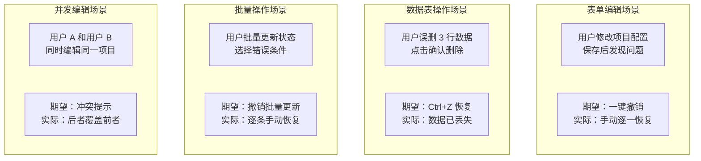

# 撤销重做系统 — 测试规格

> 来源 PRD：[12-prd-撤销重做系统.md](../../prds/2026-09/12-prd-撤销重做系统.md)

> **文档职责**：本文档定义**怎么验证**（VERIFY），不含产品目标与实现方案。用例覆盖度以 PRD 的 `FR-x.y` / `NFR-x` 编号追溯，不复制需求正文。
> 提取日期：2026-09-11

---

### 用户操作失误场景分析




---

<a id="sec-strategy"></a>
## 测试策略

### 分层模型

| 层级 | 说明 | 自动化 | 执行时机 |
|------|------|--------|---------|
| L1 单元 | Composable/hook/工具函数纯逻辑 | Vitest | 每次提交 |
| L2 组件 | Vue 组件挂载与交互 | Vitest + @vue/test-utils | 每次提交 |
| L3 集成 | Composable ↔ 组件 ↔ Store ↔ RPC | Vitest + mock | 每次提交 |
| L4 端到端 | 完整用户路径（需 YiAi 运行） | 手动 | 提测/回归 |

### 优先级定义

| 级别 | 含义 | 响应 |
|------|------|------|
| P0 | 核心路径，失败阻塞发布 | 立即修复 |
| P1 | 重要功能，失败需评估 | 当日修复 |
| P2 | 增强功能，可延后 | 排期修复 |

---

<a id="sec-env"></a>
## 测试环境与前置条件

| 项 | 要求 |
|----|------|
| Node.js | 与项目 `.nvmrc` 一致 |
| 包管理器 | pnpm |
| 浏览器 | Chrome 最新版 |
| 框架 | Vitest + jsdom |
| 类型检查 | `pnpm exec vue-tsc --noEmit` |

```bash
pnpm test                                    # 全部测试
pnpm exec vitest run tests/hooks/            # 仅 hooks
pnpm exec vitest run --coverage             # 覆盖率
```

---

<a id="sec-criteria"></a>
## 准入与准出标准

### 准入

| # | 条件 |
|---|------|
| 1 | 对应 FR 的实现已提交 |
| 2 | `vue-tsc --noEmit` 无错误 |
| 3 | 功能在开发环境可正常使用 |

### 准出

| # | 条件 | 阈值 |
|---|------|------|
| 1 | P0 用例通过率 | 100% |
| 2 | P1 用例通过率 | ≥ 95% |
| 3 | 遗留缺陷 | 无 Blocker / Critical |

---

<a id="sec-defects"></a>
## 缺陷分级

| 级别 | 定义 | 示例 |
|------|------|------|
| Blocker | 阻塞测试或数据损坏 | 功能完全不可用 |
| Critical | 核心功能不可用 | 主要路径报错 |
| Major | 功能缺陷但有替代路径 | 边界条件处理不当 |
| Minor | 体验问题 | UI 偏移/文案错误 |
| Trivial | 视觉细节 | 间距微调 |

### 需求覆盖矩阵

| FR | 需求 | 测试覆盖 | 状态 |
|----|------|---------|------|
| FR-1 | 命令模式类型定义 | UT | ✅ 已完成 |
| FR-2 | 命令基类 | UT | ✅ 已完成 |
| FR-3 | 命令管理器 | UT + CT | ✅ 已完成 |
| FR-4 | useUndoRedo Composable | UT + CT | ✅ 已完成 |
| FR-5 | 全局键盘快捷键 | UT + CT | ✅ 已完成 |
| FR-6 | 撤销重做 Store | UT | ✅ 已完成 |


<a id="sec-6"></a>
## 六、测试规格

### 单元测试：CommandManager

#### Scenario: 执行命令并撤销
- **GIVEN** 空的 CommandManager，一个 UpdateCommand
- **WHEN** 调用 `manager.execute(command)`，然后调用 `manager.undo()`
- **THEN** `undoStack` 为空，`redoStack` 包含该命令，数据恢复到执行前状态

#### Scenario: 撤销后重做
- **GIVEN** 执行了一个命令并已撤销
- **WHEN** 调用 `manager.redo()`
- **THEN** `undoStack` 包含该命令，`redoStack` 为空，数据恢复到执行后状态

#### Scenario: 超过深度限制
- **GIVEN** CommandManager 配置 `maxDepth = 3`，undoStack 已有 3 个命令
- **WHEN** 执行第 4 个命令
- **THEN** `undoStack.length = 3`，最旧的命令被移除

### 单元测试：命令合并

#### Scenario: 连续输入合并
- **GIVEN** undoStack 有一个 UpdateCommand（entityId="bug-1", timestamp=1000）
- **WHEN** 执行另一个 UpdateCommand（entityId="bug-1", timestamp=1300，同一实体，500ms 内）
- **THEN** 两个命令合并为一个，undoStack.length 不变，changeData.after 更新为最新的值

#### Scenario: 不同实体不合并
- **GIVEN** undoStack 有一个 UpdateCommand（entityId="bug-1"）
- **WHEN** 执行另一个 UpdateCommand（entityId="bug-2"）
- **THEN** 两个命令不合并，undoStack.length 增加

### 组件测试：HistoryTimeline

#### Scenario: 渲染操作历史
- **GIVEN** 历史记录包含 5 条操作（2 条更新、1 条删除、1 条创建、1 条批量）
- **WHEN** 挂载 `HistoryTimeline` 组件
- **THEN** 时间线显示 5 条记录，每条记录包含操作描述、图标和时间戳

#### Scenario: 空历史显示引导
- **GIVEN** 历史记录为空
- **WHEN** 挂载 `HistoryTimeline` 组件
- **THEN** 显示 "暂无操作记录" 空状态

---


## 补充：单元测试用例

### UT-UR01: useUndoRedo

| # | 测试场景 | 输入 | 期望结果 |
|---|---------|------|---------|
| 1 | 记录操作 | 修改数据 → pushState | history stack 新增一条 |
| 2 | 撤销 | undo() | 数据恢复到上一个状态 |
| 3 | 重做 | redo() | 数据恢复到下一个状态 |
| 4 | 栈大小限制 | 超过 maxHistory(50) | 最旧记录被移除 |
| 5 | 新操作清空 redo | 撤销后执行新操作 | redo stack 清空 |
| 6 | Ctrl+Z/Ctrl+Y | 快捷键 | 触发 undo/redo |

