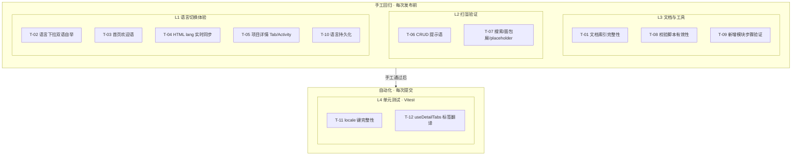

# YV-09-85: 多语言（i18n）专项优化与补充 — 测试用例

> 来源 PRD：[85-prd-多语言专项优化与补充.md](../../prds/2026-09/85-prd-多语言专项优化与补充.md)

> **文档职责**：本文档定义**怎么验证**（VERIFY），不含产品目标与实现方案。用例覆盖度以 PRD 的 `FR-x.y` / `NFR-x` 编号追溯，不复制需求正文。
> 开发方案：[85-dev-多语言专项优化与补充.md](../../devs/2026-09/85-dev-多语言专项优化与补充.md)
> 提取日期：2026-09-12 · 修订：2026-09-14


## 目录

- [一、测试范围与策略](#sec-1)
- [二、测试用例](#sec-2)
- [三、边缘场景用例](#sec-3)
- [四、回归用例](#sec-4)
- [五、追溯矩阵](#sec-5)
- [六、覆盖缺口](#sec-6)
- [七、入口与出口准则](#sec-7)
- [八、回归执行记录](#sec-8)

---

---

<a id="sec-strategy"></a>
## 测试策略

### 分层模型

| 层级 | 说明 | 自动化 | 执行时机 |
|------|------|--------|---------|
| L1 单元 | Composable/hook/工具函数纯逻辑 | Vitest | 每次提交 |
| L2 组件 | Vue 组件挂载与交互 | Vitest + @vue/test-utils | 每次提交 |
| L3 集成 | Composable ↔ 组件 ↔ Store ↔ RPC | Vitest + mock | 每次提交 |
| L4 端到端 | 完整用户路径（需 YiAi 运行） | 手动 | 提测/回归 |

### 优先级定义

| 级别 | 含义 | 响应 |
|------|------|------|
| P0 | 核心路径，失败阻塞发布 | 立即修复 |
| P1 | 重要功能，失败需评估 | 当日修复 |
| P2 | 增强功能，可延后 | 排期修复 |

---

<a id="sec-env"></a>
## 测试环境与前置条件

| 项 | 要求 |
|----|------|
| Node.js | 与项目 `.nvmrc` 一致 |
| 包管理器 | pnpm |
| 浏览器 | Chrome 最新版 |
| 框架 | Vitest + jsdom |
| 类型检查 | `pnpm exec vue-tsc --noEmit` |

```bash
pnpm test                                    # 全部测试
pnpm exec vitest run tests/hooks/            # 仅 hooks
pnpm exec vitest run --coverage             # 覆盖率
```

---

<a id="sec-criteria"></a>
## 准入与准出标准

### 准入

| # | 条件 |
|---|------|
| 1 | 对应 FR 的实现已提交 |
| 2 | `vue-tsc --noEmit` 无错误 |
| 3 | 功能在开发环境可正常使用 |

### 准出

| # | 条件 | 阈值 |
|---|------|------|
| 1 | P0 用例通过率 | 100% |
| 2 | P1 用例通过率 | ≥ 95% |
| 3 | 遗留缺陷 | 无 Blocker / Critical |

---

<a id="sec-defects"></a>
## 缺陷分级

| 级别 | 定义 | 示例 |
|------|------|------|
| Blocker | 阻塞测试或数据损坏 | 功能完全不可用 |
| Critical | 核心功能不可用 | 主要路径报错 |
| Major | 功能缺陷但有替代路径 | 边界条件处理不当 |
| Minor | 体验问题 | UI 偏移/文案错误 |
| Trivial | 视觉细节 | 间距微调 |


本文档定义**验证方式**——测什么、怎么测、通过标准是什么。需求见 PRD，实现见开发方案。

---

<a id="sec-1"></a>
## 一、测试范围与策略

### 1.1 测试分层



| 层级 | 工具 | 环境依赖 | 执行时机 |
|------|------|---------|---------|
| L1-L3 手工 | 浏览器 DevTools | YiVad 运行 + YiAi 后端 | 每次发布前 |
| L4 单元 | Vitest | 无外部依赖 | 每次提交（CI） |

### 1.2 覆盖范围

| 编号 | 被测对象 | 层级 |
|------|---------|------|
| COV-1 | 文档体系（4 篇 + README 引用） | L3 |
| COV-2 | Language.vue 切换器自举 | L1 |
| COV-3 | `getTimeState` + 首页欢迎语 | L1 |
| COV-4 | `document.documentElement.lang/dir` 同步 | L1 |
| COV-5 | CRUD 操作提示语（ElMessage/ElMessageBox） | L2 |
| COV-6 | 搜索框/面包屑/placeholder 翻译完整性 | L2 |
| COV-7 | `scripts/check-i18n-locales.mjs` 校验脚本 | L3 |
| COV-8 | 新增 locale 模块步骤 | L3 |
| COV-9 | 语言持久化（刷新/重开） | L1 |
| COV-10 | locale 键结构 + 占位符一致性（自动化） | L4 |
| COV-11 | useDetailTabs 标签翻译 | L4 |

### 1.3 不覆盖范围

| 不覆盖 | 原因 |
|--------|------|
| 第三语言 ja/zh-TW 切换 | PRD Out of Scope |
| 翻译语义正确性 | 需 Product Owner 人工审核 |
| 后端返回文案翻译 | PRD Out of Scope，需独立 PRD 覆盖 |
| Element Plus 控件内建文案 100% 覆盖 | 依赖 Element Plus 官方 locale 包完整性 |
| demo 目录中文演示数据 | 仅 dev 环境可见，不面向 end user |

### 1.4 测试环境

| 项 | 值 |
|----|----|
| 浏览器 | Chrome 最新 · 窗口 1280×800 + 移动端 375×812 |
| 语言初始态 | 先 zh → 切到 en → 再回 zh |
| 后端 | 本地 YiAi @ localhost:10086 |
| 账号 | admin（具备所有菜单权限） |
| 自动化 | Vitest（`pnpm test`） |

---

<a id="sec-2"></a>
## 二、测试用例

### 2.1 文档与引用完整性（COV-1 · L3）

> 手工验证

| 编号 | 用例 | 步骤 | 预期结果 | 优先级 | 状态 |
|------|------|------|---------|--------|------|
| TC-DOC-001 | 四篇文档存在 | 检查 `workflows/开发规范/08-规范-国际化规范.md`、`prds/2026-09/85-prd-*.md`、`devs/2026-09/85-dev-*.md`、`tests/2026-09/85-test-*.md` | 四篇均存在且 Front-matter 完整 | P0 | 待验证 |
| TC-DOC-002 | README 日常开发链接 | 打开项目详情 → Overview Tab → 点击「添加国际化文本」链接 | 跳转到 `08-规范-国际化规范.md` 且正常打开 | P0 | 待验证 |
| TC-DOC-003 | README 代码审查引用 | 打开项目详情 → 代码审查 checklist → 点击国际化条目 | 跳转到规范文档对应章节 | P1 | 待验证 |
| TC-DOC-004 | 文档间相互引用 | 检查 PRD → Dev → Test 三篇的 frontmatter 交叉引用 | PRD 含 dev/test 路径；Dev 含 `source_prd`；Test 含 `source_prds` | P0 | 待验证 |
| TC-DOC-005 | JSDoc 入口可读 | IDE 中打开 `languages/index.ts` 和 `languages/modules/index.ts` | 顶部 JSDoc 含文档链接 + 新增键/模块指引 | P1 | 待验证 |

### 2.2 语言切换器自举（COV-2 · L1）

> 手工验证

| 编号 | 用例 | 步骤 | 预期结果 | 优先级 | 状态 |
|------|------|------|---------|--------|------|
| TC-LANG-001 | 中文态下拉显示正确 | 默认 zh 打开语言下拉 | 选项显示「简体中文」和「English」 | P0 | 待验证 |
| TC-LANG-002 | 英文态下拉显示正确 | 切到 en，再次打开语言下拉 | 选项显示「Simplified Chinese」和「English」 | P0 | 待验证 |
| TC-LANG-003 | 切换后页面文本即时更新 | 在项目列表页切 en → 观察页面文本 | 所有 `t()` 渲染的文本即时切换为英文，无需刷新 | P0 | 待验证 |
| TC-LANG-004 | 切换后 Element Plus 控件更新 | 切 en 后观察表格分页、日期选择器等 | 控件内部文案（如分页 "Go to"）切换为英文 | P1 | 待验证 |

### 2.3 首页欢迎语（COV-3 · L1）

> 手工验证

| 编号 | 用例 | 步骤 | 预期结果 | 优先级 | 状态 |
|------|------|------|---------|--------|------|
| TC-GREET-001 | 中文早晨 | 系统时间 6:00-11:59，切中文 → 首页 | 显示「早上好」 | P0 | 待验证 |
| TC-GREET-002 | 中文下午 | 系统时间 12:00-17:59，切中文 → 首页 | 显示「下午好」 | P0 | 待验证 |
| TC-GREET-003 | 中文晚上 | 系统时间 18:00-23:59，切中文 → 首页 | 显示「晚上好」 | P0 | 待验证 |
| TC-GREET-004 | 中文深夜 | 系统时间 0:00-5:59，切中文 → 首页 | 显示「夜深了」 | P1 | 待验证 |
| TC-GREET-005 | 英文早晨 | 系统时间 6:00-11:59，切英文 → 首页 | 显示「Good morning」 | P0 | 待验证 |
| TC-GREET-006 | 英文下午 | 系统时间 12:00-17:59，切英文 → 首页 | 显示「Good afternoon」 | P0 | 待验证 |
| TC-GREET-007 | 英文晚上 | 系统时间 18:00-23:59，切英文 → 首页 | 显示「Good evening」 | P0 | 待验证 |
| TC-GREET-008 | 不显示裸 key | 任意时段切中/英文 | 欢迎语不显示 `common.greeting.morning` 等裸键路径 | P0 | 待验证 |

### 2.4 HTML 属性同步（COV-4 · L1）

> 手工验证

| 编号 | 用例 | 步骤 | 预期结果 | 优先级 | 状态 |
|------|------|------|---------|--------|------|
| TC-HTML-001 | 中文 lang 属性 | DevTools → Elements，切中文 | `<html lang="zh">` | P0 | 待验证 |
| TC-HTML-002 | 英文 lang 属性 | 切英文 | `<html lang="en">` | P0 | 待验证 |
| TC-HTML-003 | 切换即时生效 | 连续切换 zh→en→zh，观察 Elements 面板 | 每次切换后 `<html lang>` 即时更新（不等到刷新） | P0 | 待验证 |
| TC-HTML-004 | dir 属性为 ltr | 任意语言下检查 | `<html dir="ltr">` | P1 | 待验证 |

### 2.5 项目详情页标签与 Activity（COV-5 · L1）

> 手工验证

| 编号 | 用例 | 步骤 | 预期结果 | 优先级 | 状态 |
|------|------|------|---------|--------|------|
| TC-TAB-001 | 中文 Tab 标签 | 进入 `#/project/yivad`，zh 态观察 8 个 Tab | 8 个 Tab 标题均为中文，无裸 key | P0 | 待验证 |
| TC-TAB-002 | 英文 Tab 标签 | 切 en，观察 8 个 Tab | 8 个 Tab 标题均为英文，无中文残留 | P0 | 待验证 |
| TC-TAB-003 | Activity 分组中文 | zh 态 Overview → Activity 时间分组 | 显示「今天」「昨天」「更早」等中文 | P0 | 待验证 |
| TC-TAB-004 | Activity 分组英文 | en 态 Overview → Activity | 显示「Today」「Yesterday」「Older」等英文 | P0 | 待验证 |
| TC-TAB-005 | Todo 操作 tooltip | hover Todo 项的操作按钮 | tooltip 文字随语言切换 | P1 | 待验证 |

### 2.6 CRUD 操作提示语（COV-5 · L2）

> 手工验证

| 编号 | 用例 | 步骤 | 预期结果 | 优先级 | 状态 |
|------|------|------|---------|--------|------|
| TC-CRUD-001 | 创建成功提示（en） | 切 en → 新建项目 → 填写并提交 | ElMessage 显示 "Created successfully" | P0 | 待验证 |
| TC-CRUD-002 | 创建成功提示（zh） | 切 zh → 重复操作 | ElMessage 显示「创建成功」 | P0 | 待验证 |
| TC-CRUD-003 | 删除确认框（en） | en 态 → 选中项目 → Archive → 确认 | ElMessageBox 标题/内容/按钮为英文 | P0 | 待验证 |
| TC-CRUD-004 | 删除确认框（zh） | zh 态重复 | ElMessageBox 标题/内容/按钮为中文 | P0 | 待验证 |
| TC-CRUD-005 | 操作失败提示（en） | 构造失败场景（如网络断开） | 错误提示为英文 | P1 | 待验证 |
| TC-CRUD-006 | 所有提示无裸中文 | 中英文各操作一轮，记录所有 ElMessage | 英文态不出现中文提示；中文态不出现英文提示 | P0 | 待验证 |

### 2.7 搜索/面包屑/placeholder 完整性（COV-6 · L2）

> 手工验证

| 编号 | 用例 | 步骤 | 预期结果 | 优先级 | 状态 |
|------|------|------|---------|--------|------|
| TC-UI-001 | 搜索框 placeholder（en） | en 态进入 `/project` 列表 | 搜索框 placeholder 为英文 | P0 | 待验证 |
| TC-UI-002 | 表格列标题（en） | en 态进入 `/issue` 列表 | 列标题（标题/优先级/负责人/状态等）为英文 | P0 | 待验证 |
| TC-UI-003 | 面包屑（en） | en 态导航到深层页面 | 面包屑每级为英文，如 "Home / Project Management / Projects" | P0 | 待验证 |
| TC-UI-004 | 筛选下拉选项（en） | en 态打开任意筛选下拉 | 选项文字为英文 | P1 | 待验证 |
| TC-UI-005 | 空状态文案（en） | en 态进入无数据页面 | 空状态提示为英文 | P1 | 待验证 |
| TC-UI-006 | 无裸 key 显示 | 遍历以上所有位置 | 不出现 `project.list.searchPlaceholder` 等原始 key | P0 | 待验证 |

### 2.8 校验脚本有效性（COV-7 · L3）

> 手工验证 + 自动化

| 编号 | 用例 | 步骤 | 预期结果 | 优先级 | 状态 |
|------|------|------|---------|--------|------|
| TC-CHECK-001 | 当前 locale 通过 | `cd YiVad && pnpm i18n:check` | exit 0，无差异输出 | P0 | 待验证 |
| TC-CHECK-002 | 缺键检测 | 在 `project/en.ts` 中注释掉一个键 → 运行 | exit 1，输出缺失键路径 | P0 | 待验证 |
| TC-CHECK-003 | 多余键检测 | 在 `project/zh.ts` 中新增一个键 → 运行 | exit 1，输出仅 zh 存在的键 | P0 | 待验证 |
| TC-CHECK-004 | 占位符不一致检测 | zh 用 `{total}`，en 改为 `{n}` → 运行 | exit 1，输出占位符差异 | P0 | 待验证 |
| TC-CHECK-005 | 空值键不误报 | 某个键在 zh/en 中均为空字符串 | 不报占位符差异（空字符串mergency占位符为空） | P2 | 待验证 |

### 2.9 新增模块步骤验证（COV-8 · L3）

> 手工验证

| 编号 | 用例 | 步骤 | 预期结果 | 优先级 | 状态 |
|------|------|------|---------|--------|------|
| TC-MOD-001 | 4 步流程可用 | 按 JSDoc 指引新建 `languages/modules/foo/zh.ts` + `en.ts` → 注册到 `modules/index.ts` → 组件中 `t('foo.title')` → 中英切换 | zh/en 分别显示两语言；`pnpm i18n:check` 通过 | P1 | 待验证 |
| TC-MOD-002 | 缺少 en.ts 被检测 | 只建 zh.ts，注册但缺 en.ts | 注册时报错或 `i18n:check` 检测到差异 | P1 | 待验证 |

### 2.10 语言持久化（COV-9 · L1）

> 手工验证

| 编号 | 用例 | 步骤 | 预期结果 | 优先级 | 状态 |
|------|------|------|---------|--------|------|
| TC-PERSIST-001 | 刷新保持语言 | 切到 en → F5 刷新 | 刷新后仍为 en（不从 zh 重新开始） | P0 | 待验证 |
| TC-PERSIST-002 | 重开浏览器保持 | 切到 en → 关闭标签页 → 重新打开 | 仍为 en（globalStore 持久化生效） | P1 | 待验证 |
| TC-PERSIST-003 | 新标签页继承 | 切到 en → Ctrl+T 新标签页打开同域 | 新标签页也为 en | P1 | 待验证 |

### 2.11 locale 键完整性自动化测试（COV-10 · L4）

> 自动化落点：`tests/unit/i18n-locales.test.ts`（**待新增**）

| 编号 | 用例 | 步骤 | 预期结果 | 优先级 | 状态 |
|------|------|------|---------|--------|------|
| TC-UNIT-001 | zh/en 键路径完全一致 | 遍历 `messages.zh` 和 `messages.en` 所有键路径 | 集合相等（无缺失、无多余） | P0 | 待实现 |
| TC-UNIT-002 | 占位符名称一致 | 对每个含 `{xxx}` 占位符的键，比较 zh/en 的占位符名称 | 占位符名称集合完全相同 | P0 | 待实现 |
| TC-UNIT-003 | 非空值完整性 | 所有键在 zh/en 中均有非空字符串值 | 无 `undefined`/`null`/空字符串（特殊标记除外） | P1 | 待实现 |

### 2.12 useDetailTabs 标签翻译（COV-11 · L4）

> 自动化落点：`tests/unit/detail-tabs-i18n.test.ts`（**待新增**）

| 编号 | 用例 | 步骤 | 预期结果 | 优先级 | 状态 |
|------|------|------|---------|--------|------|
| TC-TABS-001 | zh 不出现裸 key | 用 zh locale 渲染 Tab 标签 | 所有标签不含 `project.detail.tabs.*` 原始 key 路径 | P0 | 待实现 |
| TC-TABS-002 | en 不出现裸 key | 用 en locale 渲染 Tab 标签 | 所有标签不含 `project.detail.tabs.*` 原始 key 路径 | P0 | 待实现 |
| TC-TABS-003 | 标签非空 | 遍历所有 Tab 标签 | 每个标签文本长度 > 0 | P1 | 待实现 |

---

<a id="sec-3"></a>
## 三、边缘场景用例

| 编号 | 场景 | 步骤 | 预期结果 | 优先级 | 状态 |
|------|------|------|---------|--------|------|
| TC-EDGE-001 | 浏览器语言为非法值 | `navigator.language = "fr"` → 加载页面 | 默认显示英文（`normalizeLocale` 归一化为 `en`） | P1 | 待验证 |
| TC-EDGE-002 | 语言切换时 SSE 活跃 | AI 对话进行中 → 切语言 | 对话内容不受影响，仅 UI 文案切换；不出现消息丢失 | P1 | 待验证 |
| TC-EDGE-003 | 快速连续切换 | 3 秒内连续切换 zh→en→zh→en 4 次 | 每次切换后 UI 正确；不出现混用；不出现白屏或崩溃 | P2 | 待验证 |
| TC-EDGE-004 | 切换语言后立即刷新 | 切 en → 500ms 内 F5 刷新 | 刷新后保持 en，不回到 zh（持久化写入在切换时同步完成） | P2 | 待验证 |
| TC-EDGE-005 | locale 键使用 MessageFormat 语法 | 键值含 `{n} items` 等复数格式 | 切换语言后复数形式正确（vue-i18n 原生支持） | P2 | 待验证 |
| TC-EDGE-006 | 菜单管理页语言相关字段 | 进入 `/system/menu` 编辑菜单的 `titleI18n` 字段 | 字段值不随语言切换而变化（这是配置数据，非 UI 文本） | P1 | 待验证 |

---

<a id="sec-4"></a>
## 四、回归用例

> 针对开发方案 §8 已登记的约束与 PRD §5 风险项，每条至少一条用例**固化当前行为**。

| 编号 | 关联约束 | 场景 | 当前预期 | 修复后预期 | 优先级 | 状态 |
|------|---------|------|---------|-----------|--------|------|
| TC-REG-001 | 约束 1（store 中 useI18n） | store action 中 ElMessage 中文提示 | 需在 action 内调用 `useI18n()` | 保持不变（设计约束） | P1 | 待验证 |
| TC-REG-002 | 约束 2（后端文案） | 后端返回中文错误消息 | 前端显示中文（不翻译） | 后续 PRD 覆盖前端枚举 lookup | P2 | 待验证 |
| TC-REG-003 | 约束 3（ElConfigProvider） | DatePicker 面板切语言 | 面板内文案切换（或记录不切换的控件） | 全部控件切换（或加 `:key` 强制重建） | P2 | 待验证 |
| TC-REG-004 | PRD §5 风险（扫盲误改） | debug 级字符串被替换为 `t()` | 仅 `ElMessage/ElNotification/ElMessageBox/模板` 四类被替换 | 人工 review diff 确认无误改 | P1 | 待验证 |

---

<a id="sec-5"></a>
## 五、追溯矩阵

| 需求项（PRD） | 验收标准 | 覆盖用例 |
|--------------|---------|---------|
| FR-01 文档体系 | UAT-06 | TC-DOC-001 ~ 005 |
| FR-02 切换器自举 | UAT-02 | TC-LANG-001 ~ 004 |
| FR-03 问候语国际化 | UAT-03 | TC-GREET-001 ~ 008 |
| FR-04 运行时 lang 同步 | UAT-04 | TC-HTML-001 ~ 004 |
| FR-05 ElMessage 扫盲 | UAT-01, UAT-05 | TC-CRUD-001 ~ 006, TC-TAB-001 ~ 005 |
| FR-06 结构校验 | UAT-07 | TC-CHECK-001 ~ 005, TC-UNIT-001 ~ 003 |
| FR-07 JSDoc 代码内链接 | UAT-06（包含） | TC-DOC-005 |
| NFR-01 性能（切换 < 80ms） | — | TC-EDGE-003（快速切换不崩溃） |
| NFR-02 兼容性（不破坏现有键） | — | TC-CHECK-001（全量 locale 通过校验） |
| NFR-03 可维护性（新增 ≤ 4 步） | — | TC-MOD-001 |
| — 语言持久化 | UAT-02（包含） | TC-PERSIST-001 ~ 003 |
| — Tab/Activity 翻译 | UAT-01 | TC-TAB-001 ~ 005, TC-TABS-001 ~ 003 |
| — 搜索/面包屑/placeholder | UAT-05 | TC-UI-001 ~ 006 |

---

<a id="sec-6"></a>
## 六、覆盖缺口

| 编号 | 缺口 | 影响 | 建议 |
|------|------|------|------|
| G-1 | 无视觉回归基线 | 语言切换后的布局/样式回归不可见 | 按需引入 Playwright 视觉快照 |
| G-2 | T-11/T-12 自动化用例待实现 | locale 完整性依赖手工 `i18n:check`，CI 中无强制门禁 | 优先实现 T-11（`tests/unit/i18n-locales.test.ts`） |
| G-3 | 翻译语义正确性无自动化 | "Good afternoon" vs "Good evening" 的翻译质量依赖人工 | Code Review 时关注新增/修改的 en.ts 值 |
| G-4 | `getTimeState` 时段边界依赖系统时间 | 手工测试难以覆盖所有 5 个时段 | 在单元测试中 mock `Date` 或提取 `getHours` 为可注入参数 |

---

<a id="sec-7"></a>
## 七、入口与出口准则

### 入口准则

- [ ] 开发方案 §2 文件清单全部落地，`pnpm type:check` 通过
- [ ] `common/zh.ts` + `common/en.ts` 已补齐所有通用提示键
- [ ] `scripts/check-i18n-locales.mjs` 可正常运行
- [ ] Language.vue 切换器改造完成

### 出口准则

- [ ] **P0 用例 100% 通过**（TC-DOC、TC-LANG、TC-GREET、TC-HTML、TC-TAB、TC-CRUD、TC-UI、TC-CHECK、TC-PERSIST、TC-UNIT 中的 P0 项）
- [ ] P1 用例通过率 ≥ 90%，未通过项已登记且不影响语言切换主链路
- [ ] `pnpm i18n:check` 通过（当前 locale 无差异）
- [ ] T-11 自动化测试并入 `pnpm test`，全量通过
- [ ] 组件扫盲完成：全仓扫描 ElMessage/ElNotification/ElMessageBox 中文硬编码 = 0
- [ ] 中英文各完整走一遍 UAT-01 ~ UAT-07 场景

---

<a id="sec-8"></a>
## 八、回归执行记录

| 版本 | 测试人 | 日期 | P0 通过 | P1 通过 | 备注 |
|------|--------|------|---------|---------|------|
| v1.0 首轮 | — | — | — | — | 待执行 |