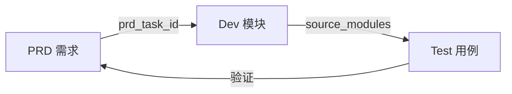

# 2026-09 测试文档索引

> 测试文档——描述 VERIFY（测试策略、测试用例、回归计划），独立于产品和开发文档。完整追溯链：**OKR → PRD → Dev Module → Test**

<a id="sec-1"></a>
## 一、PRD → Module → Test 可追溯矩阵



| Test ID | 标题 | 状态 | 覆盖 OKR | 覆盖 PRD | 覆盖 Dev 模块 |
|---------|------|------|----------|----------|-------------|
| YV-09-00 | [九月测试策略](./00-test-九月测试策略.md) | 已完成 | yivad-001, yivad-002 | YV-09-01 | 全部 19 个模块 |
| YV-09-22 | [测试体系建设](./22-test-测试体系建设.md) | 已完成 | yivad-001 | YV-09-01 | YV-09-01-1, YV-09-01-2 |

<a id="sec-2"></a>
## 二、Test 文档结构

每个测试用例文件遵循标准 7 节结构（参考 [测试模板](./模板/00-模板-测试规格.md)）：

```
1. 测试范围与策略 — 测试分层 (L1-L4)、覆盖范围、测试环境
2. 测试用例 — 按模块分组，含编号/步骤/预期/优先级/状态
3. 边缘场景用例 — 异常输入、边界条件
4. 回归用例 — 已知缺陷固化测试
5. 追溯矩阵 — 需求项 → 用例映射
6. 覆盖缺口 — 已知未覆盖项及建议
7. 入口与出口准则 — 测试开始/通过条件
```

<a id="sec-3"></a>
## 三、测试分层

| 层级 | 工具 | 环境依赖 | 执行时机 |
|------|------|---------|---------|
| L1 单元 | Vitest + jsdom | 无外部依赖 | 每次提交 |
| L2 集成 | Vitest + Pinia + 内存路由 | 无外部依赖 | 每次提交 |
| L3 组件 | Vitest + @vue/test-utils | 无外部依赖 | 每次提交 |
| L4 端到端 | Playwright | YiAi 运行 | 发布前 |

<a id="sec-4"></a>
## 四、Frontmatter 规范

```yaml
doc_type: test
title: "YV-09-NN: {功能名称} — 测试用例"
status: {待开始|进行中|已完成}
priority: {高|中|低}
owner: {负责人}
prd_task_id: "YV-09-NN"                    # 测试编号
source_prds: ["YV-09-01"]                   # 必填：覆盖的 PRD 编号
source_modules: ["YV-09-01-1", "..."]       # 必填：覆盖的 Dev Module 编号
source_okr: [{OKR ID}]
```

<a id="sec-5"></a>
## 五、目录规范

```
tests/{month}/
├── README.md                    # 本文件：可追溯矩阵 + 测试分层说明
├── 模板/                         # 测试用例模板
├── 00-test-{策略}.md            # 测试策略文档
└── NN-test-{描述}.md            # 测试用例文档
```

<a id="sec-6"></a>
## 六、追溯规则

| 从 | 到 | 字段 | 说明 |
|----|----|------|------|
| Test | Dev | `source_modules` | 每个 Test **必须**关联至少一个 Dev Module |
| Test | PRD | `source_prds` | 每个 Test **必须**关联来源 PRD |
| Test | OKR | `source_okr` | 建议关联 OKR 目标 |

**完整链路：** `OKR goal → PRD (source_okr) → Dev Module (prd_task_id) → Test (source_modules)`

<a id="sec-7"></a>
## 七、测试编写指南

### 用例编号规范

```
TC-{MODULE}-{NNN}    模块用例
TC-EDGE-{NNN}         边缘场景
TC-REG-{NNN}          回归用例（固化已知缺陷）
```

### 优先级定义

| 优先级 | 定义 | 出口要求 |
|--------|------|---------|
| P0 | 核心功能、安全相关 | 100% 通过 |
| P1 | 重要功能、常见边界 | ≥ 90% 通过 |
| P2 | 非核心功能、体验 | 不阻塞发布 |
| P3 | 已知缺陷固化 | 记录现状 |

### 出口准则

- [ ] P0 用例 100% 通过
- [ ] P1 用例通过率 ≥ 90%
- [ ] 回归用例关键行为通过（如空菜单分支始终落登录页）
- [ ] 用例并入 `pnpm test`，全量通过
- [ ] 覆盖率达标，已登记缺口可接受