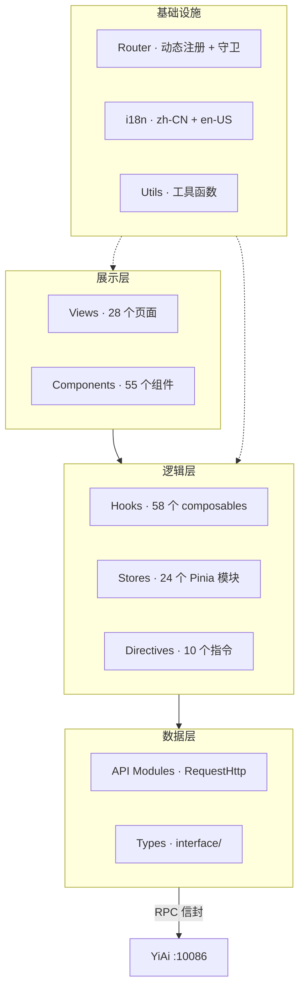
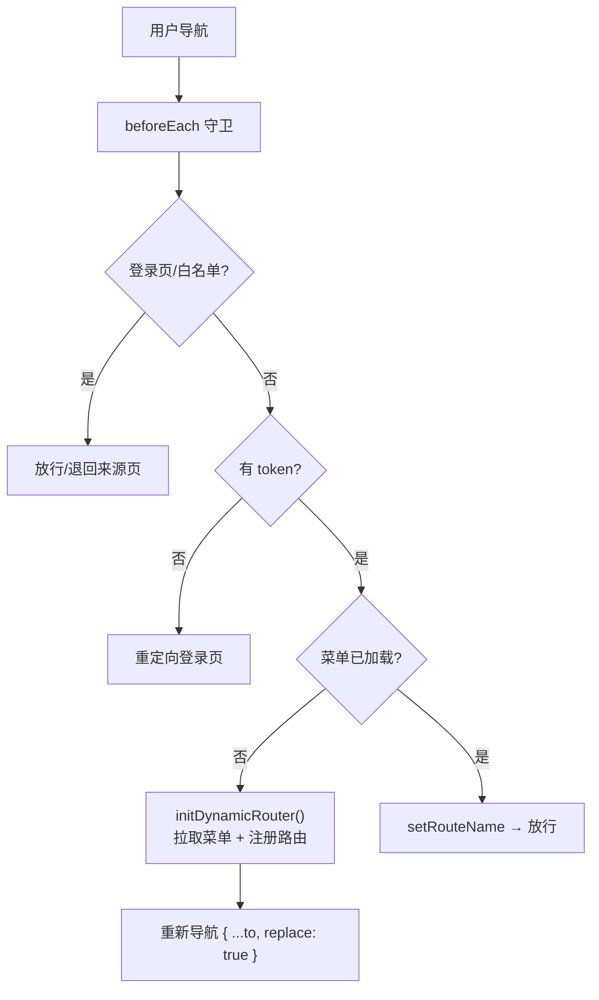
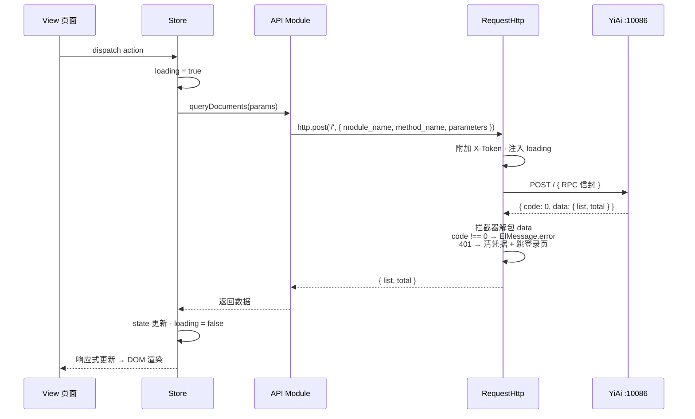

# 项目架构

> 目录结构、路由系统、状态管理、数据流 —— 架构层面的设计决策和约束。

## 一、分层架构



**分层规则：**

| 层 | 可以依赖 | 禁止依赖 |
|----|---------|---------|
| Views | Components, Hooks, Stores | 无（顶层） |
| Components | Hooks, Stores（注入） | 直接 axios/fetch |
| Hooks | Stores, API Modules | Views（避免循环） |
| Stores | API Modules | Views, Components |
| API Modules | RequestHttp, Types | Views, Stores |

## 二、目录结构

```
src/
├── api/                    # HTTP 封装 + 接口类型 + 领域服务模块
│   ├── index.ts            # RequestHttp 实例（拦截器）
│   ├── interface/          # 请求/响应类型定义
│   └── modules/            # 领域服务模块
│       ├── dataService.ts  # 通用 CRUD
│       ├── chatService.ts  # AI 聊天（SSE）
│       ├── fileService.ts  # 文件读写
│       └── login.ts        # 认证 + 权限下发
│
├── components/             # 55 个可复用组件
│   ├── ProTable/           # 核心：通用表格组件
│   ├── ProForm/            # 通用表单组件
│   └── ...
│
├── views/                  # 28 个功能域页面
│   ├── home/               # 首页仪表盘
│   ├── project/            # 项目管理
│   ├── aiChat/             # AI 聊天
│   └── system/             # 系统管理
│
├── stores/modules/         # 24 个 Pinia 模块
│   ├── auth.ts             # 权限状态（菜单树 + 按钮规则）
│   ├── user.ts             # 用户状态（token + 信息）
│   └── ...
│
├── hooks/                  # 58 个 composables
│   ├── useTable.ts         # 表格数据管理
│   ├── useAuthButtons.ts   # 编程式权限查询
│   └── ...
│
├── routers/                # 路由系统
│   ├── index.ts            # 守卫（beforeEach/afterEach/onError）
│   ├── modules/
│   │   ├── staticRouter.ts # 静态路由（登录/404/500）
│   │   └── dynamicRouter.ts # 动态路由注册
│   └── interface/          # 路由类型
│
├── directives/modules/     # 10 个自定义指令
│   ├── auth.ts             # v-auth 按钮级鉴权
│   └── ...
│
├── languages/              # i18n 国际化
│   ├── modules/
│   │   ├── zh-CN.ts        # 中文
│   │   └── en-US.ts        # 英文
│   └── index.ts            # vue-i18n 实例
│
├── styles/                 # 全局样式
│   ├── var.scss            # SCSS 变量
│   └── common.scss         # 公共样式
│
└── utils/                  # 工具函数
    ├── index.ts            # 菜单工具（扁平化/排序/面包屑）
    └── ...
```

## 三、路由系统



**路由设计决策：**
- Hash 模式（`createWebHashHistory`）——兼容静态部署，无需服务端配置
- 菜单驱动路由——后端下发菜单树，前端动态 `addRoute`，未下发菜单 **不存在路由**
- 懒加载——组件通过 `@yivad/views-glob` 虚拟模块映射为 `() => import(...)`，按视图分块
- 降级——菜单 API 不可用时回退 `authMenuList.json`（60 个路由名）
- 安全——401 拦截器清除 stores → 重定向登录页，路由守卫重入保护

## 四、状态管理

Pinia setup-function 语法，按域拆分：

| 类别 | Store | 职责 |
|------|-------|------|
| 全局 | `auth` | 权限状态（菜单树、按钮规则、路由名） |
| 全局 | `user` | 用户信息、token |
| 全局 | `global` | 主题、语言、侧边栏、loading |
| 业务 | `project` | 项目管理 CRUD 状态 |
| 业务 | `chat` | AI 对话消息、会话 |
| 页面 | `tabs` | 标签页状态 |
| 页面 | `keepAlive` | 组件缓存名单 |

**Store 模式：**

```typescript
// Setup Store 语法（唯一允许的格式）
export const useProjectStore = defineStore("yivad-project", () => {
  // 1. 状态（ref/reactive）
  const list = ref<ProjectItem[]>([]);

  // 2. 派生（computed）
  const activeProjects = computed(() => list.value.filter(p => p.status === "active"));

  // 3. 动作（async function）
  async function fetchList() { ... }
  async function create(data: CreateParams) { ... }

  // 4. 只暴露方法，不直接暴露 mutable state
  return { list, activeProjects, fetchList, create };
});
```

**原则：**
- 一个 Store 一个业务域，不做万能 Store
- Store 只通过 API 模块访问后端，不直接导入 axios
- 异步操作统一管理 loading/error 状态
- 持久化用 `pinia-plugin-persistedstate`（localStorage）

## 五、数据流



## 六、关键约束

| 约束 | 原因 |
|------|------|
| ProTable 替代 el-table | 统一分页/排序/筛选/导出模式 |
| v-auth 替代 v-if 权限判断 | 物理移除 DOM 元素，安全性高于 CSS 隐藏 |
| RequestHttp 替代直接 axios | 统一拦截器（Token/Loading/Error/401） |
| $t() 替代硬编码文本 | 国际化支持 zh-CN + en-US |
| filter 替代 query 参数名 | 后端 RPC 契约，使用 query 静默忽略 |