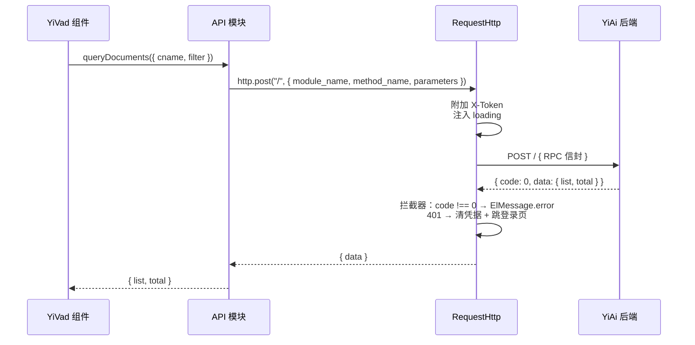

# API 开发

> RPC 信封协议、服务模块规范、RequestHttp 拦截器、参数命名契约 —— 前后端通信的唯一方式。

## 一、RPC 信封协议

所有 API 调用使用统一信封，通过 `RequestHttp` 发送：

```
POST /  Content-Type: application/json
body: {
  module_name: "services.<domain>.<service>",
  method_name: "<method>",
  parameters: { ... }
}
```



## 二、RequestHttp 拦截器

`src/api/index.ts` 中的 `RequestHttp` 实例封装了统一的请求/响应处理：

```typescript
// 请求拦截器
http.interceptors.request.use((config) => {
  // 1. 附加 Token
  const token = useUserStore().token;
  if (token) config.headers["X-Token"] = token;

  // 2. 注入 loading（可通过 { loading: false } 抑制）
  if (config.loading !== false) {
    useGlobalStore().loading = true;
  }

  return config;
});

// 响应拦截器
http.interceptors.response.use(
  (response) => {
    const { code, message, data } = response.data;

    // 业务成功
    if (code === 0) return data;

    // 业务错误 → 统一提示
    ElMessage.error(message || "请求失败");
    return Promise.reject(new Error(message));
  },
  (error) => {
    // HTTP 错误
    if (error.response?.status === 401) {
      // 凭据失效 → 清状态 + 跳登录页
      useUserStore().setToken("");
      clearPersistedState();
      router.replace(LOGIN_URL);
    }
    ElMessage.error(error.message || "网络错误");
    return Promise.reject(error);
  }
);
```

**设计要点：**
- `code === 0` → 自动解包 `data`，调用方直接拿到业务数据
- `code !== 0` → 自动 `ElMessage.error`，组件中无需重复提示
- 401 → 连锁清理（token + 持久化状态 + 路由），保证安全退出
- `{ loading: false }` → 抑制全局 loading（权限接口、轮询接口等场景）

## 三、参数命名契约

| 正确 | 错误 | 上下文 |
|------|------|--------|
| `filter` | `query` | `data_service.query_documents` 参数 |
| `target_file` | `path` | `/read-file`、`/write-file` 端点 |
| `cname` | `collection_name` | `data_service` collection 参数 |

这些不匹配曾导致真实 bug —— 后端静默忽略 `query`，对 `path` 返回 422。

## 四、API 模块规范

每个 API 模块是一个领域服务函数集合，存放于 `src/api/modules/`：

```
src/api/modules/
├── dataService.ts       # 通用 CRUD
├── chatService.ts       # AI 聊天（SSE）
├── fileService.ts       # 文件读写
├── knowledgeService.ts  # 知识库
├── ragService.ts        # RAG 检索
├── authService.ts       # 认证授权
└── login.ts             # 登录/登出/菜单/按钮权限
```

**模块示例：**

```typescript
// src/api/modules/dataService.ts
import { http } from "@/api";
import type { QueryParams, QueryResult, CreateParams } from "@/api/interface";

/**
 * 查询文档列表（分页）
 */
export async function queryDocuments(params: QueryParams): Promise<QueryResult> {
  return http.post("/", {
    module_name: "services.database.data_service",
    method_name: "query_documents",
    parameters: params,
  });
}

/**
 * 创建文档
 */
export async function createDocument(params: CreateParams): Promise<{ id: string }> {
  return http.post("/", {
    module_name: "services.database.data_service",
    method_name: "create_document",
    parameters: params,
  });
}

/**
 * 更新文档
 */
export async function updateDocument(params: {
  cname: string;
  key: Record<string, unknown>;
  data: Record<string, unknown>;
}): Promise<void> {
  return http.post("/", {
    module_name: "services.database.data_service",
    method_name: "update_document",
    parameters: params,
  });
}

/**
 * 删除文档
 */
export async function deleteDocument(params: {
  cname: string;
  key: Record<string, unknown>;
}): Promise<void> {
  return http.post("/", {
    module_name: "services.database.data_service",
    method_name: "delete_document",
    parameters: params,
  });
}
```

**规则：**
- 模块文件以 `Service` 后缀命名（`dataService.ts`）
- 每个函数封装一个 RPC 调用
- 请求/响应类型定义在 `src/api/interface/`
- API 模块**不包含业务逻辑**，仅做参数转发和类型定义
- 响应已由拦截器解包 `data`，函数签名返回业务数据

## 五、类型定义

```typescript
// src/api/interface/index.ts

/** 分页查询参数 */
export interface QueryParams {
  cname: string;
  filter?: Record<string, unknown>;
  pageNum?: number;
  pageSize?: number;
  orderBy?: Record<string, 1 | -1>;
  fields?: string[];
  exclude?: string[];
}

/** 分页查询结果 */
export interface QueryResult {
  list: Record<string, unknown>[];
  total: number;
  pageNum: number;
  pageSize: number;
  totalPages: number;
}

/** 标准 RPC 响应信封 */
export interface RpcResponse<T = unknown> {
  code: number;
  message: string;
  data: T;
}
```

## 六、SSE 流式调用

AI 聊天使用 SSE 流式响应，不经过标准 RPC 信封：

```typescript
// src/api/modules/chatService.ts
export async function chatStream(
  params: ChatParams,
  onMessage: (text: string) => void,
  onDone: () => void,
  onError: (err: Error) => void,
): Promise<void> {
  const token = useUserStore().token;

  const response = await fetch(`${API_BASE}/`, {
    method: "POST",
    headers: {
      "Content-Type": "application/json",
      ...(token ? { "X-Token": token } : {}),
    },
    body: JSON.stringify({
      module_name: "services.ai.chat_service",
      method_name: "chat",
      parameters: { ...params, stream: true },
    }),
  });

  const reader = response.body?.getReader();
  if (!reader) throw new Error("Stream not supported");

  const decoder = new TextDecoder();
  let buffer = "";

  while (true) {
    const { done, value } = await reader.read();
    if (done) break;

    buffer += decoder.decode(value, { stream: true });
    const lines = buffer.split("\n");
    buffer = lines.pop() || "";

    for (const line of lines) {
      if (line.startsWith("data: ")) {
        const json = JSON.parse(line.slice(6));
        if (json.done) {
          onDone();
          return;
        }
        onMessage(json.data?.message || "");
      }
    }
  }
}
```

**SSE 约束：**
- 不走 `RequestHttp`（因为响应不是 JSON 信封）
- 手动附加 `X-Token`
- 处理 `data:` 前缀和 `done` 结束帧
- 错误通过 `onError` 回调，不抛异常

## 七、错误码参考

| 错误码 | 含义 | 前端处理 |
|--------|------|---------|
| `0` | 成功 | 正常解包 data |
| `1001` | 参数验证失败 | ElMessage.error + 检查参数名 |
| `1002` | 资源不存在 | ElMessage.error |
| `2001` | AI 服务不可用 | ElMessage.error + 提示检查 Ollama |
| `3001` | 文件读写失败 | ElMessage.error |
| `4001` | 认证失败 | 清凭据 + 跳登录页 |
| `5001` | 数据库错误 | ElMessage.error |

## 八、反模式

| 反模式 | 错误示例 | 正确做法 | 原因 |
|--------|----------|----------|------|
| 直接 axios | `import axios from "axios"; axios.post(...)` | 使用 API 模块函数 | 绕过拦截器、Token、错误处理 |
| 参数名用 `query` | `{ query: { name: "x" } }` | `{ filter: { name: "x" } }` | 后端静默忽略 |
| 参数名用 `path` | `{ path: "/x.md" }` | `{ target_file: "/x.md" }` | 后端返回 422 |
| API 模块含业务逻辑 | 在 `dataService.ts` 中格式化日期 | 格式化在组件或 hook 中 | 破坏单一职责 |
| 组件中重复错误提示 | `catch { ElMessage.error(...) }` | 拦截器已统一提示 | 重复弹窗 |
| 硬编码 URL | `fetch("http://localhost:10086/")` | `import.meta.env.RSBUILD_API_BASE` | 不可配置 |