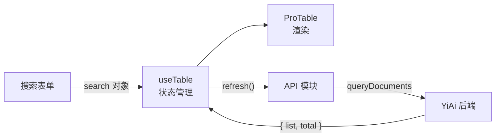
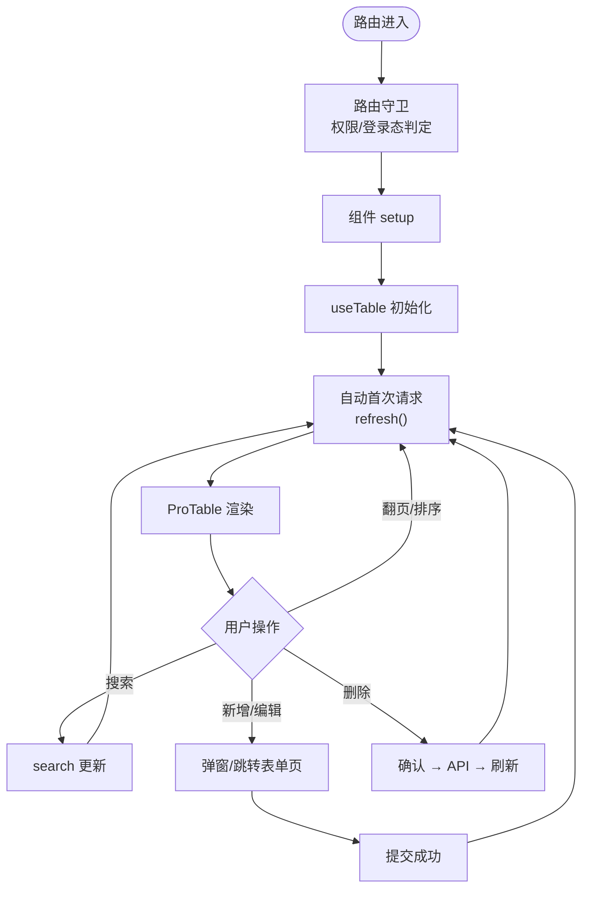

# 页面模式

> 四种标准页面模式：列表页、表单页、搜索表单、文件上传。所有页面遵循统一的数据流和组件组合方式。

## 一、列表页模式

标准组合：`ProTable` + `useTable` composable。ProTable 统一处理分页、排序、筛选、多选、导出。



```typescript
// 基本用法
import ProTable from "@/components/ProTable/ProTable.vue";
import { useTable } from "@/hooks/useTable";
import { queryDocuments } from "@/api/modules/dataService";

const {
  tableData,    // Ref<Item[]>
  loading,      // Ref<boolean>
  pagination,   // Reactive<{ current, pageSize, total }>
  search,       // Ref<Record<string, unknown>>
  refresh,      // () => Promise<void>
} = useTable({
  requestApi: queryDocuments,
  defaultParams: { cname: "projects" },
});

// 表格列定义
const columns: ColumnProps[] = [
  { prop: "name", label: "项目名称", search: { el: "input" } },
  { prop: "status", label: "状态", search: { el: "select" }, enum: STATUS_OPTIONS },
  { prop: "createdAt", label: "创建时间", sortable: true },
];
```

**ProTable 能力：**
- 分页、排序、筛选由 ProTable 统一处理
- 搜索参数通过 `search` reactive 对象管理，变更自动触发 `refresh`
- `search.el` 支持 `input`、`select`、`date-picker`、`cascader`
- 批量操作通过 `selectedRows` + 工具栏按钮
- 导出功能通过 `exportApi` 配置

**列表页约束：**
- 禁止直接使用 `el-table`，必须用 `ProTable`
- 表格列定义使用 `ColumnProps[]` 类型
- 数据请求通过 `useTable`，不在组件中手动管理分页状态

## 二、表单页模式

标准组合：`ProForm` + 声明式表单配置。

```typescript
// 表单配置
const formItems: FormItemProps[] = [
  {
    prop: "name",
    label: "项目名称",
    el: "input",
    rules: [{ required: true, message: "请输入项目名称" }],
  },
  {
    prop: "description",
    label: "项目描述",
    el: "input",
    type: "textarea",
  },
  {
    prop: "status",
    label: "项目状态",
    el: "select",
    enum: STATUS_OPTIONS,
  },
];

// 提交
async function handleSubmit(formData: Record<string, unknown>) {
  if (isEdit.value) {
    await updateDocument({ cname: "projects", key: { id: props.id }, data: formData });
  } else {
    await createDocument({ cname: "projects", data: formData });
  }
  ElMessage.success(isEdit.value ? "更新成功" : "创建成功");
  router.back();
}
```

**模式变体：**

| 变体 | 场景 | 差异 |
|------|------|------|
| 创建页 | 新建资源 | 空表单，提交走 create |
| 编辑页 | 修改资源 | 回显已有数据，提交走 update |
| 详情页 | 只读查看 | 表单 disabled，无提交按钮 |
| 分步表单 | 复杂创建流程 | `el-steps` + 多组 ProForm |

**表单页约束：**
- 表单配置使用 `FormItemProps[]` 声明式定义
- 校验规则在 formItem 的 `rules` 字段声明
- 提交逻辑在组件或 Store 中封装，不在模板中内联

## 三、搜索表单模式

搜索与表格联动：搜索参数变更 → `search` 更新 → `useTable` 自动 `refresh`。

```typescript
const searchParams = reactive({
  keyword: "",
  status: "",
  dateRange: [] as string[],
});

function handleSearch() {
  // 合并搜索参数到 useTable 的 search
  search.value = { ...searchParams };
}

function handleReset() {
  // 清空搜索参数并重新请求
  Object.assign(searchParams, { keyword: "", status: "", dateRange: [] });
  search.value = {};
}
```

**搜索模式约束：**
- 搜索参数与表格分页参数合并为统一的 `search` 对象
- 搜索按钮触发 `search.value = { ...searchParams }`
- 重置按钮清空 search reactive 并重新请求
- 不使用 ProTable 内置搜索列时，自定义搜索表单放在表格上方

## 四、文件上传模式

```typescript
// 使用 Element Plus el-upload
import { ElUpload } from "element-plus";
import { writeFile } from "@/api/modules/fileService";

const uploadUrl = computed(() => `${import.meta.env.RSBUILD_API_BASE}/write-file`);

function beforeUpload(file: File): boolean {
  // 校验类型
  const allowedTypes = ["image/png", "image/jpeg", "application/pdf"];
  if (!allowedTypes.includes(file.type)) {
    ElMessage.error("不支持的文件类型");
    return false;
  }

  // 校验大小（10MB）
  if (file.size > 10 * 1024 * 1024) {
    ElMessage.error("文件大小不能超过 10MB");
    return false;
  }

  return true;
}
```

**文件操作端点：**

| 端点 | 方法 | 参数 | 说明 |
|------|------|------|------|
| `/write-file` | POST | `{ target_file, content }` | 写入文件 |
| `/read-file` | GET | `?target_file=/path/to/file` | 读取文件 |

**文件上传约束：**
- 使用 Element Plus `el-upload` 组件
- 上传前校验类型和大小（`beforeUpload` 钩子）
- 文件写入通过 `/write-file` 端点（参数名 `target_file` 非 `path`）

## 五、页面目录结构

```
src/views/<domain>/<page>/
├── index.vue              # 页面入口
├── components/            # 页面私有组件
│   ├── SearchForm.vue     # 搜索表单
│   ├── EditDialog.vue     # 编辑弹窗
│   └── DetailDrawer.vue   # 详情抽屉
└── hooks/                 # 页面私有 hooks
    └── usePageLogic.ts    # 页面逻辑抽取
```

**规则：**
- 页面私有组件放在 `components/` 子目录
- 复杂逻辑抽取为页面私有 hooks（`hooks/` 子目录）
- 跨页面复用的逻辑放在 `src/hooks/`
- 跨页面复用的组件放在 `src/components/`

## 六、页面生命周期



**常见陷阱：**
- 不要在 `onMounted` 中手动调用 `refresh()`——`useTable` 已自动处理首次加载
- 不要在 `watch(search)` 中调用 `refresh()`——`useTable` 内部已建立 watch
- 弹窗关闭时清理表单校验状态，避免下次打开残留红色提示