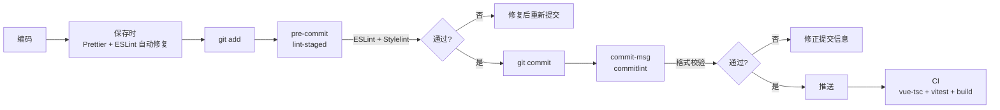

# 质量构建

> 代码质量门禁、测试策略、提交规范、构建配置 —— 保证代码质量的三道防线。

## 一、质量门禁



| 阶段 | 检查 | 工具 | 失败行为 |
|------|------|------|----------|
| 保存 | Prettier 格式化 + ESLint 自动修复 | VS Code 插件 | — |
| pre-commit | lint-staged（ESLint + Stylelint） | Husky 9 + lint-staged 17 | 阻止提交 |
| commit-msg | Conventional Commits 格式校验 | commitlint 21 | 阻止提交 |
| CI | 类型检查 + 测试 + 构建 | vue-tsc 2 + Vitest + Rsbuild | 阻止合并 |

## 二、工具链

| 工具 | 版本 | 用途 | 配置文件 |
|------|------|------|---------|
| ESLint | 10.x | JS/TS 代码检查 | `eslint.config.mjs` |
| Prettier | 3.x | 代码格式化 | `.prettierrc` |
| Stylelint | 17.x | 样式检查 | `.stylelintrc` |
| Husky | 9.x | Git hooks 管理 | `.husky/` |
| lint-staged | 17.x | 暂存文件检查 | `package.json` |
| commitlint | 21.x | 提交信息校验 | `commitlint.config.ts` |
| vue-tsc | 2.x | Vue 类型检查 | `tsconfig.json` |
| Vitest | 4.x | 单元测试 + 组件测试 | `vitest.config.ts` |

## 三、类型检查

`vue-tsc --noEmit` 是提交前的必过门禁：

```bash
# 检查所有 .vue 和 .ts 文件的类型
pnpm typecheck

# 等同于
vue-tsc --noEmit
```

**类型检查捕获的问题：**
- Props/Emits 类型不匹配
- 未使用的导入（`noUnusedLocals: true`）
- 可能为 null/undefined 的访问（`strictNullChecks: true`）
- 隐式 any（`noImplicitAny: true`）

**CI 配置（rsbuild.config.ts）：**
```typescript
// 构建前自动执行类型检查
// Rsbuild 配置中已启用 TypeScript 类型检查插件
```

## 四、测试策略

| 类型 | 框架 | 命令 | 覆盖范围 |
|------|------|------|---------|
| 类型检查 | vue-tsc | `pnpm typecheck` | 所有 .vue/.ts 文件 |
| 单元测试 | Vitest + jsdom | `pnpm test` | 工具函数、composables、stores |
| 组件测试 | Vitest + @vue/test-utils | `pnpm test` | 组件渲染与交互 |
| 代码检查 | ESLint + Prettier + Stylelint | `pnpm lint` | 代码风格、最佳实践 |
| 构建验证 | Rsbuild | `pnpm build:pro` | 构建产物正确性 |

**测试原则：**
- 纯函数和工具类优先覆盖（低成本、高收益）
- Store 测试覆盖状态转换和派生逻辑
- 组件测试覆盖核心交互路径，非像素级渲染
- 端到端测试（Playwright）覆盖关键用户链路

```typescript
// 示例：Store 测试
import { setActivePinia, createPinia } from "pinia";
import { useAuthStore } from "@/stores/modules/auth";

describe("authStore", () => {
  beforeEach(() => {
    setActivePinia(createPinia());
  });

  it("初始状态为空", () => {
    const store = useAuthStore();
    expect(store.authMenuList).toEqual([]);
    expect(store.authButtonList).toEqual({});
  });

  it("加载菜单后 getter 派生正确", async () => {
    const store = useAuthStore();
    // mock API
    await store.getAuthMenuList();
    expect(store.flatMenuListGet.length).toBeGreaterThan(0);
  });
});
```

## 五、提交规范

使用 Conventional Commits，配合 `cz-git` 交互式提交：

```bash
pnpm commit
# → 交互式选择 type → scope → 填写描述
```

```
<type>(<scope>): <description>

feat(project): add project delete confirmation dialog
fix(table): ProTable pagination reset on search
refactor(auth): extract permission logic to useAuth composable
```

| type | 说明 | 示例 |
|------|------|------|
| `feat` | 新功能 | `feat(dashboard): add project stats chart` |
| `fix` | Bug 修复 | `fix(api): correct filter parameter name` |
| `refactor` | 重构（无功能变更） | `refactor(project): split God Component` |
| `style` | 样式/格式化 | `style(layout): adjust sidebar width` |
| `docs` | 文档 | `docs(readme): update setup guide` |
| `perf` | 性能优化 | `perf(table): add virtual scroll` |
| `test` | 测试 | `test(auth): add permission guard tests` |
| `chore` | 构建/工具 | `chore(deps): update Element Plus to 2.15` |
| `ci` | CI/CD | `ci: add vue-tsc to pre-commit hook` |

**规则：**
- 一个功能点一个提交，不混入无关修改
- 提交前执行 `pnpm typecheck && pnpm lint`
- 禁止 `--no-verify` 跳过 hooks
- Scope 使用模块名（kebab-case）

## 六、构建配置

| 命令 | 用途 | 环境变量 |
|------|------|---------|
| `pnpm dev` | 开发服务器 :8848 | `.env.development` |
| `pnpm build:dev` | 开发环境构建 | `.env.dev` |
| `pnpm build:test` | 测试环境构建 | `.env.test` |
| `pnpm build:pro` | 生产环境构建 | `.env.production` |
| `pnpm preview` | 本地预览构建产物 | — |

**环境变量规范：**
- 前缀统一使用 `RSBUILD_`
- 核心变量：`RSBUILD_API_BASE`（YiAi 地址）、`RSBUILD_ROUTER_MODE`（hash/history）
- 各环境通过 `.env.{mode}` 文件管理
- 敏感信息不进仓库（`.env.local` 加入 `.gitignore`）

**构建产物检查：**
```bash
# 生产构建
pnpm build:pro

# 检查输出
ls -la dist/
# 确认：
# - JS/CSS 文件名含 contenthash（长期缓存）
# - 视图组件按 chunk 分割（懒加载）
# - index.html 存在且正确引用资源
```

## 七、代码审查清单

### 提交前自查

| 检查项 | 命令/工具 |
|--------|----------|
| 类型检查通过 | `pnpm typecheck` |
| ESLint + Stylelint 通过 | `pnpm lint` |
| 测试通过 | `pnpm test` |
| 无 console.log 残留 | ESLint `no-console` |
| 无未使用导入 | ESLint `no-unused-vars` |
| 参数名使用 `filter`（非 `query`） | 人工审查 |

### 审查关注点

| 关注点 | 说明 |
|--------|------|
| 是否使用 ProTable | 非 `el-table` |
| 是否使用 v-auth | 非 `v-if` 内联权限 |
| 是否使用 $t() | 非硬编码文本 |
| 是否通过 RequestHttp | 非直接 axios |
| 是否 `<script setup lang="ts">` | 非 Options API |
| Props/Emits 是否有类型 | 泛型声明 |
| 无 any/as 断言 | 类型收窄 |
| 组件是否可复用 | 单一职责 |