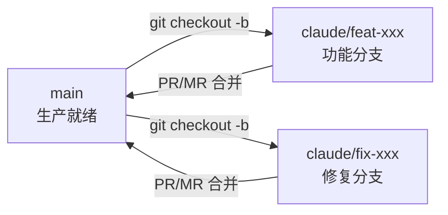
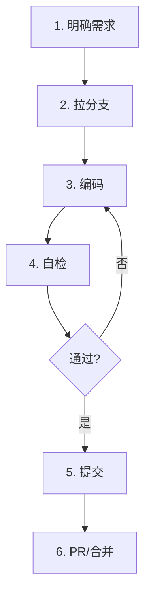

# 分支与变更

> 分支管理策略、变更落地工作流、冲突处理、发布流程。

## 一、分支策略



| 分支 | 用途 | 规则 |
|------|------|------|
| `main` | 生产就绪代码 | 仅通过 PR/MR 合并，禁止直接 push |
| `claude/*` | 功能/修复分支 | 默认前缀，kebab-case 命名 |

### 分支命名

```
claude/<type>-<简短描述>

claude/feat-project-delete-dialog    # 新功能
claude/fix-table-pagination-reset    # Bug 修复
claude/refactor-auth-permission      # 重构
```

**规则：**
- 从 `main` 拉出特性分支
- 一个分支聚焦一个功能或修复
- 合并后删除分支（保持仓库清洁）

## 二、变更落地工作流



### 详细步骤

**1. 明确需求** — 确认范围和验收标准
- 阅读 PRD（`YiKnowledge/projects/yivad/prds/`）
- 阅读开发方案（`YiKnowledge/projects/yivad/devs/`）
- 确认依赖关系和 API 契约

**2. 拉分支**
```bash
git checkout main
git pull origin main
git checkout -b claude/feat-xxx
```

**3. 编码** — 遵循代码约定
- 使用 `<script setup lang="ts">`
- 表格用 ProTable，权限用 v-auth
- API 参数名用 `filter`/`target_file`/`cname`
- 更新 CLAUDE.md（如引入新模块或模式变更）

**4. 自检**
```bash
pnpm typecheck    # vue-tsc --noEmit
pnpm lint         # ESLint + Stylelint
pnpm test         # Vitest
```

**5. 提交**
```bash
pnpm commit       # cz-git 交互式提交
# 或: git commit -m "feat(project): add delete confirmation dialog"
```

**6. PR/合并**
- 描述变更内容和测试说明
- 关联相关 Issue/Bug
- Code Review 通过后合并到 main

## 三、提交规范

Conventional Commits，使用 `cz-git` 交互式提交：

```
<type>(<scope>): <description>

feat(project): add project delete confirmation dialog
fix(table): ProTable pagination reset on search
refactor(auth): extract permission logic to useAuth composable
```

| type | 说明 | 示例 |
|------|------|------|
| `feat` | 新功能 | `feat(dashboard): add project stats chart` |
| `fix` | Bug 修复 | `fix(api): correct filter parameter name` |
| `refactor` | 重构 | `refactor(project): split God Component into composables` |
| `style` | 样式/格式化 | `style(layout): adjust sidebar width` |
| `docs` | 文档 | `docs(readme): update setup instructions` |
| `perf` | 性能优化 | `perf(table): add virtual scroll for large datasets` |
| `test` | 测试 | `test(auth): add permission guard unit tests` |
| `chore` | 构建/工具 | `chore(deps): update Element Plus to 2.15` |
| `ci` | CI/CD | `ci: add vue-tsc to pre-push hook` |

### Scope 命名

Scope 使用模块名（kebab-case）：`project`、`issue`、`dashboard`、`table`、`auth`、`api`、`router`、`i18n`

## 四、冲突处理

### 合并策略

- 优先从 `main` merge 而非 rebase（保留提交历史）
- 解决冲突后重新验证：`pnpm typecheck && pnpm lint`

### 冲突解决步骤

```bash
# 1. 更新本地 main
git checkout main && git pull origin main

# 2. 切回功能分支并合并
git checkout claude/feat-xxx
git merge main

# 3. 解决冲突（VS Code 或命令行）
# 编辑冲突文件，保留正确的内容

# 4. 标记已解决
git add <冲突文件>

# 5. 完成合并
git commit -m "merge: resolve conflicts with main"

# 6. 验证
pnpm typecheck && pnpm lint
```

### 冲突涉及关键模块时

- 冲突涉及路由（`routers/`）→ 确认动态路由注册和守卫逻辑不丢失
- 冲突涉及 Store（`stores/`）→ 确认状态结构和派生不破坏
- 冲突涉及 API 模块（`api/modules/`）→ 确认 RPC 参数契约一致
- 通知相关开发者一起 review

## 五、发布流程

### 常规发布

```
1. main 分支代码冻结（不再合并新功能）
2. pnpm build:pro → 验证构建产物
3. 部署到生产环境
4. 验证关键功能：登录、菜单、核心页面
5. 打 tag: git tag v1.x.x && git push --tags
```

### 紧急修复（Hotfix）

```
1. 从 main 拉出 hotfix 分支
   git checkout -b claude/fix-critical-bug main

2. 修复并验证
   pnpm typecheck && pnpm lint && pnpm test

3. 合并到 main
   git checkout main && git merge claude/fix-critical-bug

4. 构建部署 + 验证 + 打 tag

5. 删除 hotfix 分支
   git branch -d claude/fix-critical-bug
```

### Tag 规范

| 场景 | Tag 格式 | 示例 |
|------|---------|------|
| 常规发布 | `v{major}.{minor}.{patch}` | `v1.2.0` |
| 紧急修复 | `v{major}.{minor}.{patch}` | `v1.2.1` |

## 六、Git 操作速查

```bash
# 拉取最新代码
git checkout main && git pull origin main

# 创建功能分支
git checkout -b claude/feat-xxx

# 查看当前分支状态
git status

# 查看修改内容
git diff

# 暂存修改
git add src/views/myFeature/index.vue

# 提交（推荐用 pnpm commit）
git commit -m "feat(myFeature): add list page"

# 推送分支
git push origin claude/feat-xxx

# 查看提交历史
git log --oneline -10

# 撤销未暂存的修改
git checkout -- <file>

# 撤销已暂存的修改
git reset HEAD <file>

# 暂存当前工作（切换分支前）
git stash
git stash pop  # 恢复
```