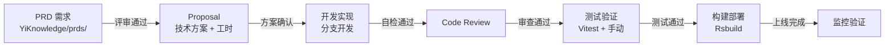

# 需求到上线

> 从 PRD 评审到 Proposal 到构建部署的完整生命周期。

## 一、生命周期总览



## 二、阶段说明

### 阶段 1：PRD 评审

| 步骤 | 内容 | 输出 |
|------|------|------|
| 1 | 需求方提供 PRD | YiKnowledge `prds/{month}/` 目录 |
| 2 | 开发者评估可行性、工时、技术方案 | 评审意见 |
| 3 | 确认范围和验收标准 | 评审通过的 PRD |

**PRD 文档结构：** 需求定义 → 功能需求 → 非功能需求 → 设计决策 → 验收标准 → 风险与回滚

### 阶段 2：Proposal

| 步骤 | 内容 | 输出 |
|------|------|------|
| 1 | 分析 PRD，识别影响模块 | 改动范围清单 |
| 2 | 设计技术方案 | 架构决策、接口契约、文件清单 |
| 3 | 评估工时和风险 | 人天估算、风险矩阵 |
| 4 | 输出 Proposal | 开发方案文档（YiKnowledge `devs/`） |

**Proposal 必须明确：**
- 改动文件清单（新增/修改）
- API 契约变更（新 RPC 调用、参数变更）
- Store/路由/权限的变更影响
- 对 YiPet 跨项目桥接的影响（如适用）

### 阶段 3：开发实现

| 步骤 | 操作 |
|------|------|
| 拉分支 | `git checkout -b claude/<feature> main` |
| 编码 | 遵循代码约定，参照开发方案 |
| 自检 | `pnpm typecheck && pnpm lint && pnpm test` |
| 提交 | `pnpm commit`（Conventional Commits） |

**开发约束：**
- 一个分支聚焦一个功能或修复
- 使用 `<script setup lang="ts">`，表格用 ProTable
- API 调用通过 RequestHttp，参数名使用 `filter`
- 更新 CLAUDE.md（如引入新模块或模式变更）

### 阶段 4：Code Review

| 检查项 | 说明 |
|--------|------|
| ProTable 替代 el-table | 表格页面必须用 ProTable |
| v-auth 替代 v-if 权限判断 | 权限控制统一用指令 |
| $t() 替代硬编码文本 | 所有用户可见文本国际化 |
| RequestHttp 替代直接 axios | 不绕过拦截器 |
| 参数名契约 | filter/target_file/cname |
| 类型安全 | 无 any、无 as 断言 |
| 测试覆盖 | 核心逻辑有测试 |

### 阶段 5：测试验证

| 层级 | 内容 | 命令 |
|------|------|------|
| 类型检查 | vue-tsc | `pnpm typecheck` |
| 单元测试 | Vitest | `pnpm test` |
| 集成验证 | 连接 YiAi 手动验证 | `pnpm dev` |
| 端到端 | Playwright（发布前） | `pnpm test:e2e` |

### 阶段 6：构建部署

```bash
pnpm build:dev      # 开发环境
pnpm build:test     # 测试环境
pnpm build:pro      # 生产环境（压缩、无 SourceMap）
```

**部署前检查清单：**
- [ ] `vue-tsc --noEmit` 通过
- [ ] 所有单元测试通过
- [ ] 新增 API 参数名遵循 RPC 契约（`filter`/`target_file`/`cname`）
- [ ] 国际化文本已添加（zh-CN + en-US）
- [ ] CLAUDE.md 已更新（如引入新模块或模式）
- [ ] 开发方案文档已归档到 YiKnowledge `devs/`

### 阶段 7：上线后

- [ ] 监控生产环境错误日志
- [ ] 验证关键功能可用（菜单、核心页面、AI 聊天）
- [ ] 标记对应 PRD 状态为「已完成」
- [ ] 如有遗留问题，登记到技术债（PRD §10 后续演进）

## 三、异常流程

| 场景 | 处理 |
|------|------|
| PRD 评审未通过 | 需求方修改后重新评审 |
| Proposal 工时超预期 | 与需求方协商 scope cut 或分期交付 |
| Code Review 未通过 | 修复后重新提交，不强制 push |
| 测试发现回归 bug | 在当前分支修复，扩展测试覆盖 |
| 构建失败 | 检查 CI 日志，修复后重新构建 |
| 上线后发现严重 bug | 启动回滚流程（回退到上一版本静态路由表或代码回滚） |

## 四、与 YiAi/YiPet 联调

| 场景 | 注意 |
|------|------|
| 新增 RPC 调用 | YiAi 需同步实现对应 service method |
| 修改参数契约 | 通知 YiAi/YiPet 开发者，更新 RPC 契约文档 |
| YiPet 桥接变更 | YiPet 的 `window.open` 跳转 URL 需同步更新 |
| 权限码变更 | 同步更新 YiAi 的 `button_permissions` 集合和 authStore |