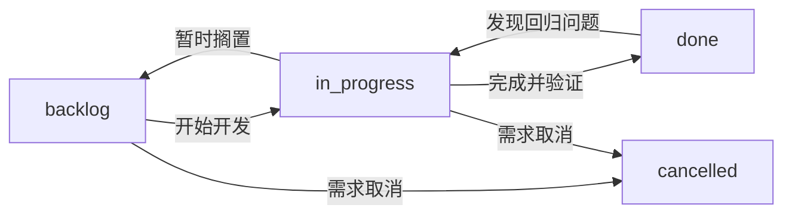
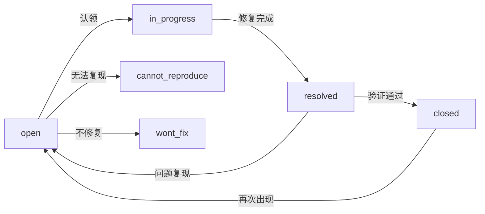

# 变更状态管理

> Issue/Bug/Module 的状态生命周期、流转规则、优先级体系、逾期管理。

## 一、Issue 生命周期



### 状态定义

| 状态 | 含义 | 典型场景 |
|------|------|---------|
| `backlog` | 待开发 | 需求已评审，等待排期 |
| `in_progress` | 开发中 | 开发者已领取，正在编码 |
| `done` | 已完成 | 代码合入、验证通过 |
| `cancelled` | 已取消 | 需求撤销或不再需要 |

### 流转规则

| 转换 | 触发条件 | 前置检查 |
|------|----------|---------|
| backlog → in_progress | 开发者领取，开始编码 | 需求已评审、范围明确 |
| in_progress → done | 代码合入 + 验证通过 | `typecheck` + `lint` 通过 + 手动验证 |
| in_progress → backlog | 因依赖阻塞暂缓 | 记录阻塞原因，不丢失代码 |
| * → cancelled | 需求方确认取消 | 关联的 Dev 模块同步标记 |
| done → in_progress | 发现回归 bug | 创建关联 Bug，从 bug 状态追踪 |

## 二、Bug 生命周期



### 状态定义

| 状态 | 含义 | 典型场景 |
|------|------|---------|
| `open` | 新建 | 缺陷刚被创建 |
| `in_progress` | 修复中 | 开发者已认领，正在修复 |
| `resolved` | 已修复 | 代码合入，等待验证 |
| `closed` | 已关闭 | 验证通过，问题消失 |
| `cannot_reproduce` | 无法复现 | 按步骤无法重现 |
| `wont_fix` | 不修复 | 有意不修复（如设计如此、优先级过低） |

### 流转规则

| 转换 | 触发条件 | 必须记录 |
|------|----------|---------|
| open → in_progress | 开发者认领 | 认领人、预计修复时间 |
| in_progress → resolved | 修复代码合入 | 修复方案、关联 commit |
| resolved → closed | QA 或报告者验证通过 | 验证环境、验证结果 |
| resolved → open | 验证时问题仍存在 | 复现截图/日志 |
| open → cannot_reproduce | 三次尝试无法复现 | 尝试的环境和步骤 |
| open → wont_fix | 评估后决定不修 | 决定人、不修复原因 |
| closed → open | 已关闭的 bug 再次出现 | 新的复现步骤 |

## 三、优先级体系

| 优先级 | 标签 | 响应时间 | 定义 |
|--------|------|---------|------|
| P0 | `urgent` | 即时 | 阻断核心功能、数据丢失、安全漏洞 |
| P1 | `high` | 24h 内 | 核心功能异常，影响主要用户流程 |
| P2 | `medium` | 本周 | 非核心功能异常，有 workaround |
| P3 | `low` | 下迭代 | 体验优化、视觉瑕疵、可延后 |

### 优先级判定矩阵

| 影响范围 \ 严重度 | Critical | Major | Minor | Trivial |
|-------------------|----------|-------|-------|---------|
| 全量用户 | P0 | P0 | P1 | P2 |
| 部分用户 | P0 | P1 | P2 | P3 |
| 个别用户 | P1 | P2 | P2 | P3 |
| 仅开发环境 | P2 | P2 | P3 | P3 |

## 四、模块管理

模块通过 `moduleService` 管理，关联到项目（`project_key`）：

| 状态 | 含义 | 行为 |
|------|------|------|
| `active` | 活跃 | 正常显示、可关联 Issue/Bug |
| `archived` | 归档 | 隐藏、已有关联保留但不新增 |

**模块归档条件：**
- 模块下所有 Issue 已 `done` 或 `cancelled`
- 模块下所有 Bug 已 `closed`
- 模块连续 30 天无新活动

## 五、逾期管理

### 逾期检测

- Issue/Bug 的 `updated_at` 在状态变更时自动更新
- 逾期判断：当前日期 > 预期完成日期（`due_date` 字段）
- 逾期项在概览页/项目详情页高亮标记

### 逾期处理流程

```
逾期检测
  ├── 1 天逾期 → 标记黄色，通知负责人
  ├── 3 天逾期 → 标记橙色，通知模块 owner
  └── 7 天逾期 → 标记红色，升级到项目 owner，评估是否需要 help
```

## 六、跟踪原则

| 原则 | 说明 |
|------|------|
| 状态变更可追溯 | 每次状态变更记录操作人、时间、原因（`status_history` 数组） |
| 单向为主 | Issue 状态以单向流转为主（backlog → in_progress → done），回退需记录原因 |
| 关联同步 | Issue done 时检查关联 Bug 是否全部 closed |
| 定期清理 | 每月清理 `cancelled` / `wont_fix` 项，归档到历史记录 |

## 七、与 Dev 模块的联动

| Dev 模块状态 | 关联 Issue 状态 | 关联 Bug 行为 |
|-------------|---------------|-------------|
| 开发中 | `in_progress` | 可关联、可修复 |
| 已完成 | `done` | 不再接受新 bug（改为关联新模块） |
| 已归档 | — | 已有 bug 保留，不创建新关联 |

**规则：** Dev 模块标记「已完成」前，必须确认关联 Issue 全部 `done`、P0/P1 Bug 全部 `closed`。