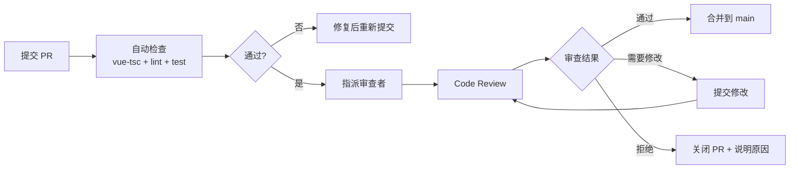

# 代码审查

> Code Review 流程、检查清单、常见问题、审查礼仪。

## 一、审查流程



## 二、审查者检查清单

### 必检项

| # | 检查项 | 说明 |
|---|--------|------|
| 1 | ProTable `>` el-table | 表格页面必须用 ProTable |
| 2 | v-auth `>` v-if 权限 | 权限判断统一用指令 |
| 3 | $t() `>` 硬编码文本 | 所有用户可见文本国际化 |
| 4 | RequestHttp `>` 直接 axios | 不绕过拦截器 |
| 5 | `<script setup lang="ts">` | 禁止 Options API |
| 6 | filter `>` query | RPC 参数名契约 |
| 7 | target_file `>` path | 文件读写参数名契约 |
| 8 | 无 `any` / `as` 断言 | 类型安全 |

### 关注项

| # | 检查项 | 说明 |
|---|--------|------|
| 9 | 组件可复用性 | 是否抽取为独立组件 |
| 10 | Composable 单一职责 | 一个 hook 做一件事 |
| 11 | loading/error 状态 | 异步操作是否有状态管理 |
| 12 | 副作用清理 | onUnmounted 是否清理了计时器/事件监听 |
| 13 | 国际化双写 | zh + en 是否都有 |
| 14 | 导入顺序 | 是否遵循分层导入顺序 |
| 15 | 无 console.log | 调试日志是否已清除 |
| 16 | 无未使用导入 | 死代码是否已清理 |

## 三、按模块审查重点

### 组件（`src/components/`）

```vue
<!-- 审查要点 -->
- Props 类型是否完整且有默认值？
- Emits 类型是否精确？
- 样式是否 scoped？
- 是否过度设计了？（为未来需求增加无用抽象）
- Props 落一层还是两层？（深层传递考虑 provide/inject）
```

### 页面（`src/views/`）

```vue
<!-- 审查要点 -->
- 复杂逻辑是否抽取为 composable？
- 页面私有组件是否放在 views/<page>/components/？
- 弹窗关闭是否正确重置状态？
- 是否在 onMounted 中手动调用了 useTable 提供的 refresh？
```

### Composable（`src/hooks/`）

```typescript
// 审查要点
- 返回的 ref/reactive 是否能被正确解构？
- 是否有 onUnmounted 清理？
- 错误是否被捕获而不抛出？
- 名称是否以 use 开头？
```

### API 模块（`src/api/modules/`）

```typescript
// 审查要点
- module_name 拼写是否正确？
- method_name 是否与后端一致？
- 参数名是否遵循契约（filter/target_file/cname）？
- 类型签名是否完整（参数 + 返回值）？
- 是否混入了业务逻辑？
```

### Store（`src/stores/modules/`）

```typescript
// 审查要点
- 是否使用 Setup Store 语法？
- 是否直接导入 axios/fetch？
- 异步操作是否有 loading 管理？
- 返回值是否暴露了不该暴露的 mutable state？
```

## 四、常见审查发现

| 发现 | 严重度 | 说明 |
|------|--------|------|
| 使用 `el-table` 而非 ProTable | 高 | 破坏统一表格模式 |
| 硬编码中文文本 | 高 | 国际化不可切换 |
| 直接 `axios.post()` | 高 | 绕过拦截器和 RPC 信封 |
| 参数名 `query` 而非 `filter` | 高 | 后端静默忽略，数据不更新 |
| Props 缺少类型 | 中 | 失去编译期类型检查 |
| `console.log` 残留 | 中 | 生产环境信息泄露 |
| 弹窗关闭后状态未重置 | 中 | 残留数据/样式 |
| 未清理副作用 | 中 | 内存泄漏风险 |
| 深层次 Props 传递 | 低 | 可维护性下降 |
| 缺少国际化双写 | 低 | 英文版显示键名 |

## 五、审查礼仪

### 提交者

- PR 描述说明**做了什么**和**为什么**（非代码逐行翻译）
- 关联相关 Issue/PRD/Bug
- 提交前自检：`pnpm typecheck && pnpm lint && pnpm test`
- 小 PR 优先：一个 PR 一个关注点，不超过 400 行变更
- 对审查意见及时响应（24h 内）

### 审查者

- 区分**必须修改**和**建议改进**（用 `nit:` 前缀标记非阻塞建议）
- 每条评论引用具体代码行
- 说明问题原因，而非只说"改一下"
- 正面反馈同样重要：好的实现也值得指出来
- 24h 内完成审查（紧急 PR 2h）

### 评论示例

```
✅ 好的评论：
"这里用 filter 而非 query 是正确的，注意 dataService.ts:42 也是同样的模式"
"建议用 computed 替代 watch，可以自动处理依赖追踪 — nit: 可选的优化"

❌ 不好的评论：
"改掉"
"不对"
"为什么这么写？"（纯问题无建议）
```

## 六、PR 合并标准

| 条件 | 说明 |
|------|------|
| CI 通过 | vue-tsc + lint + test 全部通过 |
| 至少 1 人审查通过 | 核心模块需 2 人 |
| 无未解决问题的评论 | 所有讨论已解决 |
| 关联 Issue 已关联 | PR 描述中引用 |
| 无合并冲突 | 分支与 main 无冲突 |

## 七、审查工具

| 方法 | 说明 |
|------|------|
| 逐行审查 | GitHub/GitLab PR diff 视图 |
| 拉取本地 | `gh pr checkout <N>` → IDE 中查看完整上下文 |
| 运行验证 | `gh pr checkout <N>` → `pnpm dev` 功能验证 |
| 对比审查 | 前后端 API 契约参数名对照检查 |