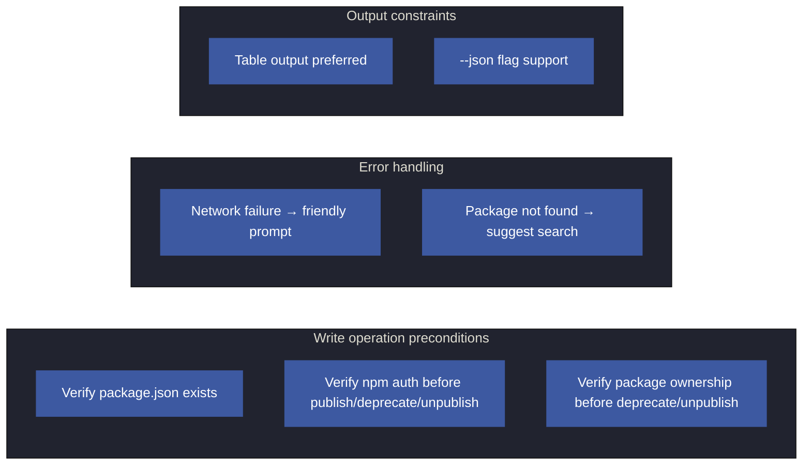
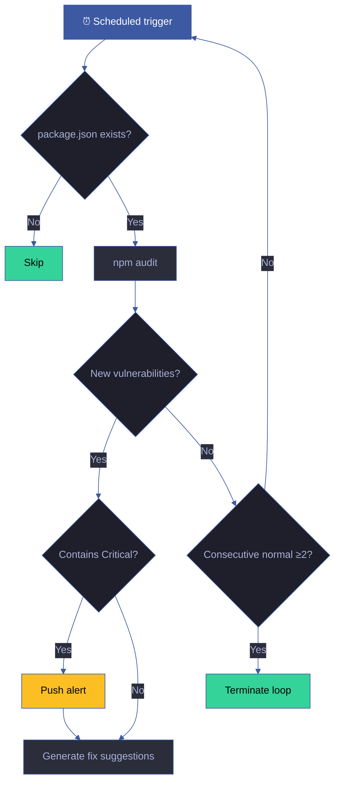
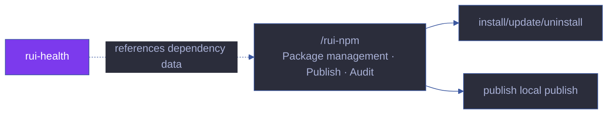

# rui-npm

> Personal npm package manager: search · install · update · list · info · uninstall · local publish · npx execution · CDN references · account-level management.
>
> **--help / -h**: Execute `node skills/rui-npm/help.mjs` to output full help (including command family overview + scenario examples). When user input is `/rui-npm --help` or `/rui-npm -h` or `/rui-npm help`, skip logic and run the script directly.
>
> Philosophy derived from [CLAUDE.md](../../CLAUDE.md).
>
> **Single responsibility**: npm package lifecycle management. Not responsible for code quality analysis ([rui-analysis](../rui-analysis/)), not responsible for dependency visualization ([rui-bundle-analyze](../rui-bundle-analyze/)).

[Command family overview](#command-family-overview) · [Subcommands](#subcommands) · [Typical workflows](#typical-workflows) · [Core rules](#core-rules) · [Degradation strategies](#degradation-strategies) · [Effectiveness indicators](#effectiveness-indicators) · [Self-loop](#self-loop)

## Command family overview

```mermaid
%%{init: {'theme': 'base', 'themeVariables': {
  'primaryColor': '#1e1f2b',
  'primaryTextColor': '#a9b1d6',
  'primaryBorderColor': '#3d59a1',
  'lineColor': '#3d59a1',
  'secondaryColor': '#2b2d3b',
  'tertiaryColor': '#21232f'
}}}%%
flowchart TD
    ENTRY["/rui-npm"]:::entry --> Q1{"Subcommand?"}

    Q1 -->|"search &lt;kw&gt;"| SEARCH["Package search<br/>npm registry keyword search"]:::read
    Q1 -->|"install &lt;pkg&gt;"| INSTALL["Package install<br/>npm install wrapper"]:::write
    Q1 -->|"update &lt;pkg&gt;"| UPDATE["Package update<br/>npm update wrapper"]:::write
    Q1 -->|"list"| LIST["Installed list<br/>npm list structured"]:::read
    Q1 -->|"info &lt;pkg&gt;"| INFO["Package info<br/>npm view structured"]:::read
    Q1 -->|"uninstall &lt;pkg&gt;"| UNINSTALL["Package uninstall<br/>npm uninstall wrapper"]:::write
    Q1 -->|"publish &lt;path&gt;"| PUBLISH["Local publish<br/>file/directory → npm publish"]:::write
    Q1 -->|"npx &lt;pkg&gt;"| NPX["npx execution<br/>run without installing"]:::run
    Q1 -->|"audit"| AUDIT["Security audit<br/>npm audit wrapper"]:::read
    Q1 -->|"cdn &lt;pkg&gt;"| CDN["CDN references<br/>unpkg/jsDelivr/esm.sh"]:::read
    Q1 -->|"login"| LOGIN["Login auth<br/>Access Token configuration"]:::write
    Q1 -->|"my-packages"| MY_PKGS["My packages list<br/>account-level package management"]:::read
    Q1 -->|"deprecate &lt;pkg&gt;"| DEPRECATE["Deprecate version<br/>mark deprecated"]:::write
    Q1 -->|"unpublish &lt;pkg&gt;"| UNPUBLISH["Delete package/version<br/>remove from registry"]:::write
    Q1 -->|"empty input"| HELP["Show help"]:::read

    classDef entry fill:#3d59a1,color:#fff
    classDef read fill:#34d399,color:#000
    classDef write fill:#fbbf24,color:#000
    classDef run fill:#60a5fa,color:#000
```



| Command | Type | Purpose | Details |
|------|------|------|------|
| `/rui-npm search <keyword>` | Read-only | Search npm registry by keyword | [read](commands/read.md#search) |
| `/rui-npm install <pkg>[@version]` | Write | Install package to current project | [write](commands/write.md#install) |
| `/rui-npm update <pkg>` | Write | Update specified package | [write](commands/write.md#update) |
| `/rui-npm list [--depth N]` | Read-only | List installed packages | [read](commands/read.md#list) |
| `/rui-npm info <pkg>` | Read-only | View package metadata | [read](commands/read.md#info) |
| `/rui-npm uninstall <pkg>` | Write | Uninstall package | [write](commands/write.md#uninstall) |
| `/rui-npm publish <path>` | Write | Publish local file/directory | [publish](commands/publish.md) |
| `/rui-npm npx <pkg>[@version]` | Execute | Run package via npx | [tools](commands/tools.md#npx) |
| `/rui-npm audit` | Read-only | Security vulnerability audit | [tools](commands/tools.md#audit) |
| `/rui-npm cdn <pkg>[@version]` | Read-only | CDN reference URLs | [tools](commands/tools.md#cdn) |
| `/rui-npm login [--token <token>]` | Write | npm authentication | [account](commands/account.md#login) |
| `/rui-npm my-packages [--limit N]` | Read-only | My packages list | [account](commands/account.md#my-packages) |
| `/rui-npm deprecate <pkg> "<msg>"` | Write | Mark as deprecated | [account](commands/account.md#deprecate) |
| `/rui-npm unpublish <pkg> [--force]` | Write | Delete package/version | [account](commands/account.md#unpublish) |
| `/rui-npm --help` | Read-only | Show full help | — |

## Responsibility groups

| Group | Subcommands | Responsibility domain | Code | Docs |
|----|--------|--------|------|------|
| Package management (read) | search, list, info | npm registry package discovery | `lib/read.mjs` | [commands/read.md](commands/read.md) |
| Package management (write) | install, update, uninstall | Package lifecycle management | `lib/write.mjs` | [commands/write.md](commands/write.md) |
| Publish | publish | Local publish | `lib/publish.mjs` | [commands/publish.md](commands/publish.md) |
| Account | login, my-packages, deprecate, unpublish | Authentication and package ownership management | `lib/auth.mjs` + `lib/account.mjs` | [commands/account.md](commands/account.md) |
| Tools | npx, audit, cdn | Execution, security, CDN | `lib/tools.mjs` | [commands/tools.md](commands/tools.md) |

## Subcommands

Detailed subcommand specifications have been extracted to the `commands/` directory by responsibility group:

- **[commands/read.md](commands/read.md)** — search, list, info
- **[commands/write.md](commands/write.md)** — install, update, uninstall
- **[commands/publish.md](commands/publish.md)** — publish
- **[commands/account.md](commands/account.md)** — login, my-packages, deprecate, unpublish
- **[commands/tools.md](commands/tools.md)** — npx, audit, cdn

## Typical workflows

### Workflow 1: Discover and install packages

```
Step 1: /rui-npm search <keyword>     → Search for candidate packages
Step 2: /rui-npm info <pkg>           → View package details (version/license/dependencies/maintainers)
Step 3: /rui-npm install <pkg>        → Install to current project
Step 4: /rui-npm list                 → Confirm installation success
```

### Workflow 2: Publish local packages

```
Step 1: /rui-npm login --token <tk>   → npm authentication (one-time)
Step 2: /rui-npm publish <path>       → Publish to npm registry
Step 3: /rui-npm npx <pkg>            → Verify publish success (npx can run directly)
```

### Workflow 3: Security audit and maintenance

```
Step 1: /rui-npm audit                → Security vulnerability scan
Step 2: /rui-npm update <pkg>         → Update packages with vulnerabilities
Step 3: /rui-npm audit                → Re-audit to confirm fixes
```

### Workflow 4: Deprecate old packages

```
Step 1: /rui-npm my-packages          → View all my packages
Step 2: /rui-npm deprecate <pkg> "msg" → Mark deprecated (recommended, reversible)
Step 3: /rui-npm unpublish <pkg>      → Completely remove (irreversible, requires confirmation)
```

### Workflow 5: CDN references

```
Step 1: /rui-npm cdn <pkg>[@version]  → Get unpkg/jsDelivr/esm.sh URLs
Step 2: Copy URL to HTML <script> tag
Step 3: Add integrity + crossorigin attributes (security requirement)
```

## Core rules



| # | Rule | Violation behavior | Design rationale |
|---|------|---------|---------|
| 1 | Verify package.json exists before install/uninstall/update/list/audit | Prompt user to run `npm init` first | A directory without package.json is not an npm project |
| 2 | Verify `npm whoami` succeeds before publish/deprecate/unpublish | Prompt user to run `rui-npm login --token <token>` first | Write operations require authentication |
| 3 | Verify current user is package owner before deprecate/unpublish | Prompt user that non-owners cannot operate, show current maintainer list | Prevent unauthorized operations |
| 4 | Output friendly prompt and manual URL when network unreachable | Mark `Network unreachable` | Don't block user, provide alternatives |
| 5 | When package not found in registry, suggest search to confirm spelling | Output `Package not found, suggest /rui-npm search <kw>` | Help users quickly correct errors |
| 6 | Query results default to table output, `--json` flag outputs raw JSON | — | Readability + pipeline consumption |
| 7 | Check registry name conflict on publish | Prompt user to rename or use `--access` | Prevent accidental overwrites |
| 8 | Show safety warning before unpublish execution (irreversible operation) | Prompt user to use deprecate first | Protect users from irreversible operations |

## Degradation strategies

| Situation | Degradation behavior | Recovery method |
|------|---------|---------|
| npm CLI unavailable | Output `npm not detected, please install Node.js first` | Install Node.js |
| npm version < 7.0.0 | Warn `npm version too old, recommend upgrading to 7.x+` | Upgrade npm |
| npm registry unreachable | Output error details + guide to manually visit `https://www.npmjs.com/` | Wait for recovery or switch registry |
| npm not authenticated (write operations) | Prompt `Please run rui-npm login --token <token> first` | Execute login |
| package.json missing (write operations) | Prompt `No package.json in current directory, please run npm init first` | Execute npm init |
| Directory has no package.json (publish directory mode) | Interactively generate package.json then continue | Generate package.json |
| npm audit no network | Skip audit, mark `No network connection, skipping security audit` | Retry after network recovery |
| deprecate/unpublish not package owner | Show current maintainer list, reject operation | Contact package owner |
| unpublish exceeds 72 hours without --force | Prompt that --force flag is needed, guide to use deprecate | Use --force or deprecate |
| my-packages registry API unreachable | Degrade to use `npm access ls-packages` | Wait for API recovery |

## Testing

> Automated verification of npm package management command routing, precondition validation, security audit, and error handling models.

### Running tests

```bash
npx vitest run skills/rui-npm/tests/          # Full run
npx vitest skills/rui-npm/tests/              # Watch mode
npx vitest run --coverage skills/rui-npm/tests/  # Coverage report
```

### Test files

| File | Test scope | Type |
|------|---------|:---:|
| `tests/rui-npm.test.mjs` | Command routing, precondition validation, security audit, error handling | Unit |

### Test strategy

| Tier | Scope | Requirement |
|------|------|------|
| **Command routing tests** | Parameter parsing and routing for 13 subcommands | Each command has corresponding tests |
| **Precondition tests** | package.json existence, npm auth, package ownership | Each precondition has tests |
| **Security tests** | publish conflict detection, unpublish confirmation, token not committed | Security-critical paths |
| **Error handling tests** | Network unreachable, package not found, version too old | Each error has friendly prompt verification |

### Coverage requirements

| Dimension | Minimum threshold | Target |
|------|:---:|:---:|
| Command coverage | 100% | Each of the 13 subcommands has tests |
| Preconditions | 100% | All 3 precondition types verified |
| Core rules | 100% | Each of the 8 rules verified |
| Degradation paths | ≥ 80% | Each of the 9 degradation scenarios has tests |

## Rules

- [npm-management.md](./rules/npm-management.md) — Rules and constraints for personal npm package management
## Effectiveness indicators

```mermaid
%%{init: {'theme': 'base', 'themeVariables': {
  'primaryColor': '#1e1f2b',
  'primaryTextColor': '#a9b1d6',
  'primaryBorderColor': '#3d59a1',
  'lineColor': '#3d59a1',
  'secondaryColor': '#2b2d3b',
  'tertiaryColor': '#21232f'
}}}%%
flowchart LR
    S1["Unified command entry<br/>all operations via rui-npm.mjs"]:::sig --> S2["Structured output<br/>table preferred, JSON optional"]:::sig
    S2 --> S3["Friendly errors<br/>each failure has clear prompt and recovery suggestion"]:::sig
    S3 --> S4["Local publish closed loop<br/>publish → npx usable"]:::sig
    S4 --> S5["Auth closed loop<br/>login → write operations usable"]:::sig
    S5 --> S6["Account-level management closed loop<br/>my-packages → deprecate → unpublish"]:::sig

    classDef sig fill:#34d399,color:#000
```



| Indicator | Remediation if unmet |
|------|------------|
| All subcommands executable via `node skills/rui-npm/rui-npm.mjs <cmd>` | Check script entry and parameter parsing |
| help.mjs output covers all subcommands and scenarios | Fill in missing documentation sections |
| After publish, immediately runnable via npx | Check npm registry sync delay |
| After login success, write operations directly usable | Verify npm whoami returns correct username |
| Ownership verification before deprecate/unpublish is not bypassed | Verify non-owner operations are correctly rejected |
| All error paths have clear prompts | Supplement error handling branches |

## Self-loop

> Dependency health watchdog. Agent can periodically audit dependency security vulnerabilities and version staleness.

| Attribute | Value |
|------|-----|
| Recommended interval | `0 8 * * 1` (every Monday 8am) |
| Trigger condition | package.json exists in current directory |
| Termination condition | 2 consecutive audits with no new vulnerabilities |
| Iteration actions | ① `npm audit` → ② Compare with last result → ③ Alert on new vulnerabilities → ④ Generate fix suggestions |
| Alert condition | New Critical/High vulnerabilities |
| Convergence criteria | No new Critical/High vulnerabilities |

### Self-loop workflow



> This skill `checkMode: "cli"` — automatically scheduled by the dispatcher on `0 8 * * 1`. For the 6-field contract and scheduling rules, see [rules/loop-engineering.md](../rui/rules/loop-engineering.md).

## Relationship with rui

`/rui-npm` is a tool skill independent of the rui orchestration pipeline. It is not part of the story pipeline (init → doc → plan → code → update → yry), and is invoked manually by users on demand. It is referenced by rui-health's dependency health dimension and rui-analysis's dependency freshness check.

