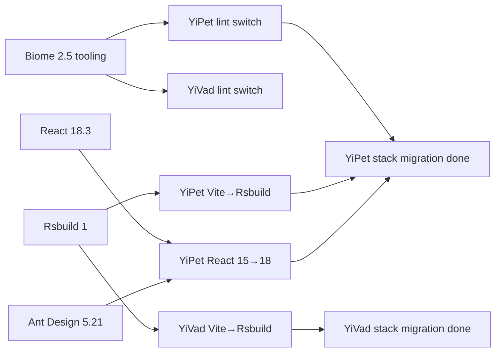

# Stack migration sequencing — four-step verification from YiPet React/Biome + YrY Vite→Rsbuild two migration rounds

> **As a** release-manager, **I want to** a record of the four-step verification order and cross-project depends-on sort for stack migrations, **so that** next migration (Vue 3→Vue 3.5 / React 18→19 / FastAPI upgrade) does not miss steps and broken builds do not leak to prod.

> 2026-07-28 completed two rounds of stack migration on the same day: YiPet React 15→18.3 + Bootstrap→Ant Design 5.21 + ESLint→Biome 2.5 (`project_yipet_stack_migration.md` memory); YrY Vite 8→Rsbuild 1 (`project_yry_rsbuild_migration.md` memory). This document records the migration sort and verification steps from a release coordination perspective, as an SOP for the next migration.

## Summary

- **Four-step migration verification = dev server → type:check → build:dev → manual smoke** — missing one step lets broken builds leak to prod; the YiPet jsxDEV incident is a case where dev passed but prod blew up
- **Cross-project migration sort: shared first, then consumers** — shared tooling (Biome / Rsbuild) migrates first, then projects that depend on it; the reverse leaves consumers stuck in a half-migrated state
- **dev mode passing ≠ prod mode passing** — React plugin / NODE_ENV define / jsx runtime behave differently in dev vs prod; the `project_yipet_chat_jsxdev.md` memory is the canonical pattern
- **Stack migration is not one PR, it is a staged PR chain** — 1 PR per layer (tooling / framework / component lib / lint); one oversized PR defeats review
- **Run N+1 rounds of self-check after migration** — stack switches expose latent bugs (timestamp collision / abort race / stale cache); see [code-reviewer/patterns/iterative-self-check.md](../../engineer/quality-security/iterative-self-check.md) for the 25+ round self-check pattern

## Core viewpoints

- **Four-step migration verification is a hard constraint** — dev server passing only proves "can start"; type:check proves "types are right"; build:dev proves "can bundle"; manual smoke proves "can run the main process"; missing any step lets broken builds leak to prod
- **Cross-project migration sort: shared first, then consumers** — Rsbuild is the shared build tool for YiVad + YiPet; migrate Rsbuild itself first (confirm plugin compatibility) then migrate YiVad / YiPet; the reverse leaves YiVad half-migrated and blocks Rsbuild plugin upgrades
- **Do not mix stack migration with feature work in one PR** — migration PRs only change the stack (build tool / framework / lint); feature PRs only change business logic; mixing defeats review and blurs rollback boundaries
- **MV3 extension migration has extra constraints** — YiPet is a Chrome MV3 extension; manifest v3 / content script / service worker have hard constraints; React 15→18 upgrade must confirm `manifest.content_security_policy` is compatible with React 18 `jsxDEV`
- **eslint→biome is a migration, not a replacement** — Biome 2.5 and ESLint 8 rules are not fully equivalent; run `biome check --write` to auto-fix + manually review the diff; some ESLint rules (e.g. `import/order`) have no Biome equivalent and must be redeclared in `biome.json`
- **YiAi does not participate in frontend stack migration** — YiAi is a FastAPI backend with an independent Python toolchain; but when YiAi upgrades FastAPI 0.x→0.140 it also runs the four-step verification (dev server → type:check → build → smoke)

## Key information

### Four-step migration verification (SOP)

```bash
# 1. dev server passes
cd YiVad && pnpm dev   # rsbuild dev, :8848
cd YiPet && npm run dev   # 3 parallel rsbuild build --watch

# 2. type:check
cd YiVad && pnpm type:check   # vue-tsc --noEmit --skipLibCheck
cd YiPet && npm run typecheck   # tsc --noEmit

# 3. build:dev (confirm it can bundle)
cd YiVad && pnpm build:dev   # vue-tsc && rsbuild build --mode development
cd YiPet && npm run build   # build:cdn + build + build:chat + build:bootstrap

# 4. manual smoke (confirm main flow)
# YiVad: open :8848 in browser, run BRD list / aicr / aiChat / knowledge once each
# YiPet: load dist/ in Chrome, run popup / content script / chat once each
```

**Common causes of failure per step**:

| Step | Common failure | Triage |
|---|---|---|
| dev server | `Module not found` / `Cannot find name` | check `tsconfig paths` / `resolve.alias` |
| type:check | `TS2307` / `TS2322` | check `@types/*` installed fully / `vue-tsc` version |
| build:dev | `Rollup failed to resolve` / `chunk too large` | check `manualChunks` / dynamic import |
| manual smoke | main flow blows up / blank screen / SSE abort | browser console + network panel |

### Cross-project migration sort (2026-07-28 instance)



**Sort principles**:
1. **Shared tooling first** — Biome / Rsbuild are cross-project shared; migrate them first, then consumers
2. **Consumers in parallel** — YiVad / YiPet are Rsbuild consumers and can migrate in parallel
3. **Framework + component lib in the same PR** — React 15→18 + Bootstrap→Ant Design must be in the same PR (Bootstrap incompatible with React 18)
4. **YiAi independent** — FastAPI upgrade is decoupled from frontend stack migration and can proceed independently

### YiPet jsxDEV incident (canonical pattern of a missed step)

`project_yipet_chat_jsxdev.md` memory:

- **Symptom** — YiPet chat bundle passed in dev mode, prod mode threw `jsxDEV is not a function`
- **Root cause** — dev mode React plugin enables `jsx: 'react-jsxdev'`; prod mode `NODE_ENV=production` define routes `jsxDEV` through prod runtime, but the React plugin did not install prod runtime
- **Fix** — chat bundle dev script changed to `--mode production` (force prod runtime); dev server uses a separate script
- **Lesson** — dev mode passing ≠ prod mode passing; the four-step verification's `build:dev` + `manual smoke` is the safety net

### Self-check reinforcement after stack migration

Stack switches expose latent bugs (timestamp collision / abort race / stale cache); run N+1 rounds of self-check after migration:

- **aicr chat.ts 25+ rounds of self-check** — during 2026-07-29 sidebar parity work, after Vite→Rsbuild migration aicr chat.ts exposed latent bugs like timestamp collision / abort race / stale activeSession; see [code-reviewer/patterns/iterative-self-check.md](../../engineer/quality-security/iterative-self-check.md)
- **Each round targets one class of failure mode** — race / stale / unawaited / collision / field name are the 5 major classes; at least 1 round per class
- **Run assertions at end of each round** — `pnpm type:check && pnpm build:dev`; do not commit if not passing

### Version management strategy (three sub-projects)

| Project | Source of truth for version | Release mechanism | Rollback boundary |
|---|---|---|---|
| YiVad | `package.json: version "1.0.0"` | `pnpm build:pro` + deploy dist/ | last stable git tag |
| YiPet | `package.json: version "1.2.0"` | `npm run build` + zip dist/ + upload Chrome Web Store | last stable git tag (MV3 requires re-review) |
| YiAi | git commit SHA (no version number) | `git pull` + `python main.py` restart | `git revert <bad-commit>` + restart |

### Hotfix decision matrix

| Severity | Scenario | Decision | Branch strategy |
|---|---|---|---|
| P0 | data loss / security / user blocked | immediate hotfix, skip review queue | `hotfix/<date>-<slug>` from main, after fix cherry-pick back to main + develop |
| P1 | broken interaction / performance | release same day, normal review | feature branch + expedited review |
| P2 | code smell / naming | next release, normal review | feature branch |
| P3 | out of scope this round | backlog, do not fix | — |

**P0/P1 block merge**; P2/P3 follow up. See [code-reviewer/patterns/iterative-self-check.md](../../engineer/quality-security/iterative-self-check.md) for severity grading.

## Action recommendations

Next stack migration (Vue 3→3.5 / React 18→19 / FastAPI upgrade):

1. **Sort**: shared tooling first (pnpm / biome / rsbuild), then consumers (YiVad / YiPet), YiAi independent
2. **PR chain**: 1 PR per layer (tooling / framework / component lib / lint); each PR runs the four-step verification
3. **dev server passes**: confirm `pnpm dev` / `npm run dev` starts with no error
4. **type:check passes**: `pnpm type:check` / `npm run typecheck` / `mypy src/` 0 errors
5. **build:dev passes**: `pnpm build:dev` / `npm run build` 0 errors; chunk size warnings acceptable, errors not
6. **manual smoke**: browser runs the main flow once (YiVad: BRD list / aicr / aiChat / knowledge; YiPet: popup / content / chat; YiAi: each RPC once)
7. **Post-migration self-check**: run N+1 rounds of self-check (per the 5 classes in [code-reviewer/patterns/iterative-self-check.md](../../engineer/quality-security/iterative-self-check.md))
8. **Tag + write release notes**: `git tag v<project>-<version>-<yyyymmdd>`; release notes default to PR description (no CHANGELOG.md)

Hotfix decision:

1. Determine severity (P0/P1/P2/P3); P0 takes a hotfix branch, P1+ takes a feature branch
2. P0: cut `hotfix/<date>-<slug>` branch from main, fix, run four-step verification, cherry-pick back to main + develop
3. After P0 release run a post-mortem: write lesson to `engineer/lessons/` + update this file
4. P1+: normal review queue, expedited review for P1

## Anti-patterns

- **Do not skip any step of the four-step verification.** Dev passing does not equal prod passing. YiPet jsxDEV is the canonical pattern where dev mode passed but prod mode threw `jsxDEV is not a function`. Each of the four steps catches a different class of failure.

- **Do not mix stack migration with feature work in one PR.** Mixed PRs defeat review and blur rollback boundaries. Migration PRs change only the stack (build tool, framework, lint). Feature PRs change only business logic. Mixing the two makes it impossible to isolate the cause of a regression.

- **Do not migrate consumers before shared tooling.** Consumers get stuck in a half-migrated state when the shared tooling has not been migrated first. Shared tooling (Biome, Rsbuild) must migrate first, then consumer projects (YiVad, YiPet) follow.

- **Do not upgrade YiAi FastAPI without running the four-step verification.** Backend migrations also need dev server, type check (mypy), build, and smoke verification. FastAPI 0.x to 0.140 has breaking changes in request and response signatures that type checking alone will catch.

- **Do not treat MV3 extension like a regular web app release.** MV3 requires Chrome Web Store review, which takes days. Decide ahead of time whether a hotfix goes through the store or dev mode load. The release timeline must account for the review latency.

- **Do not do feature work on a hotfix branch.** Hotfix branches fix only P0 issues. Adding features to a hotfix branch stalls the review and delays the fix reaching production. Features go on feature branches with normal review.

- **Do not assume all latent bugs are fixed after stack migration.** Run N+1 rounds of self-check after migration. Stack switches expose latent bugs -- timestamp collisions, abort races, stale caches -- that were invisible before the switch. Each round targets one class of failure mode.

## Related

- [release-manager/README.md](../README.md) — Release Manager working directory
- [YiPet/package.json](../../../YiPet/package.json) — YiPet version source of truth (`yipet@1.2.0`)
- [YiVad/package.json](../../../YiVad/package.json) — YiVad version source of truth (`yivad@1.0.0`)
- [YiAi/requirements.txt](../../../YiAi/requirements.txt) — YiAi depends-on source of truth (FastAPI 0.140 / uvicorn 0.51)
- [devops/processes/dev-environment-hmr.md](../../engineer/infrastructure/dev-environment-hmr.md) — HMR / watch-rebuild differences across the three sub-projects
- [code-reviewer/patterns/iterative-self-check.md](../../engineer/quality-security/iterative-self-check.md) — 25+ rounds of self-check + P0/P1/P2/P3 severity grading
- **YiPet stack migration memory** (Claude memory: `project_yipet_stack_migration.md`) — 2026-07-28 YiPet React/Biome migration facts
- **YrY Rsbuild migration memory** (Claude memory: `project_yry_rsbuild_migration.md`) — 2026-07-28 YrY Vite→Rsbuild migration facts
- **YiPet jsxDEV memory** (Claude memory: `project_yipet_chat_jsxdev.md`) — canonical pattern of dev passing but prod blowing up
