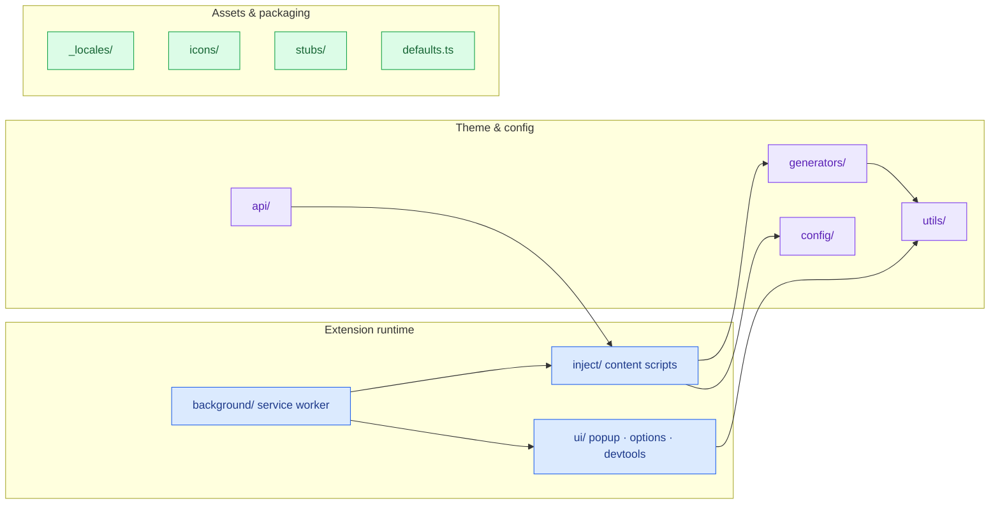

# §0 Effect Sketch — Module Location

### Chart-first summary
- **Focus**: This chart turns Module Location into a diagram-led overview before the detailed design and report sections.
- **Why**: It lets the reader understand the critical path before reading the detailed verification steps.
- **How to read**: Read the top-level extension map first, then follow runtime arrows to see which folders interact most often.
# §1 Test Design — Verification Steps

## Step 1: Confirm `background/` entry exists
**Action**: `ls src/background/index.ts`
**Expected**: file present, exports `Extension` class
**File**: `src/background/index.ts`

## Step 2: Confirm `inject/` entry exists
**Action**: `ls src/inject/index.ts`
**Expected**: file present, imports `activateTheme` from `@plus/utils/theme`
**File**: `src/inject/index.ts`

## Step 3: Confirm `ui/` sub-surfaces
**Action**: `ls src/ui/`
**Expected**: `popup/`, `options/`, `devtools/`, `stylesheet-editor/`, `controls/`, `connect/`
**File**: `src/ui/`

## Step 4: Confirm `api/` public surface
**Action**: `ls src/api/index.ts`
**Expected**: exports `setFetchMethod`, `theme`, etc.
**File**: `src/api/index.ts`

## Step 5: Confirm `generators/` has theme engines
**Action**: `ls src/generators/`
**Expected**: `theme-engines.ts` present
**File**: `src/generators/theme-engines.ts`

---

# §2 Output Inventory

| File/Directory | Type | Description |
|---------------|------|-------------|
| `src/background/` | dir | Extension lifecycle, tab/config mgmt, messenger bridge |
| `src/inject/` | dir | Content scripts applied at `document_start` on every page |
| `src/ui/` | dir | Extension UI surfaces (popup, options, devtools, stylesheet-editor) |
| `src/api/` | dir | Public Dark Reader API for third-party pages |
| `src/generators/` | dir | Theme engine strategies (dynamic, SVG filter, stylesheet) |
| `src/config/` | dir | Curated per-site fixes (dark-sites, dynamic-theme, inversion) |
| `src/utils/` | dir | Shared utilities (state-manager, platform, media-query, network) |
| `src/_locales/` | dir | i18n message stores keyed by locale code |
| `src/icons/` | dir | Extension icons shipped as PNG assets |
| `src/stubs/` | dir | Build-time stubs for MV2/MV3 and platform differences |
| `src/defaults.ts` | file | Default `Theme` + `UserSettings` |
| `src/definitions.d.ts` | file | Shared types for cross-module messaging |
| `src/manifest*.json` | file | MV2 + MV3 + Firefox + Thunderbird manifests |

**Architecture decisions**:
- One `src/` tree (no workspaces) → simpler build, single tsconfig.
- `generators/` is a sibling of `inject/`, not nested, so `api/` can
  import theme engines without pulling content-script code.
- `config/` is data, not code — overrides are `.config` files, editable
  by the `config-cleanup` script.

---

# §3 Test Report — 2026-07-14

| Step | Result | Notes |
|------|:---:|-------|
| 1 | ✅ | `src/background/index.ts` present, imports `Extension` |
| 2 | ✅ | `src/inject/index.ts` present, imports `@plus/utils/theme` |
| 3 | ✅ | `src/ui/` contains popup, options, devtools, stylesheet-editor, controls, connect |
| 4 | ✅ | `src/api/index.ts` exports public API |
| 5 | ✅ | `src/generators/theme-engines.ts` present |

**Overall**: pass — 5/5 steps passed

---

# §4 Self-Improvement

## Edge Cases Found
- `src/stubs/` is build-time only — missing it at runtime is expected,
  but a clean rebuild after `git clean -fdx` will repopulate it.
- `src/api/` depends on `src/inject/dynamic-theme/` — importing the API
  in a non-extension context (e.g. a Node test) requires the `api`
  build target, not the `inject` target.

## Suggested Improvements
- Add a top-level `MODULES.md` cross-linking this scene to each
  module's responsibility one-liner.
- Consider an `architecture.decision.records/` dir for the
  MV2/MV3/generators split decisions.

## Limitations
- This scene covers the stable top-level topology. Sub-modules inside
  `inject/dynamic-theme/` and `ui/options/` have their own subtrees
  that warrant their own scenes if deep tracing is needed.
