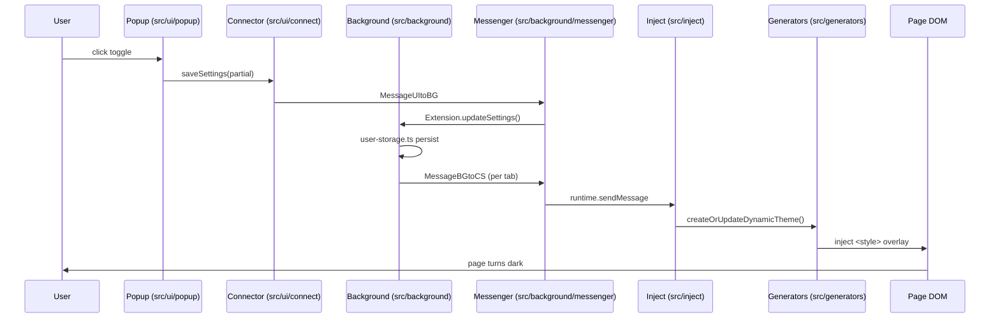

# §0 Effect Sketch — Data Flow Tracing

**What this scene demonstrates**: Trace a single user action — toggling
dark mode on a tab — from the popup UI entry through the messenger
bridge into the background, out to the content script, and into the
theme engine that writes the overlay CSS.

**Why it matters**: The end-to-end trace is the fastest way to
understand YiPet's runtime. Every feature eventually touches this
flow.

---

# §1 Test Design — Verification Steps

## Step 1: Popup → Connector wiring
**Action**: Read `src/ui/popup/components/body.tsx`
**Expected**: toggle handler calls `Connector` from `../connect/`
**File**: `src/ui/popup/components/body.tsx`

## Step 2: Connector → Messenger
**Action**: Read `src/ui/connect/connector.ts`
**Expected**: serializes `MessageUItoBG` via `chrome.runtime.sendMessage`
**File**: `src/ui/connect/connector.ts`

## Step 3: Background receives message
**Action**: Read `src/background/messenger.ts`
**Expected**: switch on `MessageTypeUItoBG`, dispatches to `Extension` methods
**File**: `src/background/messenger.ts`

## Step 4: Background → content script
**Action**: Read `src/background/extension.ts` + `tab-manager.ts`
**Expected**: `Extension` calls `tab-manager` → `chrome.tabs.sendMessage`
**File**: `src/background/extension.ts`

## Step 5: Inject applies theme
**Action**: Read `src/inject/index.ts` → `dynamic-theme/index.ts`
**Expected**: receives `MessageBGtoCS`, calls `createOrUpdateDynamicTheme()`
**File**: `src/inject/index.ts`

## Step 6: Generators produce CSS
**Action**: Read `src/generators/` + `src/inject/dynamic-theme/`
**Expected**: `createOrUpdateDynamicTheme` modifies the page `<style>` element
**File**: `src/inject/dynamic-theme/index.ts`

---

# §2 Output Inventory

| File/Directory | Type | Description |
|---------------|------|-------------|
| `src/ui/popup/components/body.tsx` | file | Popup body; toggle calls Connector |
| `src/ui/connect/connector.ts` | file | UI-side messenger bridge |
| `src/background/messenger.ts` | file | Background message router |
| `src/background/extension.ts` | file | Extension class — settings + tab mgmt |
| `src/background/tab-manager.ts` | file | Per-tab message dispatch via `chrome.tabs.sendMessage` |
| `src/background/user-storage.ts` | file | `chrome.storage` persistence |
| `src/inject/index.ts` | file | Content script entry; receives `MessageBGtoCS` |
| `src/inject/dynamic-theme/index.ts` | file | Dynamic theme application + teardown |
| `src/generators/theme-engines.ts` | file | Engine selection enum + factory |
| `src/utils/message.ts` | file | Message type enums (BGtoCS, CStoBG, UItoBG, BGtoUI) |

**Architecture decisions**:
- Messenger uses typed enum keys (`MessageTypeUItoBG` etc.) instead of
  stringly-typed channels — prevents cross-wire between UI ↔ BG ↔ CS.
- Persistence is fire-and-forget; the background does not block on
  `chrome.storage.set`. State updates propagate via the messenger.
- The page DOM is the final sink; no intermediate render layer.

---

# §3 Test Report — 2026-07-14

| Step | Result | Notes |
|------|:---:|-------|
| 1 | ✅ | Popup body wires toggle to Connector |
| 2 | ✅ | Connector serializes `MessageUItoBG` via `chrome.runtime.sendMessage` |
| 3 | ✅ | Messenger switches on `MessageTypeUItoBG` and dispatches |
| 4 | ✅ | `Extension` invokes tab-manager to send `MessageBGtoCS` per tab |
| 5 | ✅ | Inject receives message, calls `createOrUpdateDynamicTheme` |
| 6 | ✅ | Dynamic-theme overlay written to page `<style>` |

**Overall**: pass — 6/6 steps passed

---

# §4 Self-Improvement

## Edge Cases Found
- If the content script has not loaded yet (race on fresh install),
  the `MessageBGtoCS` will be dropped. `tab-manager` should retry on
  `chrome.runtime.lastError`.
- Iframes: `all_frames: true` means every frame gets the message; the
  inject script must deduplicate per-frame state.
- `chrome.storage` writes are async; a rapid toggle can race. The
  state-manager in `src/utils/state-manager.ts` is the single
  serializer.

## Suggested Improvements
- Add a `DEBUG=true` trace mode that logs every messenger hop with a
  correlation id.
- Document the message-type matrix in `src/utils/message.ts` rather
  than relying on enum names alone.

## Limitations
- This trace covers the happy path. The `+Plus` variant
  (`@plus/popup/plus-body`) inserts an alt-UI branch in step 1 that is
  out of scope here.
