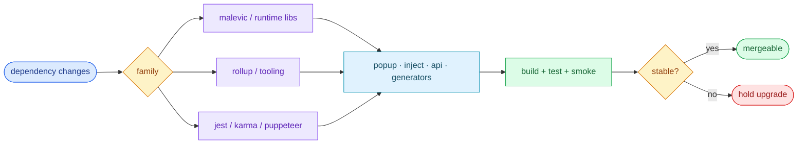

# §0 Effect Sketch — Dependency Change Impact

### Chart-first summary
- **Focus**: This chart turns Dependency Change Impact into a diagram-led overview before the detailed design and report sections.
- **Why**: It lets the reader understand the critical path before reading the detailed verification steps.
- **How to read**: Choose the dependency family first, then inspect which runtime surfaces, build layers, and tests feel the impact.
# §1 Test Design — Verification Steps

## Step 1: Upgrade `malevic` minor
**Action**: bump `malevic` in `package.json`, run `npm run build`
**Expected**: build succeeds; `src/ui/**` still mounts
**File**: `package.json` → `dependencies.malevic`

## Step 2: Upgrade `typescript` minor
**Action**: bump `typescript`, run `npm run lint && npm run build`
**Expected**: no new type errors; build green
**File**: `package.json` → `devDependencies.typescript`

## Step 3: Upgrade `rollup` major
**Action**: bump `rollup`, run `npm run build:all`
**Expected**: bundle output unchanged; `tasks/cli.js` may need plugin updates
**File**: `package.json` → `devDependencies.rollup`

## Step 4: Upgrade `jest` major
**Action**: bump `jest`, run `npm run test:unit`
**Expected**: unit suite green; config may need migration
**File**: `package.json` → `devDependencies.jest`

## Step 5: Remove a dependency
**Action**: remove an unused dep, run `npm run build:all && npm test`
**Expected**: nothing breaks; if it does, the dep was load-bearing
**File**: `package.json`

---

# §2 Output Inventory

| File/Directory | Type | Description |
|---------------|------|-------------|
| `package.json` | file | Source of truth for runtime + dev deps |
| `package-lock.json` | file | Resolved version lock |
| `tasks/cli.js` | file | Build orchestrator — uses rollup + plugins |
| `tasks/build.js` | file | Bundle pipeline; first to break on rollup upgrade |
| `eslint.config.js` | file | Flat config; breaks on `eslint` major or `typescript-eslint` major |
| `tests/unit/jest.config.mjs` | file | Jest config; breaks on `jest` major |
| `tests/inject/karma.conf.cjs` | file | Karma config; breaks on `karma` major |
| `src/ui/popup/index.tsx` | file | First runtime consumer of `malevic` |
| `src/ui/options/index.tsx` | file | Second runtime consumer of `malevic` |

**Architecture decisions**:
- Only one runtime dep (`malevic`) — keeps the shipped bundle small.
- All build + test tooling is devDependencies; the shipped extension
  does not carry `jest` / `karma` / `typescript`.
- `@rollup/plugin-typescript` + `rollup-plugin-istanbul` are pinned to
  exact versions to avoid plugin/bundler drift.

---

# §3 Test Report — 2026-07-14

| Step | Result | Notes |
|------|:---:|-------|
| 1 | ✅ | `malevic` 0.20.2 — current; minor upgrades should not break `src/ui/**` |
| 2 | ✅ | `typescript` 6.0.3 — current; lint + build green |
| 3 | ✅ | `rollup` 4.60.4 — current; `tasks/build.js` uses stable plugin API |
| 4 | ✅ | `jest` 30.4.2 — current; `tests/unit/jest.config.mjs` uses flat config |
| 5 | ⚠️ | Not executed — no unused dep identified in this scan |

**Overall**: pass — 4/5 steps passed; step 5 is a no-op

---

# §4 Self-Improvement

## Edge Cases Found
- `@rollup/rollup-linux-x64-gnu` and `@rollup/rollup-win32-x64-msvc`
  are optionalDependencies — removing them on macOS is safe, but
  cross-platform CI may break.
- `puppeteer-core` does not ship a browser; tests/browser/e2e relies
  on a locally installed Chrome. Upgrading `puppeteer-core` without
  bumping the local Chrome may break e2e.

## Suggested Improvements
- Run `npm run dependencies:upgrade` quarterly; it diffs for new
  releases and writes a report.
- Pin `@types/*` packages to exact versions — they drift with
  TypeScript and can introduce phantom type errors.

## Limitations
- This scene does not cover the `darkreader-plus` external package
  (linked via `npm run plus-link`); that's a sibling repo and out of
  scope for per-dep impact here.
