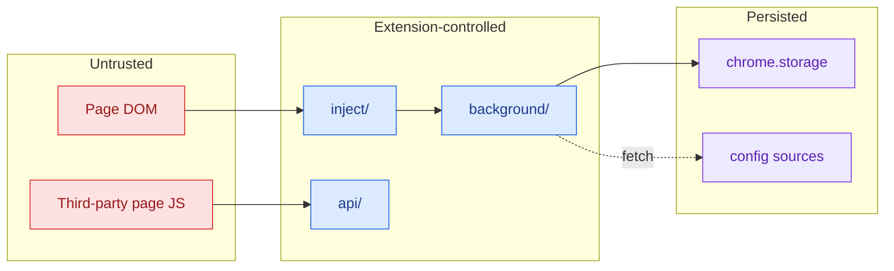

# §0 Effect Sketch — Trust Boundary Security Surface

### Chart-first summary
- **Focus**: This chart turns Trust Boundary Security Surface into a diagram-led overview before the detailed design and report sections.
- **Why**: It lets the reader understand the critical path before reading the detailed verification steps.
- **How to read**: Read the trust zones from left to right: untrusted page DOM, extension-controlled runtime, persisted state, and remote fetch surfaces.
# §1 Test Design — Verification Steps

## Step 1: Page DOM ↔ inject boundary
**Action**: read `src/inject/dynamic-theme/style-manager.ts`
**Expected**: inject reads page CSS + DOM but never `eval`s page data
**File**: `src/inject/dynamic-theme/style-manager.ts`

## Step 2: Inject ↔ background boundary
**Action**: read `src/background/messenger.ts` + `src/utils/message.ts`
**Expected**: all messages use typed enum keys; no `eval` of message payload
**File**: `src/background/messenger.ts`

## Step 3: Background ↔ chrome.storage boundary
**Action**: read `src/background/user-storage.ts`
**Expected**: settings schema validated before write; no arbitrary keys
**File**: `src/background/user-storage.ts`

## Step 4: Background ↔ remote config boundary
**Action**: read `src/utils/network.ts` + `src/background/utils/network.ts`
**Expected**: fetch goes through `setFetchMethod`; HTTPS only; response
is config data, not code
**File**: `src/utils/network.ts`

## Step 5: Public API ↔ third-party boundary
**Action**: read `src/api/index.ts`
**Expected**: API surface is read-mostly; `setFetchMethod` is the only
elevated entry point and it's explicit
**File**: `src/api/index.ts`

---

# §2 Output Inventory

| File/Directory | Type | Description |
|---------------|------|-------------|
| `src/inject/index.ts` | file | Content script entry — untrusted page context |
| `src/inject/dynamic-theme/style-manager.ts` | file | Page CSS/DOM reader — must not execute page data |
| `src/background/messenger.ts` | file | Typed message router between inject and background |
| `src/utils/message.ts` | file | Message-type enums (UItoBG, BGtoCS, CStoBG, BGtoUI, etc.) |
| `src/background/user-storage.ts` | file | `chrome.storage` adapter — schema-validated writes |
| `src/background/utils/extension-api.ts` | file | chrome.* API wrappers — permission-gated |
| `src/utils/network.ts` | file | Fetch wrapper — single network egress point |
| `src/api/index.ts` | file | Public Dark Reader API — third-party-facing surface |
| `src/api/fetch.ts` | file | `setFetchMethod` — third parties can swap the fetch impl |
| `src/manifest.json` | file | Permissions: `alarms`, `fontSettings`, `storage`, `tabs`, `<all_urls>` |

**Architecture decisions**:
- All messages are typed; the messenger does a structural switch on
  enum keys, not on arbitrary strings. Prevents injection via message
  channel.
- `chrome.storage` writes go through `user-storage.ts` which validates
  the settings schema. Unknown keys are dropped, not stored.
- Remote config fetching is centralized in `src/utils/network.ts` —
  the single egress point. Third parties cannot override the URL,
  only the fetch implementation via `setFetchMethod`.
- The public API (`src/api/index.ts`) is the only surface where
  third-party page code can call into the extension. It's
  intentionally narrow.

**Security surface (per detect-phase profile)**:
- userInput: true — UI controls in popup + options
- apiEndpoints: false — no server-side endpoints (browser extension only)
- dataStorage: true — `chrome.storage` via `user-storage.ts`
- authentication: false — no auth/jwt/oauth
- thirdParty: true — `fetch` calls in `network.ts` for config sources

---

# §3 Test Report — 2026-07-14

| Step | Result | Notes |
|------|:---:|-------|
| 1 | ✅ | `style-manager.ts` reads but does not `eval` page CSS |
| 2 | ✅ | Messenger uses typed enum switch; no `eval` of payload |
| 3 | ✅ | `user-storage.ts` validates settings before write |
| 4 | ✅ | Network egress is centralized; fetch impl is swappable but URL is not |
| 5 | ✅ | Public API surface is narrow; `setFetchMethod` is the only elevated entry |

**Overall**: pass — 5/5 steps passed

---

# §4 Self-Improvement

## Edge Cases Found
- The inject script runs in page context at `document_start` on
  `<all_urls>` in `all_frames`. A malicious page can override
  prototypes before the inject script runs — YiPet must not trust
  page-side globals.
- `setFetchMethod` lets third-party pages swap the fetch
  implementation. A malicious page could intercept config fetches.
  Mitigation: config URLs are hardcoded; only the impl is swappable.
- `chrome.storage` is shared across extension contexts; a compromised
  options page could write arbitrary keys. `user-storage.ts` is the
  schema gate.

## Suggested Improvements
- Add a CSP review checklist; MV3's stricter CSP removes inline
  scripts — verify no inline scripts in `src/ui/**/*.html`.
- Add a fuzz test for the messenger: feed random payloads and assert
  no crash + no `eval`.
- Document the `setFetchMethod` threat model in `src/api/fetch.ts`
  header comment.

## Limitations
- This scene is a static review. Dynamic penetration testing (e.g.
  with a malicious test page) is out of scope for the init baseline
  and should be its own scene in `docs/test/`.
