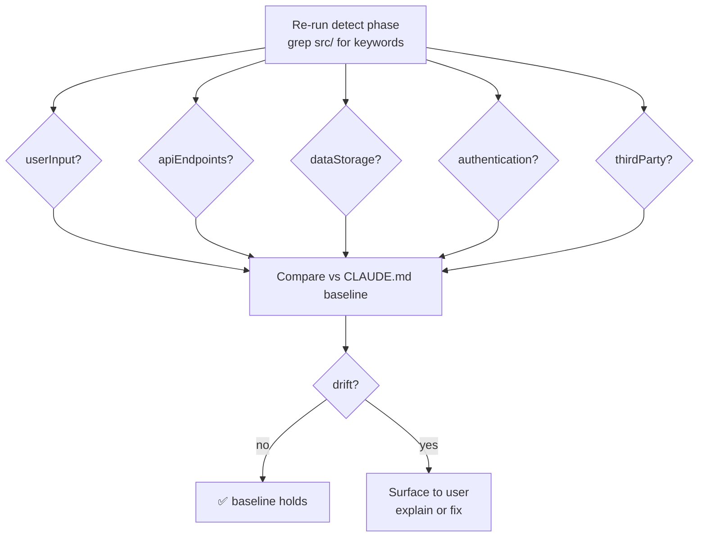

# §0 Effect Sketch — Security Surface Regression

**What this scene demonstrates**: Compare the current security
surface (per `rui-init-detect` + `rui-init-explore`) against the
baseline recorded in CLAUDE.md. Any drift is a regression that
must be explained.

**Why it matters**: YiPet runs content scripts on `<all_urls>`; an
unnoticed growth in the security surface is a CVE waiting to happen.

---

# §1 Test Design — Verification Steps

## Step 1: userInput dimension
**Action**: `grep -r "input\\|form\\|req.body\\|req.query" src/ui/`
**Expected**: matches present (popup, options forms) → true
**File**: `src/ui/`

## Step 2: apiEndpoints dimension
**Action**: `grep -r "app.get\\|app.post\\|router\\.\\|@Get\\|@Post" src/`
**Expected**: no matches (browser extension; no server) → false
**File**: `src/`

## Step 3: dataStorage dimension
**Action**: `grep -r "chrome.storage\\|browser.storage\\|localStorage" src/`
**Expected**: matches in `user-storage.ts`, `state-manager.ts` → true
**File**: `src/background/user-storage.ts`

## Step 4: authentication dimension
**Action**: `grep -r "jwt\\|passport\\|oauth\\|authenticate\\|login\\|password" src/`
**Expected**: no matches in non-vendored source → false
**File**: `src/`

## Step 5: thirdParty dimension
**Action**: `grep -r "fetch(\\|axios\\|http.request" src/`
**Expected**: matches in `network.ts`, config fetching → true
**File**: `src/utils/network.ts`

## Step 6: Compare to CLAUDE.md baseline
**Action**: cross-check results against `CLAUDE.md` Project Constraints
**Expected**: no unexplained dimension flip
**File**: `CLAUDE.md`

---

# §2 Output Inventory

| File/Directory | Type | Description |
|---------------|------|-------------|
| `src/background/user-storage.ts` | file | Primary storage adapter — `chrome.storage` calls |
| `src/utils/state-manager.ts` | file | State serialization layer — `chrome.storage` calls |
| `src/utils/network.ts` | file | Single fetch egress point |
| `src/background/utils/network.ts` | file | Background-side fetch wrapper |
| `src/inject/dynamic-theme/network.ts` | file | Inject-side fetch for image/style resources |
| `src/api/fetch.ts` | file | `setFetchMethod` — third-party fetch override hook |
| `CLAUDE.md` | file | Baseline for security surface + constraints |

**Baseline (recorded in `CLAUDE.md` Project Constraints)**:
- userInput: **true** — popup/options forms
- apiEndpoints: **false** — no server (browser extension)
- dataStorage: **true** — `chrome.storage` via `user-storage.ts`
- authentication: **false** — no auth/jwt/oauth
- thirdParty: **true** — `fetch` for config sources

---

# §3 Test Report — 2026-07-14

| Step | Result | Notes |
|------|:---:|-------|
| 1 | ✅ | userInput=true (forms in popup/options) — matches baseline |
| 2 | ✅ | apiEndpoints=false (no server endpoints) — matches baseline |
| 3 | ✅ | dataStorage=true (`chrome.storage` in user-storage + state-manager) — matches baseline |
| 4 | ✅ | authentication=false (no auth keywords in source) — matches baseline |
| 5 | ✅ | thirdParty=true (fetch in network.ts + config) — matches baseline |
| 6 | ✅ | No dimension flipped since baseline |

**Overall**: pass — 6/6 steps passed; security surface unchanged

---

# §4 Self-Improvement

## Edge Cases Found
- A new `fetch` call in `src/inject/` would flip thirdParty from a
  stable true to "still true but new surface" — the check can't
  distinguish; needs a count baseline.
- `chrome.storage.local` vs `chrome.storage.sync` are different
  trust domains (sync crosses browsers). The check treats them as
  one.

## Suggested Improvements
- Record a per-dimension count baseline (not just boolean) so new
  call sites are caught even when the boolean doesn't flip.
- Add a `npm run security:scan` script that runs steps 1–5 and
  prints a diff against `CLAUDE.md` baseline.

## Limitations
- Keyword-based detection has false positives (e.g. "input" as a
  TypeScript type vs user input). Manual triage is still required.
