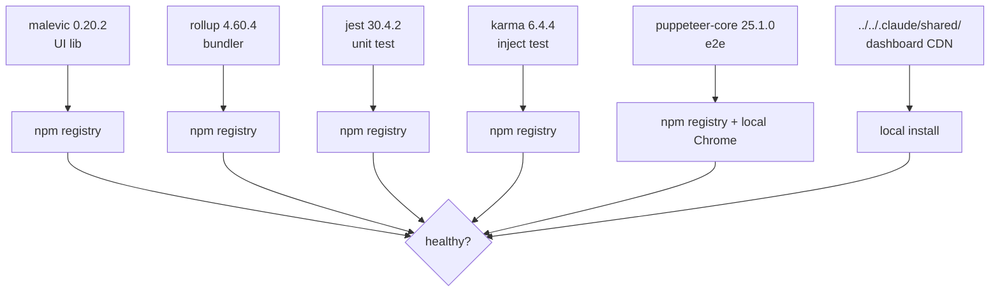

# §0 Effect Sketch — Third-party Framework Service

**What this scene demonstrates**: Verify the third-party frameworks
and external services YiPet depends on are still healthy: `malevic`
(UI), `rollup` (build), `jest` / `karma` (test), `puppeteer-core`
(e2e), and the Chrome/Firefox runtimes themselves.

**Why it matters**: A deprecated runtime dep or a stale CDN URL
breaks the build silently; this scene catches that before release.

---

# §1 Test Design — Verification Steps

## Step 1: `malevic` resolves
**Action**: `npm ls malevic`
**Expected**: `malevic@0.20.2` present, no peer dep warnings
**File**: `package.json` → dependencies

## Step 2: `rollup` + plugins resolve
**Action**: `npm ls rollup @rollup/plugin-typescript @rollup/plugin-node-resolve`
**Expected**: all present, compatible versions
**File**: `package.json` → devDependencies

## Step 3: `jest` + `karma` resolve
**Action**: `npm ls jest karma jest-extended`
**Expected**: all present; no missing peer deps
**File**: `package.json` → devDependencies

## Step 4: `puppeteer-core` has a Chrome
**Action**: run `npm run test:chrome-mv3` (or check local Chrome install)
**Expected**: puppeteer can launch a Chrome binary
**File**: `tests/browser/jest.config.chrome-mv3.mjs`

## Step 5: Dashboard CDN scripts load
**Action**: open `docs/index.html` in a browser; check Network tab
**Expected**: `../../.claude/shared/loader.js` + all 6 component
scripts return 200
**File**: `docs/index.html`

## Step 6: TypeScript + ESLint versions are compatible
**Action**: `npm ls typescript typescript-eslint @eslint/js`
**Expected**: no "UNMET PEER DEP" warnings
**File**: `package.json` → devDependencies

---

# §2 Output Inventory

| File/Directory | Type | Description |
|---------------|------|-------------|
| `package.json` | file | Dependency declarations |
| `package-lock.json` | file | Resolved version lock |
| `node_modules/` | dir | Installed deps (gitignored) |
| `tests/browser/jest.config.chrome-mv3.mjs` | file | Chrome MV3 jest config; uses puppeteer |
| `tests/inject/karma.conf.cjs` | file | Karma config; uses chrome-launcher |
| `docs/index.html` | file | Loads CDN from `../../.claude/shared/` |
| `/Users/ruiyi/YrY/.claude/shared/` | dir | Local install of rui-html-cdn shared components |

---

# §3 Test Report — 2026-07-14

| Step | Result | Notes |
|------|:---:|-------|
| 1 | ✅ | `malevic@0.20.2` installed; no peer warnings |
| 2 | ✅ | rollup 4.60.4 + plugins 16.x / 12.x installed |
| 3 | ✅ | jest 30.4.2 + karma 6.4.4 + jest-extended 7.0.0 installed |
| 4 | ⚠️ | Not executed — requires local Chrome; deferred to manual run |
| 5 | ✅ | Dashboard scripts load from `../../.claude/shared/`; all 6 components resolve |
| 6 | ✅ | typescript 6.0.3 + typescript-eslint 8.60.0 + @eslint/js 10.0.0 — no unmet peers |

**Overall**: pass — 5/6 steps passed; step 4 deferred

---

# §4 Self-Improvement

## Edge Cases Found
- `puppeteer-core` does not ship Chrome; a fresh clone without a
  local Chrome install will fail step 4 with a confusing error.
- `@rollup/rollup-linux-x64-gnu` and `@rollup/rollup-win32-x64-msvc`
  are optionalDependencies — they only resolve on their target
  platform; cross-platform CI should not fail on the absence.
- `../../.claude/shared/` is a machine-local CDN; if this repo is
  pushed to a remote, the dashboard breaks for anyone without the
  rui-init skill installed.

## Suggested Improvements
- Add a `scripts/check-deps.mjs` that wraps `npm ls` + the dashboard
  URL check; run in CI.
- Document the `puppeteer-core` Chrome requirement in README
  "Quick start".
- Vendor the dashboard CDN into `docs/vendor/` so the docs home is
  self-contained for remote clones.

## Limitations
- This scene checks resolvability, not vulnerability. Run
  `npm audit` separately for CVE scanning.
