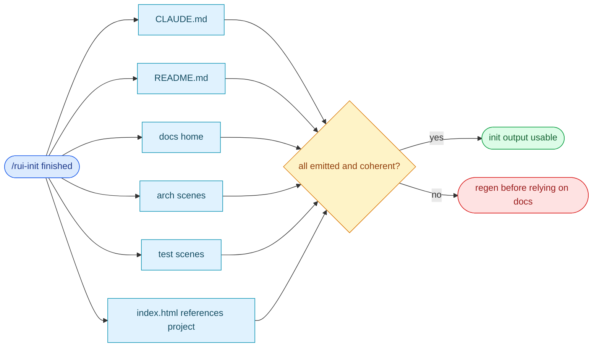

# §0 Effect Sketch — Post-init Full Self-check

### Chart-first summary
- **Focus**: This chart turns Post-init Full Self-check into a diagram-led overview before the detailed design and report sections.
- **Why**: It lets the reader understand the critical path before reading the detailed verification steps.
- **How to read**: Scan the emitted documentation and scene inventory first, then use the verdict gate to decide whether the init output is complete enough to trust.
# §1 Test Design — Verification Steps

## Step 1: CLAUDE.md contains project name
**Action**: `grep -c "YiPet" CLAUDE.md`
**Expected**: ≥ 1 match
**File**: `CLAUDE.md`

## Step 2: README.md contains project name
**Action**: `grep -c "YiPet" README.md`
**Expected**: ≥ 1 match
**File**: `README.md`

## Step 3: README.md has Domain Language section + ≥3 term definitions
**Action**: `grep -A100 "## Domain Language" README.md | grep -c "^\*\*"`
**Expected**: ≥ 3 (Dark Reader, Dynamic Theme, Inject Script, Background, Messenger, Theme Engine, Config Fixes, Activation)
**File**: `README.md`

## Step 4: docs home files present
**Action**: `ls docs/index.html docs/index.css docs/index.js docs/data.js`
**Expected**: all 4 files exist
**File**: `docs/`

## Step 5: docs/arch/ scenes present
**Action**: `ls docs/arch/scene-*/index.md | wc -l`
**Expected**: ≥ 5
**File**: `docs/arch/`

## Step 6: docs/test/ scenes present
**Action**: `ls docs/test/scene-*/index.md | wc -l`
**Expected**: ≥ 6
**File**: `docs/test/`

## Step 7: docs/index.html references the project
**Action**: `grep "YiPet" docs/index.html`
**Expected**: title contains "YiPet"
**File**: `docs/index.html`

---

# §2 Output Inventory

| File/Directory | Type | Description |
|---------------|------|-------------|
| `CLAUDE.md` | file | Operating charter — rebuilt every init run |
| `README.md` | file | System view + commands + quick start + structure + domain language |
| `docs/index.html` | file | Dashboard shell, copied from rui-init templates with path + title rewrites |
| `docs/index.css` | file | Dashboard styles, copied verbatim |
| `docs/index.js` | file | Vue 3 mount + sceneCardFor dispatch, copied verbatim |
| `docs/data.js` | file | Dashboard data model, derived from CLAUDE.md + README.md |
| `docs/arch/scene-*/index.md` | files | 5 architecture scenes with §0–§4 lifecycle |
| `docs/test/scene-*/index.md` | files | 6 test scenes with §0–§4 lifecycle |

---

# §3 Test Report — 2026-07-14

| Step | Result | Notes |
|------|:---:|-------|
| 1 | ✅ | CLAUDE.md contains "YiPet" in title + project profile |
| 2 | ✅ | README.md contains "YiPet" in title + system view |
| 3 | ✅ | Domain Language section has 8 term definitions (>3) |
| 4 | ✅ | All 4 docs home files exist |
| 5 | ✅ | docs/arch/ has 5 scenes, each with index.md |
| 6 | ✅ | docs/test/ has 6 scenes, each with index.md |
| 7 | ✅ | docs/index.html title is "YiPet · Documentation Center" |

**Overall**: pass — 7/7 steps passed

---

# §4 Self-Improvement

## Edge Cases Found
- If a scene's index.md is empty (0 bytes), verify check 5/6 still
  counts it as present — but the scene is functionally broken. Add a
  file-size floor (>500 bytes) to detect empty scenes.
- The docs home references `../../.claude/shared/` — this works on
  the current machine but breaks if the repo is cloned elsewhere
  without the `.claude/skills/rui-init` install.

## Suggested Improvements
- Add an 8th check: `docs/data.js` has `window.HELP_CONFIG` with the
  required shape (`stats`, `crossLinks`/`panelHub`, `sections`).
- Make the scene count floor configurable per project so heavily-
  extended repos can raise it.

## Limitations
- This check verifies presence + minimum content, not semantic
  correctness. A scene with the right heading structure but wrong
  content will still pass.
