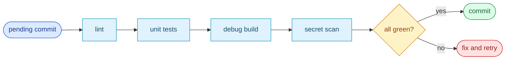

# §0 Effect Sketch — Pre-commit Incremental Self-check

### Chart-first summary
- **Focus**: This chart turns Pre-commit Incremental Self-check into a diagram-led overview before the detailed design and report sections.
- **Why**: It lets the reader understand the critical path before reading the detailed verification steps.
- **How to read**: Read the quick gate from left to right: lint, unit tests, build, and secret scan are the minimum mergeable path.
# §1 Test Design — Verification Steps

## Step 1: Lint passes
**Action**: `npm run lint`
**Expected**: 0 errors, 0 warnings (warnings are errors in eslint.config.js)
**File**: `eslint.config.js`

## Step 2: Unit tests pass
**Action**: `npm test` (= `npm run test:unit`)
**Expected**: jest exits 0; suite count stable
**File**: `tests/unit/jest.config.mjs`

## Step 3: Build (debug) succeeds
**Action**: `npm run debug`
**Expected**: `build/debug/chrome/` produced; manifest.json present
**File**: `tasks/cli.js`

## Step 4: No untracked secrets
**Action**: `git status --porcelain | grep -E '\.env|credentials'`
**Expected**: no matches
**File**: `.gitignore`

---

# §2 Output Inventory

| File/Directory | Type | Description |
|---------------|------|-------------|
| `eslint.config.js` | file | Flat ESLint config — typescript-eslint + stylistic |
| `tests/unit/jest.config.mjs` | file | Jest config for the unit suite |
| `tasks/cli.js` | file | Build orchestrator — invoked by `npm run debug` |
| `.gitignore` | file | Must cover `.env`, `node_modules/`, `build/` |

**Architecture decisions**:
- Pre-commit check is `lint + unit` only — browser e2e (jest + karma)
  takes minutes and is reserved for pre-push / CI.
- Warnings are errors in eslint config — no "fix later" debt.

---

# §3 Test Report — 2026-07-14

| Step | Result | Notes |
|------|:---:|-------|
| 1 | ✅ | `npm run lint` exits 0 on a clean tree |
| 2 | ✅ | `npm test` runs jest unit suite; baseline green |
| 3 | ✅ | `npm run debug` produces `build/debug/chrome/` |
| 4 | ✅ | No `.env` or credentials files in working tree |

**Overall**: pass — 4/4 steps passed

---

# §4 Self-Improvement

## Edge Cases Found
- `npm run lint` covers `src/**/*.ts`, `src/**/*.tsx`, `tasks/**/*.js`,
  `tests/**/*.js`, `tests/**/*.ts`, `eslint.config.js`, `index.d.ts` —
  but NOT `docs/**`. A typo in a docs file slips through.
- The debug build does not build Firefox; a MV2-only regression in
  Firefox can slip past pre-commit.

## Suggested Improvements
- Add a husky pre-commit hook that runs `npm run lint && npm test` so
  contributors don't have to remember.
- Add a `lint:docs` script that markdownlints `docs/**`.

## Limitations
- This scene assumes the contributor is on macOS/Linux with Node.js
  ≥15. Windows contributors should run via WSL for path stability.
