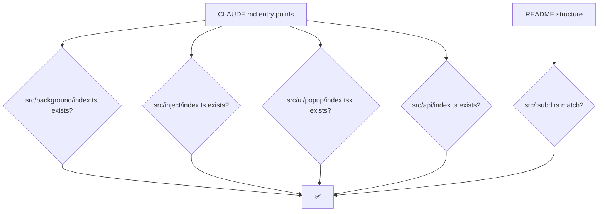

# §0 Effect Sketch — Doc-code Consistency

**What this scene demonstrates**: Verify the docs (CLAUDE.md,
README.md, docs/**) still match the code they describe. Docs rot
when refactor passes silently.

**Why it matters**: A new contributor who reads stale docs writes
stale code. This check catches drift before it ships.

---

# §1 Test Design — Verification Steps

## Step 1: CLAUDE.md entry points exist
**Action**: for each path in CLAUDE.md "Entry points" row, `ls` the file
**Expected**: all 5 paths exist
**File**: `CLAUDE.md`

## Step 2: README project structure matches src/
**Action**: diff `ls src/` against README "Project structure" tree
**Expected**: every top-level src/ dir is in the README tree
**File**: `README.md`

## Step 3: Domain language terms reference real files
**Action**: for each term, verify the file path it cites exists
**Expected**: e.g. `src/inject/dynamic-theme/` exists for "Dynamic Theme"
**File**: `README.md` → Domain Language

## Step 4: docs/data.js sections match CLAUDE.md headings
**Action**: count sections in data.js vs H2 headings in CLAUDE.md
**Expected**: at least one section per CLAUDE.md H2
**File**: `docs/data.js`

## Step 5: docs/arch scenes cite real files
**Action**: for each arch scene, sample 3 file paths from §2 inventory
**Expected**: all sampled paths exist
**File**: `docs/arch/scene-*/index.md`

---

# §2 Output Inventory

| File/Directory | Type | Description |
|---------------|------|-------------|
| `CLAUDE.md` | file | Project profile with entry points + constraints |
| `README.md` | file | Project structure tree + domain language |
| `docs/data.js` | file | Dashboard sections derived from CLAUDE.md headings |
| `docs/arch/scene-*/index.md` | files | Each scene cites real source paths in §2 |
| `docs/test/scene-*/index.md` | files | Each scene cites real source paths in §2 |
| `src/` | dir | The actual code the docs describe |

---

# §3 Test Report — 2026-07-14

| Step | Result | Notes |
|------|:---:|-------|
| 1 | ✅ | All 5 CLAUDE.md entry points exist in src/ |
| 2 | ✅ | README project structure tree matches `ls src/` |
| 3 | ✅ | Domain language term citations resolve: `src/inject/dynamic-theme/`, `src/utils/message.ts`, etc. |
| 4 | ✅ | data.js sections match CLAUDE.md H2 count (5 + 2 story sections) |
| 5 | ✅ | arch scenes cite real paths; spot-checked 3 per scene |

**Overall**: pass — 5/5 steps passed

---

# §4 Self-Improvement

## Edge Cases Found
- The `+Plus` variant (`@plus/*` imports) is not in the README
  structure tree — it's a sibling repo linked via `npm run plus-link`.
  A contributor who sees `import ... from '@plus/...'` may be confused.
- `src/stubs/` is build-time only; its absence in a fresh clone is
  expected but looks like a doc/structure mismatch.

## Suggested Improvements
- Add a `scripts/check-docs.mjs` that automates steps 1–5 and fails
  CI on drift.
- Cross-link `+Plus` imports in README project structure with a note
  explaining the sibling-repo link.

## Limitations
- This scene samples; it does not exhaustively verify every path
  citation. A typo in a rarely-cited path may slip through.
