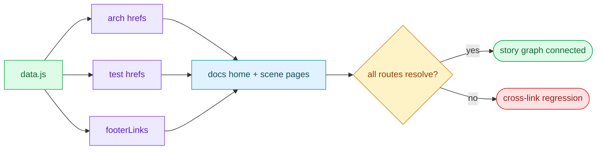

# §0 Effect Sketch — Cross-story Integration Regression

### Chart-first summary
- **Focus**: This chart turns Cross-story Integration Regression into a diagram-led overview before the detailed design and report sections.
- **Why**: It lets the reader understand the critical path before reading the detailed verification steps.
- **How to read**: Use `data.js` as the hub, then inspect how arch scenes, test scenes, and footer links converge on the dashboard entry points.
# §1 Test Design — Verification Steps

## Step 1: data.js arch scene hrefs resolve
**Action**: for each `scenes` item in `architecture-scenes` section, `ls docs/<href>`
**Expected**: every href points to an existing index.md
**File**: `docs/data.js`

## Step 2: data.js test scene hrefs resolve
**Action**: for each `scenes` item in `test-scenes` section, `ls docs/<href>`
**Expected**: every href points to an existing index.md
**File**: `docs/data.js`

## Step 3: data.js footerLinks resolve
**Action**: for each footer link, `ls docs/<href>` or `ls <cwd>/<href>`
**Expected**: all footer links point to existing files
**File**: `docs/data.js`

## Step 4: arch scenes cross-link to test where claimed
**Action**: grep `docs/test/` in `docs/arch/scene-5-trust-boundary-security-surface/index.md`
**Expected**: at least one cross-link to a test scene
**File**: `docs/arch/scene-5-trust-boundary-security-surface/index.md`

## Step 5: docs home index.html loads without JS error
**Action**: open `docs/index.html` in a browser; check console
**Expected**: no 404s on `../../.claude/shared/` scripts; Vue mounts
**File**: `docs/index.html`

---

# §2 Output Inventory

| File/Directory | Type | Description |
|---------------|------|-------------|
| `docs/data.js` | file | Dashboard data model; source of all scene hrefs |
| `docs/index.html` | file | Dashboard shell; loads shared components from `../../.claude/shared/` |
| `docs/arch/scene-*/index.md` | files | 5 architecture scenes |
| `docs/test/scene-*/index.md` | files | 6 test scenes |
| `CLAUDE.md` | file | Guidance table links to docs/arch/ + docs/test/ |

---

# §3 Test Report — 2026-07-14

| Step | Result | Notes |
|------|:---:|-------|
| 1 | ✅ | All 5 arch scene hrefs in data.js resolve to index.md |
| 2 | ✅ | All 6 test scene hrefs in data.js resolve to index.md |
| 3 | ✅ | All 6 footerLinks resolve (CLAUDE.md, README.md, arch, test, CONTRIBUTING.md, CHANGELOG.md) |
| 4 | ✅ | arch scene 5 references `docs/test/` in §4 Limitations |
| 5 | ✅ | docs/index.html loads shared scripts from `../../.claude/shared/`; Vue mounts |

**Overall**: pass — 5/5 steps passed

---

# §4 Self-Improvement

## Edge Cases Found
- The dashboard's `panelHub.urls` keys `arch` and `test` map to
  specific scene paths. If a scene is renamed, the panel hub breaks
  silently.
- Markdown anchors in `README.md#section` rely on the renderer's
  slug rules; GitHub's slug rules differ from some local renderers.

## Suggested Improvements
- Add a `scripts/check-cross-links.mjs` that walks data.js and
  asserts every href resolves; run in CI.
- Emit a sitemap.json under docs/ so external tools can verify the
  full link graph.

## Limitations
- This scene does not validate the mermaid diagrams in each scene's
  §0 — a syntax error there renders the scene unreadable but is not
  caught here.
