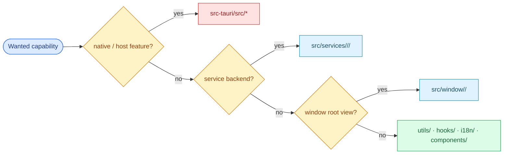

# §0 Effect Sketch — Module Location

### Chart-first summary
- **Focus**: This chart turns Module Location into a diagram-led overview before the detailed design and report sections.
- **Why**: It lets the reader understand the critical path before reading the detailed verification steps.
- **How to read**: Start with the native-versus-frontend split, then follow the decision branches into services, windows, or shared utilities.
# §1 Test Design — Verification Steps

## Step 1: Locate a translation backend
**Action**: Find where the OpenAI translation integration lives.
**Expected**: `src/services/translate/openai/` containing `index.jsx` + `Config.jsx` + `info.ts`.
**File**: `src/services/translate/openai/index.jsx`

## Step 2: Locate a Rust command
**Action**: Find where the screenshot capture logic lives.
**Expected**: `src-tauri/src/screenshot.rs` (Rust) invoked from JS via `invoke('screenshot')`.
**File**: `src-tauri/src/screenshot.rs`

## Step 3: Locate a window UI
**Action**: Find where the Config window UI lives.
**Expected**: `src/window/Config/` with `index.jsx` plus pages (About, Backup, General, History, Hotkey, Recognize, Service, Translate).
**File**: `src/window/Config/index.jsx`

## Step 4: Locate a service-instance resolver
**Action**: Find where built-in services and external plugins are merged.
**Expected**: `src/utils/service_instance.ts` (treats built-in and plugin services identically).
**File**: `src/utils/service_instance.ts`

## Step 5: Locate the HTTP daemon
**Action**: Find where the external invocation server lives.
**Expected**: `src-tauri/src/server.rs` (tiny_http, default port 60828).
**File**: `src-tauri/src/server.rs`

---

# §2 Output Inventory

| File/Directory | Type | Description |
|----------------|------|-------------|
| `src/` | dir | React frontend — entry, hooks, services, utils, windows, components, i18n |
| `src-tauri/src/` | dir | Rust backend — main, server, cmd, hotkey, clipboard, screenshot, system_ocr, tray, updater, backup, config, lang_detect, window, error |
| `src/services/translate/<name>/` | dir pattern (×22) | Per-service bundle: `index.jsx` (impl) + `Config.jsx` (settings panel) + `info.ts` (language list) |
| `src/services/recognize/<name>/` | dir pattern (×15) | Same shape as translate — 6 baidu/tencent, 5 iflytek/volcengine, 4 local |
| `src/services/tts/<name>/` | dir pattern (×1) | lingva TTS |
| `src/services/collection/<name>/` | dir pattern (×2) | anki, eudic |
| `src/window/<Name>/` | dir pattern | Per-window React view switched by `appWindow.label` in `App.jsx` |
| `src/utils/` | dir | Cross-cutting: store, env, invoke_plugin, lang_detect, service_instance |
| `src/hooks/` | dir | 6 React hooks: useConfig, useGetState, useSyncAtom, useToastStyle, useTtsPluginInfo, useVoice |
| `src/i18n/` | dir | i18next bootstrap + 20 locale JSON files |
| `src/components/WindowControl/` | dir | Min/Max/Close window control widget |

### Mirror-module pairs (JS ↔ Rust)

| Capability | JS file | Rust file |
|------------|---------|-----------|
| Language detection | `src/utils/lang_detect.js` | `src-tauri/src/lang_detect.rs` |
| OCR | `src/services/recognize/system/`, `tesseract/` | `src-tauri/src/system_ocr.rs` |
| Configuration storage | `src/utils/store.js` (tauri-plugin-store) | `src-tauri/src/config.rs` (initialization) |
| Backup | `src/window/Config/pages/Backup/` | `src-tauri/src/backup.rs` (Aliyun/WebDAV) |

---

# §3 Test Report — 2026-07-15

| Step | Result | Notes |
|------|:---:|-------|
| 1 | ✅ | `src/services/translate/openai/index.jsx` exists |
| 2 | ✅ | `src-tauri/src/screenshot.rs` exists |
| 3 | ✅ | `src/window/Config/index.jsx` exists (8 page subdirs) |
| 4 | ✅ | `src/utils/service_instance.ts` exists |
| 5 | ✅ | `src-tauri/src/server.rs` exists |

**Overall**: pass — 5/5 steps passed

---

# §4 Self-Improvement

## Edge Cases Found
- **Plugins (`.potext`)** are not under `src/` — they are loaded at runtime via `src/utils/invoke_plugin.js` and may live in user-configured directories (e.g. `~/.config/pot/plugins/`).
- **`src-tauri/src/lang_detect.rs` mirrors `src/utils/lang_detect.js`** — Rust side for native speed (lingua crate, 23 languages), JS side for in-window previews. Don't assume only one exists.
- **The `Config` window** is a router over 8 pages; look at `src/window/Config/routes/index.jsx` for the route table, not just `Config/index.jsx`.
- **`daemon.html`** is a sibling Vite entry that loads `services/` and `utils/` but never mounts `<App />` — it has no `src/window/*` involvement.

## Suggested Improvements
- Add a `services/index.md` enumerating all built-in services by kind for quick lookup.
- Cross-link the Rust `cmd.rs` command list with the JS `invoke()` call sites.
- Document the per-service `Config.jsx` panel contract (must accept a per-instance `key`).

## Limitations
- Module map only covers top-level directories — deeper per-service files (e.g. `Config.jsx`, `info.ts`) follow a uniform pattern, but the scene does not enumerate every service file.
- The Tauri plugin API packages (`tauri-plugin-{autostart,fs-watch,log,sql,store}-api`) are imported but live in `node_modules/`, not in this tree.
