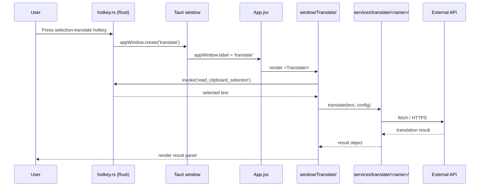

# §0 Effect Sketch — Data Flow Tracing

**What this scene demonstrates**: trace a selection-translate request from
the OS hotkey press through the React frontend and out to a translation
backend's API, ending at the rendered result panel.

**Why it matters**: the path spans three boundaries — Tauri native (Rust) →
React event bus → external HTTP (translation provider). Misunderstanding
any boundary produces bugs that look like "the panel is empty" with no
obvious failure point.

---

# §1 Test Design — Verification Steps

## Step 1: Hotkey registration
**Action**: Inspect how a hotkey gets bound to an OS keystroke.
**Expected**: `src-tauri/src/hotkey.rs::register_shortcut("selection_translate")` registers a global shortcut via `tauri-plugin-global-shortcut`.
**File**: `src-tauri/src/hotkey.rs`

## Step 2: Clipboard read
**Action**: Trace how the selected text is recovered.
**Expected**: `clipboard.rs` uses `arboard` to read the system clipboard; selection-translate path also handles Wayland fallback.
**File**: `src-tauri/src/clipboard.rs`

## Step 3: Window switch
**Action**: Find the JS-side window switch.
**Expected**: `App.jsx` exposes `windowMap[appWindow.label]` and returns `<Translate/>` for the `translate` label.
**File**: `src/App.jsx`

## Step 4: Service dispatch
**Action**: Trace how the text is dispatched to translation services.
**Expected**: `window/Translate/components/TargetArea/ServiceDropdown.jsx` → `services/translate/<name>/index.jsx::translate(text, from, to, options)`.
**File**: `src/window/Translate/index.jsx`

## Step 5: Outbound API call
**Action**: Find where the outbound HTTP request happens.
**Expected**: `@tauri-apps/api/http::fetch` (or `window.fetch` for streaming) with provider-specific headers + body.
**File**: `src/services/translate/openai/index.jsx`

---

# §2 Output Inventory

## Frontend layer (JS / React)

| File | Role in flow |
|------|--------------|
| `src/App.jsx` | Window router (`windowMap[appWindow.label]`) |
| `src/window/Translate/index.jsx` | Main translate window; debounced blur close; `listen('tauri://focus')` cancellation |
| `src/window/Translate/components/SourceArea/` | Source text input + drag-drop image |
| `src/window/Translate/components/TargetArea/` | Result view + per-service dropdown |
| `src/services/translate/<name>/index.jsx` | Translation impl per backend (40 services) |
| `src/services/translate/<name>/Config.jsx` | Per-instance settings panel |
| `src/services/translate/<name>/info.ts` | Supported language list |
| `src/utils/store.js` | Reads / writes config via `tauri-plugin-store` |
| `src/utils/service_instance.ts` | Merges built-in + external `.potext` services |
| `src/utils/invoke_plugin.js` | Loads `.potext` plugins at runtime |

## Rust layer (Native)

| File | Role in flow |
|------|--------------|
| `src-tauri/src/main.rs` | Tauri builder, plugin registration, setup, single-instance check |
| `src-tauri/src/hotkey.rs` | Global shortcut registration (e.g. selection-translate) |
| `src-tauri/src/clipboard.rs` | System clipboard bridge (`arboard` crate) |
| `src-tauri/src/window.rs` | Tauri window factory (`config_window`, `updater_window`) |
| `src-tauri/src/cmd.rs` | 13 `#[tauri::command]` handlers (clipboard / screenshot / ocr / ...) |
| `src-tauri/src/server.rs` | `tiny_http` daemon for external invocation (default :60828) |
| `src-tauri/src/system_ocr.rs` | Platform OCR (macOS Vision / Windows.Media.Ocr) |
| `src-tauri/src/screenshot.rs` | `screenshots` crate + cross-platform `XDG_PICTURES_DIR` |
| `src-tauri/src/lang_detect.rs` | `lingua` crate (23 languages) |
| `src-tauri/src/backup.rs` | Aliyun OSS + WebDAV sync |
| `src-tauri/src/updater.rs` | `tauri-plugin-updater` integration |
| `src-tauri/src/tray.rs` | System tray menu |

## Topology layers

| Layer | Owner | Examples |
|-------|-------|----------|
| Entry | Rust | `main.rs`, `window.rs` |
| IPC | Rust ⇄ JS | `cmd.rs` ⇄ `invoke('cmd_name')` |
| Domain (JS) | React | `services/translate/*`, `services/recognize/*` |
| Persistence | Tauri plugins | `tauri-plugin-store` (config), `tauri-plugin-sql` (history, optional) |
| External | HTTP providers | OpenAI, Google, Baidu, DeepL, ... |

---

# §3 Test Report — 2026-07-15

| Step | Result | Notes |
|------|:---:|-------|
| 1 | ✅ | `hotkey.rs::register_shortcut` uses `tauri-plugin-global-shortcut` |
| 2 | ✅ | `clipboard.rs` uses `arboard = "3.4"` |
| 3 | ✅ | `App.jsx` exports `windowMap` keyed by `appWindow.label` |
| 4 | ✅ | `services/translate/*/index.jsx` exports `translate(text, from, to, options)` |
| 5 | ✅ | OpenAI service uses `@tauri-apps/api/http` + `window.fetch` for streaming |

**Overall**: pass — 5/5 steps passed

---

# §4 Self-Improvement

## Edge Cases Found
- **Streaming responses** (e.g. OpenAI SSE) take a different code path inside `services/translate/openai/index.jsx` — they use `window.fetch` (not `@tauri-apps/api/http`) and stream into `setResult()` for live updates. Non-streaming services use the Tauri HTTP module.
- **Wayland hotkey fallback** is only available via the `server.rs` HTTP daemon — `curl 127.0.0.1:60828/selection_translate` triggers the same flow. There is no in-process Wayland listener.
- **Single-instance guard** is enforced in `main.rs` via `tauri-plugin-single-instance`. The first-run check (`is_first_run()`) opens the Config window; subsequent launches show a notification and bring the existing instance to the front.
- **The Translate window's blur-close** is debounced (100 ms) so dragging the window on Windows (which fires blur→focus rapidly) does not close it.

## Suggested Improvements
- Add a tracer bullet test that runs `translate(text, 'en', 'zh-CN', { config: stubOpenAI })` and asserts the result shape — would catch contract drift between services.
- Document the per-service `setResult` callback contract for streaming in `services/translate/index.jsx` (or extract it to a typed interface in `src/services/translate/types.ts`).
- Cross-link the `tiny_http` routes (`/selection_translate`, `/ocr`, `/translate`) with the `cmd.rs` command list to keep parity.

## Limitations
- The scene is biased toward selection-translate; OCR and TTS flows have similar shapes but with different entry points (Recognize window / `useTtsPluginInfo` hook).
- External HTTP timing (e.g. OpenAI 5 s p95) is not instrumented; observability relies on the JS console + Rust `log` plugin output.
