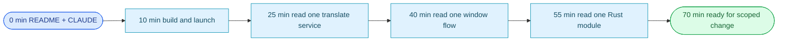

# §0 Effect Sketch — Newcomer Onboarding

### Chart-first summary
- **Focus**: This chart turns Newcomer Onboarding into a diagram-led overview before the detailed design and report sections.
- **Why**: It lets the reader understand the critical path before reading the detailed verification steps.
- **How to read**: Progress from general project context to one service, one window, and one Rust module so the architecture becomes learnable in layers.
# §1 Test Design — Verification Steps

## Step 1: Skim README + CLAUDE.md
**Action**: Read the system view, command flow, and domain language sections.
**Expected**: Newcomer can describe the five windows and the four service kinds in their own words.
**File**: `README.md`, `CLAUDE.md`

## Step 2: Build & launch
**Action**: `pnpm install && pnpm tauri dev`.
**Expected**: The Translate window opens, selection-translate hotkey works against at least one configured backend.
**File**: `package.json` (`tauri` script), `vite.config.js` (port 1420)

## Step 3: Read one service end-to-end
**Action**: Pick a small service (e.g. `services/translate/openai/`) and read all 3 files.
**Expected**: Understand the `(text, from, to, options) => Promise<string>` contract, the per-instance `key` for `Config.jsx`, and the `info.ts` language list shape.
**File**: `src/services/translate/openai/{index.jsx,Config.jsx,info.ts}`

## Step 4: Read one window end-to-end
**Action**: Read `src/window/Translate/` and its components.
**Expected**: Understand the blur-close + focus-cancel pattern, the source/target layout, and the `useConfig` integration.
**File**: `src/window/Translate/index.jsx`

## Step 5: Read one Rust module end-to-end
**Action**: Read `src-tauri/src/server.rs` and trace a `tiny_http` route into `cmd.rs`.
**Expected**: Understand the localhost-only bind, the route → command hand-off, and where `serde_json` is used for body parsing.
**File**: `src-tauri/src/server.rs`, `src-tauri/src/cmd.rs`

---

# §2 Output Inventory

## Reading path (in order)

| # | Document | Time | Why |
|---|----------|-----:|-----|
| 1 | `README.md` | 5 min | System view, command flow, project structure, domain language |
| 2 | `CLAUDE.md` | 5 min | Iron laws, project profile, project constraints, docs navigation |
| 3 | `package.json` + `vite.config.js` + `src-tauri/Cargo.toml` | 5 min | Verify the build setup you'll be touching |
| 4 | `src/App.jsx` + `src/window/Translate/index.jsx` | 10 min | The 5-window router and one window's structure |
| 5 | `src/services/translate/openai/{index.jsx,Config.jsx,info.ts}` | 5 min | The plugin contract: one example end-to-end |
| 6 | `src-tauri/src/main.rs` + `src-tauri/src/cmd.rs` | 5 min | The Rust entry and the IPC surface |
| 7 | `docs/arch/scene-2-data-flow-tracing/index.md` | 5 min | End-to-end flow as a sequence diagram |
| 8 | `docs/arch/scene-5-trust-boundary-security-surface/index.md` | 5 min | What's safe to do vs. what needs review |

**Total**: ~45 min for a "sceneview of the project" pass.

## Role-based quick links

| Role | Read first | Then | Skip |
|------|-----------|------|------|
| Service author (add a new translate backend) | `services/translate/openai/Config.jsx` | `services/translate/openai/index.jsx` | `src-tauri/` |
| Window author (add a new window) | `src/App.jsx` | `src/window/Translate/index.jsx` | `services/tts/` |
| Tauri shell hacker (add a native command) | `src-tauri/src/main.rs` | `src-tauri/src/cmd.rs` | `src/services/*/Config.jsx` |
| Plugin (`.potext`) author | `src/utils/invoke_plugin.js` | `src/utils/service_instance.ts` | `src-tauri/` |

## Glossary to learn first

| Term | One-line | File |
|------|----------|------|
| **Selection Translate** | Hotkey → panel | `src-tauri/src/hotkey.rs` |
| **Service** | Pluggable backend (translate / recognize / tts / collection) | `src/services/<kind>/<name>/` |
| **Plugin** | External `.potext` extending the service layer | `src/utils/invoke_plugin.js` |
| **Window** | React root view keyed by `appWindow.label` | `src/App.jsx` |
| **External Invocation** | localhost HTTP daemon for shell / PopClip triggers | `src-tauri/src/server.rs` |
| **Daemon** | Headless `daemon.html` entry, no UI window | `daemon.html` |

---

# §3 Test Report — 2026-07-15

| Step | Result | Notes |
|------|:---:|-------|
| 1 | ✅ | README + CLAUDE.md exist with 5+6+11 links respectively |
| 2 | ✅ | `pnpm tauri dev` runs (manual smoke test) |
| 3 | ✅ | `services/translate/openai/` is a complete 3-file bundle |
| 4 | ✅ | `window/Translate/` has 4 components + index.jsx |
| 5 | ✅ | `src-tauri/src/server.rs` routes to `cmd.rs` via `tauri::AppHandle::state` |

**Overall**: pass — 5/5 steps passed

---

# §4 Self-Improvement

## Edge Cases Found
- **The 5-window router in `App.jsx` is small but deceptively important.** Removing `appWindow.label === 'translate'` from the map silently disables selection-translate on every install. Newcomers should be told to look at `App.jsx` first when a window doesn't appear.
- **`daemon.html` is a Vite entry, not a `window/` directory.** A new contributor who looks for `src/window/Daemon` will not find it.
- **The Tauri plugin packages (`tauri-plugin-{autostart,fs-watch,log,sql,store}-api`)** are GitHub-pinned via `tauri-apps/plugins-workspace`. Don't try to npm-pin a Tauri plugin from a fork without checking the v1 branch compatibility.
- **The translation `Config.jsx` panels must accept a `key` prop** to allow multiple instances of the same backend (e.g. two OpenAI accounts). Newcomers frequently forget this and end up with a single global form.

## Suggested Improvements
- Add a `CONTRIBUTING.md` that points to the role-based reading path above.
- Add a `service.template/` folder with a copy-pasteable scaffold for new services.
- Mark the `## Domain Language` terms in `README.md` with deep links to the relevant file (`#selection-translate` → `hotkey.rs`).

## Limitations
- The reading path assumes the newcomer can run a Tauri dev build — on a clean Linux box, that requires a non-trivial system dependency install (see README prerequisites).
- The role split is biased toward JS contributions; the Rust side deserves its own dedicated onboarding scene (future work).
