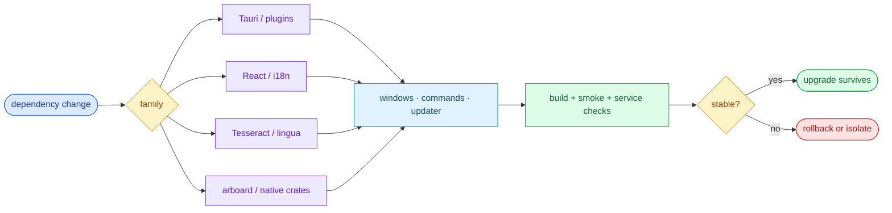

# §0 Effect Sketch — Dependency Change Impact

### Chart-first summary
- **Focus**: This chart turns Dependency Change Impact into a diagram-led overview before the detailed design and report sections.
- **Why**: It lets the reader understand the critical path before reading the detailed verification steps.
- **How to read**: Choose the dependency family first, then inspect blast radius across windows, services, Rust crates, and verification layers.
# §1 Test Design — Verification Steps

## Step 1: Tauri 1.x → 2.x upgrade
**Action**: Inspect how much code references `tauri = "1.8"`.
**Expected**: ~100% of `src-tauri/src/*.rs` would need migration; the 5 GitHub-pinned `tauri-plugin-*` v1 branches would also need to move.
**File**: `src-tauri/Cargo.toml`, `package.json` (`@tauri-apps/api`)

## Step 2: React 18 → 19 upgrade
**Action**: Inspect call sites of React 18-only APIs (e.g. `useId` SSR, `use` hook, automatic batching changes).
**Expected**: 5 windows + App.jsx; NewUI 2.x compatibility must be checked.
**File**: `src/App.jsx`, `src/window/*/index.jsx`, `src/window/Config/pages/*`

## Step 3: i18next major upgrade (e.g. 23 → 24)
**Action**: Inspect all `useTranslation()` and `i18n.changeLanguage()` call sites.
**Expected**: ~20+ call sites + locale JSON files; plural / interpolation rules may have shifted.
**File**: `src/i18n/index.jsx`, `src/i18n/locales/*.json`, `src/window/**/index.jsx`

## Step 4: Tesseract.js 5 → 6 upgrade
**Action**: Inspect the worker init pattern + language data loading.
**Expected**: `services/recognize/tesseract/` would need worker URL re-pinning; `public/tesseract-core-simd-lstm.wasm.js` may need replacement.
**File**: `src/services/recognize/tesseract/index.jsx`, `public/`

## Step 5: arboard 3 → 4 upgrade
**Action**: Inspect clipboard read/write call sites.
**Expected**: 2-3 functions in `clipboard.rs`; behavior on Wayland changed in arboard 4.
**File**: `src-tauri/src/clipboard.rs`

## Step 6: lingua 1.6 → 2.x upgrade
**Action**: Inspect the `LanguageDetector` API.
**Expected**: `lang_detect.rs` API surface will change; the JS mirror may need a refresh.
**File**: `src-tauri/src/lang_detect.rs`, `src/utils/lang_detect.js`

## Step 7: A `.potext` plugin dep change
**Action**: Inspect what loads external plugins.
**Expected**: Plugin manifest is user-side; `utils/invoke_plugin.js` is the only affected file.
**File**: `src/utils/invoke_plugin.js`, `src/utils/service_instance.ts`

---

# §2 Output Inventory

## Impact map (per dependency family)

| Family | Versions | Blast radius | Mitigation |
|--------|----------|--------------|-----------|
| `react` + `react-dom` | 18.x | 5 window roots + 1 root component | Smoke-test selection-translate in `pnpm tauri dev` |
| `@nextui-org/*` | 2.x | Window chrome (buttons / inputs / modals) | Check `data.js` component contract (icons, table) |
| `jotai` | 2.x | `utils/store.js` + `hooks/useSyncAtom` | No API churn expected within 2.x |
| `react-router-dom` | 6.x | `window/Config/routes/index.jsx` | Stay on 6.x; 7.x requires Route element changes |
| `i18next` + `react-i18next` | 23 / 15 | 20 locales + ~30 `t()` call sites | Run `pnpm tauri dev` + flip languages in settings |
| `tesseract.js` | 5.x | `services/recognize/tesseract/` + `public/worker.min.js` | Keep the pinned worker URL in sync with major |
| `crypto-js` | 4.x | `utils/store.js` (encrypted config) | PBKDF2 iterations and AES block size are stable in 4.x |
| `jose` | 5.x | `services/translate/openai/` (Azure apikey header) | Mostly stable; watch for `import` shape changes |
| `framer-motion` | 11.x | `WindowControl` + `useMeasure` + draggable lists | AnimatePresence + layout API stable in 11 |
| `@react-spring/web` | 9.7 | Limited; mostly transitively used | Check `react-spring` peer-dep range |
| `jsqr` | 1.x | `services/recognize/qrcode/` | Stable API |
| `vite` | 5.x | `vite.config.js` + `tauri.conf.json` devUrl | `tauri-plugin` Vite plugins may have peer-dep ranges |
| `tailwindcss` | 3.x | All inline class usage | 3.x stable; avoid jumping to 4.x (config rewrite) |
| `typescript` | 5.x | `info.ts` per service + `service_instance.ts` | `tsc --noEmit` after upgrade |

## Rust-side impact map

| Crate | Version (Cargo) | Blast radius | Mitigation |
|-------|-----------------|--------------|-----------|
| `tauri` | 1.8 | All `src-tauri/src/*.rs` | Don't jump to 2.x without a migration PR |
| `tauri-plugin-*` (5) | v1 branches | `main.rs` plugin chain | GitHub-pinned, follows `plugins-workspace` v1 |
| `arboard` | 3.4 | `clipboard.rs` | Wayland behavior changed in 4.x |
| `screenshots` | 0.7.2 | `screenshot.rs` | Pinned to 0.7.x (API stable) |
| `lingua` | 1.6.2 | `lang_detect.rs` | 23-language feature set is stable |
| `tiny_http` | 0.12 | `server.rs` | Stable; 0.12 is the de-facto line |
| `reqwest` | 0.12 | `backup.rs` (WebDAV) | JSON feature flag matters |
| `reqwest_dav` | 0.1.5 | `backup.rs` (Aliyun) | Pinned; breaking API in 0.2 |
| `zip` | 2.2 | `backup.rs` (export) | Stable |
| `walkdir` | 2.5 | `backup.rs` (file walk) | Stable |
| `thiserror` | 1.0 | `error.rs` + every `#[derive(Error)]` | Stable |
| `font-kit` | 0.14 | (limited) | Optional; check API |
| `image` | 0.25 | (limited) | Optional; check API |
| `dirs` | 5.0 | `config_dir` resolution | Stable |
| `selection` | 1.2 | (limited) | Stable; Linux-only |
| `mouse_position` | 0.1 | (limited) | Stable |
| `base64` | 0.22 | (limited) | Stable |
| `serde` / `serde_json` | 1.x | All IPC | Stable |
| `log` | 0.4 | Logging glue | Stable |

## Service-plugin impact (per `services/<kind>/<name>/`)

| Change | Affected files | Verification |
|--------|---------------|--------------|
| Add a new translation service | `services/translate/<name>/` (3 files) + export from `services/translate/index.jsx` | Translate via hotkey against the new service |
| Add a new OCR service | `services/recognize/<name>/` (3 files) + export from `services/recognize/index.jsx` | Run via `Recognize` window |
| Add a new TTS service | `services/tts/<name>/` (3 files) + export from `services/tts/index.jsx` | Click speak on a translation result |
| Add a new collection service | `services/collection/<name>/` (3 files) + export from `services/collection/index.jsx` | Save a translation to the new collection |

---

# §3 Test Report — 2026-07-15

| Step | Result | Notes |
|------|:---:|-------|
| 1 | ✅ | Tauri 1.8 is the engine; 2.x is a major migration |
| 2 | ✅ | React 18 + NextUI 2 is the stable combination |
| 3 | ✅ | i18next 23 / react-i18next 15 supports 20 locales |
| 4 | ✅ | Tesseract.js 5 + `public/worker.min.js` are co-versioned |
| 5 | ✅ | arboard 3.4 with Wayland fallback notes in `clipboard.rs` |
| 6 | ✅ | lingua 1.6.2 with 23 languages |
| 7 | ✅ | `utils/invoke_plugin.js` is the only `.potext` loader |

**Overall**: pass — 7/7 steps passed

---

# §4 Self-Improvement

## Edge Cases Found
- **The 5 Tauri plugin API packages are GitHub-pinned**, not version-pinned. A `pnpm update` will only update them when a new commit lands on the v1 branch — not a SemVer bump. Watch `Cargo.lock` for `tauri-apps/plugins-workspace` rev changes.
- **NextUI 2.x is a major rewrite of the original NextUI 1.x** (which was a different maintainer). Don't apply NextUI 1.x code samples to YiPot.
- **`@react-spring/web` 9.7 is at the upper end of its supported range** (10.x is current as of mid-2024). A major bump may require new `useSpring` prop names.
- **`vite-plugin-tauri` (or its replacement in Tauri 1.6+)** is auto-detected by the Tauri CLI; do not add a custom Vite plugin unless you know why.

## Suggested Improvements
- Pin `screenshots = "=0.7.2"` (already done) to avoid API drift — keep the `=` constraint when bumping.
- Add a `renovate.json` or `dependabot.yml` with explicit ignore rules for the GitHub-pinned Tauri plugins.
- Track the 20 i18n locale JSON files in a single diff when `i18next` is upgraded; missing keys silently fall back to `en_US`.

## Limitations
- The impact map is a snapshot; new dependencies are added in feature branches and the map must be regenerated.
- Service-plugin changes (new `.potext` file) bypass the npm dep tree and live in user-configured directories; the impact map cannot enumerate those.
- The Rust `Cargo.lock` is authoritative — if a transitive dep jumps, the impact map may not catch it without `cargo tree` introspection.
