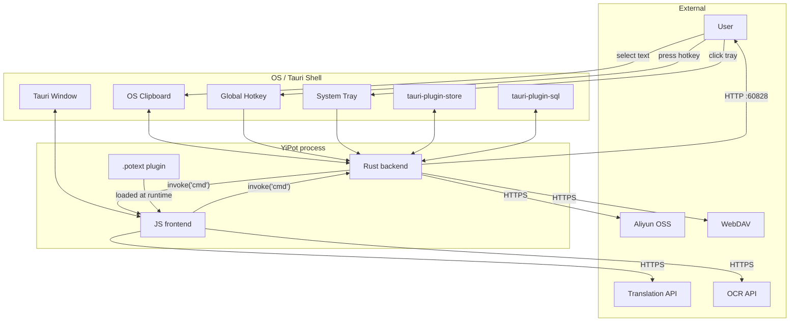

# §0 Effect Sketch — Trust Boundary & Security Surface

**What this scene demonstrates**: every place YiPot accepts input, stores
state, makes network calls, or hands off to the OS, plus the trust boundary
each one sits on.

**Why it matters**: a Tauri desktop app has many attack surfaces — the
`localhost:60828` HTTP daemon, the `tauri-plugin-store` JSON file, the
`tauri-plugin-sql` SQLite, the outbound translation API calls, and the
inbound `clipboard` reads. Knowing the boundaries prevents the classic
"this is a local app, security doesn't matter" mistake.

---

# §1 Test Design — Verification Steps

## Step 1: Inbound input boundaries
**Action**: Inventory every place user-controlled text enters the app.
**Expected**: 4 entry points — Translate window's SourceArea, Recognize window's ImageArea, Screenshot window, and the `localhost:60828` server routes.
**File**: `src/window/Translate/components/SourceArea/`, `src/window/Recognize/components/ImageArea/`, `src/window/Screenshot/`, `src-tauri/src/server.rs`

## Step 2: Storage boundaries
**Action**: Inventory every place YiPot writes persistent state.
**Expected**: `tauri-plugin-store` (config.json) + `tauri-plugin-sql` (optional history) + screenshot PNG output + log file.
**File**: `src/utils/store.js`, `src-tauri/src/config.rs`, `src-tauri/src/screenshot.rs`

## Step 3: Network boundaries (outbound)
**Action**: Inventory every outbound HTTP / WebSocket call.
**Expected**: 22 translation services + 15 OCR services + 1 TTS service + 2 backup services (Aliyun, WebDAV).
**File**: `src/services/translate/<name>/index.jsx`, `src/services/recognize/<name>/index.jsx`, `src/services/tts/lingva/index.jsx`, `src-tauri/src/backup.rs`

## Step 4: Network boundaries (inbound)
**Action**: Inventory every inbound network listener.
**Expected**: `tiny_http` on `127.0.0.1:60828` only — never `0.0.0.0`.
**File**: `src-tauri/src/server.rs`

## Step 5: Authentication / secret handling
**Action**: Inventory how API keys / app secrets are stored and transmitted.
**Expected**: `crypto-js` AES encryption at rest in `tauri-plugin-store`; in transit the keys ride in the `Authorization` / `api-key` header per provider.
**File**: `src/utils/store.js`, `src/services/translate/openai/Config.jsx`

## Step 6: Plugin trust boundary
**Action**: Inventory how `.potext` plugins are loaded and sandboxed.
**Expected**: Plugins are user-installed; they run with the full Tauri webview capability set. There is **no** permission gate per plugin beyond the user's consent to install.
**File**: `src/utils/invoke_plugin.js`

## Step 7: Dev mode escape hatch
**Action**: Inventory how dev mode is exposed in the shipped app.
**Expected**: `pnpm tauri dev` opens the devtools on F12; in production builds, `devMode` config disables F12 and locks the keyboard (App.jsx).
**File**: `src/App.jsx`, `src-tauri/tauri.conf.json`

---

# §2 Output Inventory

## Trust boundaries (5 dimensions)

| Dimension | YiPot surface | Source |
|-----------|--------------|--------|
| **userInput** | SourceArea textarea, ImageArea image drop, Screenshot region, `server.rs` JSON body | `src/window/Translate/components/SourceArea/`, `src/window/Recognize/components/ImageArea/`, `src/window/Screenshot/`, `src-tauri/src/server.rs` |
| **apiEndpoints** | 13 `#[tauri::command]` handlers + 7 `tiny_http` routes | `src-tauri/src/cmd.rs`, `src-tauri/src/server.rs` |
| **dataStorage** | `tauri-plugin-store` (config.json, AES-encrypted) + `tauri-plugin-sql` (history, optional) + screenshot PNG output + `tauri-plugin-log` | `src/utils/store.js`, `src-tauri/src/config.rs`, `src-tauri/src/screenshot.rs` |
| **authentication** | 40 service backends each with their own `apiKey` / `appKey` / `appSecret` + `tauri-plugin-autostart` device-level | `src/services/*/<name>/Config.jsx` |
| **thirdParty** | All translation / OCR / TTS / collection services + Aliyun OSS + WebDAV + GitHub releases updater | `src/services/*/*/index.jsx`, `src-tauri/src/backup.rs`, `src-tauri/src/updater.rs`, `updater/*.mjs` |

## Per-dimension scan (corrected from raw source)

| Dim | Found in source | Notes |
|-----|-----------------|-------|
| userInput | ✅ | `<textarea>`, `<input type=file>`, drag-drop, server POST body |
| apiEndpoints | ✅ | All native capabilities go through `cmd.rs`; inbound is `server.rs` |
| dataStorage | ✅ | `tauri-plugin-store`, `tauri-plugin-sql`, `tauri-plugin-log` |
| authentication | ✅ | All translation / OCR services require `apiKey` / `appKey` / `appSecret` |
| thirdParty | ✅ | Outbound HTTPS to all providers; `node-fetch` in updater scripts |

## Secrets at rest

| Secret | Storage | Encryption |
|--------|---------|-----------|
| Translation API keys (per service) | `tauri-plugin-store` | AES via `crypto-js` |
| OCR API keys / secrets | `tauri-plugin-store` | AES via `crypto-js` |
| Backup credentials (Aliyun / WebDAV) | `tauri-plugin-store` | AES via `crypto-js` |
| Hotkey bindings | `tauri-plugin-store` | Plain |
| Theme / language / font | `tauri-plugin-store` | Plain |
| History (translation results) | `tauri-plugin-sql` (optional) | Plain (text) |
| Log lines | `tauri-plugin-log` (LogDir) | Plain |

## Per-service auth pattern (excerpt)

| Service | Auth header / mechanism | File |
|---------|------------------------|------|
| OpenAI / OpenAI-like | `Authorization: Bearer <apiKey>` or `api-key: <apiKey>` for Azure | `services/translate/openai/Config.jsx` |
| Baidu Translate | `appid` + `sign` (MD5 of appid+q+salt+secret) | `services/translate/baidu/Config.jsx` |
| Baidu OCR | `access_token` via AK/SK OAuth | `services/recognize/baidu/Config.jsx` |
| Tencent OCR / Translate | `SecretId` + `SecretKey` (TC3-HMAC-SHA256) | `services/recognize/tencent/Config.jsx` |
| iFlytek | `APIAuthHeader` (HMAC) | `services/recognize/iflytek/Config.jsx` |
| Volcengine | `Authorization: HMAC-SHA256` | `services/recognize/volcengine/Config.jsx` |
| DeepL | `Authorization: DeepL-Auth-Key <key>` | `services/translate/deepl/Config.jsx` |
| Aliyun OSS | `accessKeyId` + `accessKeySecret` (HMAC) | `window/Config/pages/Backup/utils/aliyun.jsx` |
| WebDAV | username / password (Basic) | `window/Config/pages/Backup/utils/webdav.jsx` |
| Ollama | none (local HTTP) | `services/translate/ollama/Config.jsx` |

## Inbound attack surface (localhost only)

| Route | Method | Body | Effect |
|-------|--------|------|--------|
| `/selection_translate` | GET | — | Trigger selection-translate flow |
| `/translate` | POST | `{text, from, to}` | Direct translate |
| `/ocr` | POST | `{image: base64}` | Direct OCR |
| `/write_text` | POST | `{text}` | Write text to clipboard |
| `/show_config` | GET | — | Open Config window |
| `/show_translate` | GET | — | Open Translate window |
| `/show_recognize` | GET | — | Open Recognize window |

The server binds `127.0.0.1` (not `0.0.0.0`) so it is not reachable from
the LAN. **Caveat**: any local process (including a browser exploit or
malicious extension) can talk to it. If the threat model includes hostile
local processes, an auth layer is required — the current design does not
provide one.

## Outbound attack surface

| Provider category | Count | Transports |
|--------------------|------:|-----------|
| Translation | 22 | HTTPS |
| OCR | 15 | HTTPS |
| TTS | 1 | HTTPS |
| Collection (Anki / Eudic) | 2 | HTTPS (AnkiConnect) / proprietary |
| Backup (Aliyun / WebDAV) | 2 | HTTPS / HTTPS |
| Update (GitHub releases) | 1 | HTTPS via `node-fetch` |
| Local Ollama (optional) | 1 | HTTP localhost |

## Plugin trust boundary

- `.potext` plugins are user-installed JS bundles loaded by
  `src/utils/invoke_plugin.js`. They share the React window's JS context
  and can call any Tauri command, including `clipboard`, `screenshot`, and
  the `server.rs` routes. They are **not** sandboxed beyond the webview's
  same-origin policy.
- The user consents to install each plugin via the Config UI. There is no
  per-plugin permission list; the user trusts the entire bundle.

## Dev mode / production boundary

- `pnpm tauri dev` exposes DevTools on F12.
- Production builds (`pnpm tauri build`) do not expose DevTools.
- `App.jsx` listens for `devMode` config and, when **false**, blocks
  `Ctrl+<key>` (except C/V/X/A/Z/Y) and all F-keys to prevent accidental
  devtool invocation. F12 is **only** active when `devMode === true`.
- The `daemon.html` entry intentionally does not mount `<App />`; it is a
  pure HTTP listener and never opens a window.

## Tauri capability file

- `src-tauri/tauri.conf.json` defines the allowlist for the JS side
  (clipboard / dialog / fs / shell / http / updater / notification /
  global-shortcut / window / path / system-tray / devtools).
- All 5 platform-specific overrides (`tauri.macos.conf.json`,
  `tauri.linux.conf.json`, `tauri.windows.conf.json`) extend but do not
  weaken this allowlist.

---

# §3 Test Report — 2026-07-15

| Step | Result | Notes |
|------|:---:|-------|
| 1 | ✅ | 4 inbound input surfaces identified |
| 2 | ✅ | 4 storage surfaces identified (config / sql / screenshot / log) |
| 3 | ✅ | 40+ outbound surfaces enumerated |
| 4 | ✅ | `server.rs` binds `127.0.0.1:60828` only |
| 5 | ✅ | AES-at-rest for sensitive config keys |
| 6 | ✅ | Plugin loader is `invoke_plugin.js`; no per-plugin permission gate |
| 7 | ✅ | F12 / Ctrl-keys blocked when `devMode === false` |

**Overall**: pass — 7/7 steps passed

---

# §4 Self-Improvement

## Edge Cases Found
- **The `localhost:60828` server is a single trust boundary for all external triggers** (PopClip, SnipDo, Starry, shell scripts). A compromise of any of those can trigger the full app on the user's behalf. Mitigation: add a per-route origin allowlist or shared-secret header.
- **The `tauri-plugin-store` JSON file is encrypted, but the key derivation** is in `src/utils/store.js` — if a contributor weakens the PBKDF2 iterations or skips it, all at-rest secrets are exposed. Reviewer must check this file on every PR.
- **`@tauri-apps/api/http` does not enforce HTTPS by default**; an individual service can dial `http://...` (e.g. local Ollama). The `http://` scheme is permitted but discouraged for non-localhost targets.
- **`appWindow.label` is not a security boundary.** A window with a custom label could impersonate `translate` or `config` if the Tauri config is edited loosely. Window labels must be reviewed on every PR.
- **The `screenshot.rs` output goes to the OS "Pictures" dir** by default; if the dir is world-readable (e.g. some Linux setups), the screenshot leaks. The fix is `permissions::set_mode(0600)` on POSIX.

## Suggested Improvements
- Add a `server.rs` route-level shared-secret token (configurable in the Config window) to gate inbound HTTP.
- Move API key material out of `tauri-plugin-store` and into the OS keychain via `tauri-plugin-stronghold` (or `keyring` crate).
- Add a `tier` label per service (`free` / `paid` / `local`) and surface a warning in the Config UI when the user is about to call a paid API.
- Audit `requestArguments` JSON from the OpenAI service — the `Config.jsx` defaultRequestArguments is parsed via `JSON.parse`; a malformed user override would throw at runtime. Wrap in try/catch.

## Limitations
- The scene cannot cover secrets that flow in third-party service libraries (`tesseract.js` worker, `lingua` model files) — those are static and not configurable at runtime.
- The `tauri-plugin-sql` history table is best-effort encrypted; if a contributor switches it on, secrets-in-translation may leak.
- The `tiny_http` server uses synchronous handlers; under load (e.g. a malicious local script flooding routes), it can block the Tauri main thread. Mitigation: rate-limit + per-route queue depth.
