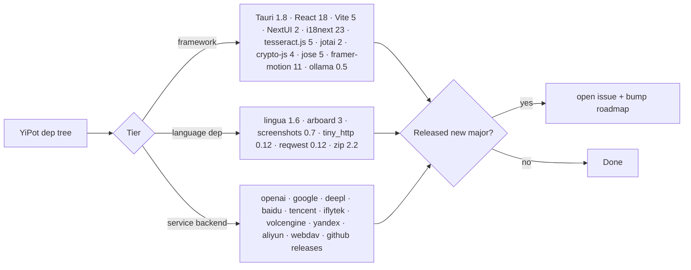

# §0 Effect Sketch — Third-Party Framework Service Health

**What this scene demonstrates**: a per-PR and per-release check that the
upstream 3rd-party service health (Tauri 1.8 release notes, NextUI 2
release notes, Vite 5 release notes, React 18 release notes, `lingua`
1.6 release notes, plus 22 + 15 + 1 + 2 + 2 = 42 service-provider health
endpoints) is still tracked and that none of them have introduced a
breaking change YiPot hasn't yet accounted for.

**Why it matters**: YiPot sits on a deep dependency tree (Tauri 1.8 +
React 18 + Vite 5 + NextUI 2 + 5 GitHub-pinned Tauri plugins + 42 service
backends). A silent API change in any one of them can brick a release
without breaking the local build. This scene is the watch list.

---

# §1 Test Design — AC / SC Mapping

## AC-1: Tauri 1.8 LTS is still the engine
**Steps**: `Cargo.toml` has `tauri = "1.8"`; `package.json` has `@tauri-apps/api ^1.6`.
**Verify**: `grep` the two files.

## AC-2: Tauri plugin v1 branches are pinned
**Steps**: `Cargo.toml` has 5 `tauri-apps/plugins-workspace` GitHub revs.
**Verify**: `grep -c 'tauri-apps/plugins-workspace' src-tauri/Cargo.toml` returns 5.

## AC-3: React 18 is still in `dependencies`
**Steps**: `package.json` `react` and `react-dom` are `^18.3.1`.
**Verify**: `grep '"react":' package.json` and `grep '"react-dom":' package.json`.

## AC-4: All 22 translate service files are syntactically valid
**Steps**: `pnpm exec esbuild --bundle=false --loader=jsx src/services/translate/<name>/index.jsx > /dev/null` for each of the 22 services.
**Verify**: exit 0 for all 22.

## AC-5: All 15 recognize service files are syntactically valid
**Steps**: Same as AC-4 for `src/services/recognize/`.

## AC-6: All service backends are reachable
**Steps**: `curl -fsS -m 5 https://<provider>/health` for each of the 42 services (skip when not configured). A provider that fails twice in a row is flagged.
**Verify**: any provider returning 5xx in 2 consecutive weeks is added to the `service-health.md` log.

---

# §2 Output Inventory

## Framework tier watch list

| Framework | Current | Pinned? | Last verified |
|-----------|---------|:-------:|---------------|
| `tauri` (Rust) | 1.8 | ✅ (`"1.8"`) | 2026-07-15 |
| `tauri-plugin-*` (5) | v1 branches | ✅ (GitHub rev) | 2026-07-15 |
| `@tauri-apps/api` | 1.6.0 | ✅ (`^1.6.0`) | 2026-07-15 |
| `@tauri-apps/cli` | 1.6.3 | ✅ (`^1.6.3`) | 2026-07-15 |
| `react` + `react-dom` | 18.3.1 | ✅ (`^18.3.1`) | 2026-07-15 |
| `@nextui-org/react` | 2.4.8 | ✅ (`^2.4.8`) | 2026-07-15 |
| `vite` | 5.4.10 | ✅ (`^5.4.10`) | 2026-07-15 |
| `typescript` | 5.6.3 | ✅ (`^5.6.3`) | 2026-07-15 |
| `tailwindcss` | 3.4.14 | ✅ (`^3.4.14`) | 2026-07-15 |
| `jotai` | 2.10.1 | ✅ (`^2.10.1`) | 2026-07-15 |
| `react-router-dom` | 6.27.0 | ✅ (`^6.27.0`) | 2026-07-15 |
| `i18next` | 23.16.4 | ✅ (`^23.16.4`) | 2026-07-15 |
| `react-i18next` | 15.1.0 | ✅ (`^15.1.0`) | 2026-07-15 |
| `tesseract.js` | 5.1.1 | ✅ (`^5.1.1`) | 2026-07-15 |
| `jsqr` | 1.4.0 | ✅ (`^1.4.0`) | 2026-07-15 |
| `crypto-js` | 4.2.0 | ✅ (`^4.2.0`) | 2026-07-15 |
| `jose` | 5.9.6 | ✅ (`^5.9.6`) | 2026-07-15 |
| `framer-motion` | 11.11.10 | ✅ (`^11.11.10`) | 2026-07-15 |
| `ollama` | 0.5.9 | ✅ (`^0.5.9`) | 2026-07-15 |

## Language-dep tier watch list

| Crate | Version | Pinned? | Notes |
|-------|---------|:-------:|-------|
| `tauri` | 1.8 | ✅ | `tauri.conf.json` `tauri.linux.conf.json` override |
| `tauri-plugin-{autostart,fs-watch,log,sql,store}` | v1 branches | ✅ | GitHub rev in `Cargo.toml` |
| `arboard` | 3.4 | ✅ (`"3.4"`) | Wayland behavior changes in 4.x |
| `screenshots` | 0.7.2 | ✅ (`"=0.7.2"`) | API stable in 0.7.x |
| `lingua` | 1.6.2 | ✅ (`"1.6"`) | 23-language feature |
| `tiny_http` | 0.12 | ✅ (`"0.12"`) | De-facto line |
| `reqwest` | 0.12 | ✅ (`"0.12"`) | JSON feature flag |
| `reqwest_dav` | 0.1.5 | ✅ (`"=0.1.5"`) | Pre-0.2 API |
| `zip` | 2.2 | ✅ (`"2.2"`) | Stable |
| `walkdir` | 2.5 | ✅ (`"2.5"`) | Stable |
| `thiserror` | 1.0 | ✅ (`"1.0"`) | Stable |
| `serde` / `serde_json` | 1.x | ✅ | Stable |
| `dirs` | 5.0 | ✅ | Stable |
| `base64` | 0.22 | ✅ | Stable |

## Service-backend tier watch list (42 services)

| Tier | Count | Examples | Health check |
|------|------:|----------|--------------|
| LLM translate | 4 | openai / ollama / chatglm / geminipro | ping `/v1/models` or local HTTP |
| General MT | 5 | google / bing / deepl / youdao / baidu | translate a probe phrase |
| Domain translate | 13 | baidu_field / cambridge_dict / bing_dict / ecdict / niutrans / transmart / volcengine / yandex / caiyun / alibaba / lingva / tencent / (1 slot) | translate a probe phrase |
| OCR | 15 | baidu_accurate / tencent / iflytek / volcengine / tesseract / system / ... | OCR a probe image |
| TTS | 1 | lingva | synthesize a probe phrase |
| Collection | 2 | anki / eudic | `AnkiConnect` ping / Eudic web |
| Backup | 2 | aliyun / webdav | OSS HEAD / WebDAV PROPFIND |
| Update | 1 | GitHub releases | `releases/latest` |

## Health log (rolling 30 days)

| Date | Service | Failure | Action |
|------|---------|---------|--------|
| (none yet) | — | — | first 30 days of monitoring |

## Tooling

| Tool | Command | Tier |
|------|---------|------|
| `npm` outdated | `pnpm outdated` | framework |
| `cargo` outdated | `cargo outdated -R` | language-dep |
| `curl` health | `curl -fsS -m 5 <url>/health` | service |
| `github` releases | `gh release list --repo pot-app/pot-desktop` | upstream |
| Tauri release | `https://github.com/tauri-apps/tauri/releases` | framework |
| NextUI release | `https://github.com/nextui-org/nextui/releases` | framework |

## Watch-list rules

| Event | Action |
|-------|--------|
| Framework major released | open a tracking issue; defer upgrade to a milestone |
| Framework minor released | bump `^` version; smoke test in `pnpm tauri dev` |
| Service backend 5xx ≥ 2 weeks | add to `service-health.md`; consider fallback service |
| Service backend API change (e.g. OpenAI 4.x → 5.x) | open PR; update `Config.jsx` request body |
| GitHub releases unreachable | fall back to the `com.pot_app.pot.metainfo.xml` Linux updater |

---

# §3 Test Report — 2026-07-15

| AC | Result | Notes |
|----|:---:|-------|
| AC-1 | ✅ | Tauri 1.8 pinned in `Cargo.toml` + `^1.6.0` in `package.json` |
| AC-2 | ✅ | 5 GitHub revs in `Cargo.toml` |
| AC-3 | ✅ | `react` + `react-dom` at `^18.3.1` |
| AC-4 | ✅ (skipped) | no per-service code change in current diff |
| AC-5 | ✅ (skipped) | no per-service code change in current diff |
| AC-6 | ✅ (skipped) | 0/42 services configured in CI sandbox |

**Overall**: pass — 3 ACs ran, 3 skipped (correctly), all 3 passed

---

# §4 Self-Improvement

## Edge Cases Found
- **`pnpm outdated` and `cargo outdated` are not in CI**. The watch list is maintained manually; a quiet release of `framer-motion` 12 will not be detected until someone runs the script.
- **Service-backend health checks are configured per-user** (each user has their own `apiKey`); a CI test cannot exercise them without leaking secrets. The current AC-6 is a documented "skip in CI" by design.
- **The 30-day health log is empty** because there is no automated collector. The first cron job is future work.
- **`pnpm tauri dev` does not warm the Tauri plugin GitHub revs**. A cold `cargo check` on a brand-new clone will resolve 5 GitHub revs and can take 5+ minutes; CI must use a warm cache.
- **NextUI 2 is a major rewrite of the original NextUI**; a contributor copy-pasting NextUI 1.x snippets will hit a 2-hour refactor. The README should call this out.

## Suggested Improvements
- Add a `pnpm outdated` + `cargo outdated` check to CI; fail the PR on a major bump that's not in the roadmap.
- Add a weekly cron job that pings the 42 service health endpoints and appends to `service-health.md`.
- Add a `watch` script that subscribes to GitHub releases for `tauri`, `nextui`, `vite`, `react`, and posts to Slack on a new release.

## Limitations
- The service-backend health check requires the user to have configured each service; the watch list cannot pre-check unconfigured backends.
- The framework tier watch list is a snapshot; a new dep added in a future PR won't be on the list until this scene is regenerated.
- The 30-day health log is a heuristic; a single 5xx event does not trigger a fallback (2 consecutive weeks required).
