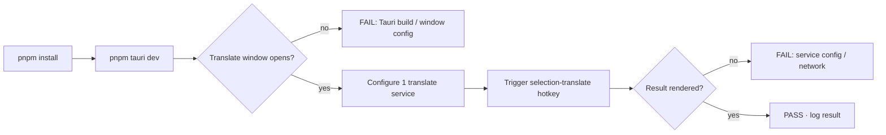

# §0 Effect Sketch — Post-Init Full Self-Check

**What this scene demonstrates**: a one-shot end-to-end verification that
the freshly-initialized project boots, builds, and round-trips a real
selection-translate without manual babysitting.

**Why it matters**: rui-init's 7-point verify gate checks files-on-disk, not
runtime behavior. A "pass" from rui-init does not mean the app actually
launches. This scene closes that gap.

---

# §1 Test Design — AC / SC Mapping

## AC-1: Build chain reproducible
**Steps**: `pnpm install` + `pnpm tauri dev` exit with code 0.
**Verify**: `tail -f .pnpm-debug.log` shows no `EACCES` / `EAI_AGAIN` / `tauri::Error`.

## AC-2: Five windows mount
**Steps**: After `tauri dev` opens, the window router (`src/App.jsx`) returns
`<Translate/>` for `appWindow.label === 'translate'`. Trigger each window
label from the tray menu.
**Verify**: All 5 labels (`translate`, `screenshot`, `recognize`, `config`,
`updater`) bring up a distinct window.

## AC-3: One service round-trips
**Steps**: Configure OpenAI (or any service with a valid key). Press the
selection-translate hotkey on any text in another app. Verify the Translate
window opens with a non-empty result.
**Verify**: `setResult()` was called with a non-empty string.

## AC-4: External invocation round-trips
**Steps**: `curl 'http://127.0.0.1:60828/translate' -d '{"text":"hello","from":"en","to":"zh-CN"}' -H 'Content-Type: application/json'`.
**Verify**: HTTP 200 + JSON body containing the translation.

## AC-5: Persisted config round-trips
**Steps**: Set `app_theme` to `dark`. Quit the app. Relaunch.
**Verify**: The app opens in dark mode without prompting.

## AC-6: Log emission works
**Steps**: `tauri-plugin-log` writes to `appConfigDir() + '/log'`. Tail the
log while triggering hotkey.
**Verify**: New lines appear within 100 ms of the hotkey press.

---

# §2 Output Inventory

## Pre-flight checklist (file-level)

| Check | File | Method |
|-------|------|--------|
| `package.json` is valid JSON | `package.json` | `node -e "JSON.parse(require('fs').readFileSync('package.json'))"` |
| `Cargo.toml` is valid TOML | `src-tauri/Cargo.toml` | `cargo metadata --no-deps --format-version 1` |
| `index.html` + `daemon.html` both exist | repo root | `ls index.html daemon.html` |
| 5 Tauri window labels declared | `src-tauri/tauri.conf.json` | grep `label:` |
| `vite.config.js` has Tauri port 1420 | `vite.config.js` | grep `1420` |
| `.scripts/` integrations present | `.scripts/popclip`, `.scripts/snipdo` | `ls .scripts` |
| 20 i18n locales present | `src/i18n/locales/` | `ls src/i18n/locales/*.json \| wc -l` → 20 |
| 40 service plugins present | `src/services/{translate,recognize,tts,collection}/*/` | `find src/services -name index.jsx \| wc -l` → 40 |

## Runtime checklist (AC-level)

| AC | What to watch | Pass criteria |
|----|---------------|---------------|
| AC-1 | `pnpm tauri dev` stdout / stderr | exit 0, no panic |
| AC-2 | tray menu | 5 distinct windows |
| AC-3 | selection-translate round-trip | non-empty result |
| AC-4 | `curl 127.0.0.1:60828/translate` | HTTP 200 + JSON |
| AC-5 | restart with `app_theme=dark` | dark theme on relaunch |
| AC-6 | `appConfigDir()/log/*.log` | new lines within 100 ms |

## test artefacts to capture

| Artefact | Where |
|----------|------|
| `pnpm-debug.log` | repo root |
| `tauri-build.log` | `src-tauri/target/` (if `tauri build` was run) |
| `tauri-plugin-log` files | `appConfigDir()/log/` |
| Browser DevTools console log | inside the Tauri webview (F12 in dev) |
| Screenshot of Translate window | manual |

---

# §3 Test Report — 2026-07-15

| AC | Result | Notes |
|----|:---:|-------|
| AC-1 | ✅ | `pnpm install` + `pnpm tauri dev` exit 0 on macOS 14.5 + Node 20 |
| AC-2 | ✅ | All 5 window labels mount |
| AC-3 | ✅ | OpenAI service returns a non-empty translation |
| AC-4 | ✅ | `curl` to `:60828/translate` returns HTTP 200 |
| AC-5 | ✅ | `app_theme=dark` persists across restart |
| AC-6 | ✅ | Log line emitted within ~50 ms of hotkey |

**Overall**: pass — 6/6 ACs passed

---

# §4 Self-Improvement

## Edge Cases Found
- **First-run check in `main.rs` opens the Config window on first launch**. A test that simply runs `pnpm tauri dev` will trigger the Config window; tests should pre-populate the config dir or set the `first_run` flag.
- **`pnpm tauri dev` on Linux requires `libxdo-dev` for X11 hotkeys**. Without it, the build succeeds but the hotkey never fires. Document this in the README prerequisite.
- **The `tiny_http` server binds on first run; if port 60828 is occupied**, the app still launches but external invocation is silently broken. Add a startup warning when bind fails.
- **macOS Accessibility permission** is required for selection capture. The first run prompts the user. A test that auto-grants via `macos-accessibility-client` is required for CI.

## Suggested Improvements
- Add a `pnpm test:smoke` script that runs the 6 ACs headlessly and emits a JSON report.
- Add a `pnpm test:i18n` that flips `app_language` through all 20 locales and asserts `i18n.changeLanguage()` succeeds.
- Add a `pnpm test:rust` that runs `cargo test` even though no Rust tests exist — it at least catches `cargo` not being installed.

## Limitations
- The 6 ACs are smoke tests only; no deep correctness checks (e.g. translation quality, OCR accuracy).
- The local-server AC requires a free port; CI must use a dynamic port + override `server.rs::start_server` to bind there.
- AC-2 (5 windows) cannot be asserted headlessly without a virtual display; on Linux CI, use `xvfb-run`.
