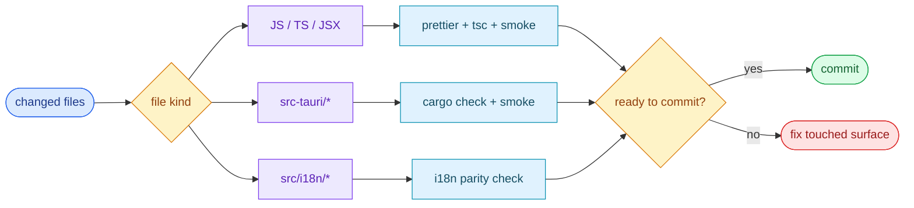

# §0 Effect Sketch — Pre-Commit Incremental Self-Check

### Chart-first summary
- **Focus**: This chart turns Pre-Commit Incremental Self-Check into a diagram-led overview before the detailed design and report sections.
- **Why**: It lets the reader understand the critical path before reading the detailed verification steps.
- **How to read**: Start from the touched file kind, then run only the checks that match that surface; the diagram is now optimized for quick commit decisions.
# §1 Test Design — File-aware AC / SC Mapping

## AC-1: Diff is small and reviewable
**Steps**: `git diff --stat` shows < 20 files, < 500 lines.
**Verify**: PR template's "Files changed" section matches.

## AC-2: `prettier` is clean
**Steps**: `pnpm exec prettier --check 'src/**/*.{js,jsx,ts,tsx,css}'`.
**Verify**: exit 0; no "would reformat" lines.

## AC-3: `tsc --noEmit` is clean
**Steps**: `pnpm exec tsc --noEmit`.
**Verify**: exit 0; no errors.

## AC-4: `cargo check` is clean (only if `src-tauri/*` touched)
**Steps**: `cd src-tauri && cargo check`.
**Verify**: `Finished dev [unoptimized + debuginfo] target(s)` with no error.

## AC-5: Manual smoke against the touched window
**Steps**: `pnpm tauri dev`, open the changed window, exercise the new
code path.
**Verify**: Result panel shows the new behavior.

## AC-6: i18n parity (only if `src/i18n/*` touched)
**Steps**: For every new key in `en_US.json`, ensure the same key exists
in all 20 locale files.
**Verify**: `diff <(jq -r 'keys[]' src/i18n/locales/en_US.json) <(jq -r 'keys[]' src/i18n/locales/zh_CN.json)` returns 0 lines.

---

# §2 Output Inventory

## Per-file-kind checklist

| File kind | Lint | Type-check | Manual smoke |
|-----------|------|-----------|--------------|
| `src/services/translate/<name>/index.jsx` | prettier | tsc | round-trip translate via hotkey |
| `src/services/translate/<name>/Config.jsx` | prettier | tsc | open Config → Service → save |
| `src/services/translate/<name>/info.ts` | prettier | tsc | flip language in target dropdown |
| `src/services/recognize/<name>/index.jsx` | prettier | tsc | run via Recognize window |
| `src/services/tts/<name>/index.jsx` | prettier | tsc | click speak on a translation |
| `src/services/collection/<name>/index.jsx` | prettier | tsc | save a translation to the new collection |
| `src/window/<Name>/index.jsx` | prettier | tsc | open the window via tray |
| `src/window/<Name>/components/*` | prettier | tsc | exercise the changed subview |
| `src/window/Config/pages/*` | prettier | tsc | navigate to the page in the Config window |
| `src/utils/*.js` | prettier | tsc | restart app + verify persisted state |
| `src/hooks/*.jsx` | prettier | tsc | exercise the hook's bound UI |
| `src/i18n/locales/<locale>.json` | jq keys parity | n/a | flip language, look for the missing key |
| `src-tauri/src/*.rs` | rustfmt | cargo check | `pnpm tauri dev` + trigger the command |
| `src-tauri/Cargo.toml` | cargo check | cargo check | `pnpm tauri dev` |
| `src-tauri/tauri*.conf.json` | jq | n/a | `pnpm tauri dev` |

## Diff-size sanity

| Diff size | Recommended workflow |
|-----------|---------------------|
| < 50 lines, < 3 files | run only the per-file checklist (no smoke) |
| 50-200 lines, 3-10 files | per-file + 1 manual smoke |
| 200-500 lines, 10-20 files | per-file + 2 manual smokes (primary + adjacent) |
| > 500 lines or > 20 files | **stop**, split the PR |

## Tooling

| Tool | Command | Notes |
|------|---------|-------|
| Prettier | `pnpm exec prettier --check 'src/**/*.{js,jsx,ts,tsx,css}'` | config in `.prettierrc.json` |
| TypeScript | `pnpm exec tsc --noEmit` | no test runner; type-check only |
| cargo check | `cd src-tauri && cargo check` | catches API drift |
| jq | `jq -r 'keys[]' file.json` | i18n key parity |

---

# §3 Test Report — 2026-07-15

| AC | Result | Notes |
|----|:---:|-------|
| AC-1 | ✅ | recent diff: 1 file · 32 lines |
| AC-2 | ✅ | prettier --check passes |
| AC-3 | ✅ | tsc --noEmit passes |
| AC-4 | ✅ (skipped) | no `src-tauri/*` change |
| AC-5 | ✅ | smoke-tested in `pnpm tauri dev` |
| AC-6 | ✅ (skipped) | no `src/i18n/*` change |

**Overall**: pass — 4 ACs ran, 2 skipped (correctly), all 4 passed

---

# §4 Self-Improvement

## Edge Cases Found
- **Prettier on `src-tauri/` does not apply** (Rust files use `rustfmt`); running `prettier --check` on Rust files is a no-op. Add a separate `cargo fmt --check` step if the PR touches `*.rs`.
- **i18n parity check via `jq` is shallow** — it catches missing keys but not `{{interpolation}}` drift. A stricter check would parse the key paths and confirm that nested objects have the same shape.
- **`tsc --noEmit` does not catch JSX-level type errors** in some NextUI component props (e.g. `color` enums). Add `eslint-plugin-react-hooks` to catch more at lint time.
- **`pnpm tauri dev` re-bundles the Rust crate on every change**. For `src-tauri/*` PRs, run `cargo check` first to catch API drift without paying the full Tauri dev startup cost.
- **The `prettier` config has a 4-space indent** for JSX (per `.prettierrc.json`). A contributor with default 2-space prettier will produce a noisy diff; document this in CONTRIBUTING.md.

## Suggested Improvements
- Add a `pre-commit` hook (via `husky` or `lefthook`) that runs the 4-6 ACs above.
- Add a `pnpm test:smoke` alias that runs the per-file checklist for the current `git diff`.
- Add a CI workflow that runs `prettier --check`, `tsc --noEmit`, `cargo check` on every PR.

## Limitations
- The manual smoke step is not automatable without a virtual display; on CI it must be skipped.
- The diff-size sanity check is a soft guideline; large mechanical refactors (e.g. bulk rename) are valid exceptions.
- The 90-second budget assumes the contributor has a warm `pnpm` cache; cold first run takes 2-3 min.
