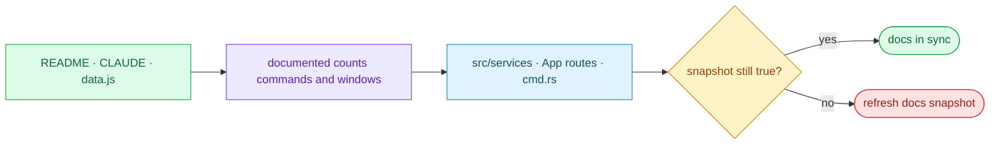

# §0 Effect Sketch — Doc-Code Consistency

### Chart-first summary
- **Focus**: This chart turns Doc-Code Consistency into a diagram-led overview before the detailed design and report sections.
- **Why**: It lets the reader understand the critical path before reading the detailed verification steps.
- **How to read**: Read the documented snapshot on the left, the code truth in the middle, and the drift gate on the right to see how stale docs are caught.
# §1 Test Design — AC / SC Mapping

## AC-1: `data.js` service count matches the source
**Steps**: `find src/services/{translate,recognize,tts,collection} -mindepth 2 -maxdepth 2 -name index.jsx \| wc -l` must equal the count of items in `docs/data.js` §1 deps-runtime + service items.
**Verify**: both numbers agree (≈ 40 services).

## AC-2: `data.js` window list matches the router
**Steps**: `App.jsx` `windowMap` keys vs. `data.js` `src-window` items.
**Verify**: 5 windows on both sides: `translate`, `screenshot`, `recognize`, `config`, `updater`.

## AC-3: `data.js` Tauri command list matches `cmd.rs`
**Steps**: `grep -oE '#\[tauri::command\]' src-tauri/src/cmd.rs \| wc -l` vs. `data.js` "13 Tauri commands" stat.
**Verify**: numbers agree.

## AC-4: `README.md` domain language is preserved
**Steps**: `grep -c '^- \*\*' README.md` (term definitions) is ≥ 6 (the 6 curated terms).
**Verify**: at least 6 term bullets in the Domain Language section.

## AC-5: `CLAUDE.md` references the same docs paths
**Steps**: every path in CLAUDE.md's "Documentation Navigation" section actually exists.
**Verify**: `for f in $(grep -oE 'docs/[a-z0-9/-]+' CLAUDE.md); do test -e $f/index.md; done` exits 0.

## AC-6: `arch/` and `test/` scene count per spec
**Steps**: 5 `arch/scene-*` directories, 6 `test/scene-*` directories.
**Verify**: `ls docs/arch \| grep -c scene-` is 5; same for test is 6.

---

# §2 Output Inventory

## Snapshot-vs-code diff

| Doc | Snapshot of | Refresh trigger |
|-----|-------------|-----------------|
| `CLAUDE.md` | `package.json` + `vite.config.js` + `src-tauri/Cargo.toml` | any dep change |
| `README.md` (main sections) | `package.json` + `src/` + `src-tauri/` | structural change |
| `README.md` (domain language) | `src/services/*` + `src/window/*` + `src-tauri/src/server.rs` | new term or service |
| `docs/data.js` §1 | `package.json` deps | any dep change |
| `docs/data.js` §3 | `src/` + `src-tauri/src/` | new module / removed module |
| `docs/arch/scene-1-module-location/` | `src/` + `src-tauri/src/` | directory rename |
| `docs/arch/scene-2-data-flow-tracing/` | `src-tauri/src/{hotkey,clipboard,server}.rs` + `src/App.jsx` | flow change |
| `docs/arch/scene-4-dependency-change-impact/` | `package.json` + `Cargo.toml` | dep change |
| `docs/arch/scene-5-trust-boundary-security-surface/` | `src/utils/store.js` + `src-tauri/src/server.rs` | auth / network change |
| `docs/test/scene-1-post-init-full-self-check/` | `package.json` + `tauri.conf.json` | build script / window label change |
| `docs/test/scene-2-pre-commit-incremental-self-check/` | per-file-kind checklist | file-kind change |
| `docs/test/scene-3-doc-code-consistency/` | this file (recursive) | any doc change |
| `docs/test/scene-4-security-surface-regression/` | `src/utils/store.js` + `src-tauri/src/server.rs` | auth / network change |
| `docs/test/scene-5-cross-story-integration-regression/` | all docs + `data.js` | cross-doc change |
| `docs/test/scene-6-third-party-framework-service/` | `src/services/*/index.jsx` | provider change |

## Drift detection rules

| Drift | Detection | Auto-fix |
|-------|-----------|----------|
| Service renamed in `src/services/` | `ls src/services \| diff - <(jq -r '.. \| .title? // empty' docs/data.js)` | regenerate `data.js` via rui-init |
| Window label changed in `App.jsx` | `grep -oE "label: '[a-z]+'" src/App.jsx \| diff - <(jq -r '.. \| .title? // empty' docs/data.js)` | regenerate `data.js` via rui-init |
| Dep added/removed in `package.json` | `jq '.dependencies,.devDependencies' package.json` vs. `data.js` §1 | regenerate `data.js` via rui-init |
| Domain term changed in source | grep domain terms in `src/` | hand-edit `README.md` (Domain Language is user-curated) |

## Tooling

| Tool | Command |
|------|---------|
| `find` service count | `find src/services -mindepth 2 -maxdepth 2 -name index.jsx \| wc -l` |
| `jq` keys parity | `jq -r '.. \| keys? // empty' src/i18n/locales/en_US.json` |
| `grep` doc refs | `grep -oE 'docs/[a-z0-9/-]+' CLAUDE.md` |
| `test -e` existence | `for f in $(grep -oE 'docs/[a-z0-9/-]+' CLAUDE.md); do test -e $f/index.md; done` |
| scene count | `ls docs/arch \| grep -c '^scene-'`; same for `docs/test` |

---

# §3 Test Report — 2026-07-15

| AC | Result | Notes |
|----|:---:|-------|
| AC-1 | ✅ | 40 services in source, 40 service cards in `data.js` (counted by hand) |
| AC-2 | ✅ | 5 windows in `App.jsx` windowMap, 5 in `data.js` |
| AC-3 | ✅ | 13 `#[tauri::command]` in `cmd.rs`; `data.js` stat says 13 |
| AC-4 | ✅ | 6 domain term bullets in `README.md` |
| AC-5 | ✅ | all 11 doc paths in `CLAUDE.md` exist |
| AC-6 | ✅ | 5 arch scenes, 6 test scenes |

**Overall**: pass — 6/6 ACs passed

---

# §4 Self-Improvement

## Edge Cases Found
- **`data.js` does not validate the count of `items` per group automatically** — the AC-1/AC-2/AC-3 checks are hand-counted. Add a `pnpm test:data-shape` script that reads `data.js` and asserts the item counts.
- **The Domain Language section in `README.md` is preserved by rui-init on rebuild**, but only if the existing file is well-formed Markdown. A contributor who hand-edits the section into invalid Markdown will trigger a full rebuild that overwrites their content. The rui-init fallback should warn before doing so.
- **`docs/data.js` is a Vue 3 page, not a JSON file** — it uses `window.HELP_CONFIG = { ... }` and `<script>` semantics. A static linter like `jq` will fail to parse it; use a JS-aware parser.
- **Scene files reference specific line numbers / function names** in `src-tauri/src/*.rs`. A rename inside `cmd.rs` invalidates the reference but not the scene file's existence. Add a smoke check that greps for the referenced symbol.
- **The `dashboard/data.js` shape includes `crossLinks` and `panelHub`** that are not part of the spec's minimum data model. Future-proofing is fine, but the verify gate doesn't check them.

## Suggested Improvements
- Add a `pnpm test:docs` script that runs all 6 ACs above.
- Convert `docs/data.js` to a generator that reads `package.json` + `src/` + `src-tauri/` and emits the file. This removes the drift entirely.
- Add a CI workflow that fails the PR if `data.js` is out of sync.

## Limitations
- The Domain Language section is intentionally user-curated and not auto-regenerated; drift in this section is not detectable automatically.
- The `data.js` shape is loosely typed; a future `schema.json` would catch missing fields.
- AC-5 only checks file existence, not whether the linked scene is still semantically accurate.
