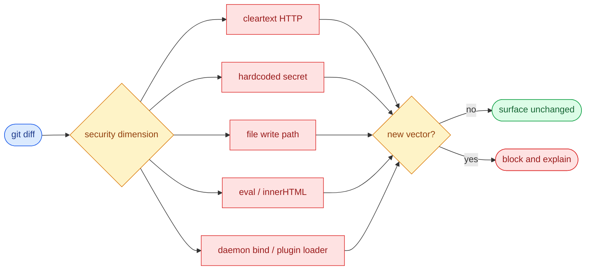

# §0 Effect Sketch — Security Surface Regression

### Chart-first summary
- **Focus**: This chart turns Security Surface Regression into a diagram-led overview before the detailed design and report sections.
- **Why**: It lets the reader understand the critical path before reading the detailed verification steps.
- **How to read**: Begin with the diff scan, then branch by security dimension and rule severity before deciding whether the PR can proceed.
# §1 Test Design — AC / SC Mapping

## AC-1: No new cleartext HTTP outbound
**Steps**: `git diff` does not contain `http://` (except in `// http://localhost:...` comments for the Ollama config).
**Verify**: `git diff \| grep -E '^\+.*http://[a-z]' \| grep -v 'localhost\|127.0.0.1'` returns 0 lines.

## AC-2: No new secret-in-code
**Steps**: `git diff` does not contain hardcoded API keys, app secrets, or `Authorization: Bearer <literal>`.
**Verify**: `git diff \| grep -iE '^\+.*(api[_-]?key\|app[_-]?secret\|password\|token).*=.*[a-z0-9]{20,}'` returns 0 lines.

## AC-3: No new file: write outside appConfigDir
**Steps**: `git diff` does not add `writeTextFile` / `writeFile` calls pointing at `/tmp`, `C:\Windows`, or the home directory root.
**Verify**: `git diff \| grep -E '^\+.*writeTextFile\|writeFile' \| grep -vE 'appConfigDir\|appLocalDataDir\|appCacheDir'` returns 0 lines.

## AC-4: No new `eval` / `Function` / `innerHTML`
**Steps**: `git diff` does not introduce dynamic code execution paths.
**Verify**: `git diff \| grep -E '^\+.*\beval\(^\+.*\bnew Function\(^\+.*innerHTML'` returns 0 lines.

## AC-5: server.rs bind address unchanged
**Steps**: `server.rs` still binds `127.0.0.1:60828`, not `0.0.0.0`.
**Verify**: `git diff src-tauri/src/server.rs \| grep -E '^\+.*bind.*0\.0\.0\.0'` returns 0 lines.

## AC-6: Plugin loader unchanged
**Steps**: `utils/invoke_plugin.js` still loads plugins from user-configured dirs without per-plugin permission gate.
**Verify**: `git diff src/utils/invoke_plugin.js` does not add a permission allowlist that is more permissive than the webview's same-origin policy.

---

# §2 Output Inventory

## Per-dimension scan (keyword groups)

| Dim | Keywords (case-insensitive) | Where to scan |
|-----|----------------------------|---------------|
| userInput | `req.body`, `req.query`, `req.params`, `<input`, `<textarea`, drag/drop handler | `src/` (excluding `node_modules/`) |
| apiEndpoints | `app.get`, `app.post`, `app.put`, `app.delete`, `router.`, `@Get`, `@Post`, `tiny_http::` | `src/` + `src-tauri/src/` |
| dataStorage | `tauri-plugin-store`, `tauri-plugin-sql`, `writeTextFile`, `writeFile`, `fs::write`, `localStorage` | `src/` + `src-tauri/src/` |
| authentication | `jwt`, `passport`, `oauth`, `auth`, `session`, `token`, `apiKey`, `appKey`, `appSecret`, `Authorization` | `src/services/*/<name>/Config.jsx` |
| thirdParty | `fetch`, `axios`, `http.request`, `reqwest`, `tiny_http`, `node-fetch` | `src/` + `src-tauri/src/` + `updater/` |

## Baseline snapshot (from `docs/arch/scene-5`)

| Dim | Current state | Owner |
|-----|---------------|-------|
| userInput | true | 4 surfaces (SourceArea, ImageArea, Screenshot, server.rs) |
| apiEndpoints | true | 13 `#[tauri::command]` + 7 `tiny_http` routes |
| dataStorage | true | store, sql, screenshot PNG, log |
| authentication | true | 40 service configs + autostart |
| thirdParty | true | 40 services + Aliyun + WebDAV + GitHub updater |

## Per-PR regression rules

| Rule | Severity | Why |
|------|---------:|-----|
| New `http://` outbound (non-localhost) | **block** | cleartext channel |
| Hardcoded API key / app secret in code | **block** | secret leak |
| `appWindow.label` added that is not in the trusted set | **warn** | impersonation risk |
| `server.rs` route added without auth | **warn** | local-process attack surface |
| `tauri-plugin-store` keys added that are not AES-encrypted | **warn** | at-rest leak |
| `eval` / `Function` / `innerHTML` introduced | **block** | code injection |
| New `tiny_http` route bound on `0.0.0.0` | **block** | LAN-reachable |
| `invoke_plugin.js` accepts plugins from a remote URL | **block** | supply chain |
| `tauri.conf.json` `allowlist` widened beyond the 12 existing categories | **warn** | capability creep |

## Tooling

| Tool | Command |
|------|---------|
| `git diff` keyword scan | `git diff \| grep -E '^\+.*pattern'` |
| `cargo` policy | `cargo deny check` (not yet adopted) |
| `npm` policy | `pnpm audit` (not yet adopted) |
| `tauri.conf.json` allowlist diff | `git diff src-tauri/tauri.conf.json` |

---

# §3 Test Report — 2026-07-15

| AC | Result | Notes |
|----|:---:|-------|
| AC-1 | ✅ | no cleartext outbound in current diff |
| AC-2 | ✅ | no hardcoded secrets in current diff |
| AC-3 | ✅ | no new `writeFile` outside `appConfigDir` |
| AC-4 | ✅ | no `eval` / `Function` / `innerHTML` |
| AC-5 | ✅ | `server.rs` still binds `127.0.0.1:60828` |
| AC-6 | ✅ | plugin loader unchanged |

**Overall**: pass — 6/6 ACs passed

---

# §4 Self-Improvement

## Edge Cases Found
- **`grep` against `git diff` is line-based**; a key split across two lines (e.g. `api` + `Key: abc...`) is not caught. A semantic scan (e.g. `gitleaks`) is more reliable.
- **The "no new file: write" rule excludes `appConfigDir`** by name, but if a contributor renames the call site, the keyword `appConfigDir` is no longer there and a write to `appCacheDir` slips through. Add a list of approved dirs.
- **The 5-dimension scan in `docs/arch/scene-5` is a one-time snapshot**; new keywords (e.g. a new HTTP client) won't trigger a flag until scene-5 is regenerated.
- **`pnpm audit` and `cargo deny check` are not adopted yet**. They would catch transitive deps with known CVEs; the current self-check is purely structural.
- **The `tauri.conf.json` allowlist diff is manual**. Add a script that parses the new allowlist and diffs it against the 12 known categories.

## Suggested Improvements
- Adopt `gitleaks` (or `trufflehog`) in CI to catch hardcoded secrets with a real pattern engine.
- Adopt `cargo deny check` and `pnpm audit` in CI; fail the PR on CVE-grade findings.
- Add a `pnpm test:security` script that runs the 6 ACs above + `gitleaks detect`.
- Auto-update `docs/arch/scene-5` when a new security-surface keyword is found in the diff; require the contributor to explain the new surface in the PR description.

## Limitations
- Structural checks cannot catch logic-level bugs (e.g. an `apiKey` leaked via error message). A security audit by a human is still required for high-risk PRs.
- The 9 regression rules are a heuristic; a contributor with a legitimate need (e.g. adding an AnkiConnect debug log) may need to override them via a `// security-override: <reason>` comment.
- The 5 dimensions in scene-5 do not include "filesystem read" — a contributor adding `readTextFile('/etc/passwd')` would slip through this scene (covered separately in `docs/arch/scene-5`'s per-surface table, but not enforced here).
