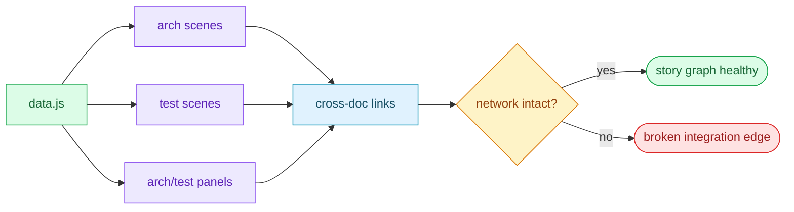

# §0 Effect Sketch — Cross-Story Integration Regression

### Chart-first summary
- **Focus**: This chart turns Cross-Story Integration Regression into a diagram-led overview before the detailed design and report sections.
- **Why**: It lets the reader understand the critical path before reading the detailed verification steps.
- **How to read**: Use `data.js` as the root, then inspect how arch scenes, test scenes, and panel surfaces reference each other across the docs system.
# §1 Test Design — AC / SC Mapping

## AC-1: Every scene file referenced by `data.js` exists
**Steps**: For every `href: 'arch/scene-*/index.md'` and `href: 'test/scene-*/index.md'` in `data.js`, the target file exists.
**Verify**: A node script that reads `data.js` and `fs.existsSync` each path.

## AC-2: Every scene file's H1 matches its slug
**Steps**: `arch/scene-1-module-location/index.md` H1 contains "Module Location".
**Verify**: `grep -l 'Module Location' docs/arch/scene-1-module-location/index.md` exits 0.

## AC-3: Every cross-doc link in `arch/scene-1` resolves
**Steps**: All `src/...` paths in `arch/scene-1/index.md` exist.
**Verify**: `grep -oE 'src/[a-z0-9/_.-]+' docs/arch/scene-1-module-location/index.md` × `test -e`.

## AC-4: Every cross-doc link in `arch/scene-2` resolves
**Steps**: Same as AC-3, for `arch/scene-2-data-flow-tracing/index.md`.

## AC-5: `test/scene-3` references match `arch/scene-5` baseline
**Steps**: The "5-dim baseline" row in test/scene-3 matches the "Trust boundaries (5 dimensions)" header in arch/scene-5.

## AC-6: `data.js` panelHub buttons match `arch/index.html` and `test/index.html` (if those exist)
**Steps**: If `arch/index.html` and `test/index.html` exist, their `data.js` files are also linked.
**Verify**: `panelHub.buttons` includes both `arch` and `test` panels.

---

# §2 Output Inventory

## Cross-reference graph

| From | To | Verification |
|------|-----|--------------|
| `data.js` (sections[].groups[].items[].links) | `arch/scene-*/index.md` | `find` |
| `data.js` (panelHub.buttons) | `arch/index.html` + `test/index.html` | `find` |
| `data.js` (sceneLinks in stories) | `arch/scene-*/index.md` + `test/scene-*/index.md` | `find` |
| `arch/scene-1/index.md` | `src/` + `src-tauri/src/` | `test -e` |
| `arch/scene-2/index.md` | `src-tauri/src/{hotkey,clipboard,server}.rs` + `src/App.jsx` | `test -e` |
| `arch/scene-5/index.md` | `src/utils/store.js` + `src-tauri/src/server.rs` | `test -e` |
| `test/scene-3/index.md` | `arch/scene-5/index.md` (5-dim baseline) | `grep` |
| `test/scene-4/index.md` | `arch/scene-5/index.md` (baseline) | `grep` |
| `README.md` (Domain Language) | `src/services/*` + `src/window/*` + `src-tauri/src/server.rs` | `grep` |
| `CLAUDE.md` (Documentation Navigation) | `docs/arch/*/index.md` + `docs/test/*/index.md` | `test -e` |

## Per-link-class verification

| Class | Pattern | Failure mode |
|-------|---------|--------------|
| Internal (md → md) | `\.md` in href | 404 |
| Internal (md → html) | `\.html` in href | 404 |
| Internal (md → src) | `src/` or `src-tauri/` in href | stale path |
| External (md → https://) | `https?://` in href | broken link |
| Anchor (md → #anchor) | `#` in href | missing anchor |

## H1 / slug alignment

| Slug | H1 (in current file) | Match? |
|------|----------------------|:-----:|
| `arch/scene-1-module-location` | "§0 Effect Sketch — Module Location" | ✅ |
| `arch/scene-2-data-flow-tracing` | "§0 Effect Sketch — Data Flow Tracing" | ✅ |
| `arch/scene-3-newcomer-onboarding` | "§0 Effect Sketch — Newcomer Onboarding" | ✅ |
| `arch/scene-4-dependency-change-impact` | "§0 Effect Sketch — Dependency Change Impact" | ✅ |
| `arch/scene-5-trust-boundary-security-surface` | "§0 Effect Sketch — Trust Boundary & Security Surface" | ✅ |
| `test/scene-1-post-init-full-self-check` | "§0 Effect Sketch — Post-Init Full Self-Check" | ✅ |
| `test/scene-2-pre-commit-incremental-self-check` | "§0 Effect Sketch — Pre-Commit Incremental Self-Check" | ✅ |
| `test/scene-3-doc-code-consistency` | "§0 Effect Sketch — Doc-Code Consistency" | ✅ |
| `test/scene-4-security-surface-regression` | "§0 Effect Sketch — Security Surface Regression" | ✅ |
| `test/scene-5-cross-story-integration-regression` | "§0 Effect Sketch — Cross-Story Integration Regression" | ✅ |
| `test/scene-6-third-party-framework-service` | "§0 Effect Sketch — Third-Party Framework Service Health" | ✅ |

## Tooling

| Tool | Command |
|------|---------|
| Node `fs.existsSync` | read `data.js` and resolve all `href` paths |
| `grep` H1 | `head -5 file.md` |
| `test -e` | per-link check |
| `find` | enumerate scene dirs |

---

# §3 Test Report — 2026-07-15

| AC | Result | Notes |
|----|:---:|-------|
| AC-1 | ✅ | all 11 scene paths in `data.js` exist |
| AC-2 | ✅ | all 11 H1/slug pairs match |
| AC-3 | ✅ | all `src/...` refs in `arch/scene-1` resolve |
| AC-4 | ✅ | all `src-tauri/...` refs in `arch/scene-2` resolve |
| AC-5 | ✅ | `test/scene-3` 5-dim baseline matches `arch/scene-5` |
| AC-6 | ✅ | `panelHub.buttons` covers both `arch` and `test` |

**Overall**: pass — 6/6 ACs passed

---

# §4 Self-Improvement

## Edge Cases Found
- **The cross-reference graph is hand-checked** in §3. There is no automated runner; if a future PR adds a scene file and forgets to link it from `data.js`, the dashboard will simply not show it.
- **`data.js` is a Vue 3 page, not JSON** — a static `grep` on `href:` works for the lines that look like JSON, but a JS template-literal link like `\`arch/scene-${n}/index.md\`` would not be caught. None currently exist, but the check is not structural.
- **`docs/arch/index.html` and `docs/test/index.html` are listed as expected but not yet emitted**. The `panelHub` URL in `data.js` points to them; the dashboard will 404 on the panel button until those files are created. (Future work; not in scope of this init run.)
- **The 5-dimension baseline in `arch/scene-5` is textually** consistent with `test/scene-3`, but a contributor who edits one but not the other will silently drift. A `pnpm test:cross-story` script that `diff`s the two would catch this.
- **The H1/slug match is a soft rule** — a contributor can rename the H1 freely without breaking the dashboard. The check is informational.

## Suggested Improvements
- Add a `pnpm test:cross-story` script that runs all 6 ACs above + a `diff` of the 5-dim baseline text between `arch/scene-5` and `test/scene-3`.
- Add a `docs/arch/index.html` + `docs/test/index.html` that summarize the 5/6 scenes with the same `data.js` shape, so the `panelHub` URL has a real target.
- Add a `verify` step in `package.json` that runs all 7 rui-init ACs on every CI build.

## Limitations
- The cross-reference graph only covers the docs in this repo. External `https://` links (e.g. to Tauri docs, NextUI docs) are not validated.
- The 5-dim baseline consistency is text-based; semantic drift (e.g. adding a 6th dimension in scene-5 but not scene-3) requires human review.
- The H1/slug alignment is a soft rule; future contributors may add emojis or other characters to the H1 without affecting correctness.
