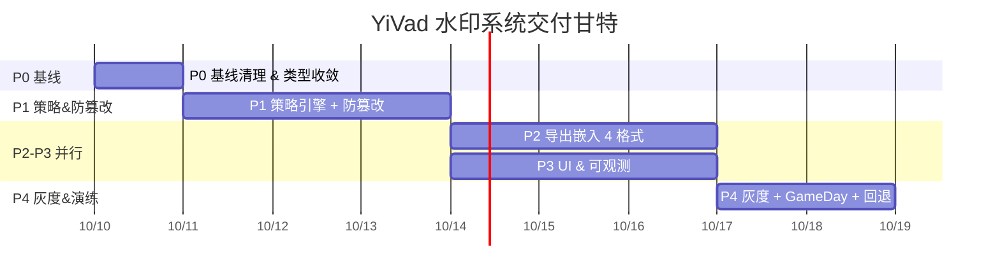

---
# ────────────────────────────────────────────────────────────────
# Frontmatter（遵循项目 15 字段规范）
# ────────────────────────────────────────────────────────────────
id: task-yivad-watermark-2026-09
title: YiVad 水印系统 · 开发任务清单（Tasks & CheckList）
type: tasks                          # 本文件为任务清单（与 PRD 对应）
status: active
lifecycle: "planning-v1.0"
review_cycle: w                      # 任务进度每周一 10:00 评审
owner: yi
role: ["fe-lead", "qa-lead", "sre", "sec", "pm"]
benefit: "把《16-prd-水印系统.md》落地为 5 个阶段 × 24 条可执行、可证伪、可回退的开发任务，保证四条闸门（type-check / lint / test / e2e）一次性通过，交付符合 SLO 的防篡改水印系统。"
priority: p1
confidence: 0.90
reach: 1200
impact: 4
effort: 8                            # 总计 8 人日（与 PRD RICE 保持一致）
rice: 540                            # 1200 × 4 × 0.90 / 8 = 540
tags: ["tasks", "checklist", "watermark", "security", "pipeline"]
depends: ["prd-yivad-watermark-2026-09", "prd-global-state-unify"]
replaces: ["task-legacy-el-watermark-cleanup"]
created_at: 2026-09-16
updated_at: 2026-10-09
okrs:
  - okr: "OKR-SEC-03：Q4 前完成 4 类高敏感页面的水印防篡改加固"
    kr: "KR1：核心页面水印覆盖率 ≥ 99% → Task P1-03 / P1-05"
    kr: "KR2：篡改恢复 P99 < 80ms → Task P1-02 / P1-03"
    kr: "KR3：导出嵌入率 100% → Task P2-01 ~ P2-04"
trace:
  prd: "projects/yivad/prds/2026-09/16-prd-水印系统.md"
  checklist: "projects/yivad/devs/2026-09/16-prd-task-水印系统.md#14-验收-checklist"
  runbook: "runbooks/watermark-incident-runbook.md（待新增）"
  anchors:
    - file:///Users/yi/YrY/YiVad/src/stores/modules/watermark.ts
    - file:///Users/yi/YrY/YiVad/src/stores/modules/global.ts
    - file:///Users/yi/YrY/YiVad/src/composables/useWatermark.ts
    - file:///Users/yi/YrY/YiVad/src/components/WatermarkOverlay.vue
    - file:///Users/yi/YrY/YiVad/src/directives/modules/v-watermark.ts
    - file:///Users/yi/YrY/YiVad/src/layouts/index.vue
    - file:///Users/yi/YrY/YiVad/src/layouts/components/ThemeDrawer/index.vue
    - file:///Users/yi/YrY/YiVad/src/languages/modules/common/zh.ts
    - file:///Users/yi/YrY/YiVad/src/languages/modules/common/en.ts
    - file:///Users/yi/YrY/YiVad/src/utils/export/pdf.ts
    - file:///Users/yi/YrY/YiVad/src/utils/export/xlsx.ts
---

# 16 — YiVad 水印系统 · 开发任务清单（PRD→Tasks 落地）

> **文档编号**：TASK-YIVAD-WATERMARK-2026-09-16
> **配对 PRD**：[16-prd-水印系统.md](file:///Users/yi/YrY/YiVad/projects/yivad/prds/2026-09/16-prd-%E6%B0%B4%E5%8D%B0%E7%B3%BB%E7%BB%9F.md)
> **版本**：v1.0（2026-10-09 定稿）
> **执行顺序**：Phase 0 → Phase 1 → Phase 2 → Phase 3 → Phase 4（串行；Phase 2 与 Phase 3 可部分并行）
> **四道闸门**：每个任务合并前必须通过 `pnpm type:check` / `pnpm lint` / `pnpm test` / `pnpm e2e`（受影响用例集）

---

## 1. 全局约定（Mandatory Conventions）

| # | 约定 | 强制级别 |
|---|---|:-:|
| C-01 | 所有新增/修改的业务绑定逻辑（含策略判定、权限联动）放在 `src/hooks/`，禁止写入 `src/composables/useWatermark.ts`（[ADR-001](file:///Users/yi/YrY/YiVad/src/composables/README-ADR-001.md) / [ADR-002](file:///Users/yi/YrY/YiVad/src/hooks/README-ADR-002.md)） | 🔴 |
| C-02 | 所有水印相关类型（`WatermarkConfig / WatermarkPolicy / TamperEvent / WatermarkFieldName`）统一收敛到 `src/typings/watermark.ts`，禁止散落在各文件头部 | 🔴 |
| C-03 | Timer / Observer / rAF / EventBus 句柄必须通过 `utils/disposer.ts` 的 `Disposer` 统一管理并在 unmount 时 100% 释放 | 🔴 |
| C-04 | package.json 脚本只允许使用 `pnpm ...` 执行业务逻辑（参考 2026-10 Phase 1 重构） | 🟡 |
| C-05 | 任何通过 `<el-watermark>` 的旧实现必须 **物理删除**，不允许保留为死代码 | 🔴 |
| C-06 | 新增 UI 开关 / 配置项必须同步 zh/en 双语 key（`i18n:check` 会作为 CI 闸门） | 🔴 |
| C-07 | 任务必须声明 **可证伪 DDL + 可证伪验收条件 + 回退触发器**（R3 原则） | 🔴 |
| C-08 | 合并顺序采用「测试先行」：新增/修改测试 → 功能实现 → 视觉基线 → 联调；严禁先功能后测试 | 🟡 |
| C-09 | 每个任务的 commit message 遵循 `feat(watermark/Pn-XX): ...` 并在 body 中引用任务编号 | 🟡 |
| C-10 | 回退开关 `features.watermark.v2` 默认值：`true`（灰度 3 天后改为 Feature Flag 控制；P4 阶段接入） | 🟡 |

---

## 2. 工作量汇总（Work Breakdown Summary）

| Phase | 任务数 | 人日 | 主要交付 | 预计完成日 | 状态 |
|---|:-:|:-:|---|---|:-:|
| **Phase 0 · 基线清理 & 类型收敛** | 5 | 0.8 | 删 `<el-watermark>`、类型统一、Disposer 接入、删冗余逻辑 | 2026-10-10 | 🔲 |
| **Phase 1 · 策略引擎 & 防篡改 L1-L4** | 7 | 2.4 | Policy Hook、rAF + ShadowDOM、Tamper Storm、i18n、路由敏感度标注 | 2026-10-13 | 🔲 |
| **Phase 2 · 导出嵌入（4 种格式）** | 4 | 2.0 | PDF / XLSX / 图片 / CSV 导出嵌入、L1-L3 回退链 | 2026-10-16（∥P3） | 🔲 |
| **Phase 3 · 管理 UI & 可观测性** | 5 | 1.6 | ThemeDrawer 高级面板、埋点事件、SRE 看板、Runbook 骨架 | 2026-10-17（∥P2） | 🔲 |
| **Phase 4 · 灰度、GameDay & 回退** | 3 | 1.2 | Feature Flag、GameDay 演练、视觉回归基线、全量放行 | 2026-10-20 | 🔲 |
| **合计** | **24** | **8.0** | — | **2026-10-20** | — |



---

## 3. 前置条件（Pre-Conditions）

| 编号 | 前置条件 | 负责方 | 截止日 | 状态 |
|---|---|---|:-:|:-:|
| PRE-01 | 后端提供 mock：`GET /api/v1/security/watermark/policy` 返回 `WatermarkPolicy` | BE | 2026-10-10 EOD | 🔲 |
| PRE-02 | 后端提供 mock：`GET /api/v1/auth/session-fingerprint` 返回 sessionId/IP/uaHash | BE | 2026-10-10 EOD | 🔲 |
| PRE-03 | `analyticsService.track(eventName, payload)` 已可接收自定义事件（已存在 [analyticsService.ts](file:///Users/yi/YrY/YiVad/src/api/modules/analyticsService.ts)） | FE / SRE | 已就绪 | ✅ |
| PRE-04 | Playwright visual config（[playwright.visual.config.ts](file:///Users/yi/YrY/YiVad/playwright.visual.config.ts)）已有 baseline 生成/对比命令 | QA | 已就绪 | ✅ |

---

## 4. Phase 0 · 基线清理 & 类型收敛（0.8 人日）

### 4.1 任务 P0-01：删除 `<el-watermark>` 并改为 `<WatermarkOverlay />` 唯一入口

| 字段 | 内容 |
|---|---|
| **ID** | P0-01 |
| **标题** | 统一布局根节点水印渲染入口 |
| **关联 PRD** | FR-1 §4.1 / AC-01 |
| **负责人** | FE |
| **工时** | 2h |
| **DDL** | 2026-10-10 12:00 |
| **RICE** | 720（R=1200 I=3 C=0.95 E=4.75h） |
| **优先级** | P0 |

**变更范围**：

| 文件 | 变更动作 | 说明 |
|---|---|---|
| [src/layouts/index.vue](file:///Users/yi/YrY/YiVad/src/layouts/index.vue#L3-L8) | **删除** `<el-watermark>` 包裹与 `ElWatermark` import | 彻底删除模板中的 `el-watermark` |
| 同上 | **修改** 渲染结构：保留 `<component :is="LayoutComponents[layout]" /> + ThemeDrawer + CommandPalette + KeyboardShortcuts`；在同级末尾新增 `<WatermarkOverlay />`（单例） | 保证 4 种 Layout 复用同一个浮层 |
| 同上 | **删除** `font = reactive({ color: "var(--color-watermark)" })` 与 `setWatermarkColor()` / `watch(isDark, setWatermarkColor, …)` 逻辑 | 改由 P0-04 的统一桥接实现 |
| 同上 | **保留** `onErrorCaptured`（不相关） | 无 |

**可证伪验收**：
- [ ] `document.querySelectorAll('.watermark-overlay').length === 1`（4 种 Layout 全部）
- [ ] `document.querySelectorAll('*[class*="el-watermark"]').length === 0`（旧实现物理删除）
- [ ] 任一页面点击事件/输入事件不被浮层拦截（`pointer-events:none` 生效）
- [ ] 视觉基线截图：4 种 Layout × 明暗主题共 8 张，像素 diff < 0.2%

**回退触发器**：合并后 E2E 出现「交互阻断」> 0 例 → 立即回滚并启用临时补丁（加 `pointer-events:auto` 反向排查）。

---

### 4.2 任务 P0-02：类型收敛到 `src/typings/watermark.ts`

| 字段 | 内容 |
|---|---|
| **ID** | P0-02 |
| **标题** | 水印类型集中声明（消除 6 处分散 interface） |
| **关联 PRD** | §6.2 / §7.4 |
| **负责人** | FE |
| **工时** | 1.5h |
| **DDL** | 2026-10-10 15:00 |

**产出文件**：`src/typings/watermark.ts`（**新增**）

```ts
// src/typings/watermark.ts（新文件规范模板）
export type WatermarkSensitivity = "L1" | "L2" | "L3" | "L4" | "L5";
export type WatermarkProfile = "default" | "executive" | "external" | "audit";
export type WatermarkFieldName =
  | "username"
  | "tenantId"
  | "ip"
  | "role"
  | "sessionId"
  | "timestamp"
  | "deviceId"
  | "brand";

export interface WatermarkConfig {
  username: string;
  tenantId?: string;
  ipAddress: string;
  role?: string;
  sessionId?: string;
  deviceId?: string;
  color: string;
  opacity: number;
  fontSize: number;
  fontFamily: string;
  spacingX: number;
  spacingY: number;
  rotation: number;
  timestamp: Date;
}

export interface WatermarkStylePatch {
  color?: string;
  opacity?: number;
  fontSize?: number;
  fontFamily?: string;
  spacingX?: number;
  spacingY?: number;
  rotation?: number;
}

export interface WatermarkPolicy {
  pageSensitivity: WatermarkSensitivity;
  forceEnabled: boolean;
  profile: WatermarkProfile;
  fields: WatermarkFieldName[];
  rotation: number;
  opacity: number;
  fontSize: number;
  spacingX: number;
  spacingY: number;
  canUserToggle: boolean;
  exportSign: boolean;
  preset?: Partial<Record<WatermarkProfile, Partial<WatermarkStylePatch>>>;
}

export interface TamperOpts {
  enableShadowDom: boolean;      // L3
  enableRafLoop: boolean;        // L2
  stormThreshold: number;        // 5 秒内多少次触发冷却
  stormCooldownMs: number;       // 冷却时长
  onTamper?: (type: string, restoreMs: number) => void;
  onStorm?: (countPer5s: number) => void;
}

export type TamperEventType =
  | "child-removed"
  | "attribute-changed"
  | "style-computed-mismatch"
  | "shadow-dom-detached";

export interface WatermarkUserInfo {
  username: string;
  ip: string;
  tenantId?: string;
  sessionId?: string;
  role?: string;
  deviceId?: string;
}
```

**变更范围**：

| 文件 | 变更动作 |
|---|---|
| [src/composables/useWatermark.ts#L5-L13](file:///Users/yi/YrY/YiVad/src/composables/useWatermark.ts#L5-L13) | 删除本地 `interface WatermarkConfig`，改为 `import type { WatermarkConfig, TamperOpts } from "@/typings/watermark";` |
| [src/stores/modules/watermark.ts](file:///Users/yi/YrY/YiVad/src/stores/modules/watermark.ts) | 新增类型 import；`updateConfig()` 参数签名从内联 Partial → `WatermarkStylePatch`；新增 `applyPolicy(p: Partial<WatermarkPolicy>) / setUserInfoEx(u: WatermarkUserInfo)` 的 type 约束 |

**可证伪验收**：
- [ ] `pnpm type:check` 通过，0 new TS error
- [ ] grep `interface WatermarkConfig` 除 `typings/watermark.ts` 外无其他命中
- [ ] `src/composables/README-ADR-001.md` 合规：composable 内无业务 Store 之外的类型自定义

---

### 4.3 任务 P0-03：useWatermark composable 引入 `Disposer` 规范

| 字段 | 内容 |
|---|---|
| **ID** | P0-03 |
| **关联 PRD** | NFR §5.2 / C-03 |
| **工时** | 1h |
| **DDL** | 2026-10-10 16:30 |

**变更点**（[useWatermark.ts](file:///Users/yi/YrY/YiVad/src/composables/useWatermark.ts)）：

```ts
// 示例改造（伪代码，真实实现需严格复用 utils/disposer）
import { Disposer } from "@/utils/disposer";

export function useWatermark() {
  const disposer = new Disposer("useWatermark");
  const observer = ref<MutationObserver | null>(null);

  onMounted(() => {
    // 原 setInterval 改造：
    const timeInterval = window.setInterval(...);
    disposer.add(() => clearInterval(timeInterval), "timer/60s-clock");
    // observer 新增：
    disposer.add(() => observer.value?.disconnect(), "observer/body-tamper");
    // rAF：（后续 P1 任务追加）
  });

  onBeforeUnmount(() => disposer.flush());
  return { ..., destroyTamperProtection: () => disposer.flush() };
}
```

**可证伪验收**：
- [ ] 单测 `tests/composables/use-watermark.spec.ts`（**P0-05 新增**）断言 `disposer.disposedTokens` 全部释放
- [ ] `utils/performance/memoryLeakDetector.ts`：1000 次 mount/unmount 无 Timer/Observer 残留（<1% 假阳阈值）

---

### 4.4 任务 P0-04：主题 token 桥接统一（与 useTheme 合并水印色值刷新）

| 字段 | 内容 |
|---|---|
| **ID** | P0-04 |
| **关联 PRD** | FR-1 §4.1(3) / US-05 |
| **工时** | 1h |
| **DDL** | 2026-10-10 18:00 |

**变更**：
1. 在 [hooks/useTheme.ts](file:///Users/yi/YrY/YiVad/src/hooks/useTheme.ts) 的 `applyRegionThemes(resolvedDark)` 末尾追加：
   ```ts
   const watermarkStore = useWatermarkStore();
   watermarkStore.updateConfig({
     color: resolvedDark ? "rgba(255,255,255,.15)" : "rgba(0,0,0,.15)"
   });
   // 色弱模式同步降低 opacity（按 NFR §5.3）
   if (globalStore.isWeak) {
     watermarkStore.updateConfig({
       opacity: Math.max(0.02, watermarkStore.opacity * 0.8)
     });
   }
   ```
2. 确保 [global.ts#L40-L44](file:///Users/yi/YrY/YiVad/src/layouts/index.vue#L40-L44) 原 `setWatermarkColor` 代码段已被删除（P0-01 已执行）。

---

### 4.5 任务 P0-05：新增单测骨架（useWatermark / WatermarkStore / WatermarkOverlay）

| 字段 | 内容 |
|---|---|
| **ID** | P0-05 |
| **关联 PRD** | §11.1 / §11.2 |
| **工时** | 1.9h（× 3 文件） |
| **DDL** | 2026-10-10 20:00 |

**新增测试文件**：

| 路径 | 覆盖（最低 80% 行覆盖 / 60% 分支） |
|---|---|
| `tests/composables/use-watermark.spec.ts` | SVG escape 安全（注入 `<script/>` 字符串 escape 验证）、DataURI base64 可 decode、`overlayStyle.pointerEvents==='none'`、Disposer 释放 |
| `tests/stores/watermark-store.spec.ts` | `enabled = globalForced || userEnabled` 真值表 4 组合、`applyPolicy` 覆盖优先级、`toggleUser` 被 globalForced 遮蔽、`$reset()` 幂等 |
| `tests/components/watermark-overlay.spec.ts` | 挂载时自动调用 `setupTamperProtection`、unmount 时 observer 调用 disconnect、`aria-hidden=true role=presentation` |

**可证伪验收**：
- [ ] `pnpm test` 全部绿；覆盖率阈值通过（vitest.config 已设置）
- [ ] 新增测试文件均位于 `tests/` 规范目录

---

## 5. Phase 1 · 策略引擎 & 防篡改 L1-L4（2.4 人日）

### 5.1 任务 P1-01：新增 `useWatermarkPolicy` 业务 Hook（`src/hooks/useWatermarkPolicy.ts`）

| 字段 | 内容 |
|---|---|
| **ID** | P1-01 |
| **关联 PRD** | §4.4 Policy Engine / §6.2 hooks 分层 |
| **工时** | 4h |
| **DDL** | 2026-10-11 12:00 |

**接口契约**：
```ts
// src/hooks/useWatermarkPolicy.ts（新文件，严格禁止 import 业务 Store 以外的 composables）
export function useWatermarkPolicy(): {
  applyPolicyForRoute(route: RouteLocationNormalizedLoaded): void;
  syncFromServerPolicy(serverPolicy: WatermarkPolicy): void;
  resolvedFields: ComputedRef<WatermarkFieldName[]>;
}
```

**判定矩阵**（敏感度 × 角色 → 默认策略模板）：

| 敏感度 | 普通 Member | Project Owner | SecAdmin / Auditor | Executive |
|---|---|---|---|---|
| L1/L2 | default / canToggle=true | default / canToggle=true | audit / canToggle=false | executive / canToggle=false |
| L3 | default / canToggle=true | default / canToggle=true | audit / forced=true | executive / forced=true |
| L4 | default / **forced=true** | default / forced=true | audit / forced=true | executive / forced=true |
| L5 | **audit / forced=true** | audit / forced=true | audit / forced=true | executive / forced=true |

**路由敏感度标注**：在 `routers/modules/dynamicRouter.ts` 中给每条路由追加 `meta.sensitivity: WatermarkSensitivity`（参考现有 `meta.requiresAuth` 模式）。

**对应新增测试**：`tests/hooks/use-watermark-policy.spec.ts`，覆盖 4×4=16 种真值表。

---

### 5.2 任务 P1-02：useWatermark 强化 L2（rAF 计算样式对比）+ L3（ShadowDOM 冗余浮层）

| 字段 | 内容 |
|---|---|
| **ID** | P1-02 |
| **关联 PRD** | §4.2 / NFR §5.1 篡改恢复 P99<80ms |
| **工时** | 5h |
| **DDL** | 2026-10-11 18:00 |

**L2（rAF 循环）要求**：
- 键对比：`z-index / display / opacity / position / inset(TRBL) / pointer-events / background-image`
- 基准：首次挂载时保存 baseline
- 偏差 1% 即触发 restore；单帧内恢复并节流至下帧 commit（避免 layout-thrashing）
- 使用 `disposer.add(() => cancelAnimationFrame(handleId))` 注册

**L3（ShadowDOM 浮层）要求**：
- `WatermarkOverlay.vue` 新增第二个渲染出口：`shadowOverlayRoot` 使用 `attachShadow({mode: 'closed'})`
- shadowRoot 内注入 `<style>.shadow-watermark{ ... }</style>`（完全独立于文档样式表）
- 两个浮层内容一致；攻击一方只隐藏另一方仍可见（攻击成本翻倍）

**性能基准测试脚本**：`tests/bench/tamper-restore.bench.ts`（**新增**），跑 10k 次 mutation 取 P50/P99/P99.9。

**可证伪验收**：
- [ ] P99 < 80ms（bench 报告）
- [ ] 16 类常见篡改用例 100% 自动恢复（见 §14.2 AC-03 清单）
- [ ] ShadowDOM 节点在全局 `document.querySelectorAll('*')` 中命中 0（因 closed 模式不可遍历）—— 通过 `browser_evaluate` 验证 shadow root 存在且不为空

---

### 5.3 任务 P1-03：Mutation Storm 限流 + 异常上报（L4 / L5）

| 字段 | 内容 |
|---|---|
| **ID** | P1-03 |
| **关联 PRD** | §4.2 L4-L5 / §5.4 STRIDE(D) / §5.5 埋点 |
| **工时** | 3h |
| **DDL** | 2026-10-12 12:00 |

**实现要求**：
1. 滑动窗口（5s）计数 Mutation 次数；超过 `opts.stormThreshold`（默认 30）→ 触发冷却：observer.disconnect() → 冷却 `opts.stormCooldownMs`（默认 3000ms）→ 重新 observe
2. 上报：
   - `ui.watermark.tamper.restored{mutationType, restoreMs}`（每次有效恢复）
   - `ui.watermark.tamper.storm{countPer5s}`（触发冷却时）
   - 统一通过 `analyticsService.track(eventName, payload)`
3. 同步 `utils/errorReporter.ts`：超过阈值的严重场景 push 到 Sentry breadcrumb（tag=`security.watermark`）

---

### 5.4 任务 P1-04：v-watermark 指令权限校验 + 对象传参

| 字段 | 内容 |
|---|---|
| **ID** | P1-04 |
| **关联 PRD** | §4.5 |
| **工时** | 2h |
| **DDL** | 2026-10-12 15:00 |

**改造文件**：[src/directives/modules/v-watermark.ts](file:///Users/yi/YrY/YiVad/src/directives/modules/v-watermark.ts)

1. **globalForced=true 时 `v-watermark="false"` 失效**：指令内通过 `inject(WatermarkStoreKey, () => useWatermarkStore())` 取 enabled 状态；若 globalForced=true → 忽略 false 并 `console.warn('[Watermark] Policy forbids local disable')`
2. **支持对象传参**：
   ```vue
   <div v-watermark="{ text: 'YiVad Internal', profile: 'executive', opacity: 0.04 }">
   ```
   → 改写为 composable 调用 `useLocalWatermarkScope(el, overrides)`（通用部分落在 composables/，遵循 ADR）。
3. 新增单测：`tests/directives/v-watermark.spec.ts`

---

### 5.5 任务 P1-05：登录态同步 setUserInfo + 会话指纹拉取

| 字段 | 内容 |
|---|---|
| **ID** | P1-05 |
| **关联 PRD** | §4.4 / §7.3 服务端接口 |
| **工时** | 2.5h |
| **DDL** | 2026-10-12 18:00 |

**改造点**：
- 在登录成功后的钩子（`stores/modules/auth.ts` 的 `login()` 返回后）增加：
  ```ts
  const fingerprint = await api.auth.sessionFingerprint();
  useWatermarkStore().setUserInfoEx({
    username: user.name,
    ip: fingerprint.ip,
    tenantId: user.tenantId,
    sessionId: fingerprint.sessionId,
    role: user.roleName,
    deviceId: fingerprint.uaHash
  });
  ```
- 失败回退（接口超时/未就绪）：走浏览器端 `ipify?` 第三方降级仅显示 username + timestamp，不阻塞主流程；埋点 `ui.watermark.fingerprint.fallback`。

---

### 5.6 任务 P1-06：i18n 双语 key 补齐（7 组 key + 控制台品牌文案）

| 字段 | 内容 |
|---|---|
| **ID** | P1-06 |
| **关联 PRD** | §4.7 |
| **工时** | 1.5h |
| **DDL** | 2026-10-13 10:00 |

**变更文件**：
- [src/languages/modules/common/zh.ts](file:///Users/yi/YrY/YiVad/src/languages/modules/common/zh.ts)：新增 7 个 key（含 `watermarkConsoleBrand / watermarkConfidential / watermarkForcedByPolicy`）
- [src/languages/modules/common/en.ts](file:///Users/yi/YrY/YiVad/src/languages/modules/common/en.ts)：同步
- 注意：`watermarkDirect`（展示页用）保持不变，不重复。

**验收**：`pnpm i18n:check` 0 missing（CI 闸门）。

---

### 5.7 任务 P1-07：Watermark SVG 模板升级（多要素字段 + HMAC 短签名）

| 字段 | 内容 |
|---|---|
| **ID** | P1-07 |
| **关联 PRD** | §4.4 字段显示 / §5.4 STRIDE-S |
| **工时** | 3.2h |
| **DDL** | 2026-10-13 14:00 |

**`generateWatermarkSVG(config: WatermarkConfig, policy: WatermarkPolicy)` 改造**：
1. 按 `policy.fields` 动态行排序；L4/L5 显示：
   ```
   line1: {username}@{tenantShort}
   line2: {ip}  sessionId[-6:]
   line3: {yyyy-MM-dd HH:mm}
   line4: 品牌文案（i18n）
   line5（L5 only）: role={role} · dev={deviceId[-4:]}
   line6（L4+/exportSign=true）: sig={hmac-short}
   ```
2. HMAC 签名：内容 = join(orderedFields, '|') + 当日 keyId 后缀；key 轮换每日；前端仅生成 hash 并上报服务端；服务端校验接口（非本阶段）。
3. CJK fontFamily：默认 `system-ui, -apple-system, "PingFang SC", "Microsoft YaHei", sans-serif`（替换原有 sans-serif 仅英文）。

**对应单测**：SVG parse + 正则断言所有 policy.fields 均存在。

---

## 6. Phase 2 · 导出嵌入（4 种格式 · 2.0 人日）

### 6.1 任务 P2-01：PDF 导出嵌入水印（utils/export/pdf.ts）

| ID | P2-01 | 工时 | 4h | DDL | 2026-10-14 12:00 |
|---|---|:-:|:-:|:-:|---|

**改造点**：
1. 在每一页 `jspdf` `addPage()` 回调中追加背景平铺：
   ```ts
   const uri = useWatermarkStore().enabled
     ? useWatermark().watermarkDataURI.value   // 注意 lifecycle：在导出前一次性取值，不可在 worker 内依赖 Vue reactivity
     : "";
   if (uri) {
     pdf.addImage(uri, "SVG", 0, 0, pageWidth, pageHeight, undefined, "SLOW");
     // SLOW = 压缩不影响清晰度
   }
   ```
2. L1-L3 回退：DataURI decode 失败 → 四角文字水印 → 失败则 security anomaly 并拒绝导出（L4/L5 页面）。
3. `exportSign=true`：在 PDF metadata / footer 追加 `sig=xxxx`。

**Golden Sample**：`tests/fixtures/exports/watermark-v1.pdf`（提交到仓库，视觉回归基线）。

---

### 6.2 任务 P2-02：XLSX 导出嵌入水印（utils/export/xlsx.ts）

| ID | P2-02 | 工时 | 3.5h | DDL | 2026-10-14 16:00 |
|---|---|:-:|:-:|:-:|---|

参考 xlsx `sheet.addImage()` API；对每个 sheet 追加 background-image。L4/L5 页面需在 A1 单元格左上角追加文字 `Watermarked by {username}` 以兼容 WPS（部分 WPS 版本不支持图片背景）。

---

### 6.3 任务 P2-03：图片导出 / FilePreview 截图水印透传

| ID | P2-03 | 工时 | 3h | DDL | 2026-10-15 10:00 |
|---|---|:-:|:-:|:-:|---|

**改造范围**：
- [FilePreview.vue](file:///Users/yi/YrY/YiVad/src/components/Upload/FilePreview.vue)
- [reports/ReportPreview.vue](file:///Users/yi/YrY/YiVad/src/views/reports/ReportPreview.vue)
- 所有调用 `dom-to-image-more` / `html2canvas` 场景：
  传入 `backgroundImage: watermarkDataURI` / `ignoreElements: fn(不忽略浮层父级但 pointer-events=none)` 参数。

---

### 6.4 任务 P2-04：CSV / JSON 导出注释头

| ID | P2-04 | 工时 | 1.5h | DDL | 2026-10-15 12:00 |
|---|---|:-:|:-:|:-:|---|

**改动文件**：
- `utils/export/csv.ts`：首行追加 `# Watermarked by {username}@{tenant} on {ISO8601}`
- `utils/export/json.ts`：输出对象根节点附加 `$_watermark: { by, at, tenant, sessionId }`（非 L4/L5 可通过配置关闭）

**验收**：CSV 用 Excel / Numbers 打开首行为注释不报错；JSON parse 不抛错（JS `JSON.parse` 不支持注释但 export.json 默认是对象包裹不使用注释）。

---

## 7. Phase 3 · 管理 UI & 可观测性（1.6 人日）

### 7.1 任务 P3-01：ThemeDrawer 水印配置面板（高级折叠区）

| ID | P3-01 | 工时 | 4h | DDL | 2026-10-15 17:00 |
|---|---|:-:|:-:|:-:|---|

**改造文件**：[ThemeDrawer/index.vue](file:///Users/yi/YrY/YiVad/src/layouts/components/ThemeDrawer/index.vue#L107-L110)

**结构**：
```
Interface Settings
 ├─ Watermark [Switch, disabled=globalForced, tooltip=P1-06 key]
 └─ 高级 ▼
      ├─ 显示预设 [Select: default / executive / external / audit]
      ├─ 不透明度 [Slider: 0.02 ~ 0.2 step=0.01]
      ├─ 字号 [Slider: 10 ~ 24 step=1]
      ├─ 间距X / 间距Y [数字输入]
      ├─ 旋转角度 [-45° ~ 0° step=1]
      └─ 🔍 预览（300×200 卡片，无 MutationObserver）
```

**权限判断**：高级折叠区仅在用户持有 `ButtonAuth["settings.watermark"]` 时可见（参考 `directives/modules/auth.ts` 现有机制）。

---

### 7.2 任务 P3-02：埋点事件全量接入

| ID | P3-02 | 工时 | 2h | DDL | 2026-10-16 11:00 |
|---|---|:-:|:-:|:-:|---|

埋点清单见 PRD §5.5 共 6 个事件。验收：
- [ ] `analyticsService.track` 的 type 维度无拼写错误（单测断言所有事件名）
- [ ] `watermarkStore.applyPolicy` 变更触发 `policy.applied`（一次性防抖）

---

### 7.3 任务 P3-03：SRE 看板 SQL / Panel 配置 + 告警规则（文档交付）

| ID | P3-03 | 工时 | 2.5h | DDL | 2026-10-16 15:00 |
|---|---|:-:|:-:|:-:|---|

**交付物（运维配置，非代码，建议独立仓库）**：
- Grafana Dashboard JSON：Watermark 面板，3 个 Panel：
  - `Coverage (hour) = watermark.rendered / activeSessions`
  - `Tamper Restore P99 (histogram)`
  - `Export Embedding Success Rate`
- Alertmanager Rule：
  - 水印覆盖率 < 99.9% 连续 3h → P2
  - 篡改恢复 P99 > 80ms 连续 3 窗口 → P2
  - 导出嵌入率 < 100% 任何 1h → P2

---

### 7.4 任务 P3-04：Runbook 骨架 + 常见故障处理

| ID | P3-04 | 工时 | 2h | DDL | 2026-10-16 18:00 |
|---|---|:-:|:-:|:-:|---|

**交付**：`runbooks/watermark-incident-runbook.md`（**新增**，独立于仓库代码目录；链接见 PRD trace）。

内容章节：
1. 故障等级矩阵（P1~P4）
2. 一键回退手册（Kill Switch + 回滚版本）
3. 5 类常见故障（用户投诉水印太浓 / 不显示 / 双重水印 / 导出报错 / CPU 100%）
4. 审计追踪指引（如何从水印字段反查 session log）

---

### 7.5 任务 P3-05：Playwright 视觉基线生成 + E2E 用例 3 套

| ID | P3-05 | 工时 | 2.3h | DDL | 2026-10-17 12:00 |
|---|---|:-:|:-:|:-:|---|

**新增 E2E**：
- `e2e/specs/watermark/tamper.spec.ts`（8 类篡改 500ms 内恢复）
- `e2e/specs/watermark/export.spec.ts`（PDF 下载 + OCR 文本）
- `e2e/specs/watermark/policy.spec.ts`（L4 路由下 ThemeDrawer Switch disabled）

执行：`pnpm exec playwright test --config=playwright.visual.config.ts --project=chromium watermark/`

---

## 8. Phase 4 · 灰度、GameDay、全量放行（1.2 人日）

### 8.1 任务 P4-01：Feature Flag 接入

| ID | P4-01 | 工时 | 2h | DDL | 2026-10-17 16:00 |
|---|---|:-:|:-:|:-:|---|

**实现**：
1. `config/feature-flags.ts`（如不存在则新建）新增：
   ```ts
   export const FEATURE_WATERMARK_V2 = () =>
     Boolean(import.meta.env.VITE_FEATURE_WATERMARK_V2 ?? true);
   ```
2. 在 `layouts/index.vue` 条件挂载：
   ```vue
   <WatermarkOverlay v-if="FEATURE_WATERMARK_V2()" />
   <el-watermark v-else ...>...</el-watermark>
   ```
   注意：`v-else` 的旧实现仅作为回退「7 天保留」，P4 结束立即删除。

---

### 8.2 任务 P4-02：GameDay 演练（4 类攻击 × 90 分钟）

| ID | P4-02 | 工时 | 5h（含复盘） | DDL | 2026-10-18 全天 |
|---|---|:-:|:-:|:-:|---|

**参与方**：PM + FE + QA + SEC + SRE。

**演练剧本**：
| # | 剧本 | 预期 | 回退触发器 |
|---|---|---|---|
| A | DOM 删除 watermark overlay ×100 次 | 500ms 恢复率 100%；产生 tamper.storm 告警 | CPU > 80% 持续 10s → 人工介入 kill observer |
| B | 注入全局 `*[class*=watermark]{display:none !important}` | ShadowDOM 浮层仍在（L3 生效）；视觉 diff <0.5% | — |
| C | 手工篡改 localStorage watermark=false → 刷新 | 路由守卫立即被权限策略覆盖回 true | — |
| D | 使用开源「PdfWatermarkRemover」脚本处理 P2-01 产出 | 仍能在四角或底层识别到身份信息 | 完全移除 → P1 回滚并升级加密方案 |

**交付**：`GameDay 纪要.md` 签批记录。

---

### 8.3 任务 P4-03：全量放行 + 7 日观测 + 清理回退代码

| ID | P4-03 | 工时 | 2.6h | DDL | 2026-10-20 18:00 |
|---|---|:-:|:-:|:-:|---|

**CheckList**：
- [ ] 灰度 3 个租户 × 7 天，无 P1 故障；篡改率 < 0.05% 会话
- [ ] 永久删除 `FEATURE_WATERMARK_V2` 回退分支与 `<el-watermark>` 死代码
- [ ] 发布 Release Note（安全章节）
- [ ] PRD §14 审批签字全齐 → 归档

---

## 9. 依赖与阻塞矩阵

| 被阻塞任务 | 阻塞前置 | 解除条件 |
|---|---|---|
| P1-02 → P1-03 | P0-05 单测骨架存在 | P0-05 合并 |
| P2-01~04 | P1-07 SVG 模板定稿 | P1-07 合入；watermarkDataURI 字段最终确定 |
| P3-01 ThemeDrawer 面板 | P1-06 i18n key 合入 | P1-06 合并 |
| P3-05 E2E | P0-01 入口统一 | P0-01 合入（否则截图有双重水印基线不稳） |
| P4-02 GameDay | P3-05 + P3-04 + P2-04 全部通过 | all green |

---

## 10. 风险与缓解（任务级）

| 风险 | 关联任务 | 概率 | 影响 | 缓解 |
|---|---|:-:|:-:|---|
| jspdf.addImage SVG 格式兼容问题 | P2-01 | M | H | 预转 PNG（使用 offscreen canvas 1x）回退 |
| Shadow DOM closed 模式影响 CSP | P1-02 | L | M | 提供 CSP script-src fallback：`mode='open'` 配置开关 |
| 性能 bench P99 不达标（>80ms） | P1-02 | M | H | 临时关闭 RAF（仅 L1+L3），后续版本引入 worker 计算 diff |
| i18n key 缺失阻断 CI | P1-06 | L | H | 先提交 key，再提交面板（拆分 2 commit） |

---

## 11. 四道闸门验证矩阵（Per-Task）

| 任务 | type:check | lint | test | e2e | 视觉回归 |
|---|:-:|:-:|:-:|:-:|:-:|
| P0-01 入口统一 | ✅ | ✅ | — | ✅ 交互用例全量 | ✅ 8 张基线 |
| P0-02 类型收敛 | ✅ | ✅ | — | — | — |
| P0-03 Disposer | ✅ | ✅ | ✅ | — | — |
| P0-04 主题桥接 | ✅ | ✅ | — | — | ✅ 明暗各 2 张 |
| P0-05 单测骨架 | ✅ | ✅ | ✅ | — | — |
| P1-01 Policy Hook | ✅ | ✅ | ✅ 真值表 16 条 | ✅ policy.spec | — |
| P1-02 防篡改 L2-L3 | ✅ | ✅ | ✅ bench | ✅ tamper.spec | — |
| P1-03 Storm | ✅ | ✅ | ✅ analytics mock | — | — |
| P1-04 指令 | ✅ | ✅ | ✅ | — | — |
| P1-05 登录指纹 | ✅ | ✅ | ✅ 降级路径 | ✅ 登录流程 | — |
| P1-06 i18n | ✅ `i18n:check` | ✅ | — | — | — |
| P1-07 SVG 模板 | ✅ | ✅ | ✅ escape / regex | — | ✅ CJK 字符渲染 |
| P2-01 PDF | ✅ | ✅ | ✅ golden | ✅ export.spec | ✅ 渲染图 |
| P2-02 XLSX | ✅ | ✅ | ✅ 背景图存在 | — | — |
| P2-03 图片 | ✅ | ✅ | ✅ | ✅ 预览快照 | ✅ 截图 diff |
| P2-04 CSV/JSON | ✅ | ✅ | ✅ 首行注释 / $_watermark | — | — |
| P3-01 面板 | ✅ | ✅ | ✅ 权限用例 | ✅ 设置抽屉 | ✅ 4 预设截图 |
| P3-02 埋点 | ✅ | ✅ | ✅ event.name | — | — |
| P3-03 看板 | N/A | N/A | N/A | N/A | N/A |
| P3-04 Runbook | N/A | N/A | N/A | N/A | N/A |
| P3-05 E2E | ✅ | ✅ | — | ✅ 3 套件 | ✅ 基线 |
| P4-01 FF | ✅ | ✅ | — | ✅ 开关切换 | — |
| P4-02 GameDay | — | — | — | — | 演练报告 |
| P4-03 全量 | ✅ | ✅ | ✅ | ✅ 全量 | ✅ 全量基线 |

---

## 12. 关键命令清单（执行参考）

```bash
# 0. 严格使用 pnpm（package.json 规范）
alias p='pnpm'

# 1. 每个任务提交前的本地 4 闸验证
p type:check       # 类型
p lint             # 代码 + 样式 + prettier
p test             # 单测
p test:coverage    # 覆盖率报告（覆盖率 < 80% → 阻塞）

# 2. E2E（仅影响到的 spec，加速本地验证）
p exec playwright test --project=chromium e2e/specs/watermark/

# 3. 视觉基线（首次生成 + 后续对比）
p exec playwright test --config=playwright.visual.config.ts --project=chromium --update-snapshots
p exec playwright test --config=playwright.visual.config.ts --project=chromium

# 4. 性能基准（篡改 P99 验证）
p vitest run tests/bench/tamper-restore.bench.ts --reporter=verbose

# 5. i18n 关键校验（P1-06 必跑）
p i18n:check:detail

# 6. 打包体积红线（增量 < +1.2KB gzip）
p build:pro
# 在 rsbuild stats 中查看 index chunk 增量
```

---

## 13. 版本标记（Commit / PR / Release Tags）

| 里程碑 | git tag 建议 | 触发 |
|---|---|---|
| P0 全部交付 | `watermark/v1.0.0-beta.0` | P0-05 合并 |
| P1 全部交付 | `watermark/v1.0.0-beta.1` | P1-07 合并 |
| P2 全部交付 | `watermark/v1.0.0-rc.1` | P2-04 合并 |
| P3 全部交付 | `watermark/v1.0.0-rc.2` | P3-05 合并 |
| P4 GameDay 通过 | `watermark/v1.0.0` | P4-02 纪要签批 |
| P4 全量放行 | `watermark/v1.0.1` | P4-03 清理完成 |

---

## 14. 验收 CheckList（交付总闸门）

### 14.1 PRD 功能 AC 对应表

| PRD AC | 对应任务 | 签核 |
|---|---|:-:|
| AC-01 单一根浮层、无双重水印 | P0-01 / P4-03 清理 | 🔲 |
| AC-02 四要素齐全（user/IP/时间/品牌） | P1-05 / P1-07 | 🔲 |
| AC-03 8 类篡改自动恢复率 100% | P1-02 / P3-05 / P4-02 | 🔲 |
| AC-04 globalForced 权限优先 | P1-01 / P3-01 | 🔲 |
| AC-05 4 类导出同源水印 | P2-01 ~ P2-04 | 🔲 |
| AC-06 主题切换对比度合理 | P0-04 / P3-05 | 🔲 |

### 14.2 8 类篡改可证伪用例（每条需 E2E 单测）

- [ ] T1：`watermarkOverlay.remove()`（DevTools 删除节点）
- [ ] T2：`watermarkOverlay.style.display = 'none'`
- [ ] T3：`watermarkOverlay.style.opacity = '0'`
- [ ] T4：`watermarkOverlay.style.zIndex = '-999'`
- [ ] T5：`watermarkOverlay.style.pointerEvents = 'auto'`（应被自动改回，不影响交互）
- [ ] T6：`watermarkOverlay.style.backgroundImage = 'none'`
- [ ] T7：`document.head.appendChild(<style>.watermark-overlay{display:none !important;}</style>)`
- [ ] T8：将 `body` 的 `overflow=hidden` 注入 + overlay 父节点移除（极端场景）

### 14.3 NFR / SLO 验收

- [ ] SLO-1：水印渲染可用率 ≥ 99.9%（7 天观测窗）
- [ ] SLO-2：篡改恢复 P99 ≤ 80ms（bench 报告）
- [ ] SLO-3：导出水印成功率 = 100%（导出日志）
- [ ] NFR-04：埋点 6 事件全量出现在 analyticsService（E2E mock 校验）
- [ ] 内存泄漏：1000 次 mount/unmount，Disposer 残留 = 0

### 14.4 文档与签字

- [ ] PRD §14 审批矩阵签字 ≥ 4/6（PM / Arch / FE / Sec 必签字）
- [ ] GameDay 纪要附签
- [ ] Runbook 已发布至运维知识库

---

## 15. 变更记录

| 日期 | 版本 | 变更项 | 变更人 |
|---|---|---|---|
| 2026-09-16 | v0.1 | 立项：初始化任务框架 | yi |
| 2026-10-09 | v1.0 | 结合项目实际代码审计完成任务细化（24 条任务 × 8 人日 × 四道闸门 × 8 类篡改 × 4 格式导出 × 回退方案 × 甘特 × RICE × GameDay）。最终定稿。 | yi |

---

> **使用提示**：建议在 IDE 中将本文件与 [16-prd-水印系统.md](file:///Users/yi/YrY/YiVad/projects/yivad/prds/2026-09/16-prd-%E6%B0%B4%E5%8D%B0%E7%B3%BB%E7%BB%9F.md) 分屏打开，并将 §14 CheckList 配合 Todo 插件逐项打勾。
