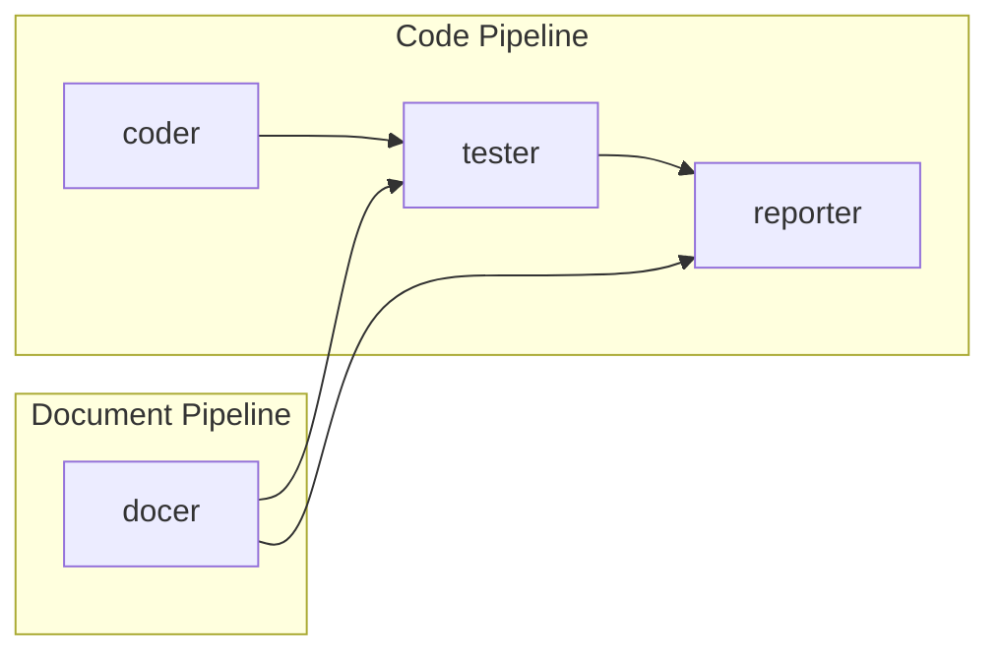

# Agents

四个 agent 协作覆盖 rui 代码和文档两条管线。



---

## coder — 代码实现

**触发**: rui C0 / C2 / D2 / D3

```
C0 (预检): 双边影响分析 → 锚定报告 → 准入判定
C2 (实现): 代码检索 → 架构设计 → 影响分析 → 逐模块编码+审查
```

| Phase | 做什么 | 红线 |
|-------|--------|------|
| C0 预检 | 代码+文档双边影响分析，验证上游 P0 完整性 | P0 缺失不进入 C2；影响链未闭合不声称闭合 |
| Phase 1 检索 | 全项目搜索相关代码，交叉验证，报告缺失 | 不报告未读代码；不隐藏多源冲突；不孤立看单函数 |
| Phase 2 架构 | 模块划分、接口规范、数据流、构建计划 | 不产出无法映射到具体文件的设计；未定义验收标准不进编码 |
| Phase 3 影响分析 | 全项目搜索变更影响链（代码/测试/构建/类型） | 不只搜当前目录；类型变更不只做值搜索；不虚假闭合 |
| Phase 4 实现 | 按模块顺序编码 → code-review → 修 P0 → 自检 | 不创建设计文档外的文件；review 前不进下一模块；P0 不清零不完成 |

**全局约束**: 全项目范围搜索，精确定位（路径+行号），每个结论可追溯到来源，产出可被下游直接消费。

---

## docer — 文档生成

**触发**: rui D0–D5 / init / from-weekly D1

```
D0 → D1 → D2 → D3 → D4 → D5
自适应规划 → 文档检索 → 影响分析 → 架构设计 → 文档生成(三层审查) → 策展辅助
```

| Phase | 做什么 | 红线 |
|-------|--------|------|
| D0 自适应规划 | 从 execution-memory 预测变更级别，推荐策略 | 历史数据可用时必须由数据驱动；无数据标注"首次执行" |
| D1 文档检索 | 定位召回所有上游文档，交叉验证 | 不报告未读内容；不隐藏多源冲突 |
| D2 影响分析 | 追踪代码+文档变更的完整影响链 | 全项目范围搜索；不虚假闭合；检查代码示例是否过时 |
| D3 架构设计 | 基于真实代码产出模块划分和接口规范 | 架构必须与现有代码结构一致；不虚构模块 |
| D4 文档生成 | 按模板生成 §1–§4+后记，与 tester 协作三层审查 | 不编造未验证的模块名/接口/路径；故事四子节必须完整；强制后记 |
| D5 策展 | git 持久化 + execution-memory 回写 + 知识归档 | 不跳过 git commit；不跳过执行记忆回写 |

**全局约束**: 全项目搜索，仅真实文档，精确定位（路径+锚点），项目对齐，交接就绪。

---

## tester — 质量保证

**触发**: rui C1 / C2 / C3 / D4，pre-commit，post-save

```
Code: C1(测试设计+UI原型) → C2(逐模块审查) → C3(全量审查+冒烟测试+质量统计)
Doc:  D4(文档原型+Mermaid审查+Markdown QA+文档审查+质量统计)
```

| Phase | 做什么 | 红线 |
|-------|--------|------|
| P1 E2E 测试设计 | 场景识别 → 验证设计 → 选择器策略 → 测试数据 → 稳定性评估 | 不遗漏异常/边界；优先 data-testid；不断言"无报错" |
| P2 UI 原型 | 原生 HTML+CSS+JS 验证交互可行性 | 不引入框架；不实现领域逻辑；不遗漏错误/空/加载态 |
| P3 代码审查 | 业务逻辑 → 安全 → 架构 → 可维护性 → 可测试性 | 无测试覆盖不通过；安全不过不发布；无法验证不给 LGTM |
| P4 文档原型 | 最小化 Markdown 验证结构可行性 | stub 内容仅占位；不引入复杂扩展 |
| P5 Mermaid 审查 | 逐块检查修复语法 | 逐块审查不遗漏；修复后必须写回 |
| P6 Markdown QA | 结构/链接/示例/术语/格式/代码同步检查 | 不断裂链接；不过语法错误示例；不过代码-文档不一致 |
| P7 文档审查 | 读者视角 → 结构完整性 → 知识准确性 → 决策可追溯性 → 跨文档一致性 | 不过缺"为什么"的决策；不过与代码不一致的文档 |
| P8 质量追踪 | P0/P1/P2 统计 → 趋势分析 → 薄弱维度诊断 → 可执行建议 | 不编造数据；不建议不指向具体文件 |

**分级**: P0=阻塞发布, P1=建议修复, P2=可选优化。

**跳过条件**: 无 UI 场景跳过 P1/P2；无 Mermaid 块跳过 P5；结构已验证跳过 P4。

---

## reporter — 过程报告与知识策展

**触发**: rui C4 / D5，用户显式请求经验提取

```
Phase 1 (过程报告): 记录收集 → 路径还原 → 质量分析 → 效率度量 → 知识提取 → 可视化
Phase 2 (知识策展): 过程扫描 → 跨工作流模式识别 → 资产结构化 → 归档
```

| Phase | 做什么 | 红线 |
|-------|--------|------|
| P1 过程报告 | 从实际执行中提取可验证事实：调用序列、门控轮次、变更列表、效率指标、知识提取 | 不扭曲实际路径（含重试和降级）；不编造失败/建议；变更列表不漏文件 |
| P2 知识策展 | 消费 P1 输出 → 提取可复用模式 → 跨工作流洞察 → 归档结构化知识 | 不记录未验证的"最佳实践"；共性知识需 ≥2 个独立来源；Phase 1 输出必须消费 |

**全局约束**: 流程图只记实际调用，重入显示循环和次数。改进建议必须指向具体文件。每个知识条目标注适用边界。

---

## 证据标准（反幻觉）

所有写入 `docs/` 或影响实现决策的陈述必须可验证或标注为未知。

| Level | 含义 | 如何撰写 |
|-------|------|---------|
| A 已验证 | 可通过 Read/Grep/Glob 验证 | 直接陈述，附 `path` 或 `doc§section` |
| B 可推导 | 通过明确规则从 A 推导一步 | "由……可得"，链回 A |
| C 未验证 | 用户口述、未抓取网页、未执行工具 | `> 待补充（原因：……）` |
| D 禁止 | 无 A/B 支撑且非 C | 视为幻觉，不得出现 |

**禁止**: 未执行 Grep/Glob/Read 即写"项目已有模块 X"；编造文件路径、导出名、版本号；捏造依赖关系或测试文件。

---

## 全项目影响分析

**原则**: 全项目搜索（非仅 `src/` 或当前目录）。每个变更点追踪上下游到闭合或声明停止原因。删除/重命名/修改公共接口前证明所有调用方已覆盖。

**搜索范围**: 源码、测试、文档、agents/、skills/、配置与构建文件。排除 `node_modules/`、`dist/`、`.git/`、锁文件。

**步骤**:
1. 列出所有拟变更点（文件/导出/函数/组件/Store/路由/事件/CSS/配置/依赖）
2. 构建搜索词（名称/别名/路径/标签名/事件名/路由名/字符串键/环境变量/包名）
3. 全项目搜索每个词，记录命中文件和引用方式
4. 追踪二级及以上传递影响直到闭合
5. 标注处置方式：同步修改 / 保持兼容 / 补充验证 / 人工审核 / 无需操作

**输出**: 搜索词与变更点列表 + 影响链表 + 依赖闭合摘要 + 未覆盖风险。

**P0 门禁**: 全项目搜索完成前不生成设计结论；未输出搜索词列表不声称完成；影响链未闭合不删/改公共接口。
