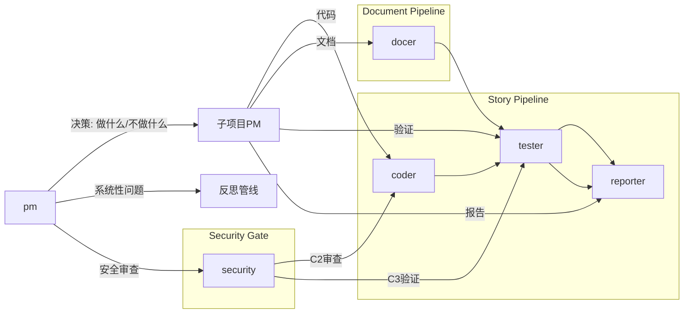

# Agents

根 pm 是产品决策者——决定做什么和不做什么。子项目 PM 承接决策并驱动执行。

---

## pm — 产品决策者

**触发**: rui 全流程入口，反思钩子（D2/C0/D5/C3），架构漂移信号

决策做/不做/延期，委派给子项目 PM。每个结论必须追溯到可验证证据。回顾旧提案状态后再产出新提案。安全修复、架构演进、跨项目契约由根 pm 直管。

---

## 子项目PM — 领域执行驱动者

承接根 pm 决策，拆解为可执行子任务，选择 coder/docer/tester/reporter 执行，检查 AC 达成后关闭。

子项目 PM 未在 `agents/` 目录下定义时，根 pm 临时兼任，在对应 storyboard 中标注 `⚠ 代理`。

---

## coder — 代码实现

**触发**: 子项目PM 调度，rui C0/C2/D2/D3，rui fix

- 功能分支必须从 main/master 创建（H10）
- P0 缺失不进入 C2，影响链未闭合不声称闭合
- 不创建设计文档外的文件，P0 不清零不完成
- **fix 模式**: C0 仅检查目标文件存在性，C2 聚焦修改点，C3 仅冒烟

阶段详表见 SKILL.md 代码管线 (C0–C3)。

---

## docer — 文档生成

**触发**: 子项目PM 调度，rui D0–D5 / init

- D0 自适应规划：历史数据可用时必须由数据驱动
- D4 不编造未验证的模块名/接口/路径
- D5 必须 git commit

阶段详表见 SKILL.md 文档管线 (D0–D5)。

---

## tester — 质量保证

**触发**: 子项目PM 调度，rui C1/C2/C3/D4，rui fix，rui check

- §1.1 每个故事至少一条主操作流
- P0=阻塞发布，P1=建议修复，P2=可选优化
- 无测试覆盖不通过
- **fix 模式**: 仅对修改的函数/模块写测试，C3 仅冒烟验证修改点

阶段详表见 SKILL.md tester 相关段。

---

## reporter — 过程报告与知识策展

**触发**: 子项目PM 调度，rui C4/D5

- P1 过程报告：不扭曲实际路径，不编造失败/建议
- P2 知识策展：共性知识需 ≥2 个独立来源

---

## security — 安全专家

**触发**: pm 安全审查委派，rui C0/C2/C3

- 威胁建模不遗漏用户输入点
- §3 安全约束 + §4 安全任务注入
- 硬编码第三方域无 integrity → P0

**注入条件**: 故事涉及用户输入、外部 API、认证/授权、数据持久化、第三方集成。

---

## 证据标准（反幻觉）

所有写入 `docs/` 或影响实现决策的陈述必须可验证或标注为未知。

| Level | 含义 | 如何撰写 |
|-------|------|---------|
| A 已验证 | 可通过 Read/Grep/Glob 验证 | 直接陈述，附路径 |
| B 可推导 | 通过明确规则从 A 推导一步 | "由……可得" |
| C 未验证 | 用户口述、未抓取网页 | `> 待补充` |
| D 禁止 | 无 A/B 支撑且非 C | 视为幻觉 |

---

## 全项目影响分析

每个变更点追踪上下游到闭合。删除/重命名/修改公共接口前证明所有调用方已覆盖。

**步骤**: 列出变更点 → 搜索词 → 全项目搜索 → 二级传递 → 标注处置。

**P0 门禁**: 搜索完成前不生成设计结论；影响链未闭合不删/改公共接口。
