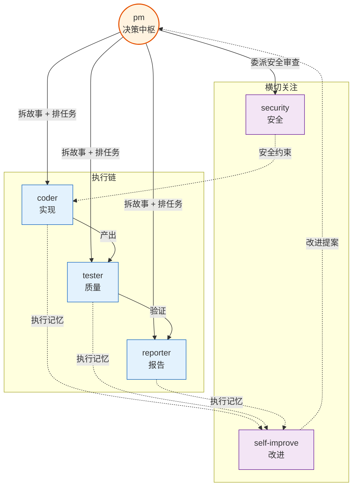
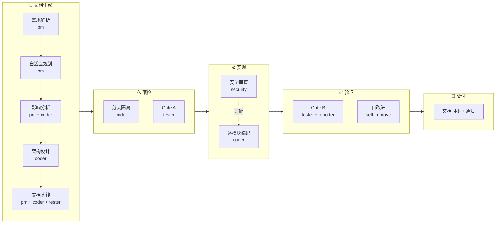
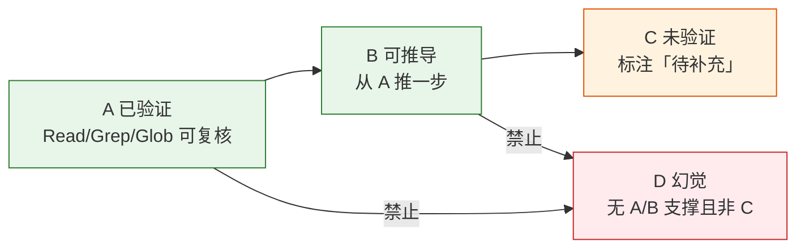
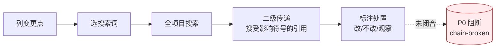
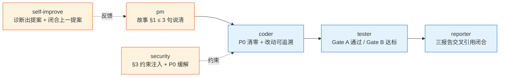
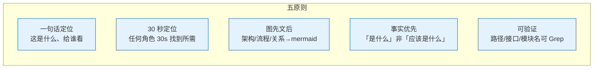

# Agents

> 每条决策必有人负责，每个结论必有证据，每个变更必收闭环。

哲学源头 [CLAUDE.md](../CLAUDE.md)：信模型、惜注意、验现实。本文件是角色总览与共用底线，专项契约见各 agent 文件。

## 角色拓扑



| Agent | 一句话 | 核心动作 | 卡点 | 触发源 | 契约文件 |
|-------|------|---------|------|--------|---------|
| **pm** | 决定做/不做/延期 | 拆需求 → 排故事 → 委派 Agent → 检 AC → 放行/阻断 | 故事无 AC 不委派 | rui 入口 · 自适应规划 · 反思钩子 · init | [pm.md](./pm.md) |
| **coder** | 逐模块实现，P0 清零 | 读设计 → 写代码 → P0 清零 → 进下一模块 | P0 未清零不进下一模块 | pm 委派 · rui 预检/实现/影响分析 | [coder.md](./coder.md) |
| **tester** | 测试先行，Gate 阻不放行 | 写用例 → Gate A 审 → 执行 → Gate B 判 | Gate A 未通过不编码；Gate B 未通过不交付 | pm 委派 · rui 测试/验证 | [tester.md](./tester.md) |
| **reporter** | 过程记录，交叉闭合 | 写实施报告 ×2 + 测试报告 → 三报告交叉引用 | 三报告不一致不闭合 | rui 验证/交付/策展 | [reporter.md](./reporter.md) |
| **security** | 威胁建模，P0 卡发布 | 建威胁模型 → 写 §3 安全约束 → 注入 P0 | P0 安全项未缓解卡发布 | pm 安全审查委派 | [security.md](./security.md) |
| **self-improve** | 采数据 → 出诊断 → 写提案 | 采集执行数据 → 六维诊断 → 改进提案 → 闭环保案 | 不阻断主流程（降级 `no-metrics`） | rui 自改进阶段 | [self-improve.md](./self-improve.md) |

## 管线阶段与 Agent 参与



| 阶段 | pm | coder | tester | reporter | security | self-improve |
|------|:---:|:---:|:---:|:---:|:---:|:---:|
| 需求解析 | ● | | | | | |
| 自适应规划 | ● | | | | | |
| 影响分析 | ● | ● | | | | |
| 架构设计 | | ● | | | | |
| 文档基线 | ● | ● | ● | | | |
| 分支隔离 | | ● | | | | |
| Gate A | | | ● | | | |
| 逐模块编码 | | ● | | | ● | |
| Gate B | | | ● | ● | | |
| 自改进 | | | | ● | | ● |
| 交付 | | | | ● | | |

## 共用底线

### 证据等级

> 写入 `docs/` 的内容必须标注证据等级。反幻觉。



| Level | 含义 | 写入规则 | 示例 |
|-------|------|---------|------|
| **A** | 已验证 | 直接陈述，附路径 | `src/auth/login.ts:42 定义了 /login 路由` |
| **B** | 可推导 | "由……可得"，必须标注推导链 | "由 A 可得，中间件链为 auth → ratelimit → handler" |
| **C** | 未验证 | `> 待补充`，禁止以陈述句写入 | `> 待补充：第三方 API 的速率限制策略` |
| **D** | 幻觉 | 视为错误，不得出现在产出中 | — |

### 影响分析



| 步骤 | 动作 | 产出 |
|------|------|------|
| 1. 列变更点 | 列出本次所有变更的文件/函数/接口 | 变更清单 |
| 2. 选搜索词 | 每个变更点提取 1-3 个搜索词 | 搜索词列表 |
| 3. 全项目搜索 | Grep 搜索所有引用点 | 引用清单 |
| 4. 二级传递 | 对每个引用点再搜其引用 | 完整影响链 |
| 5. 标注处置 | 逐点标注：改 / 不改（附原因）/ 观察 | 闭合的影响分析表 |

闭合前禁止：生成设计结论、删/改公共接口、声称影响链已闭合。

### 交接信号

> 每个 Agent 定义"何时算交接成功"，定义后必须可被下游验证。



| Agent | 交接信号 | 下游验证方式 |
|-------|---------|-------------|
| **pm** | 故事 §1 ≤ 3 句说清「做什么/给谁/为什么」+ AC 可独立验证 | coder 检 AC 是否可翻译为代码 |
| **coder** | 每模块 P0 清零 + 改动文件/行数与任务 ID 对应 | tester 检 P0 清零记录 |
| **tester** | Gate A 测试方案就绪 + Gate B P0 全部通过 · P1 高通过率 · 修复 ≤ 2 轮 | reporter 检测试报告与实施报告一致 |
| **reporter** | 三报告（后端实施/前端实施/测试）交叉引用一致 + git commit | pm 检三报告闭合 |
| **security** | 威胁模型覆盖所有安全面 + §3 约束已注入 coder 任务 + P0 安全项状态已标记 | coder 检任务中是否含安全约束 |
| **self-improve** | 诊断信号 ≥ 1 条 + 改进提案 ≥ 1 条 + 上一故事提案状态已更新 | pm 检提案是否进入改进清单 |

## 文档写作原则

> 所有 Agent 写入 `docs/` 的产出均遵循以下原则。原则优先级自上而下。



| 原则 | 含义 | 反例 |
|------|------|------|
| 一句话定位 | 每份文件开头说明「这是什么、给谁看」 | 开头直接进入技术细节 |
| 30 秒定位 | 任何角色 30 秒内找到所需 | 关键信息埋在长段落中 |
| 图先文后 | 架构/流程/关系先用 mermaid，文字补细节 | 大段文字描述架构，无图 |
| 事实优先 | 描述「是什么」而非「应该是什么」 | "建议使用 Redis 缓存" |
| 可验证 | 路径/接口/模块名可通过 Read/Grep 验证（Level A/B） | "应该有个 UserService" |

## 行为纪律

> 智能体会为走捷径找理由。以下纪律从 [superpowers](https://github.com/obra/superpowers) 的实战数据（94% PR 驳回率）中提取，经本项目哲学适配。

**基本原则：违反规则字母即是违反规则精神。** 切断所有"我遵循精神不遵循字母"的合理化。

### Red Flags — 暂停并回到 Iron Law

以下念头是你在合理化——停下来，回到 [CLAUDE.md 基础信念](../CLAUDE.md#基础信念)：

- "这里不需要验证，我确认过了"
- "这个 bug 很简单，直接修就行"
- "同时改这几处能省时间"
- "这次是个例外，因为..."
- "太累了，先提交再说"
- "跳过 Gate A 直接写代码更快"
- "影响链应该没问题，不用二次传递了"
- "修复超过 2 轮了但这次肯定对"
- "我只是在 '参考' 没走流程的代码"
- "证据 C 写陈述句也没关系"

**以上任何一个念头 = 停止。回到 Iron Law。**

### 合理化速查表

| 借口 | 现实 |
|------|------|
| "小改动不需要流程" | 小改动和大改动的 bug 率相同。流程不因改动量打折。 |
| "紧急情况，跳过 Gate A" | Gate A 就是为紧急设计的——越紧急越需要测试先行。 |
| "影响链看起来闭合了" | "看起来"不等于"已验证"。做二级传递搜索。 |
| "先实现再补文档" | 实现后补的文档从未被补。文档与代码同时产出。 |
| "这个 Agent 我信任，不用验证" | 信任 Agent 报告而不核实 = 信赖输出而非证据。验现实。 |
| "我已经看过类似的了" | 类似不等于相同。每个文件证据必须独立验证。 |
| "这不在我职责边界内，我不需要管" | 发现下游隐患应标记，不理 = 技术债传递。 |
| "P2 不影响交付，我先忽略" | P2 堆叠 = 3 个故事后 P0。记录不阻断但必须记录。 |

### 验证门禁

> 源自 superpowers 的 verification-before-completion 模式。在声称任何状态或表达满意之前：

```
1. IDENTIFY — 什么命令证明这个声称？
2. RUN      — 执行完整命令（新鲜，完整）
3. READ     — 读完整输出，检查退出码，数失败数
4. VERIFY   — 输出是否确认了声称？
   - 否 → 陈述实际状态并附证据
   - 是 → 陈述声称并附证据
5. ONLY THEN — 做出声称

跳过任一步骤 = 撒谎，不是验证
```

| 声称 | 需要 | 不充分 |
|------|------|--------|
| 测试通过 | 测试命令输出：0 失败 | 上次运行、"应该能通过" |
| 构建成功 | 构建命令：exit 0 | Lint 通过、日志看着正常 |
| Bug 修复 | 测原始症状：通过 | 代码改了、"假定修好了" |
| Agent 完成 | VCS diff 显示变更 | Agent 报告说"成功" |
| 影响链闭合 | Grep 二级传递已做 | "应该没有遗漏" |
