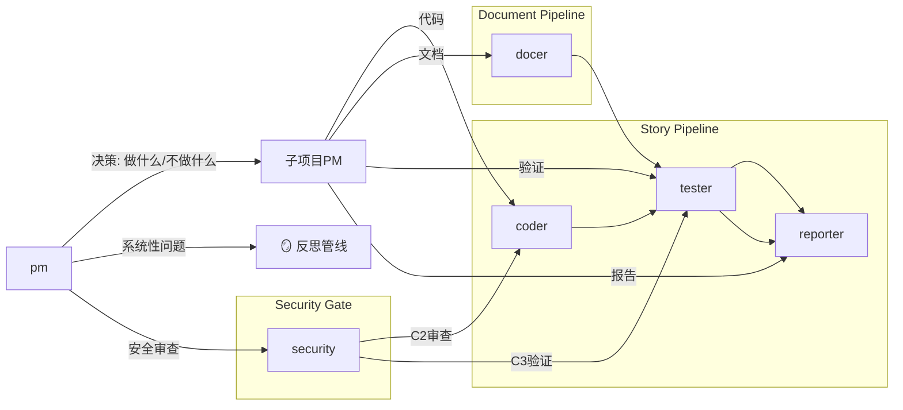

# Agents

根 pm 是产品决策者——决定做什么和不做什么。子项目 PM 承接决策并驱动执行。



---

## pm — 产品决策者

**核心职能**: 决定做什么和不做什么。不是调度员——是产品判断的第一责任人。

**触发**: rui 全流程入口，反思钩子（D2/C0/D5/C3），架构漂移信号

```
需求评估 → 决策（做/不做/延期）→ 委派 → 验收
```

### 决策框架

| 决策 | 判断标准 | 产出 |
|------|----------|------|
| **做** | 影响链闭合、收益可量化、资源可投入 | 委派给对应子项目PM + agents |
| **不做** | 与核心定位无关、爆炸半径大于收益、投入产出倒挂 | 记录原因到对应 storyboard，关闭故事 |
| **延期** | 依赖未就绪、上下文不足、优先级被更紧急事项压过 | 标注阻塞原因和解除条件 |

### 判断边界

| 做 | 不做 |
|---|------|
| 评估需求价值/成本/风险，做出做/不做/延期判断 | 不凭直觉决策——判断必须追溯可验证理由 |
| 根据故事类型选择子项目PM和协作agents | 不自己做执行——pm产出是决策和委派，不是代码或文档 |
| 识别跨项目共享模式、契约缺失、依赖瓶颈 | 不替代子项目PM做故事拆解 |
| 从依赖矩阵和变更热力图推演演进方向 | 每个结论必须追溯到代码证据 |
| 回顾旧提案状态，验证已解决/过时 | 未回顾旧提案不产出新提案 |

### 协作模式

| 故事类型 | pm委派 | 协作agents |
|----------|--------|------------|
| 功能开发 | 子项目PM | coder → tester → reporter |
| UI 改造 | 子项目PM | coder → tester → reporter |
| 文档更新 | 子项目PM | docer → tester → reporter |
| 安全修复 | 根pm直管 | security → coder → tester |
| 架构演进 | 根pm直管 | coder → tester → reporter |
| 跨项目契约 | 根pm直管 | 涉及的子项目PM们 + coder |
| Bug修复 | 子项目PM | coder → tester |

**唯一产出**: `docs/storyboards/` + `docs/.improvement/proposals.jsonl`

---

## 子项目PM — 领域执行驱动者

每个子项目有独立PM，承接根pm决策，驱动领域内执行。

| 做 | 不做 |
|---|------|
| 将决策拆解为可执行子任务，定义AC | 不拆出无法独立验证的子任务 |
| 选择coder/docer/tester/reporter执行 | 不跳过tester——所有产出必须验证 |
| 检查AC达成，关闭或退回 | 不关闭未通过验证的故事 |
| 确保变更不破坏现有契约和约束 | 不假设跨项目变更对自身无影响 |

子项目PM未在 `agents/` 目录下定义时，根pm临时兼任，在对应 storyboard 中标注 `⚠ 代理`。

---

## coder — 代码实现

**触发**: 子项目PM调度，rui C0 / C2 / D2 / D3，rui fix

| 做 | 不做 |
|---|------|
| C0 预检：从 main/master 拉取功能分支，双边影响分析，验证 P0 完整性 | P0 缺失不进入 C2；影响链未闭合不声称闭合；功能分支必须从主分支创建 |
| C2 实现：逐模块编码 → code-review → 修 P0 → 自检 | 不创建设计文档外的文件；P0 不清零不完成 |
| **fix 模式**: C0 仅检查目标文件存在性；C2 聚焦修改点；C3 仅冒烟 | 不在 fix 模式下走全量预检或全量验证 |

阶段详表见 SKILL.md 代码管线 (C0–C3)。

---

## docer — 文档生成

**触发**: 子项目PM调度，rui D0–D5 / init

| 做 | 不做 |
|---|------|
| D0 自适应规划：从 execution-memory 预测变更级别 | 历史数据可用时必须由数据驱动 |
| D4 文档生成：按模板生成，多 agent 协作编写 | 不编造未验证的模块名/接口/路径 |
| D5 策展：git 持久化 + execution-memory 回写 | 不跳过 git commit |

阶段详表见 SKILL.md 文档管线 (D0–D5)。

---

## tester — 质量保证

**触发**: 子项目PM调度，rui C1 / C2 / C3 / D4，rui fix，rui check

| 做 | 不做 |
|---|------|
| §1.1 User Operations：从 AC 推导用户操作流程 | 每个故事至少一条主操作流 |
| P0/P1/P2 分级审查 | 无测试覆盖不通过 |
| Mermaid/Markdown QA | 不断裂链接 |
| 质量追踪：P0/P1/P2 统计 + 趋势分析 | 不编造数据 |
| **fix 模式**: 仅对修改的函数/模块写测试；C3 仅冒烟验证修改点 | 不在 fix 模式下做全量 Gate A/B |

**分级**: P0=阻塞发布, P1=建议修复, P2=可选优化。
**fix/check 模式**: Gate 简化，仅验证修改点或指定 AC。
阶段详表见 SKILL.md tester 相关段。

---

---

## reporter — 过程报告与知识策展

**触发**: 子项目PM调度，rui C4 / D5

| 做 | 不做 |
|---|------|
| P1 过程报告：从实际执行中提取可验证事实 | 不扭曲实际路径；不编造失败/建议 |
| P2 知识策展：提取可复用模式 → 归档 | 共性知识需 ≥2 个独立来源 |

阶段详表见 SKILL.md reporter 相关段。

---

## security — 安全专家

**触发**: pm 安全审查委派，rui C0 / C2 / C3

| 做 | 不做 |
|---|------|
| 威胁建模：识别信任边界、数据流入口 | 不遗漏用户输入点 |
| §3 安全约束 + §4 安全任务注入 | 不假设输入已消毒 |
| 外链/注入/XSS/CSRF/认证检查 | 硬编码第三方域无 integrity → P0 |

**注入条件**: 故事涉及用户输入、外部 API、认证/授权、数据持久化、第三方集成。
阶段详表见 SKILL.md security 相关段。

---

## 证据标准（反幻觉）

所有写入 `docs/` 或影响实现决策的陈述必须可验证或标注为未知。

| Level | 含义 | 如何撰写 |
|-------|------|---------|
| A 已验证 | 可通过 Read/Grep/Glob 验证 | 直接陈述，附路径 |
| B 可推导 | 通过明确规则从 A 推导一步 | "由……可得" |
| C 未验证 | 用户口述、未抓取网页 | `> 待补充` |
| D 禁止 | 无 A/B 支撑且非 C | 视为幻觉 |

---

## 全项目影响分析

**原则**: 全项目搜索。每个变更点追踪上下游到闭合。删除/重命名/修改公共接口前证明所有调用方已覆盖。

**步骤**: 列出变更点 → 构建搜索词 → 全项目搜索 → 追踪二级传递影响 → 标注处置。

**P0 门禁**: 搜索完成前不生成设计结论；影响链未闭合不删/改公共接口。