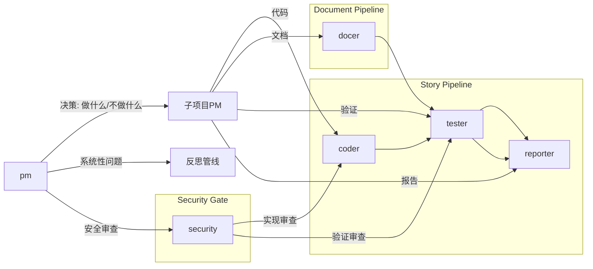

# Agents

根 pm 是产品决策者——决定做什么和不做什么。子项目 PM 承接决策并驱动执行。

| Agent | 文件 | 触发 |
|-------|------|------|
| pm | [pm.md](pm.md) | rui 全流程入口，反思钩子，架构漂移信号 |
| coder | [coder.md](coder.md) | 子项目PM 调度，rui 预检/实现/影响分析/架构设计，rui fix |
| docer | [docer.md](docer.md) | 子项目PM 调度，rui 自适应规划→策展 / init |
| tester | [tester.md](tester.md) | 子项目PM 调度，rui 测试先行/实现/验证/文档生成，rui fix，rui check |
| reporter | [reporter.md](reporter.md) | 子项目PM 调度，rui 交付/策展 |
| security | [security.md](security.md) | pm 安全审查委派，rui 预检/实现/验证 |

---

## 证据标准（反幻觉）

所有写入 `docs/` 或影响实现决策的陈述必须可验证或标注为未知。

| Level | 含义 | 如何撰写 |
|-------|------|---------|
| A 已验证 | 可通过 Read/Grep/Glob 验证 | 直接陈述，附路径 |
| B 可推导 | 通过明确规则从 A 推导一步 | "由……可得" |
| C 未验证 | 用户口述、未抓取网页 | `> 待补充` |
| D 禁止 | 无 A/B 支撑且非 C | 视为幻觉 |

---

## 全项目影响分析

每个变更点追踪上下游到闭合。删除/重命名/修改公共接口前证明所有调用方已覆盖。

**步骤**: 列出变更点 → 搜索词 → 全项目搜索 → 二级传递 → 标注处置。

**P0 门禁**: 搜索完成前不生成设计结论；影响链未闭合不删/改公共接口。
