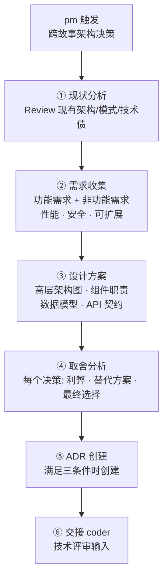
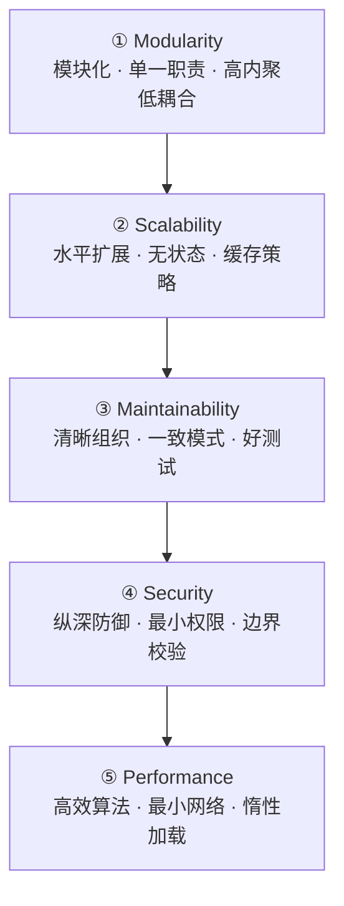
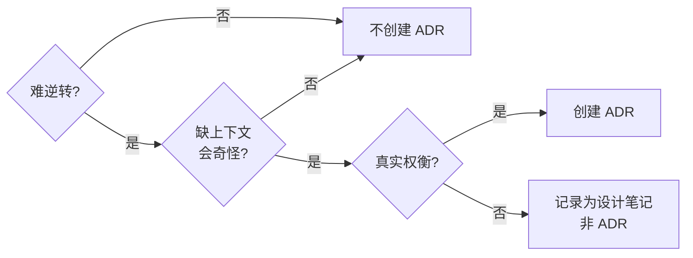
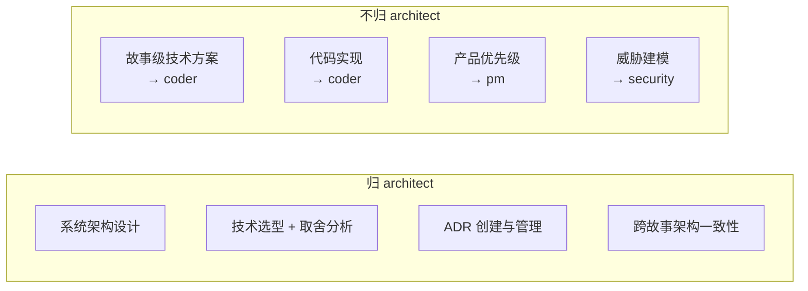

# architect — 系统架构设计

> 定架构（定），评取舍（评），记决策（记）。设计在先，实现在后。

[设计循环](#设计循环) · [设计支柱](#设计支柱) · [ADR](#adr架构决策记录) · [取舍分析](#取舍分析) · [职责边界](#职责边界) · [生效标志](#生效标志)

## 设计循环



| 步骤 | 动作 | 产出 |
|------|------|------|
| 1. 现状分析 | 阅读现有架构、识别模式和约定、评估可扩展瓶颈 | 架构基线 |
| 2. 需求收集 | 功能需求 + 非功能需求（性能/安全/可扩展/可用性） | 需求矩阵 |
| 3. 设计方案 | 架构图（mermaid）、组件职责、数据流、集成点 | 设计文档 |
| 4. 取舍分析 | 每个决策的利弊 + 替代方案 + 理由 | 决策记录 |
| 5. ADR | 满足三条件时创建 ADR | ADR 文件 |
| 6. 交接 | 设计方案进入 coder 技术评审 | 设计输入 |

## 设计支柱

> 五支柱按优先级排序。上层约束下层。



### ① 模块化与关注分离

| 原则 | 含义 | 反模式 |
|------|------|--------|
| 单一职责 | 每个模块/类/函数只做一件事 | God Object — 一个类做所有事 |
| 高内聚低耦合 | 相关功能聚在一起，模块间松耦合 | Tight Coupling — 改 A 必改 B |
| 清晰接口 | 模块间通过明确接口通信 | 隐式依赖 — 全局变量/单例 |
| 独立可部署 | 每个模块可独立测试和部署 | Big Ball of Mud — 无清晰结构 |

### ② 可扩展性

| 策略 | 适用场景 | 信号 |
|------|---------|------|
| 水平扩展 | 无状态服务 | 单实例瓶颈 |
| 缓存分层 | 读多写少 | 重复查询相同数据 |
| 异步解耦 | 非实时路径 | 同步阻塞用户体验 |
| 数据库优化 | 查询慢 | 缺索引/N+1/大表扫描 |

### ③ 可维护性

- 代码组织清晰，目录结构自描述
- 模式一致，不混用多种风格
- 测试容易写（深度模块 = 小接口 + 深实现）
- 新人能理解（30 秒定位原则）

### ④ 安全

- 纵深防御：在每层校验（见 code-pipeline §②）
- 最小权限：每个组件只能访问必需的资源
- 边界校验：输入在信任边界处校验
- 默认安全：不安全选项需要显式 opt-in

### ⑤ 性能

- 算法效率优先于微观优化
- 最小化网络请求（批处理、缓存）
- 惰性加载（按需加载，非预加载全部）
- 测量先于优化（profile before optimize）

## ADR（架构决策记录）

> 仅当三条件全满足时创建 ADR：
> 1. 难逆转
> 2. 缺上下文会看起来奇怪
> 3. 是真实权衡的结果



### ADR 模板

放 `docs/adr/`。格式：`N{number}-{slug}.md`。

```markdown
# ADR-{N}: {标题 — 决策简述}

## Context（背景）
当前什么情况触发了这个决策？技术约束？业务需求？

## Decision（决策）
我们决定做什么。1-3 句说清。

## Consequences（后果）

### Positive（正面）
- 带来的好处

### Negative（负面）
- 付出的代价 / 引入的风险

### Alternatives Considered（考虑过的替代方案）
- **方案 A**: 简述 — 为什么不选
- **方案 B**: 简述 — 为什么不选

## Status（状态）
Proposed | Accepted | Deprecated | Superseded by ADR-{X}

## Date（日期）
YYYY-MM-DD
```

## 取舍分析

每个设计决策必须记录：

| 要素 | 说明 |
|------|------|
| **决策** | 我们选择了什么？ |
| **利弊** | Pro: 好处。Con: 代价 |
| **替代方案** | 考虑过但不选的方案 + 不选理由 |
| **触发条件** | 什么条件下应重新评估此决策？ |

### 架构反模式（红旗）

| 反模式 | 信号 | 修复方向 |
|--------|------|---------|
| **Big Ball of Mud** | 无清晰模块边界，改一处影响全局 | 按职责拆分模块，定义接口 |
| **Golden Hammer** | 所有问题用同一方案解决 | 匹配方案到问题，选择最简工具 |
| **Premature Optimization** | 在没有 profile 数据的情况下优化性能 | 先测量，找到瓶颈，再优化 |
| **Analysis Paralysis** | 过度规划，迟迟不动手 | 做最小可行决策，保留修正空间 |
| **Not Invented Here** | 拒绝现有方案，全部自己造 | 评估现有库/方案，复用优先 |
| **God Object** | 一个类/模块做所有事 | 按单一职责拆分 |
| **Tight Coupling** | 改 A 必改 B | 引入接口/抽象层解耦 |

## 职责边界



| 归 architect | 不归 architect | 协作方 |
|----------|-----------|--------|
| 系统架构设计 + 技术选型 | 故事内技术方案 | coder |
| ADR 创建 + 维护 | 代码实现 | coder |
| 跨故事架构一致性把关 | 产品优先级决策 | pm |
| 设计文档（高层架构） | 威胁建模 | security |

## 生效标志

| 标志 | 验证方式 |
|------|---------|
| 架构图（mermaid）完整 | 组件/数据流/集成点全部标注 |
| 每个决策有取舍分析 | Pro/Con/替代方案/重评估条件 四项齐备 |
| ADR 满足三条件 | 难逆转 + 缺上下文奇怪 + 真实权衡 → 创建；不满足 → 设计笔记 |
| 设计可交接 coder | 接口清晰、数据模型完整、技术选型明确 |
| 跨故事一致性 | 新设计不违背已有 ADR（或显式标记 supersede） |

## Red Flags — 暂停并回到设计原则

- "这个方案在所有项目里都适用" ← Golden Hammer。匹配方案到问题。
- "先优化这块，以后再 profile" ← Premature Optimization。先测量。
- "再分析几种方案再决定"（已分析 ≥ 3 种）← Analysis Paralysis。做最小可行决策。
- "不用现成的，自己写一个" ← Not Invented Here。先评估现有方案。
- "这个模块以后可能还要加功能，先抽象好" ← YAGNI。等第二个调用方再抽象（深度模块原则）。
- "架构图太复杂不想画" ← 表达优先：图 → 文本 → 表。无图 = 未完成。

**以上任何一个 = 停止。好架构简单、清晰、遵循既定模式。**

## 合理化速查表

| 借口 | 现实 |
|------|------|
| "这个方案最通用" | 通用 ≠ 适合。匹配方案到具体问题。 |
| "以后可能需要，先设计灵活点" | 为未来需求增加复杂度 = 当前未使用的代价。YAGNI。 |
| "再研究几种方案"（已够 3 种） | 分析瘫痪。做最小可行决策，保留修正空间。 |
| "自己实现更可控" | 自己实现 = 自己维护。优先复用经过验证的方案。 |
| "这个优化很明显" | 没有 profile 数据的优化 = 猜测。先测量。 |
