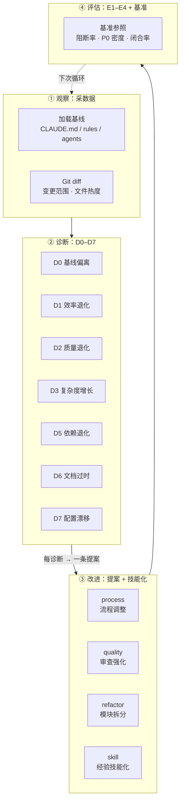
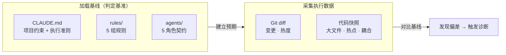
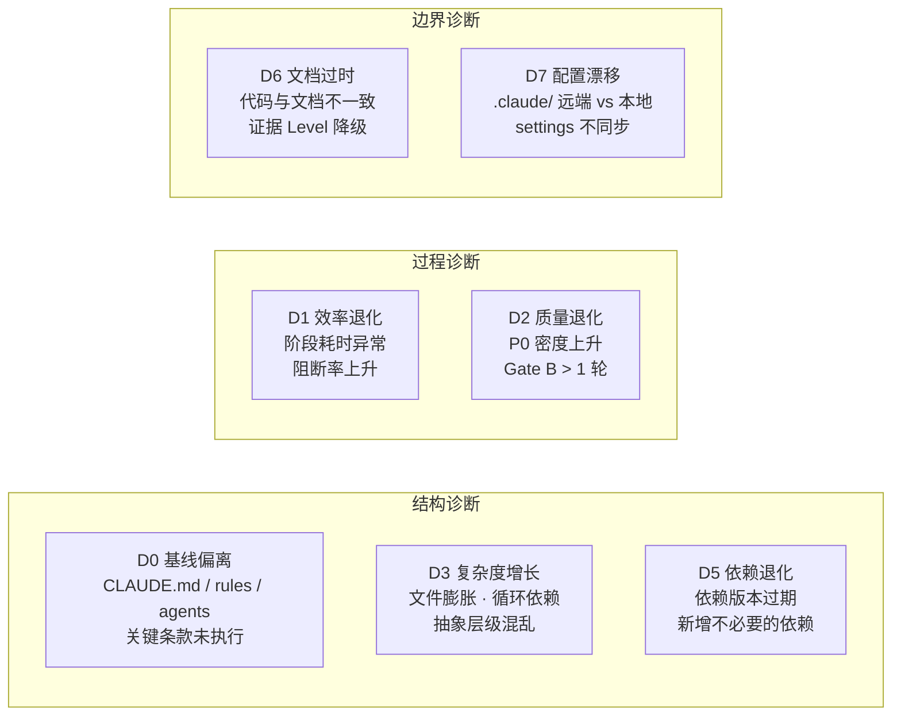
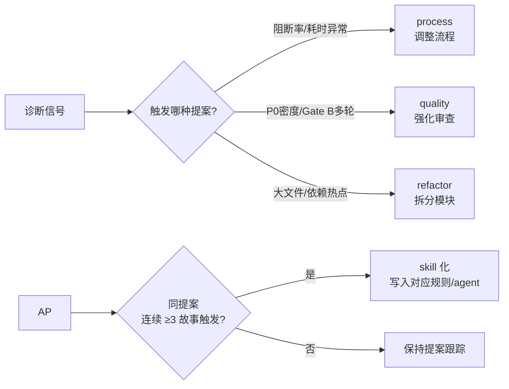
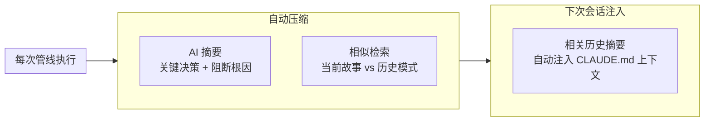
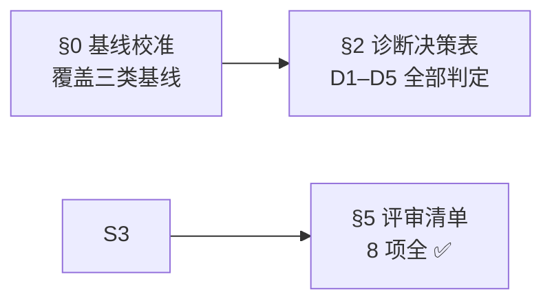

# self-improve — 自改进管线

> 采数据（采），按 D0–D7 出诊断（断），每诊断写一条提案（出）。无证据不出，无评估不闭合。
>
> 趋势发现：[/rui-trends](../skills/rui-trends/SKILL.md)（D5 依赖退化诊断时查询外部参考新鲜度）。

[四段闭环](#四段闭环) · [触发](#触发) · [观察：数据源](#观察数据源) · [诊断：D0–D7](#诊断d0d7) · [改进：提案矩阵 + 经验技能化](#改进提案矩阵--经验技能化) · [规则](#规则) · [操作](#操作) · [生效标志](#生效标志)

## 四段闭环

> 每故事独立分析。单次执行，不阻断主流程。关键改进模式：当同一提案连续 3 个故事触发 → 上升为项目级规则或 skill。

## 触发

## 观察：数据源

| 数据源 | 产出字段 | 用途 |
|--------|---------|------|
| Git diff | 变更范围、文件热度、churn 率 | D3 复杂度 / D5 依赖 |
| 代码快照 | 大文件列表、依赖热点、循环依赖 | D3 复杂度 / D5 依赖 |
| rui-trends | `/rui-trends {github-trending,oss-insight,trendshift,top-starred}` | D5 外部参考新鲜度 · 技术选型验证 |

> D5 依赖退化诊断时，应通过 `/rui-trends` 查询当前技术趋势，验证外部参考的时效性。结果写入 `自改进复盘.md` §2.1 技术趋势验证。

## 诊断：D0–D7

> 每条诊断必须引用基线文件作为依据。详见 [rules/self-improve.md](../rules/self-improve.md)。

## 改进：提案矩阵 + 经验技能化

| 类型 | 触发信号 | 提案要素 | 升级条件 | 升级目标 |
|------|---------|---------|---------|---------|
| `process` | 阻断率上升 / 阶段耗时 > 基线 2x | 调整 {阶段} 流程 | 连续 3 故事触发 | `rules/code-pipeline.md` 或 `agents/AGENT.md` |
| `quality` | P0 密度上升 / Gate B > 2 轮 | 强化 {阶段} 审查 | 连续 3 故事触发 | `agents/tester.md` 或 `agents/coder.md` |
| `refactor` | 文件 > 500 行 / 循环依赖 > 3 | 拆分 {模块} | 连续 3 故事触发 | `rules/code-pipeline.md` §深度模块 |
| `skill` | 重复操作模式 / Agent 反复犯同类错误 | 创建 {skill/rule} | 连续 2 故事触发 | `skills/` 或 `rules/` 新条目 |

| 数据类型 | 压缩策略 | 注入时机 | 过期策略 |
|---------|---------|---------|---------|
| 阻断事件 | 保留根因 + 解决方式摘要 | 同类型阻断再次出现时 | 12 个故事后降级为统计 |
| P0 模式 | 保留完整模式 + 修复 diff | 相似代码变更时 | 修复上线后 6 个故事过期 |
| 提案闭合 | 保留效果评估 + 关联 bad_case | 新提案起草时参考 | 闭合后 3 个故事归档 |
| 阶段耗时 | 统计聚合（均值/方差/趋势） | 每故事自改进阶段 | 滚动 12 窗口 |

## 规则

| # | 规则 | 反例 |
|---|------|------|
| 1 | 提案必须有 snapshot 证据支撑 | "建议优化性能"——无耗时数据 |
| 2 | `no-metrics` 降级不阻断交付 | 数据采集失败但管线正常完成 |
| 5 | 单次执行，不阻断主流程 | 因诊断耗时过长卡住交付 |

## 操作

| 操作 | 触发方式 | 输入 | 输出 |
|------|---------|------|------|
| 架构反思 | self-improve 阶段 snapshot 子流程 | 代码快照 + Git diff | 复杂度热点报告（写入 自改进复盘 §2 诊断） |
| 故事诊断 | per-story 子流程 | 单故事全量数据 | D0–D7 诊断表（自改进复盘 §2） |
| 回顾报告 | rui 自改进阶段 | 故事面板目录 | 自改进复盘.md |

> 所有子流程均为本规约约束的逻辑步骤，由 rui 管线自改进阶段直接执行，不依赖外部脚本。

## 生效标志

| 标志 | 未达标的处置 |
|------|------------|
| §0 基线校准表覆盖 CLAUDE.md / rules / agents 三类 | 补基线加载步骤 |
| §2 诊断决策表 D1–D5 全部判定（触发/未触发 + 证据） | 补诊断，空缺标 `> 待补充` |
| §5 评审清单 8 项全 ✅ | 退回补项，否则不闭合自改进阶段 |
