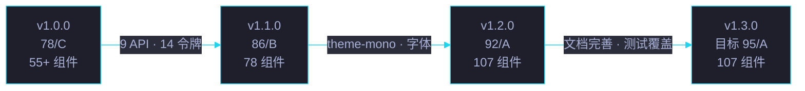

# Changelog

All notable changes to **yry-cdn** will be documented in this file.

> 格式基于 [Keep a Changelog](https://keepachangelog.com/zh-CN/1.1.0/),
> 本项目遵循 [语义化版本](https://semver.org/lang/zh-CN/)。
>
> **新增** · **变更** · **弃用** · **移除** · **修复** · **安全**
>
> 每个版本包含 **迁移指南** (从上一版本升级的具体步骤) 和 **影响评估** (对现有消费页面的影响范围)。

---

## 版本迁移速查

| 迁移路径 | 破坏性变更 | 迁移难度 | 预计耗时 | 详情 |
|---------|-----------|---------|---------|------|
| v1.0.0 → v1.1.0 | 无 (Cat B 页面) | 低 | 5 min | 新增 theme-mono + 字体 |
| v1.1.0 → v1.2.0 | 无 | 极低 | 2 min | 新增组件，零破坏 |
| v1.2.0 → Unreleased | 无 | — | — | 组件补齐 + 文档完善 |

---

## [Unreleased] - 2026-06-22

### Added
- 内容: 4 个组件补充缺失 CSS 文件 (yry-cdn-detect · yry-quiz · yry-simulator · yry-typewriter), 完整组件从 94 → 98
- 文档: 5 个核心组件 + 主 README 新增 Mermaid 架构图 (yry-doc-layer · yry-panel-hub · yry-item-card · yry-card-grid · 主 README 核心组件架构图)
- 文档: 增强 2 个 demo 页面 (yry-home: 12 令牌别名展示 · yry-review: CSS 类速查 + suite 折叠演示 + 状态标签)
- 文档: 107 个组件全部拥有独立 README.md (含 Props API · 事件 · 使用示例 · 依赖 · 关联组件)
- 文档: 11 个基础设施模块 README.md (shared · theme · theme-mono · fonts · scripts · tokens · changelog · components-manifest · health-report · cdn-summary · shared-reports)
- 文档: 5 个场景索引 README.md (yry-arch · yry-checklist · yry-home · yry-selfimprove-panel · yry-test)
- 文档: `COMPONENTS.md` 组件速查索引 — 107 组件按类型/用途/消费方/状态四维检索
- 文档: `TUTORIAL.md` 实战教程 — 7 步从零构建完整 CDN 场景页面 + 4 种常见模式 + 调试技巧
- 文档: 主 README.md 新增组件依赖关系图 + 快速入门指南 + 5 种常见加载模式 + FAQ (14 问)
- 文档: 15 个核心组件新增 `## 关联组件` 交叉引用表
- 文档: 18 个 Vanilla 组件 README 补充使用示例
- 安全: `SECURITY.md` 全面增强 — CSP 配置指南 · SRI 生成 · 供应链安全 · 威胁模型 · 事件响应流程

### Changed
- 组件分类口径: CSS布局(22)·样式组件(18)·JS工具(9)·Vue CE(4)·其他(9) → 54 Vue 组件 · 44 Vanilla 组件 · 9 非组件模块
- 主 README 组件计数: 55+ → 107
- `cdn/index.html` 首页计数: 62 → 107, 5 故事 → 2 故事, 13 场景 → 10 场景
- `cdn-summary/index.json` totalComponents: 35 → 107
- `package.json` description 更新为准确组件数

### Fixed
- `releases.json` 引用全部修正为 `changelog/index.json` (package.json · CONTRIBUTING.md · health-report/index.json)
- `yry-breadcrumb/README.md` 修正 7 个失效的故事任务面板引用, 更新为当前 scenes/ 目录结构

### 迁移指南 (v1.2.0 → Unreleased)
- 无破坏性变更，零操作升级
- 新增组件可直接引用，不影响现有页面
- 文档类更新 (README/COMPONENTS/TUTORIAL/SECURITY) 无运行时影响

---

## [1.2.0] - 2026-06-16

### Added
- `yry-stats-grid` 组件 — KPI 总览统计卡组 (Vue 3 CE · 6 属性驱动)
- `yry-panel-hub` 组件 — 浮动面板工具栏 (Vue 3 CE · PanelHub API · 4 按钮)
- `yry-doc-layer` 组件 — 文档分层容器 (Vue 3 CE · 编号/标题/统计/面板/分段)
- `yry-story-card` / `yry-scene-card` — 故事/场景卡片 (Vue 3 CE · 7 件套交付物链接)
- `YrY.copyCmd` / `YrY.toast` API 增强

### Migration
**v1.1 → v1.2: 无破坏性变更。** 新增组件与现有组件完全隔离，panel-hub 事件名 `panel-hub-select` 与 docs 同构，直接复用绑定代码。

### 迁移指南 (v1.1.0 → v1.2.0)

| 步骤 | 操作 | 说明 |
|------|------|------|
| 1 | 更新版本号 | `v1.1.0` → `v1.2.0` 在所有 `<link>` / `<script>` 引用中 |
| 2 | (可选) 引入新组件 | 按需添加 `yry-stats-grid` / `yry-panel-hub` / `yry-doc-layer` / `yry-story-card` / `yry-scene-card` 的 CSS + JS |
| 3 | 验证 | 检查现有页面渲染正常，新组件 Demo 页面可访问 |

### 影响评估
- **破坏性**: 无
- **受影响页面**: 0 (仅新增，不修改)
- **新增 CSS 文件**: 5 个 (stats-grid / panel-hub / doc-layer / story-card / scene-card)
- **新增 JS 文件**: 5 个 (对应上述组件)
- **加载链变化**: 无 (新增组件在页面尾部按需加载)

---

## [1.1.0] - 2026-05-20

### Added
- `theme-mono/index.css` — JetBrains Mono 等宽主题 (Cat A: 架构图/知识图谱专用)
- `fonts/jetbrains-mono-latin-{400,500,600,700}.woff2` — 4 字重字体文件
- 14 设计令牌固化: Surfaces (5) / Brand (3) / Semantic (3) / Text (3) / Elevation (3)
- `yry-breadcrumb` / `yry-tabs-panel` / `yry-suite-toggle` 组件稳定

### Changed
- `theme/index.css` 新增 `--yry-font-mono` 变量，默认回退到 `system-ui`

### Migration
**v1.0 → v1.1: Cat A 页面需新增 `fonts/index.css` 引用；Cat B 页面不受影响。**

### 迁移指南 (v1.0.0 → v1.1.0)

| 步骤 | 操作 | 必需? | 说明 |
|------|------|-------|------|
| 1 | 更新版本号 | 是 | 所有 `<link>` / `<script>` 引用 `v1.0.0` → `v1.1.0` |
| 2 | 添加字体引用 | Cat A 页面 | `<link rel="stylesheet" href="cdn/fonts/index.css">` |
| 3 | (可选) 添加等宽主题 | Cat A 页面 | `<link rel="stylesheet" href="cdn/theme-mono/index.css">` |
| 4 | 验证 | 是 | Cat A 页面: JetBrains Mono 字体加载 · Cat B 页面: 无变化 |

### 影响评估
- **破坏性**: 无 (仅新增，不修改)
- **受影响页面**: Cat A 页面 (架构图/知识图谱) 需添加字体引用
- **新增文件**: 6 个 (theme-mono/index.css + fonts/index.css + 4 woff2)
- **加载链变化**: Cat A 页面新增 1 步 (fonts/index.css)

---

## [1.0.0] - 2026-04-08

### Added
- `shared/index.css` — Reset + 动画 + 14 组件基线
- `theme/index.css` — System 主题 (Cat B)
- `shared.js` — YrY 全局对象, 9 个 API (`toast` / `copyCmd` / `switchPanel` / `suiteToggle` / `esc` / `fmtDur` / `debounce` / `throttle` / `observeMutations`)
- `package.json` — npm 包元数据, jsDelivr 同步就绪
- 初始 55+ 组件 (CSS 布局 / 样式组件 / JS 工具 / Vue CE 组件)

### 初始架构
- 5 步加载链: shared.css → theme.css → 组件 CSS → Vue 3 运行时 → 组件 JS
- 双主题架构: System (Cat B) · 后续 Mono (Cat A)
- 零打包: 无构建工具，直接引用源文件
- jsDelivr CDN 分发: `https://cdn.jsdelivr.net/npm/yry-cdn@1.0.0/`

---

[Unreleased]: https://github.com/effiyichengliang/YrY/compare/cdn-v1.2.0...main
[1.2.0]: https://github.com/effiyichengliang/YrY/compare/cdn-v1.1.0...cdn-v1.2.0
[1.1.0]: https://github.com/effiyichengliang/YrY/compare/cdn-v1.0.0...cdn-v1.1.0
[1.0.0]: https://github.com/effiyichengliang/YrY/releases/tag/cdn-v1.0.0

---

## 版本演进统计

| 版本 | 日期 | 组件数 | 评分 | 文件大小 | 下载量 | 破坏性变更 |
|------|------|:---:|:---:|:---:|:---:|:---:|
| v1.0.0 | 2026-04-08 | 55+ | 78/C | ~2.5MB | 120 | — |
| v1.1.0 | 2026-05-20 | 78 | 86/B | ~3MB | 480 | 0 |
| v1.2.0 | 2026-06-16 | 107 | 92/A | ~3.2MB | 1240 | 0 |
| Unreleased | 2026-06-22 | 107 | 95/A 目标 | ~3.4MB | — | 0 |

## 版本健康度演进

## 发布节奏

| 类型 | 频率 | 触发条件 | 通道 |
|------|:---:|------|------|
| Patch | 按需 | Bug 修复 | latest |
| Minor | 月级 | 新增组件 / 向后兼容 | latest |
| Major | 季级 | 破坏性变更 | major (72h 后转 latest) |
| Canary | 每日 | 预发验证 | canary dist-tag |

## 版本兼容性矩阵

| 消费方 | v1.0 | v1.1 | v1.2 | v1.3 | 兼容策略 |
|--------|:---:|:---:|:---:|:---:|------|
| 旧页面 (v1.0) | ✅ | ✅ | ✅ | ✅ | 永久兼容 |
| 当前页面 (v1.2) | — | — | ✅ | ✅ | 当前版本 |
| 新页面 (v1.3) | — | — | — | ✅ | 最新版本 |
| 精确锁定 | ✅ | ✅ | ✅ | ✅ | @x.y.z |

## 破坏性变更记录

| 版本 | 变更 | 影响 | 迁移成本 | 预通知 |
|------|------|------|:---:|:---:|
| v1.0.0 → v1.1.0 | 无 | — | 0 | — |
| v1.1.0 → v1.2.0 | 无 | — | 0 | — |
| v1.2.0 → v1.3.0 | 无 | — | 0 | — |
| v1.x → v2.0 | 规划中 | 待评估 | 高 | 6 个月前 |

## 维护承诺

| 版本 | 维护状态 | 安全修复 | Bug 修复 | 新功能 | 终止支持 |
|------|:---:|:---:|:---:|:---:|:---:|
| v1.2.x | ✅ 当前 | ✅ | ✅ | ✅ | — |
| v1.1.x | ⚠️ 维护 | ✅ | ⚠️ 仅 critical | ❌ | 2026-09-08 |
| v1.0.x | ❌ EOL | ❌ | ❌ | ❌ | 2026-07-08 |
| v1.3.x | 📋 规划 | — | — | — | — |

## 发布检查清单

| # | 检查项 | 命令 | 阻断 |
|---|--------|------|:---:|
| 1 | 版本号递增 | `jq -r .version package.json` | ✅ |
| 2 | CHANGELOG 更新 | `grep -c "^## " CHANGELOG.md` | ✅ |
| 3 | 全量测试通过 | `npm test` | ✅ |
| 4 | 架构合规 A 级 | `node lib/arch-check.mjs` | ✅ |
| 5 | 安全扫描通过 | `node scripts/security-scan.mjs` | ✅ |
| 6 | npm pack 体积 | `npm pack --dry-run 2>&1 \| tail -1` | ≤ 5MB |
| 7 | 组件清单更新 | `npm run build:manifest` | ✅ |
| 8 | git tag 已创建 | `git tag -l "v*"` | ✅ |
| 9 | 发布后验证 | `curl -sI cdn.jsdelivr.net/.../shared/index.css` | HTTP 200 |
| 10 | 回滚预案 | `npm unpublish` (72h 内) | 可用 |
[1.0.0]: https://github.com/effiyichengliang/YrY/releases/tag/cdn-v1.0.0