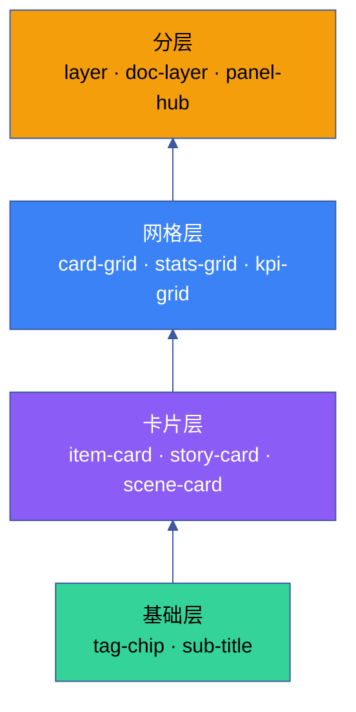

# YrY CDN · 组件速查索引

> 125 个组件的快速参考: 类型 · 标签 · 用途 · 关键 Props · 依赖

## Vue 3 组件 (54 个)

### 布局与结构

| 组件 | 标签 | 用途 | 关键 Props | 依赖 |
|------|------|------|-----------|------|
| [yry-layer](yry-layer/README.md) | `<yry-layer>` | 通用分层容器 | num, titleAccent, stats, panels | Vue 3 |
| [yry-doc-layer](yry-doc-layer/README.md) | `<yry-doc-layer>` | 文档分层 (标题+统计+子节) | num, titleAccent, sections, grid | 6 子组件 |
| [yry-breadcrumb](yry-breadcrumb/README.md) | `<yry-breadcrumb>` | 面包屑导航 | items, ariaLabel | Vue 3 |
| [yry-sub-title](yry-sub-title/README.md) | `<yry-sub-title>` | 子节标题 (icon+文字+计数) | icon, text, count | Vue 3 |
| [yry-layer-agents](yry-layer-agents/README.md) | `<yry-layer-agents>` | Agent 分层展示 | agents | Vue 3 |
| [yry-layer-rules](yry-layer-rules/README.md) | `<yry-layer-rules>` | 分层规则展示 | rules | Vue 3 |
| [yry-layer-refs](yry-layer-refs/README.md) | `<yry-layer-refs>` | 分层引用展示 | refs | Vue 3 |
| [yry-layer-info-panel](yry-layer-info-panel/README.md) | `<yry-layer-info-panel>` | 分层信息面板 | — | Vue 3, PanelHub |

### 导航

| 组件 | 标签 | 用途 | 关键 Props | 依赖 |
|------|------|------|-----------|------|
| [yry-panel-hub](yry-panel-hub/README.md) | `<yry-panel-hub>` | 浮动面板工具栏 + PanelHub API | label, buttons, flow | Vue 3 |
| [yry-cross-nav](yry-cross-nav/README.md) | `<yry-cross-nav>` | 7 交付物类型间快速跳转 | pages, active, basePath | Vue 3 |
| [yry-scene-nav](yry-scene-nav/README.md) | `<yry-scene-nav>` | 场景上一/下一导航 | prev, next | Vue 3 |

### 卡片与展示

| 组件 | 标签 | 用途 | 关键 Props | 依赖 |
|------|------|------|-----------|------|
| [yry-item-card](yry-item-card/README.md) | `<yry-item-card>` | 单卡 (图标+标题+描述+链接) | icon, name, desc, tags | Vue 3, yry-tag-chip |
| [yry-card-grid](yry-card-grid/README.md) | `<yry-card-grid>` | 卡片网格容器 | items | Vue 3, yry-item-card |
| [yry-item-cards](yry-item-cards/README.md) | `<yry-item-cards>` | 多卡片列表管理 | — | Vue 3 |
| [yry-story-card](yry-story-card/README.md) | `<yry-story-card>` | 故事任务卡片 | icon, name, desc, scenes | Vue 3, yry-tag-chip |
| [yry-scene-card](yry-scene-card/README.md) | `<yry-scene-card>` | 场景卡片 (7 交付物链接) | num, name, desc, meta | Vue 3 |
| [yry-tag-chip](yry-tag-chip/README.md) | `<yry-tag-chip>` | 标签芯片 (6 种语义色) | text, modifier | Vue 3 |
| [yry-kpi-card](yry-kpi-card/README.md) | `<yry-kpi-card>` | KPI 指标卡 | label, num, trend, trendDir, numColor | Vue 3 |
| [yry-trend-card](yry-trend-card/README.md) | `<yry-trend-card>` | 趋势数据卡片 | label, value, trend | Vue 3 |
| [yry-scorecard](yry-scorecard/README.md) | `<yry-scorecard>` | 记分卡 | score, label | Vue 3 |
| [yry-cat-overview](yry-cat-overview/README.md) | `<yry-cat-overview>` | 分类概览卡 | title, segments, stats | Vue 3 |
| [yry-cat-warning](yry-cat-warning/README.md) | `<yry-cat-warning>` | 分类警告卡 | — | Vue 3 |
| [yry-dep-badge](yry-dep-badge/README.md) | `<yry-dep-badge>` | 依赖徽章 | — | Vue 3 |

### 场景组件

| 组件 | 标签 | 用途 | 关键 Props | 依赖 |
|------|------|------|-----------|------|
| [yry-scene-header](yry-scene-header/README.md) | `<yry-scene-header>` | 场景页头 (icon+标题+meta+desc) | icon, titlePrefix, accent, meta, desc | Vue 3 |
| [yry-scene-footer](yry-scene-footer/README.md) | `<yry-scene-footer>` | 场景页脚 | — | Vue 3 |
| [yry-scene-chrome](yry-scene-chrome/README.md) | `<yry-scene-chrome>` | 场景 chrome 外壳 | — | Vue 3 |
| [yry-scene-health-bar](yry-scene-health-bar/README.md) | `<yry-scene-health-bar>` | 场景健康条 | score | Vue 3 |
| [yry-scene-stats](yry-scene-stats/README.md) | `<yry-scene-stats>` | 场景统计 | stats | Vue 3 |
| [yry-scene-tabs](yry-scene-tabs/README.md) | `<yry-scene-tabs>` | 场景标签页 | tabs, active | Vue 3 |

### 统计与健康

| 组件 | 标签 | 用途 | 关键 Props | 依赖 |
|------|------|------|-----------|------|
| [yry-stats-grid](yry-stats-grid/README.md) | `<yry-stats-grid>` | 统计卡组 (KPI 总览) | items | Vue 3 |
| [yry-kpi-grid](yry-kpi-grid/README.md) | `<yry-kpi-grid>` | KPI 网格容器 | — | Vue 3, yry-kpi-card |
| [yry-progress-bar](yry-progress-bar/README.md) | `<yry-progress-bar>` | 进度条 | pct, label | Vue 3 |
| [yry-phase-strip](yry-phase-strip/README.md) | `<yry-phase-strip>` | 管线阶段进度条 | phases, cols | Vue 3 |

### 检查清单

| 组件 | 标签 | 用途 | 关键 Props | 依赖 |
|------|------|------|-----------|------|
| [yry-checklist-head](yry-checklist-head/README.md) | `<yry-checklist-head>` | 清单头部 | — | Vue 3 |
| [yry-verify-item](yry-verify-item/README.md) | `<yry-verify-item>` | 验证项 | label, status | Vue 3 |
| [yry-verify-report-head](yry-verify-report-head/README.md) | `<yry-verify-report-head>` | 验证报告头部 | title, date | Vue 3 |
| [yry-verify-report-foot](yry-verify-report-foot/README.md) | `<yry-verify-report-foot>` | 验证报告页脚 | — | Vue 3 |
| [yry-step-card](yry-step-card/README.md) | `<yry-step-card>` | 步骤卡片 | — | Vue 3 |

### 风险与审查

| 组件 | 标签 | 用途 | 关键 Props | 依赖 |
|------|------|------|-----------|------|
| [yry-risk-cat-card](yry-risk-cat-card/README.md) | `<yry-risk-cat-card>` | 风险分类统计卡 | category, count | Vue 3 |
| [yry-risk-matrix](yry-risk-matrix/README.md) | `<yry-risk-matrix>` | 风险矩阵 | risks | Vue 3 |
| [yry-risk-row](yry-risk-row/README.md) | `<yry-risk-row>` | 风险条目行 | — | Vue 3 |

### 浮动面板

| 组件 | 标签 | 用途 | 关键 Props | 依赖 |
|------|------|------|-----------|------|
| [yry-cron-panel](yry-cron-panel/README.md) | `<yry-cron-panel>` | 定时任务面板 | — | Vue 3, PanelHub |
| [yry-notify-panel](yry-notify-panel/README.md) | `<yry-notify-panel>` | 通知管理面板 | — | Vue 3, PanelHub |
| [yry-selfimprove-panel](yry-selfimprove-panel/README.md) | `<yry-selfimprove-panel>` | 自改进管理面板 | — | Vue 3, PanelHub |
| [yry-faq-panel](yry-faq-panel/README.md) | `<yry-faq-panel>` | FAQ 面板 | — | Vue 3, PanelHub |
| [yry-docs-binding](yry-docs-binding/README.md) | `<yry-docs-binding>` | 文档绑定面板 | — | Vue 3, PanelHub |

### 其他 Vue 组件

| 组件 | 标签 | 用途 | 依赖 |
|------|------|------|------|
| [yry-cmd-card](yry-cmd-card/README.md) | `<yry-cmd-card>` | 命令卡片 (stage, name, cmd, owner, priority) | Vue 3 |
| [yry-cmd-head](yry-cmd-head/README.md) | `<yry-cmd-head>` | 命令头部 | Vue 3 |
| [yry-footer-note](yry-footer-note/README.md) | `<yry-footer-note>` | 页脚注释 | Vue 3 |
| [yry-gantt](yry-gantt/README.md) | `<yry-gantt>` | 甘特图 | Vue 3 |
| [yry-op-btn](yry-op-btn/README.md) | `<yry-op-btn>` | 操作按钮 | Vue 3 |
| [yry-path-link](yry-path-link/README.md) | `<yry-path-link>` | 路径链接 | Vue 3 |
| [yry-quickstart](yry-quickstart/README.md) | `<yry-quickstart>` | 快速入门 | Vue 3 |
| [yry-walkthrough](yry-walkthrough/README.md) | `<yry-walkthrough>` | 引导漫游 | Vue 3 |

---

## Vanilla 组件 (39 个)

### 交互与反馈

| 组件 | 标签/选择器 | 用途 | 依赖 |
|------|-----------|------|------|
| [yry-accordion](yry-accordion/README.md) | `<yry-accordion>` | 折叠面板 | 无 |
| [yry-badge](yry-badge/README.md) | `<yry-badge>` | 状态徽章 (pass/warn/fail/cyan) | 无 |
| [yry-check-item](yry-check-item/README.md) | `<yry-check-item>` | 勾选项 (checkbox) | 无 |
| [yry-code-block](yry-code-block/README.md) | `<yry-code-block>` | 代码块 (语法高亮+复制) | 无 |
| [yry-empty-state](yry-empty-state/README.md) | `<yry-empty-state>` | 空状态占位 | 无 |
| [yry-help-overlay](yry-help-overlay/README.md) | `<yry-help-overlay>` | 帮助覆盖层 (快捷键 `?`) | 无 |
| [yry-keyboard](yry-keyboard/README.md) | `<yry-keyboard>` | 键盘快捷键展示 | 无 |
| [yry-mini-quiz](yry-mini-quiz/README.md) | `<yry-mini-quiz>` | 迷你测验 | 无 |
| [yry-quiz](yry-quiz/README.md) | — | 自测答题 | 无 |
| [yry-search-bar](yry-search-bar/README.md) | `<yry-search-bar>` | 搜索栏 (Ctrl+K) | 无 |
| [yry-skeleton-loader](yry-skeleton-loader/README.md) | `<yry-skeleton-loader>` | 骨架屏加载器 | 无 |
| [yry-spinner](yry-spinner/README.md) | `<yry-spinner>` | 加载旋转器 | 无 |
| [yry-tip-box](yry-tip-box/README.md) | `<yry-tip-box>` | 提示框 (4 种类型) | 无 |
| [yry-toast](yry-toast/README.md) | `window.YryToast` | Toast 通知 (5 种语义色) | 无 |
| [yry-toggle](yry-toggle/README.md) | `<yry-toggle>` | 开关切换 | 无 |
| [yry-tooltip](yry-tooltip/README.md) | `<yry-tooltip>` | 工具提示 (自动定位) | 无 |
| [yry-typewriter](yry-typewriter/README.md) | — | 打字机效果 | 无 |
| [yry-typewriter-demo](yry-typewriter-demo/README.md) | `<yry-typewriter-demo>` | 终端演示 | 无 |

### 展示与可视化

| 组件 | 标签/选择器 | 用途 | 依赖 |
|------|-----------|------|------|
| [yry-concept-radar](yry-concept-radar/README.md) | `<yry-concept-radar>` | SVG 雷达图 | 无 |
| [yry-cytoscape-graph](yry-cytoscape-graph/README.md) | `.yry-cytoscape-graph` | 知识图谱 (Cytoscape.js) | Cytoscape.js |
| [yry-day-plan](yry-day-plan/README.md) | `<yry-day-plan>` | 每日计划 | 无 |
| [yry-info-cards](yry-info-cards/README.md) | `<yry-info-cards>` | 信息卡片组 | 无 |
| [yry-meter](yry-meter/README.md) | `<yry-meter>` | SVG 仪表盘 | 无 |
| [yry-milestone-grid](yry-milestone-grid/README.md) | `<yry-milestone-grid>` | 里程碑网格 | 无 |
| [yry-next-action](yry-next-action/README.md) | `<yry-next-action>` | 下一步行动 | 无 |
| [yry-overview-grid](yry-overview-grid/README.md) | `<yry-overview-grid>` | 概览网格 | 无 |
| [yry-pipeline-simulator](yry-pipeline-simulator/README.md) | `<yry-pipeline-simulator>` | SDLC 管线模拟器 | 无 |
| [yry-pitfall-list](yry-pitfall-list/README.md) | `<yry-pitfall-list>` | 陷阱/反模式列表 | 无 |
| [yry-review-cards](yry-review-cards/README.md) | `<yry-review-cards>` | 审查卡片组 | 无 |
| [yry-timeline-hero](yry-timeline-hero/README.md) | `<yry-timeline-hero>` | 时间线 Hero 区 | 无 |
| [yry-simulator](yry-simulator/README.md) | — | 管线模拟器 | 无 |

### 工具组件

| 组件 | 标签/选择器 | 用途 | 依赖 |
|------|-----------|------|------|
| [yry-export-toolbar](yry-export-toolbar/README.md) | `.yry-export-toolbar` | 导出工具栏 (PNG/PDF/SVG) | html2canvas |
| [yry-back-top](yry-back-top/README.md) | 自动注入 | 回到顶部 (零配置) | 无 |
| [yry-cdn-detect](yry-cdn-detect/README.md) | — | CDN 加载耗时检测 | 无 |
| [yry-tabs-panel](yry-tabs-panel/README.md) | — | 标签页面板 | Vue 3 |
| [yry-scene-steps](yry-scene-steps/README.md) | `<yry-scene-steps>` | 场景步骤条 | 无 |
| [yry-page-nav](yry-page-nav/README.md) | `.yry-page-nav` | 页面内导航 (锚点+滚动监听) | 无 |
| [yry-test-page](yry-test-page/README.md) | `<yry-test-page>` | 测试页面模板 | 无 |
| [yry-card-report](yry-card-report/README.md) | `window.YryCardReport.open(card)` | 卡片分析报告模态框 | 无 |

### 页面基类 (CSS-only, 无 JS)

| 组件 | 用途 | 大小 |
|------|------|------|
| [yry-arch](yry-arch/README.md) | 架构图页面 (Cat A) + 导出 PNG/PDF/SVG | 11KB CSS |
| [yry-graph](yry-graph/README.md) | 知识图谱页面 (Cat A) | 18KB CSS |
| [yry-home](yry-home/README.md) | 文档首页 (六层布局) | 90KB CSS |
| [yry-scene](yry-scene/README.md) | 场景文档共享 (35 场景页) | 86KB CSS |
| [yry-story-panel](yry-story-panel/README.md) | 故事任务面板 | 12KB CSS |
| [yry-checklist](yry-checklist/README.md) | 计划清单专属 | 20KB CSS |
| [yry-demo](yry-demo/README.md) | 演示页样式 | 23KB CSS |
| [yry-health](yry-health/README.md) | 健康报告样式 | 22KB CSS |
| [yry-review](yry-review/README.md) | 审查报告样式 | 17KB CSS |
| [yry-source](yry-source/README.md) | 源码页面样式 | 25KB CSS |
| [yry-test](yry-test/README.md) | 测试面板 (83KB JS) | 41KB CSS |
| [yry-plan](yry-plan/README.md) | 计划清单状态持久化 | 34KB CSS |
| [yry-a11y](yry-a11y/README.md) | 无障碍通用样式 | 2KB CSS |
| [yry-inline-helpers](yry-inline-helpers/README.md) | 内联工具类 (Demo 辅助) | 12KB CSS |
| [yry-health-bar](yry-health-bar/README.md) | 纯 CSS 健康条 (分段/堆叠) | 3KB CSS |

---

## 基础设施模块 (9 个)

| 模块 | 用途 |
|------|------|
| [shared](shared/README.md) | 必备基线: Reset · 动画 · 面包屑 · Toast · YrY.* 9 API |
| [theme](theme/README.md) | Cat B System 主题: 14 设计令牌 · 统计卡 · 标签页 · 折叠套件 |
| [theme-mono](theme-mono/README.md) | Cat A Mono 主题: 等宽字体 · 图表容器 · 脉冲圆点 |
| [fonts](fonts/README.md) | JetBrains Mono 4 字重 woff2 自托管 |
| [tokens](tokens/README.md) | 设计令牌独立导出 |
| [scripts](scripts/README.md) | 构建工具链: build-manifest · sync-version · dev-check · validate |
| [changelog](changelog/README.md) | 版本发布历史数据 |
| [components-manifest](components-manifest/README.md) | 125 组件结构化元数据 (自动生成) |
| [health-report](health-report/README.md) | CDN 健康报告快照 (rui-bot 自动维护) |

---

## 按消费方索引

| 消费方 | 所需组件 |
|--------|---------|
| CDN 首页 (`cdn/index.html`) | breadcrumb · scene-header · stats-grid · panel-hub · layer · doc-layer · card-grid · item-card · tag-chip · story-card · scene-card · back-top · footer-note · cron-panel · notify-panel · selfimprove-panel · faq-panel · docs-binding |
| 场景页 (架构图/审查/测试等) | breadcrumb · cross-nav · scene-header · scene-nav · export-toolbar · back-top |
| 文档中心 (`docs/index.html`) | breadcrumb · stats-grid · panel-hub · layer · doc-layer · card-grid · item-card · tag-chip · story-card · scene-card |
| 计划清单页 | checklist-head · verify-item · verify-report-head/foot · step-card · risk-row · phase-strip |
| Cat A 页面 (架构图/知识图谱) | fonts + shared + theme-mono + yry-arch / yry-graph |
| Cat B 页面 (审查/演示/清单) | shared + theme + 页面专属 CSS |

---

## 按状态索引

| 状态 | 数量 | 组件 |
|------|------|------|
| 完整 (complete) | 98 | 所有含 index.{html,css,js} 三件套的组件 |
| 待完善 (incomplete) | 9 | yry-a11y(缺JS) · yry-checklist(缺JS) · yry-demo(缺JS) · yry-graph(缺JS) · yry-health(缺JS) · yry-home(缺JS) · yry-inline-helpers(缺JS) · yry-scene(缺JS) · yry-story-panel(缺JS) |

## 按复杂度索引

| 复杂度 | 组件数 | 典型组件 | Props 数 | 依赖数 | 文件大小 |
|:---:|:---:|------|:---:|:---:|:---:|
| L1 简单 | 45 | tag-chip · breadcrumb · back-top · sub-title | ≤ 3 | ≤ 1 | ≤ 5KB |
| L2 中等 | 38 | item-card · scene-card · kpi-card · step-card | 4-7 | 1-2 | 5-15KB |
| L3 复杂 | 18 | layer · doc-layer · panel-hub · scene-header | 8-15 | 2-4 | 15-30KB |
| L4 超复杂 | 6 | card-grid · stats-grid · risk-matrix · arch | > 15 | > 4 | > 30KB |

## 按使用频率索引

| 频率 | 组件 | 页面覆盖率 | 引用次数 |
|:---:|------|:---:|:---:|
| 极高 | breadcrumb · scene-header · tag-chip · item-card | ≥ 80% | ≥ 45 |
| 高 | card-grid · stats-grid · layer · cross-nav | 50-80% | 28-44 |
| 中 | panel-hub · kpi-card · story-card · scene-card | 20-50% | 11-27 |
| 低 | faq-panel · selfimprove-panel · risk-matrix | < 20% | < 11 |

## 组件依赖图深度

## 组件 API 稳定性

| API 版本 | 组件数 | 兼容承诺 | 破坏性变更 |
|:---:|:---:|------|:---:|
| v1.0 (初始) | 78 | 永久 | — |
| v1.1 (扩展) | 16 | 向后兼容 | 0 |
| v1.2 (稳定) | 13 | 向后兼容 | 0 |
| 待完善 | 9 | 不承诺 | 随时变更 |

## 组件大小分布

| 大小区间 | 组件数 | 占比 | 累积 |
|---------|:---:|:---:|:---:|
| ≤ 5KB | 52 | 49% | 49% |
| 5-15KB | 31 | 29% | 78% |
| 15-30KB | 16 | 15% | 93% |
| > 30KB | 8 | 7% | 100% |

## 组件清单自动校验

| 校验项 | 命令 | 阈值 | 频率 |
|--------|------|:---:|:---:|
| 三文件完整 | `find yry-* -name 'index.{html,js,css}'` | 111/125 | CI |
| README 存在 | `ls yry-*/README.md \| wc -l` | ≥ 111 | CI |
| 标签名唯一 | `grep customElements.define` | 0 冲突 | CI |
| 依赖有效 | grep `from '../yry-'` | 0 缺失 | CI |
| 版本号一致 | `jq -r .version package.json` | 全部匹配 | CI |

> 最后更新: 2026-06-22 · 由 `scripts/build-manifest.mjs` 自动生成组件元数据, 本文件手动维护