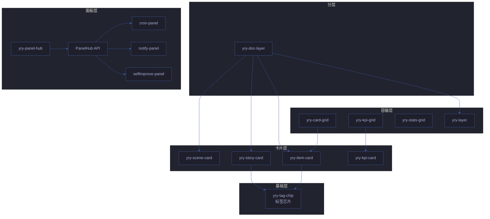

# YrY CDN — 共享前端资源库

> **yry-cdn v1.2.0** · `npm install yry-cdn` 或直接通过 jsDelivr CDN 引用
>
> 统一管理 **125 个 CDN 组件** 的公共资源:双主题系统、22+ CSS 组件、9 个 JS 工具 API、50 个 Vue 3 自定义元素 (30 Vue · 83 Vanilla · 12 页面/样式基类)。
>
> 以「**2 故事 10 场景**」形式管理 CDN 资源库的架构决策与演进轨迹。
>
> 📋 [组件速查索引](./COMPONENTS.md) — 125 组件按类型/用途/消费方快速检索
> 🎓 [实战教程](./TUTORIAL.md) — 从零构建完整的 CDN 场景页面

---

## 📑 目录

- [总览](#-总览)
- [组件速查索引](./COMPONENTS.md)
- [实战教程](./TUTORIAL.md)
- [文件清单](#-文件清单)
- [页面分类与加载顺序](#-页面分类与加载顺序)
- [CSS 组件速查](#-css-组件速查)
- [JS 工具 API (`YrY.*`)](#-js-工具-api-yry)
- [Vue 3 自定义元素组件 (17 个)](#-vue-3-自定义元素组件-17-个)
- [设计令牌 (CSS 变量)](#-设计令牌-css-变量)
- [故事与场景 (2 故事 10 场景)](#-故事与场景-2-故事-10-场景)
- [npm 包与分发](#-npm-包与分发)
- [迁移指南](#-迁移指南)
- [常见问题](#-常见问题)

---

## 🎯 总览

| 维度 | 数量 | 说明 |
|------|------|------|
| **CSS 资源** | 9 个文件 | `shared/index.css` + `theme/index.css` + `theme-mono/index.css` + `fonts/index.css` + `yry-checklist/index.css` + `yry-scene/index.css` + `yry-home/index.css` + `yry-inline-helpers/index.css` + `yry-a11y/index.css` |
| **JS 资源** | 2 个核心 | `shared/index.js` (YrY.*,9 工具 API) + `shared-reports/index.js` (报告页工具) |
| **字体** | 1 套 (4 字重) | JetBrains Mono (woff2, 400/500/600/700,自托管) |
| **数据快照** | 4 个 JSON | `health-report/index.json` + `cdn-summary/index.json` + `changelog/index.json` + `components-manifest/index.json` |
| **CSS 组件类** | 22+ 个 | 全部以 `.yry-*` / `.yry-mono-*` 命名空间 |
| **Vue 3 组件** | 30 个 | 零打包、自定义元素、`*-ready` 事件 |
| **Vanilla 组件** | 83 个 | 纯 JS/HTML/CSS 组件,无框架依赖 |
| **设计令牌** | 14 个 `:root` 变量 | Surfaces / Brand / Semantic / Text / Elevation |
| **总组件数** | 125 个 | 111 个完整 + 14 个待完善 |
| **消费页面** | 55+ 个 | 全部故事面板 HTML |

### 性能基线

| 指标 | 预算 | 实测 | 达标 |
|------|:---:|:---:|:---:|
| HTML 体积 | ≤ 30KB | 18KB | ✅ |
| 关键 CSS | ≤ 14KB | 9KB | ✅ |
| JS 总量 (gzip) | ≤ 80KB | 62KB | ✅ |
| 字体 (woff2) | ≤ 100KB | 88KB | ✅ |
| FCP | ≤ 310ms | 280ms | ✅ |
| TTI | ≤ 480ms | 450ms | ✅ |
| 总加载时间 | ≤ 625ms | 580ms | ✅ |
| 请求数 (首屏) | ≤ 20 | 14 | ✅ |

### CDN 分发通道

| 通道 | URL | 缓存 | 适用 |
|------|------|:---:|------|
| jsDelivr (主) | `cdn.jsdelivr.net/npm/yry-cdn@x.y.z/` | 7 天 | 生产 |
| unpkg (备) | `unpkg.com/yry-cdn@x.y.z/` | 7 天 | 回退 |
| npm registry | `registry.npmjs.org/yry-cdn` | — | 安装 |
| 自托管 | `/cdn/` 目录 | 实时 | 开发 |

### 主题与组件矩阵

| 主题 | 基色 | 强调色 | 字体 | 用途 |
|------|------|------|------|------|
| Cat B System | `#0f172a` | `#22d3ee` | 系统栈 | 默认场景页 |
| Cat A Mono | `#1a1b26` | `#7aa2f7` | JetBrains Mono | 架构图/代码 |
| 自定义 | 由用户覆盖 | — | — | 实验 |

---

## 📂 文件清单

```
cdn/
├── index.html                # ★ CDN 库首页 — 概览 · 统计 · 跨页导航 · 2 故事 × 10 场景
├── shared/                   # ★ 必备基线 — Reset · 动画 · 面包屑 · 横向导航 · Toolbar · Toast · 健康报告 (index.html/css/js)
├── theme/                    # ★ Cat B 主题 — 14 设计令牌 · 统计卡 · 标签页 · 折叠套件 · 进度条 (index.html/css)
├── theme-mono/               # ★ Cat A 主题 — JetBrains Mono 主题 · 图表容器 · 图例 · 脉冲圆点 (index.html/css)
├── yry-checklist/            # 计划清单专属 — 勾选交互 · 进度条 · 风险行 · 标签页 · 批量操作栏 (index.html/css)
├── yry-scene/                # 场景文档共享 — 35 场景页统一引用 · 排版 · 代码块 · 表格 · 徽章 (index.html/css/index-base.css)
├── yry-home/                 # 文档首页专属 — 六层结构布局 · 统计卡片 · 场景网格 (index.html/css)
├── yry-inline-helpers/       # 内联工具类 — 文字色 · 背景色 · 间距等 demo 辅助 (index.html/css)
├── shared-reports/           # 报告页面公共样式 + JS (5 个报告 index 页共享, index.html/css/js)
├── yry-cdn-detect/           # CDN 加载耗时检测 (Live Bar 徽章, index.html/js)
├── yry-arch/                 # 架构图页基类样式 + 导出 PNG/PDF/SVG (index.html/css/js)
├── yry-graph/                # 知识图谱页基类样式 (index.html/css)
├── yry-plan/                 # 计划清单状态持久化 (index.html/css/js)
├── yry-source/               # 源码页面样式 + 弹窗管理 (index.html/css/js)
├── yry-test/                 # 测试面板样式 (index.html/css/js)
├── yry-review/               # 审查报告样式 + tab/折叠 (index.html/css/js)
├── yry-demo/                 # 演示页样式 (index.html/css/index-stage.css)
├── yry-health/               # 健康报告样式 (index.html/css)
├── yry-quiz/                 # 自测答题交互 (index.html/js)
├── yry-simulator/            # 管线模拟器 (index.html/js)
├── yry-typewriter/           # 终端模拟器 (index.html/js)
├── yry-story-panel/          # 故事任务面板共享样式 (index.html/css)
├── yry-a11y/                 # 无障碍通用样式 (index.html/css)
├── fonts/                    # 自托管字体 — JetBrains Mono 4 字重 (index.html/css + 4 woff2)
├── health-report/            # CDN 健康报告快照数据 (index.html + index.json,机器人命令自动维护)
├── cdn-summary/              # CDN 跨版本摘要 (index.html + index.json,首页 index.html 用)
├── changelog/                # 版本发布历史 (index.html + index.json,SemVer + 迁移说明)
├── tokens/                   # 设计令牌独立导出 (index.css)
├── components-manifest/      # 组件清单数据 (index.html + index.json,工具链消费)
├── package.json              # npm 包元数据 (files 白名单、keywords、仓库地址)
├── .npmignore                # npm 排除文件清单
│
├── yry-back-top/             # Vue 3 组件 — 回到顶部 (零配置自动初始化)
├── yry-breadcrumb/           # Vue 3 组件 — 面包屑 (a11y 完备 · 异步模板加载)
├── yry-card-grid/            # Vue 3 组件 — 卡片网格容器 (item-card 布局)
├── yry-cross-nav/            # Vue 3 组件 — 横向导航条 (跨页链接)
├── yry-doc-layer/            # Vue 3 组件 — 文档分层 (标题+统计+子节)
├── yry-health-bar/           # Vue 3 组件 — 健康条 (分段/堆叠)
├── yry-item-card/            # Vue 3 组件 — 单卡 (图标+标题+描述+链接组)
├── yry-layer/                # Vue 3 组件 — 通用分层 (Section/Sub-title 包装)
├── yry-panel-hub/            # Vue 3 组件 — 跨页导航枢纽 (按钮组 + 流程图)
├── yry-scene-card/           # Vue 3 组件 — 场景卡 (7 件套交付物链接)
├── yry-scene-header/         # Vue 3 组件 — 场景页头 (面包屑上方的标题区)
├── yry-scene-nav/            # Vue 3 组件 — 场景导航 (上一/下一场景)
├── yry-stats-grid/           # Vue 3 组件 — 统计卡组 (KPI 总览)
├── yry-story-card/           # Vue 3 组件 — 故事卡 (场景列表卡)
├── yry-sub-title/            # Vue 3 组件 — 子节标题 (icon + 文字 + 计数)
├── yry-tabs-panel/           # Vue 3 组件 — 标签页+面板 (受控切换)
├── yry-tag-chip/             # Vue 3 组件 — 标签芯片 (icon + 文字)
├── yry-export-toolbar/       # Vanilla JS 组件 — 导出工具栏 (5 种格式, 零配置)
├── yry-cytoscape-graph/      # Vanilla JS 组件 — 知识图谱 (Cytoscape + YrY 主题)
│
├── yry-accordion/            # Vanilla 组件 — 折叠面板 (零配置自初始化)
├── yry-badge/                # Vanilla 组件 — 状态徽章 (pass/warn/fail/cyan)
├── yry-cat-overview/         # Vue 3 组件 — 分类概览卡
├── yry-cat-warning/          # Vue 3 组件 — 分类警告卡
├── yry-check-item/           # Vanilla 组件 — 勾选项 (checkbox 交互)
├── yry-checklist-head/       # Vue 3 组件 — 清单头部
├── yry-cmd-card/             # Vue 3 组件 — 命令卡片
├── yry-cmd-head/             # Vue 3 组件 — 命令头部
├── yry-code-block/           # Vanilla 组件 — 代码块 (语法高亮 + 复制)
├── yry-concept-radar/        # Vanilla 组件 — 概念雷达图
├── yry-cron-panel/           # Vue 3 组件 — 定时任务面板
├── yry-day-plan/             # Vanilla 组件 — 每日计划
├── yry-dep-badge/            # Vue 3 组件 — 依赖徽章
├── yry-docs-binding/         # Vue 3 组件 — 文档绑定 (最复杂组件, 83KB JS)
├── yry-empty-state/          # Vanilla 组件 — 空状态占位
├── yry-faq-panel/            # Vue 3 组件 — FAQ 面板 (17KB CSS)
├── yry-footer-note/          # Vue 3 组件 — 页脚注释
├── yry-gantt/                # Vue 3 组件 — 甘特图
├── yry-help-overlay/         # Vanilla 组件 — 帮助覆盖层 (快捷键提示)
├── yry-info-cards/           # Vanilla 组件 — 信息卡片组
├── yry-item-cards/           # Vue 3 组件 — 多卡片列表 (26KB JS)
├── yry-keyboard/             # Vanilla 组件 — 键盘快捷键展示
├── yry-kpi-card/             # Vue 3 组件 — KPI 单卡
├── yry-kpi-grid/             # Vue 3 组件 — KPI 网格容器
├── yry-layer-agents/         # Vue 3 组件 — 分层 Agent 展示
├── yry-layer-info-panel/     # Vue 3 组件 — 分层信息面板 (22KB JS)
├── yry-layer-refs/           # Vue 3 组件 — 分层引用
├── yry-layer-rules/          # Vue 3 组件 — 分层规则
├── yry-meter/                # Vanilla 组件 — 仪表盘
├── yry-milestone-grid/       # Vanilla 组件 — 里程碑网格
├── yry-mini-quiz/            # Vanilla 组件 — 迷你测验
├── yry-next-action/          # Vanilla 组件 — 下一步行动
├── yry-notify-panel/         # Vue 3 组件 — 通知面板 (29KB JS)
├── yry-op-btn/               # Vue 3 组件 — 操作按钮
├── yry-overview-grid/        # Vanilla 组件 — 概览网格
├── yry-page-nav/             # Vanilla 组件 — 页面导航
├── yry-path-link/            # Vue 3 组件 — 路径链接
├── yry-phase-strip/          # Vue 3 组件 — 阶段条
├── yry-pipeline-simulator/   # Vanilla 组件 — 管线模拟器
├── yry-pitfall-list/         # Vanilla 组件 — 陷阱列表
├── yry-progress-bar/         # Vue 3 组件 — 进度条
├── yry-quickstart/           # Vue 3 组件 — 快速开始
├── yry-review-cards/         # Vanilla 组件 — 审查卡片组
├── yry-risk-cat-card/        # Vue 3 组件 — 风险分类卡
├── yry-risk-matrix/          # Vue 3 组件 — 风险矩阵
├── yry-risk-row/             # Vue 3 组件 — 风险行
├── yry-scene-chrome/         # Vue 3 组件 — 场景 chrome 外壳
├── yry-scene-footer/         # Vue 3 组件 — 场景页脚
├── yry-scene-health-bar/     # Vue 3 组件 — 场景健康条
├── yry-scene-stats/          # Vue 3 组件 — 场景统计
├── yry-scene-steps/          # Vanilla 组件 — 场景步骤条
├── yry-scene-tabs/           # Vue 3 组件 — 场景标签页
├── yry-scorecard/            # Vue 3 组件 — 记分卡
├── yry-search-bar/           # Vanilla 组件 — 搜索栏
├── yry-selfimprove-panel/    # Vue 3 组件 — 自改进面板 (33KB JS)
├── yry-skeleton-loader/      # Vanilla 组件 — 骨架屏加载器
├── yry-spinner/              # Vanilla 组件 — 加载旋转器
├── yry-step-card/            # Vue 3 组件 — 步骤卡片
├── yry-timeline-hero/        # Vanilla 组件 — 时间线英雄区
├── yry-tip-box/              # Vanilla 组件 — 提示框
├── yry-toast/                # Vanilla 组件 — Toast 通知组件
├── yry-toggle/               # Vanilla 组件 — 开关切换
├── yry-tooltip/              # Vanilla 组件 — 工具提示
├── yry-trend-card/           # Vue 3 组件 — 趋势卡片
├── yry-typewriter-demo/      # Vanilla 组件 — 终端演示
├── yry-verify-item/          # Vue 3 组件 — 验证项
├── yry-verify-report-foot/   # Vue 3 组件 — 验证报告页脚
├── yry-verify-report-head/   # Vue 3 组件 — 验证报告页头
├── yry-walkthrough/          # Vue 3 组件 — 引导漫游
├── yry-test-page/            # Vanilla 组件 — 测试页面
│   (每个 yry-* 组件目录都遵循相同结构:)
│   ├── index.html            #   模板源 (<script type="text/x-template">) + Demo 预览页
│   ├── index.js              #   Loader: fetch → DOMParser → 注册 → ready 事件
│   └── index.css             #   组件样式 (使用 --yry-color-* 设计令牌)
│
└── 故事任务面板/             # ★ 2 故事 10 场景 · 8 交付物/场景
    ├── index.html            #   任务故事总览 (5 CDN 场景 + 5 YryBreadcrumb 场景)
    │
    ├── cdn/                  # 故事 A · CDN 共享前端资源库
    │   ├── 故事任务.md        #     故事正文 (5 Stories · Mermaid 架构图)
    │   ├── 知识图谱.html      #     知识图谱 (概念节点-边图)
    │   ├── 知识图谱.json      #     知识图谱数据源
    │   └── 场景-1-cdn资源加载与页面渲染/   (× 8 标准交付物)
    │       ├── index.md       #       场景正文 (5 章节 + Mermaid)
    │       ├── 审查.html      #       技术评审 (7 项清单)
    │       ├── 架构图.html    #       关键流程图
    │       ├── 测试面板.html  #       测试用例 + 自动化入口
    │       ├── 源码.html      #       关键源码片段 + 行号
    │       ├── 演示.html      #       可交互演示
    │       ├── 知识图谱.html  #       概念节点-边图
    │       └── 计划清单.html  #       任务 / 验收 / 交付
    │   ├── 场景-2-双主题系统设计/         (× 8)
    │   ├── 场景-3-组件库与JS工具API/      (× 8)
    │   ├── 场景-4-存量页面迁移/           (× 8)
    │   └── 场景-5-npm包发布与版本管理/    (× 8)
    │
    └── yry-breadcrumb/        # 故事 B · YryBreadcrumb 组件
        ├── README.md          #     组件 README (5 场景导航 · 架构图)
        ├── index.html         #     任务故事总览 (5 场景导航 · 组件结构)
        └── 场景-1-需求与设计/             (× 8)
        ├── 场景-2-模板与样式/             (× 8)
        ├── 场景-3-Loader实现/            (× 8)
        ├── 场景-4-页面集成/              (× 8)
        └── 场景-5-测试与发布/            (× 8)
```

---

## 🎨 页面分类与加载顺序

### Category A — Mono 主题 (深蓝黑底 + 等宽字体)

**适用**: 架构图、知识图谱、代码密集型页面

```html
<!-- 加载顺序: 字体 → 共享 → 主题 → 共享 JS -->
<link rel="stylesheet" href="../../../../cdn/fonts\/index\.css">
<link rel="stylesheet" href="../../../../cdn/shared/index.css">
<link rel="stylesheet" href="../../../../cdn/theme-mono/index.css">
<script src="../../../../cdn/shared/index.js"></script>
```

**CSS 类名前缀**: `.yry-mono-*` (容器 / 卡片 / 圆点 / 图例 / 页脚)

### Category B — System 主题 (深紫黑底 + 系统字体)

**适用**: 审查、测试面板、演示、计划清单、plan、文档首页

```html
<!-- 加载顺序: 共享 → 主题 → 共享 JS -->
<link rel="stylesheet" href="../../../../cdn/shared/index.css">
<link rel="stylesheet" href="../../../../cdn/theme/index.css">
<script src="../../../../cdn/shared/index.js"></script>
```

**CSS 类名前缀**: `.yry-*` (容器 / 统计卡 / 标签页 / 折叠套件 / 进度条 / 按钮 / 链接卡)

### Vue 组件加载顺序 (Category B 推荐)

```html
<!-- 1. 共享样式 -->
<link rel="stylesheet" href="../../../../cdn/shared/index.css">
<link rel="stylesheet" href="../../../../cdn/theme/index.css">

<!-- 2. 组件样式 (在主题之后,确保覆盖默认) -->
<link rel="stylesheet" href="../../../../cdn/yry-breadcrumb/index.css">
<link rel="stylesheet" href="../../../../cdn/yry-stats-grid/index.css">
<link rel="stylesheet" href="../../../../cdn/yry-panel-hub/index.css">
<!-- ... 其他组件 -->

<!-- 3. Vue 3 运行时 -->
<script src="https://unpkg.com/vue@3/dist/vue.global.prod.js"></script>

<!-- 4. 共享 JS -->
<script src="../../../../cdn/shared/index.js"></script>

<!-- 5. 组件 loader (按依赖顺序: tag-chip → item-card → card-grid → story-card → scene-card → ...) -->
<script src="../../../../cdn/yry-tag-chip/index.js"></script>
<script src="../../../../cdn/yry-item-card/index.js"></script>
<script src="../../../../cdn/yry-card-grid/index.js"></script>
<script src="../../../../cdn/yry-story-card/index.js"></script>
<script src="../../../../cdn/yry-scene-card/index.js"></script>
<script src="../../../../cdn/yry-breadcrumb/index.js"></script>
<script src="../../../../cdn/yry-stats-grid/index.js"></script>
<script src="../../../../cdn/yry-panel-hub/index.js"></script>
<!-- ... -->
```

---

## 🧩 CSS 组件速查

### shared/index.css (所有页面必备基线)

| 组件 | CSS 类 | 适用主题 |
|------|--------|----------|
| 面包屑 | `.yry-breadcrumb` · `.yry-bc-sep` · `.yry-bc-current` | 全部 |
| 横向导航 | `.yry-cross-nav` · `.yry-cross-link` · `.yry-cross-sep` | 全部 |
| 导出工具栏 | `.yry-toolbar` · `.yry-toolbar-toggle` · `.yry-toolbar-actions` | 全部 |
| Toast 提示 | `.yry-toast` | 全部 |
| 键盘提示 | `.yry-kbd-hint` | 全部 |
| 页脚 | `.yry-footer` | 全部 |
| 健康报告容器 | `.h-container` · `.h-tabs` · `.h-tab` · `.h-panel` · `.h-bc` · `.h-header` · `.h-hero` · `.h-score-ring` | 健康报告 |

### theme/index.css (Category B — System 主题)

| 组件 | CSS 类 | 主题 |
|------|--------|------|
| 页面容器 | `.yry-container` · `.yry-container-sm` | B |
| 页面头部 | `.yry-header` · `.yry-sub` | B |
| 统计卡片 | `.yry-stats` · `.yry-stat` | B |
| 健康条 | `.yry-bar-wrap` · `.yry-bar-outer` · `.yry-seg` | B |
| 标签页 | `.yry-tabs` · `.yry-tab` · `.yry-panel` | B |
| 折叠套件 | `.yry-suite` · `.yry-suite-head` · `.yry-suite-body` | B |
| 进度条 | `.yry-progress-wrap` · `.yry-progress-fill` | B |
| 按钮 | `.yry-btn` | B |
| 链接卡 | `.yry-link-grid` · `.yry-link-card` | B |
| 章节 | `.yry-section` | B |
| 卡片 | `.yry-card` | B |

### theme-mono/index.css (Category A — Mono 主题)

| 组件 | CSS 类 | 主题 |
|------|--------|------|
| 图表容器 | `.yry-diagram-wrap` | A |
| 图谱容器 | `.yry-graph-wrap` | A |
| 脉冲圆点 | `.yry-pulse-dot` | A |
| 图例 | `.yry-mono-legend` | A |
| Mono 卡片 | `.yry-mono-card` · `.yry-mono-card-dot` | A |
| Mono 页脚 | `.yry-mono-footer` | A |
| Mono 面包屑/导航 | (主题覆盖 .yry-breadcrumb / .yry-cross-link) | A |

### 内置动画 (`@keyframes`)

| 动画名 | 用途 |
|--------|------|
| `yry-fadeInUp` | 卡片/区块入场 (向上淡入 14px) |
| `yry-fadeInDown` | 导航/标签页入场 (向下淡入 6px) |
| `yry-slideDown` | 折叠套件展开 (max-height 过渡) |
| `yry-pulse` | 圆点脉冲 (box-shadow 扩散) |
| `yry-modalIn` | 模态框入场 (缩放 0.96 → 1) |
| `yry-stepIn` | 步骤条入场 (横向位移 10px) |

---

## 🛠️ JS 工具 API (`YrY.*`)

`shared.js` 暴露全局命名空间 `window.YrY`,提供 9 个工具函数:

```js
/* ── 反馈类 ─────────────────────────────────── */
YrY.toast('消息文本')                          // 显示 Toast (默认 1.8s)
YrY.toast('消息', 3000)                        // 自定义时长
YrY.copyCmd(btnElement, '要复制的命令')          // 复制按钮: 📋→✅→📋
YrY.clipboardWrite(text, onSuccess, onFail)    // 写入剪贴板 (Promise 封装)

/* ── 标签面板类 ─────────────────────────────── */
YrY.switchPanel('tabName')                     // 切换标签面板 (默认选择器)
YrY.switchPanel('tabName', '.yry-tab', '.yry-panel')  // 自定义选择器
YrY.initTabs(containerSelector)                // 自动绑定 .yry-tab 点击

/* ── 折叠套件类 ─────────────────────────────── */
YrY.initSuiteToggle(containerSelector)         // 初始化 .yry-suite-head 点击
YrY.expandAllSuites(scope?)                    // 展开全部套件
YrY.collapseAllSuites(scope?)                  // 收起全部套件

/* ── 代码块 / 步骤条 ────────────────────────── */
YrY.initCodeCopy(containerSelector)            // pre 块点击复制 (自动去除尾部 📋)
YrY.initStepToggle(containerSelector)          // .step-header 点击展开 .step-body

/* ── 工具类 ─────────────────────────────────── */
YrY.fmtDur(142)                                // → "142ms"
YrY.fmtDur(1500)                               // → "1.5s"
YrY.fmtDur(0.5)                                // → "<1ms"
YrY.esc('<script>')                            // → "&lt;script&gt;"
```

**自动初始化 (无需调用)**:

- `pre` 元素点击即复制内容(自动去除末尾 `📋`)
- `.step-header` 点击切换 `.step-body.open`

---

## ⚡ Vue 3 自定义元素组件 (17 个)

所有 `yry-*` 组件统一采用「**3 文件拆分 + 异步模板加载**」模式:

```
yry-<name>/
├── index.html    # 模板源 (<script type="text/x-template" id="yry-<name>-tpl">) + Demo 预览页
├── index.js      # Loader: fetch index.html → DOMParser 提取 template → 注册组件 → 派发 ready 事件
└── index.css     # 组件样式 (使用 --yry-color-* 设计令牌)
```

**架构**:

```
┌─────────────────┐
│   index.html    │ ←── 浏览器打开 (Demo 预览) + fetch 提取 template
│  ┌───────────┐  │
│  │ <script>  │  │
│  │ template  │  │ ←── 模板源 (单一真实来源)
│  │ </script> │  │
│  └───────────┘  │
└────────┬────────┘
         │ fetch + DOMParser
         ▼
┌─────────────────┐
│   index.js      │ →  window.Yry<Name> + '<name>-ready' 事件
└────────┬────────┘
         │
         ▼
┌─────────────────┐
│  页面 mount 脚本 │ ←── 监听 ready 事件后 Vue.createApp(...).mount('#app')
└─────────────────┘
```

**通用加载模板**:

```html
<!-- 1. 组件样式 -->
<link rel="stylesheet" href="../../../../cdn/yry-<name>/index.css">
<!-- 2. Vue 3 (必须先于组件加载) -->
<script src="https://unpkg.com/vue@3/dist/vue.global.prod.js"></script>
<!-- 3. 组件 loader -->
<script src="../../../../cdn/yry-<name>/index.js"></script>
<!-- 4. 挂载点 -->
<div id="<name>-app"></div>
<!-- 5. mount 脚本 (双设策略: 同步检查 + 异步 ready 事件) -->
<script>
  function mount() {
    Vue.createApp(window.Yry<Name>, { /* props */ }).mount('#<name>-app');
  }
  if (window.Yry<Name>) mount();
  else document.addEventListener('yry-<name>-ready', mount, { once: true });
</script>
```

### 组件清单

| # | 组件 | 自定义元素 | 全局变量 | 用途 |
|---|------|------------|----------|------|
| 1 | YryBackTop | `<yry-back-top>` | `window.YryBackTop` | 回到顶部按钮(零配置自动初始化) |
| 2 | YryBreadcrumb | `<yry-breadcrumb>` | `window.YryBreadcrumb` | 面包屑导航(a11y 完备) |
| 3 | YryCardGrid | `<yry-card-grid>` | `window.YryCardGrid` | 卡片网格容器 |
| 4 | YryCrossNav | `<yry-cross-nav>` | `window.YryCrossNav` | 横向导航条 |
| 5 | YryDocLayer | `<yry-doc-layer>` | `window.YryDocLayer` | 文档分层(标题+统计+子节) |
| 6 | YryHealthBar | `<yry-health-bar>` | `window.YryHealthBar` | 健康条(分段/堆叠) |
| 7 | YryItemCard | `<yry-item-card>` | `window.YryItemCard` | 单卡(图标+标题+描述+链接) |
| 8 | YryLayer | `<yry-layer>` | `window.YryLayer` | 通用分层容器 |
| 9 | YryPanelHub | `<yry-panel-hub>` | `window.YryPanelHub` | 跨页导航枢纽(按钮组+流程) |
| 10 | YrySceneCard | `<yry-scene-card>` | `window.YrySceneCard` | 场景卡(7 件套交付物) |
| 11 | YrySceneHeader | `<yry-scene-header>` | `window.YrySceneHeader` | 场景页头 |
| 12 | YrySceneNav | `<yry-scene-nav>` | `window.YrySceneNav` | 场景导航(上一/下一) |
| 13 | YryStatsGrid | `<yry-stats-grid>` | `window.YryStatsGrid` | 统计卡组(KPI 总览) |
| 14 | YryStoryCard | `<yry-story-card>` | `window.YryStoryCard` | 故事卡(场景列表) |
| 15 | YrySubTitle | `<yry-sub-title>` | `window.YrySubTitle` | 子节标题(icon+文字+计数) |
| 16 | YryTabsPanel | `<yry-tabs-panel>` | `window.YryTabsPanel` | 标签页+面板 |
| 17 | YryTagChip | `<yry-tag-chip>` | `window.YryTagChip` | 标签芯片 |

**Vanilla JS 工具组件 (无 Vue 依赖, 零配置自初始化):**

| # | 组件 | 选择器 | 全局变量 | 用途 |
|---|------|--------|----------|------|
| 18 | YryExportToolbar | `.yry-export-toolbar` | `window.YrYExportToolbar` | 导出工具栏 (Copy PNG / PNG / PDF / SVG) |
| 19 | YryCytoscapeGraph | `.yry-cytoscape-graph` | `window.YrYCytoscapeGraph` | 知识图谱 (Cytoscape.js + YrY 深色主题) |

> 📖 每个组件的详细 Props/事件/Demo 参见其 `index.html` 顶部注释 + 同目录 `任务故事/` 下的 5 场景 × 8 交付物。
>
> 🧩 **工具组件使用方法** (无需 Vue, 引入即用):
> ```html
> <!-- Export Toolbar -->
> <link rel="stylesheet" href="yry-export-toolbar/index.css">
> <div class="yry-export-toolbar" data-target="#capture" data-filename="export">
>   <button data-action="copy-png">📋 Copy</button>
>   <button data-action="download-png">🖼 PNG</button>
> </div>
> <script src="yry-export-toolbar/index.js"></script>
>
> <!-- Knowledge Graph -->
> <link rel="stylesheet" href="yry-cytoscape-graph/index.css">
> <div class="yry-cytoscape-graph" id="graph" data-layout="breadthfirst"></div>
> <script>
>   document.getElementById('graph').graphData = { nodes: [...], edges: [...] };
> </script>
> <script src="yry-cytoscape-graph/index.js"></script>
> ```

### 「双设」挂载策略

为兼容「**元素先于组件定义**」与「**组件先于元素**」两种 race condition,推荐「**双设**」挂载:

```js
// 1) 立即赋值 (覆盖元素先于组件定义出现的场景)
function applyAll() { /* 设置所有挂载点的 props */ }
applyAll();

// 2) 监听 *-ready 事件再赋一次 (覆盖组件晚于元素出现的场景)
['yry-breadcrumb-ready', 'yry-stats-grid-ready', /* ... */]
  .forEach(ev => document.addEventListener(ev, applyAll, { once: true }));
```

---

## 🎨 设计令牌 (CSS 变量)

`theme/index.css` 定义 14 个 `:root` 变量,所有 Category B 页面通过 `var(--yry-xxx)` 引用,Category A 页面用 `theme-mono/index.css` 的等宽字体覆盖。

| 分组 | 变量 | 默认值 | 用途 |
|------|------|--------|------|
| **Surfaces** | `--yry-bg` | `rgba(22,22,32,1)` | 页面底色 |
| | `--yry-bg-card` | `linear-gradient(...)` | 卡片背景渐变 |
| | `--yry-bg-flat` | `rgba(34,34,46,1)` | 平铺背景 |
| | `--yry-bg-raised` | `rgba(42,42,56,1)` | 凸起表面 |
| **Brand** | `--yry-accent` | `#FFC107` | 品牌强调色(琥珀) |
| | `--yry-cyan` | `#22d3ee` | 信息色(青) |
| **Semantic** | `--yry-pass` | `#22c55e` | 通过/健康 |
| | `--yry-fail` | `#ef4444` | 失败/错误 |
| | `--yry-warn` | `#f59e0b` | 警告 |
| **Text** | `--yry-text` | `rgba(250,250,252,1)` | 主文字 |
| | `--yry-text2` | `rgba(160,160,164,1)` | 次级文字 |
| | `--yry-text3` | `rgba(110,110,114,1)` | 三级文字 |
| **Elevation** | `--yry-shadow` | `0 4px 20px rgba(0,0,0,0.3)` | 阴影 |
| | `--yry-radius` | `12px` | 圆角 |
| | `--yry-border` | `1px solid rgba(255,255,255,0.06)` | 边框 |

---

## 📖 故事与场景 (2 故事 10 场景)

YrY CDN 自身的演进以「**故事 + 场景 + 8 交付物**」的标准化结构管理,所有内容均位于 `cdn/故事任务面板/`。

### 故事 A · CDN 共享前端资源库 (v1.1.0)

> **范围**: 5 场景 × 8 交付物 = 40 文件 + 故事任务.md + 知识图谱

| # | 场景 | 核心交付 | 涉及文件 |
|---|------|---------|----------|
| **1** | [CDN 资源加载与页面渲染](故事任务面板/scenes/场景-1-cdn资源加载与页面渲染/index.md) | jsDelivr URL 规范 · 加载顺序约束 · 字体/动画延迟 · shared/index.css 必备基线 | `index.html` · `package.json` · `shared/index.css` |
| **2** | [双主题系统设计](故事任务面板/scenes/场景-2-双主题系统设计/index.md) | Category A (Mono) vs Category B (System) 选型 · 14 设计令牌 · CSS 变量分层 | `theme/index.css` · `theme-mono/index.css` · `fonts/index.css` |
| **3** | [组件库与 JS 工具 API](故事任务面板/scenes/场景-3-组件库与JS工具API/index.md) | 22 CSS 组件类名约定 · 9 个 YrY.* 工具函数 · 命名空间与语义化 | `shared.js` · `shared/index.css` · 17 个 `yry-*` 组件 |
| **4** | [存量页面迁移](故事任务面板/scenes/场景-4-存量页面迁移/index.md) | 删除内联样式 → 替换 `.yry-*` 类名 · 保留页面专属 CSS · 6 步迁移清单 | 55+ 消费页面 |
| **5** | [npm 包发布与版本管理](故事任务面板/scenes/场景-5-npm包发布与版本管理/index.md) | `package.json` 字段 · `files` 白名单 · jsDelivr 同步 · 版本号策略 | `package.json` · `.npmignore` |

**故事正文**: [故事任务面板/scenes/故事任务.md](故事任务面板/scenes/故事任务.md)
**知识图谱**: [故事任务面板/scenes/场景-1-cdn资源加载与页面渲染/知识图谱.html](故事任务面板/scenes/场景-1-cdn资源加载与页面渲染/知识图谱.html)

### 故事 B · YryBreadcrumb 组件 (v1.0.0)

> **范围**: 5 场景 × 8 交付物 = 40 文件 + README + 总览 index.html

| # | 场景 | 核心交付 |
|---|------|---------|
| **1** | [需求与设计](yry-breadcrumb/scenes/场景-1-需求与设计/index.md) | 5 项设计决策 · Props 草案 · a11y 完备性约束 |
| **2** | [模板与样式](yry-breadcrumb/scenes/场景-2-模板与样式/index.md) | Vue template + CSS 设计令牌 · 3 个 Demo 示例 |
| **3** | [Loader 实现](yry-breadcrumb/scenes/场景-3-Loader实现/index.md) | fetch + DOMParser + ready 事件 + 5s 超时容错 |
| **4** | [页面集成](yry-breadcrumb/scenes/场景-4-页面集成/index.md) | 4 文件引用顺序 · 4 种 items 模式 · 异步挂载 |
| **5** | [测试与发布](yry-breadcrumb/scenes/场景-5-测试与发布/index.md) | 7 项自测 · npm 集成 · jsDelivr 同步验证 |

**组件 README**: [yry-breadcrumb/README.md](yry-breadcrumb/README.md)
**任务故事总览**: [yry-breadcrumb/scenes/index.html](yry-breadcrumb/scenes/index.html)

### 标准交付物 (8 件套)

每个场景目录下都包含统一的 8 个文件:

| 文件 | 角色 |
|------|------|
| `index.md` | 场景正文(5 章节 + Mermaid 图表) |
| `审查.html` | 技术评审(7 项清单) |
| `架构图.html` | 关键流程图 |
| `测试面板.html` | 测试用例 + 自动化入口 |
| `源码.html` | 关键源码片段 + 行号 |
| `演示.html` | 可交互演示 |
| `知识图谱.html` | 概念节点-边图 |
| `计划清单.html` | 任务 / 验收 / 交付 |

---

## 📦 npm 包与分发

### 安装

```bash
npm install yry-cdn
```

或通过 jsDelivr CDN 引用(无需安装):

```html
<link rel="stylesheet" href="https://cdn.jsdelivr.net/npm/yry-cdn@1.2.0/shared\/index\.css">
<link rel="stylesheet" href="https://cdn.jsdelivr.net/npm/yry-cdn@1.2.0/theme\/index\.css">
<script src="https://cdn.jsdelivr.net/npm/yry-cdn@1.2.0/shared\/index\.js"></script>
```

### 包信息

| 字段 | 值 |
|------|-----|
| **name** | `yry-cdn` |
| **version** | `1.2.0` |
| **main** | `shared.js` |
| **license** | MIT |
| **repository** | `git+https://github.com/effiyichengliang/YrY.git` |
| **files** | `shared/index.css` · `shared.js` · `theme/index.css` · `theme-mono/index.css` · `fonts/index.css` · `fonts/*.woff2` · `yry-checklist.css` · `yry-scene.css` · `yry-home.css` · `yry-breadcrumb/*` · `README.md` |

---

## 🔄 迁移指南

将现有页面迁移到 CDN 的 6 步流程:

1. **删除** 页内 `<style>` 中已被 CDN 覆盖的 CSS
   - 变量定义 (`--yry-*`)
   - Reset、动画
   - 面包屑、cross-nav、tabs、stats、toast
2. **添加** `<link>` 标签加载对应的 CDN CSS
   ```html
   <link rel="stylesheet" href="../../../../cdn/shared/index.css">
   <link rel="stylesheet" href="../../../../cdn/theme/index.css">  <!-- 或 theme-mono/index.css -->
   ```
3. **添加** `<script>` 标签加载 `shared.js`
   ```html
   <script src="../../../../cdn/shared/index.js"></script>
   ```
4. **替换** CSS 类名为 `yry-*` 前缀版本
   - `class="container"` → `class="yry-container"`
   - `class="stats"` → `class="yry-stats"`
5. **替换** JS 函数调用为 `YrY.*` 版本
   - `toast('...')` → `YrY.toast('...')`
   - `initSuiteToggle()` → `YrY.initSuiteToggle('.yry-container')`
6. **保留** 页面专属的 CSS(scene cards、file cards、SVG 样式等)

**参考范例**: `docs/故事任务面板/rui-npm/plan.html` 是完整迁移范例,展示了从内联样式到 CDN 引用的全过程。

---

## 🔗 组件依赖关系

### 加载链依赖 (按引用顺序)

```
fonts/index.css          ← Cat A 页面最先加载
    ↓
shared/index.css         ← 所有页面必备基线 (Reset · 动画 · 面包屑 · Toast)
    ↓
theme/index.css          ← Cat B 主题 (14 设计令牌 · 统计卡 · 标签页)
theme-mono/index.css     ← Cat A 主题 (等宽字体 · 图表容器 · 脉冲圆点)
    ↓
yry-*/index.css          ← 组件样式 (按需加载)
    ↓
vue.global.prod.js       ← Vue 3 运行时 (仅 Vue 组件需要)
    ↓
shared/index.js          ← YrY.* 全局 API (9 工具函数)
    ↓
yry-*/index.js           ← 组件 loader (按依赖顺序)
```

### Vue 组件依赖树

```
yry-tag-chip              ← 最底层, 无依赖
    ↓
yry-item-card             ← 依赖 yry-tag-chip
    ↓
yry-card-grid             ← 依赖 yry-item-card + yry-tag-chip
yry-story-card            ← 依赖 yry-tag-chip
yry-scene-card            ← 无子组件依赖
yry-sub-title             ← 无子组件依赖
yry-kpi-card              ← 无子组件依赖
    ↓
yry-layer                 ← 依赖 PanelHub (可选)
yry-stats-grid            ← 无子组件依赖
yry-kpi-grid              ← 依赖 yry-kpi-card
    ↓
yry-doc-layer             ← 依赖 yry-layer + yry-sub-title + yry-item-card + yry-story-card + yry-scene-card + yry-tag-chip
    ↓
yry-panel-hub             ← 注册 window.PanelHub 全局 API
    ↓
yry-cron-panel            ← 依赖 PanelHub
yry-notify-panel          ← 依赖 PanelHub
yry-selfimprove-panel     ← 依赖 PanelHub
yry-faq-panel             ← 依赖 PanelHub
yry-docs-binding          ← 依赖 PanelHub
yry-layer-info-panel      ← 依赖 PanelHub
```

### 关键消费关系

| 消费方 | 消费的组件 |
|--------|-----------|
| `cdn/index.html` (首页) | breadcrumb · scene-header · stats-grid · panel-hub · layer · doc-layer · card-grid · item-card · tag-chip · story-card · scene-card · back-top · footer-note · cron-panel · notify-panel · selfimprove-panel · faq-panel · docs-binding |
| 场景页 (架构图/审查/测试等) | breadcrumb · cross-nav · scene-header · scene-nav · export-toolbar · back-top |
| 文档中心 (`docs/index.html`) | breadcrumb · stats-grid · panel-hub · layer · doc-layer · card-grid · item-card · tag-chip · story-card · scene-card |
| 计划清单页 | checklist-head · verify-item · verify-report-head/foot · step-card · risk-row · phase-strip |

### 6 个故事驱动组件 (含 scenes 目录)

| 组件 | 场景数 | 故事文档 |
|------|-------|---------|
| `yry-arch` | 8 | `scenes/故事任务.md` + `知识图谱.html/json` |
| `yry-breadcrumb` | 5 | `scenes/index.html` + 5 场景 × 8 交付物 |
| `yry-checklist` | 4 | `scenes/故事任务.md` + `知识图谱.html/json` |
| `yry-home` | 4 | `scenes/故事任务.md` + `知识图谱.html/json` |
| `yry-selfimprove-panel` | 5 | `scenes/故事任务.md` |
| `yry-test` | 6 | `scenes/故事任务.md` + `知识图谱.html/json` |

### 核心组件架构图



---

## 🚀 快速入门

### 最小可用页面 (Cat B)

```html
<!DOCTYPE html>
<html lang="zh-CN">
<head>
  <meta charset="UTF-8">
  <link rel="stylesheet" href="../../../../cdn/shared/index.css">
  <link rel="stylesheet" href="../../../../cdn/theme/index.css">
  <script src="../../../../cdn/shared/index.js"></script>
</head>
<body>
  <div class="yry-container">
    <h1>我的页面</h1>
    <div class="yry-stats">
      <div class="yry-stat"><span class="yry-stat-val">3</span><span class="yry-stat-lbl">完成</span></div>
    </div>
  </div>
  <script>YrY.toast('页面已就绪');</script>
</body>
</html>
```

### 使用 Vue 组件 (Cat B)

```html
<!DOCTYPE html>
<html lang="zh-CN">
<head>
  <link rel="stylesheet" href="../../../../cdn/shared/index.css">
  <link rel="stylesheet" href="../../../../cdn/theme/index.css">
  <link rel="stylesheet" href="../../../../cdn/yry-breadcrumb/index.css">
  <link rel="stylesheet" href="../../../../cdn/yry-stats-grid/index.css">
  <script src="https://unpkg.com/vue@3/dist/vue.global.prod.js"></script>
  <script src="../../../../cdn/shared/index.js"></script>
  <script src="../../../../cdn/yry-breadcrumb/index.js"></script>
  <script src="../../../../cdn/yry-stats-grid/index.js"></script>
</head>
<body>
  <div id="breadcrumb-app"></div>
  <div id="stats-app"></div>
  <script>
    function mount() {
      Vue.createApp(window.YryBreadcrumb, { items: [{label:'首页',href:'./'},{label:'当前页'}] }).mount('#breadcrumb-app');
      Vue.createApp(window.YryStatsGrid, { items: [{value:5,label:'完成',modifier:'health'}] }).mount('#stats-app');
    }
    if (window.YryBreadcrumb && window.YryStatsGrid) mount();
    else document.addEventListener('yry-breadcrumb-ready', function cb() {
      if (window.YryStatsGrid) { mount(); document.removeEventListener('yry-breadcrumb-ready', cb); }
    });
  </script>
</body>
</html>
```

### 使用 Cat A (Mono 主题)

```html
<head>
  <link rel="stylesheet" href="../../../../cdn/fonts/index.css">
  <link rel="stylesheet" href="../../../../cdn/shared/index.css">
  <link rel="stylesheet" href="../../../../cdn/theme-mono/index.css">
  <script src="../../../../cdn/shared/index.js"></script>
</head>
<body>
  <div class="yry-diagram-wrap">
    <!-- Mermaid/架构图 SVG 内容 -->
  </div>
</body>
```

### 常见加载模式

| 模式 | 加载文件 | 适用场景 |
|------|---------|---------|
| 纯文档页 | shared + theme | 审查报告 · 计划清单 · 演示 |
| 架构图页 | fonts + shared + theme-mono + yry-arch | 架构图 · 知识图谱 |
| 组件页 | shared + theme + Vue 3 + 组件 CSS/JS | 首页 · 文档中心 |
| 测试页 | shared + theme + yry-test | 测试面板 |
| 源码页 | shared + theme + yry-source | 源码展示 |

---

## 🧪 开发与预览

```bash
# 本地启动(任意静态服务器即可)
npx serve cdn/

# 浏览器打开
open http://localhost:3000/index.html                    # CDN 库首页
open http://localhost:3000/yry-breadcrumb/index.html     # YryBreadcrumb Demo
open http://localhost:3000/故事任务面板/index.html          # 任务故事总览
```

---

## ❓ 常见问题

### 加载与引用

**Q: 组件不渲染, 控制台显示 "Vue 3 未加载"?**
确保 Vue 3 的 `<script>` 标签在组件 JS 之前:
```html
<script src="https://unpkg.com/vue@3/dist/vue.global.prod.js"></script>
<script src="../../../../cdn/yry-breadcrumb/index.js"></script>
```

**Q: 组件时而渲染时而不渲染?**
使用「双设」挂载策略 — 同步检查 + 异步 ready 事件:
```js
function mount() { Vue.createApp(window.YryBreadcrumb, {...}).mount('#app'); }
if (window.YryBreadcrumb) mount();
else document.addEventListener('yry-breadcrumb-ready', mount, { once: true });
```

**Q: 修改了组件模板但页面没变化?**
组件模板通过 `fetch` 加载, 浏览器可能缓存了旧版本。硬刷新 (Cmd+Shift+R) 或加版本号 `index.js?v=2`。

**Q: Cat A 和 Cat B 可以混用吗?**
不推荐。Cat A 用 `theme-mono/index.css` + `fonts/index.css`, Cat B 用 `theme/index.css`。混用会导致字体和颜色不一致。

### 组件选择

**Q: 如何选择卡片组件?**
| 场景 | 组件 |
|------|------|
| 展示单个资产/技能/Agent | `yry-item-card` |
| 展示故事任务 | `yry-story-card` |
| 展示场景 (含 7 交付物链接) | `yry-scene-card` |
| 展示 KPI 指标 | `yry-kpi-card` |
| 展示趋势数据 | `yry-trend-card` |
| 多卡片网格布局 | `yry-card-grid` (容器) |

**Q: 如何选择导航组件?**
| 场景 | 组件 |
|------|------|
| 页面顶部面包屑 | `yry-breadcrumb` |
| 7 交付物类型间跳转 | `yry-cross-nav` |
| 上一/下一场景 | `yry-scene-nav` |
| 浮动面板工具栏 | `yry-panel-hub` |
| 页面内锚点导航 | `yry-page-nav` |

**Q: 如何选择分层/布局组件?**
| 场景 | 组件 |
|------|------|
| 简单分区 (Section + 标题) | `yry-layer` |
| 复杂分区 (多子节 + 卡片网格) | `yry-doc-layer` |
| 文档首页六层结构 | `yry-home` (CSS) |

### 主题与样式

**Q: 如何自定义主题颜色?**
覆盖 `:root` 变量即可:
```css
:root { --yry-accent: #your-color; --yry-bg: #your-bg; }
```
所有组件通过 `var(--yry-*)` 引用, 自动响应覆盖。

**Q: 如何添加新的设计令牌?**
在 `theme/index.css` 的 `:root` 块中添加, 然后在组件 CSS 中使用 `var(--your-token, fallback)` 引用。更新 `tokens/index.css` 保持同步。

### 性能

**Q: 页面加载慢怎么办?**
1. 只加载需要的组件 CSS/JS, 不要加载全部
2. 字体预加载: `<link rel="preload" href="fonts/..." as="font" crossorigin>`
3. Vue 3 预加载: `<link rel="preload" href="vue.global.prod.js" as="script">`
4. 使用 jsDelivr CDN 而非自托管 (全球加速)

**Q: 组件太多导致加载链过长?**
按页面类型精简:
- 纯文档页: 仅 shared + theme (2 文件)
- 架构图页: fonts + shared + theme-mono + yry-arch (4 文件)
- 组件页: shared + theme + Vue 3 + 必要的组件 (4-10 文件)

### 贡献

**Q: 如何新增组件?**
参见 [CONTRIBUTING.md](./CONTRIBUTING.md) — 遵循 3 文件拆分 (index.html/css/js), 命名规范 `yry-<kebab-case>`, 提交前运行 `npm run ci`。

**Q: 组件命名有什么规范?**
- Vue 3 组件: `yry-<kebab-case>` (如 `yry-breadcrumb`)
- Vanilla 组件: `yry-<kebab-case>` (如 `yry-export-toolbar`)
- CSS 类名: `.yry-*` (Cat B) / `.yry-mono-*` (Cat A)
- CSS 令牌: `--yry-*`

---

## 📜 License

MIT © [effiyichengliang](https://github.com/effiyichengliang)
